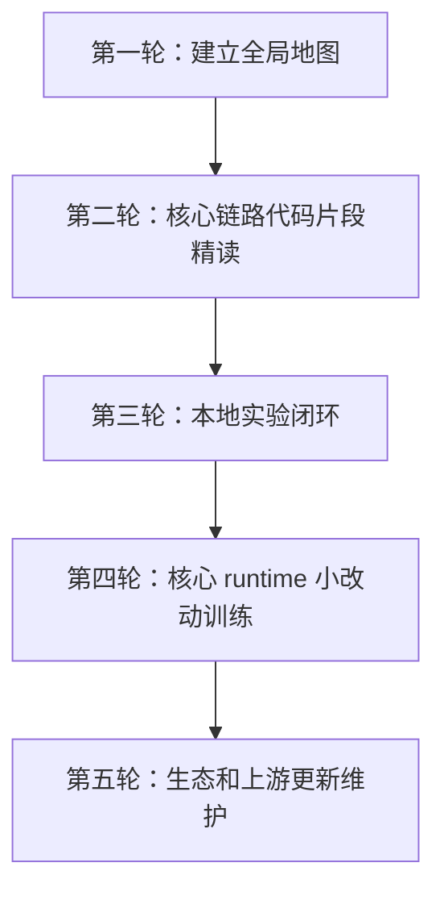

# Learning path

本仓库按“从粗到精”的方式学习 DeepSeek Harness。不要一开始就打开 7 万行符号索引，也不要只读 README 后就判断项目成熟度。

## 总体路线

## 第一轮：建立全局地图

目标：先理解 Harness 是什么、不是什么，以及它由哪些核心模块组成。

阅读顺序：

1. [docs/00-start-here/README.md](docs/00-start-here/README.md)
2. [docs/00-start-here/paths/non-engineer.md](docs/00-start-here/paths/non-engineer.md)
3. [docs/01-product/README.md](docs/01-product/README.md)
4. [docs/01-product/product-maturity.md](docs/01-product/product-maturity.md)
5. [docs/02-system-architecture/README.md](docs/02-system-architecture/README.md)
6. [docs/02-system-architecture/runtime-topology.md](docs/02-system-architecture/runtime-topology.md)

学完应能回答：

- Harness 和 DeepSeek 模型有什么区别？
- Agent Harness 和 Evaluation Harness 有什么区别？
- Web、headless、SDK 是不是三套内核？
- 为什么 developer preview 不能直接等同于生产成熟？

## 第二轮：核心链路代码片段精读

目标：从架构图进入关键文件和关键函数，理解一次任务如何真正跑起来。

阅读顺序：

1. [docs/03-cordis-foundation/plugin-system-mainline.md](docs/03-cordis-foundation/plugin-system-mainline.md)
2. [docs/04-boot-and-configuration/config-composition.md](docs/04-boot-and-configuration/config-composition.md)
3. [docs/05-agent-runtime/turn-step-tool-loop.md](docs/05-agent-runtime/turn-step-tool-loop.md)
4. [docs/06-model-adapter/deepseek-protocol.md](docs/06-model-adapter/deepseek-protocol.md)
5. [docs/07-tools-permissions-sandbox/tool-policy-pipeline.md](docs/07-tools-permissions-sandbox/tool-policy-pipeline.md)
6. [docs/08-session-and-context/event-log-and-recovery.md](docs/08-session-and-context/event-log-and-recovery.md)
7. [docs/14-file-reference/key-file-deep-dives.md](docs/14-file-reference/key-file-deep-dives.md)
8. [docs/14-file-reference/key-function-walkthroughs.md](docs/14-file-reference/key-function-walkthroughs.md)

学完应能回答：

- prompt 是在哪里拼装的？
- 上下文窗口在哪里计算和记录？
- 模型 tool call 如何进入工具策略管道？
- approval、sandbox、permission preset 分别解决什么问题？
- Session event log 和 UI 展示状态为什么不能混为一谈？

## 第三轮：本地实验闭环

目标：把“我看懂了”变成“我跑过并能复核”。

阅读顺序：

1. [docs/15-labs-and-tutorials/local-first-run.md](docs/15-labs-and-tutorials/local-first-run.md)
2. [docs/15-labs-and-tutorials/experiment-protocol.md](docs/15-labs-and-tutorials/experiment-protocol.md)
3. [docs/15-labs-and-tutorials/minimal-plugin-lab.md](docs/15-labs-and-tutorials/minimal-plugin-lab.md)
4. [docs/19-benchmarks-and-evaluation/benchmark-design.md](docs/19-benchmarks-and-evaluation/benchmark-design.md)

实验要求：

- 使用个人 `DEEPSEEK_API_KEY`。
- 记录 commit、命令、环境、退出码和脱敏日志。
- 至少跑一个成功路径和一个失败路径。
- 区分“启动成功”“模型请求成功”“工具执行成功”“Session 持久化成功”“用户任务完成”。

## 第四轮：核心 runtime 小改动训练

目标：学习如何修改 Harness 核心 runtime，并尽量不破坏行为。

阅读顺序：

1. [docs/00-start-here/paths/runtime-contributor.md](docs/00-start-here/paths/runtime-contributor.md)
2. [docs/13-source-studies/core-runtime-study.md](docs/13-source-studies/core-runtime-study.md)
3. [docs/13-source-studies/deepseek-adapter-study.md](docs/13-source-studies/deepseek-adapter-study.md)
4. [docs/13-source-studies/security-and-orchestration-study.md](docs/13-source-studies/security-and-orchestration-study.md)
5. [docs/13-source-studies/web-bridge-and-product-surface-study.md](docs/13-source-studies/web-bridge-and-product-surface-study.md)

改动前必须写清楚：

- 改动目标是什么。
- 影响哪些 service、event、tool、adapter、session 或 UI projection。
- 哪些行为必须保持不变。
- 需要跑哪些测试和本地实验。
- 哪些风险暂时没有覆盖。

## 第五轮：生态和上游更新维护

目标：知道 Harness 在 Agent 生态中的位置，并让学习资料跟随上游变化。

阅读顺序：

1. [docs/11-protocols-and-integrations/README.md](docs/11-protocols-and-integrations/README.md)
2. [docs/16-ecosystem-and-community/README.md](docs/16-ecosystem-and-community/README.md)
3. [docs/16-ecosystem-and-community/plugin-ecosystem.md](docs/16-ecosystem-and-community/plugin-ecosystem.md)
4. [docs/17-version-tracking/README.md](docs/17-version-tracking/README.md)
5. [docs/18-maintainer-guide/README.md](docs/18-maintainer-guide/README.md)
6. [docs/20-decisions-and-postmortems/README.md](docs/20-decisions-and-postmortems/README.md)

学完应能回答：

- Cordis 论文和 Harness 插件实现是什么关系？
- MCP、ACP、DSML、E2B 分别在哪一层？
- Codex、Claude Code、OpenCode、Qwen Code、mini-swe-agent 是参考对象还是依赖？
- 社交媒体证据为什么不能替代源码事实？
- 上游更新后，哪些人工文档需要重新审核？

## 如果你只想查源码

不要直接全文搜索整仓。建议按这个顺序：

1. 先用 [docs/14-file-reference/source-reading-guide.md](docs/14-file-reference/source-reading-guide.md) 判断能力域。
2. 再用 [docs/14-file-reference/generated/harness-file-cards.md](docs/14-file-reference/generated/harness-file-cards.md) 找文件职责。
3. 需要函数级理解时，看 [docs/14-file-reference/key-function-walkthroughs.md](docs/14-file-reference/key-function-walkthroughs.md)。
4. 需要判断设计原因时，看 [docs/13-source-studies/](docs/13-source-studies/README.md)。
5. 需要验证行为时，看 [docs/15-labs-and-tutorials/](docs/15-labs-and-tutorials/README.md)。

## 学到什么程度算够

| 目标 | 合格标准 |
| --- | --- |
| 产品判断 | 能解释 Harness 的价值、边界、成熟度和采用风险 |
| 架构理解 | 能画出 boot/profile、Cordis、Agent Loop、model、tool、session、Web 的关系 |
| 源码定位 | 能从一个问题定位到关键包、文件、函数和测试 |
| 本地验证 | 能跑正向/负向实验，并留下可复核证据 |
| 改核心 runtime | 能描述不变量、设计测试矩阵，并证明改动没有破坏关键行为 |
| 维护仓库 | 能处理上游更新、stale 文档、许可证和发布记录 |
