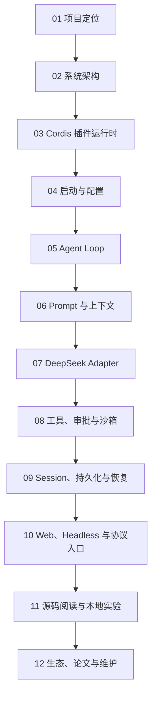

# Learning path

本仓库现在按“课程主线 + 参考资料”的方式组织。

如果你要系统学习 DeepSeek Harness，直接从 [docs/00-course/](docs/00-course/README.md) 开始。其它目录主要用于查源码、做实验、看证据或维护上游更新。

## 主学习线

完整课程入口：[docs/00-course/README.md](docs/00-course/README.md)

## 学习阶段

| 阶段 | 读什么 | 目标 |
| --- | --- | --- |
| 先建立判断框架 | 课程 01–02 | 知道 Harness 是什么、不是什么，理解四个平面 |
| 再理解 runtime 主链路 | 课程 03–06 | 看懂插件、配置、Agent Loop、prompt/context |
| 然后理解副作用治理 | 课程 07–09 | 看懂 DeepSeek adapter、工具策略、Session 事实账本 |
| 接着理解产品入口 | 课程 10 | 区分 Web、headless、SDK、ACP、MCP |
| 最后动手验证 | 课程 11–12 | 能查源码、跑实验、维护上游变化 |

## 参考资料怎么用

| 资料区 | 什么时候看 |
| --- | --- |
| [docs/13-source-studies/](docs/13-source-studies/README.md) | 想理解核心源码为什么这样实现 |
| [docs/14-file-reference/](docs/14-file-reference/README.md) | 想查具体文件、符号、依赖和测试 |
| [docs/15-labs-and-tutorials/](docs/15-labs-and-tutorials/README.md) | 想做本地实验或插件实验 |
| [docs/16-ecosystem-and-community/](docs/16-ecosystem-and-community/README.md) | 想看生态、插件成熟度和社区证据 |
| [docs/18-maintainer-guide/](docs/18-maintainer-guide/README.md) | 想维护 source lock、许可证和发布流程 |

## 学到什么程度算够

| 目标 | 合格标准 |
| --- | --- |
| 产品判断 | 能解释 Harness 的价值、边界、成熟度和采用风险 |
| 架构理解 | 能画出 boot/profile、Cordis、Agent Loop、model、tool、session、Web 的关系 |
| 源码定位 | 能从一个问题定位到关键包、文件、函数和测试 |
| 本地验证 | 能跑正向/负向实验，并留下可复核证据 |
| 改核心 runtime | 能描述不变量、设计测试矩阵，并证明改动没有破坏关键行为 |
| 维护仓库 | 能处理上游更新、stale 文档、许可证和发布记录 |
