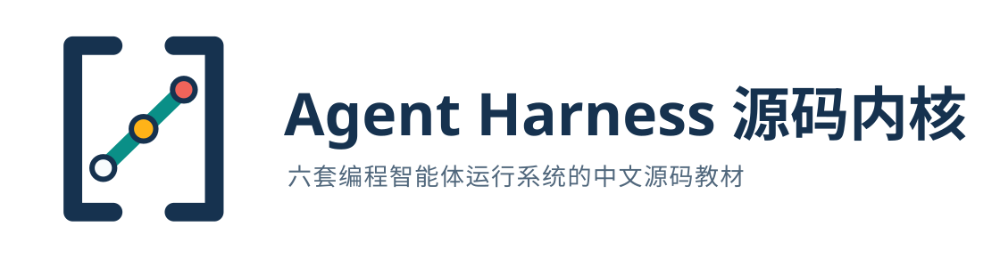

<p align="center">
  
</p>

# Agent Harness 源码内核

<p align="center">从一次工具调用开始，读懂六套编程智能体的运行系统</p>

<p align="center">
  <a href="https://plwslpld-arch.github.io/agent-harness-internals/">在线阅读</a> ·
  <a href="docs/00-start-here.md">开始学习</a> ·
  <a href="docs/README.md">完整课程目录</a> ·
  <a href="docs/learning-paths.md">选择阅读路线</a> ·
  <a href="https://plwslpld-arch.github.io/agent-harness-internals/downloads/agent-harness-internals-cn.pdf">下载 PDF</a>
</p>

<p align="center">
  姊妹项目：<a href="https://github.com/plwslpld-arch/eval-harness-internals">Eval Harness 源码内核</a>
  —— 智能体跑完之后，谁来判定它真的做对了
</p>

这个仓库是一套面向开发者的中文 Agent Harness 源码教材。它不比较模型排行榜，也不复述产品功能列表。你会先用一个失败测试建立共同语言，再沿 DeepSeek Harness、Codex、Gemini CLI、Claude、pi 与 OpenCode 的锁定源码，跟完模型输入、智能体循环、工具执行、权限、会话和结果核对的完整链路。

## 先建立一个简单画面

```text
用户目标
   │
   ▼
Harness ── 组织上下文、维持循环、控制工具、保存状态
   │                         │
   │ 请求下一步              │ 执行动作
   ▼                         ▼
模型                     执行环境
决定下一步               文件、终端、网络与外部系统
```

模型负责根据输入选择下一步；Harness 把选择变成受控制、可继续的任务执行；执行环境承担真实副作用。运行轨迹和独立评测观察这条交互链，但不会替 Harness 执行工具。

## 六条主要源码课程

| 课程 | 主要语言与公开来源 | 适合观察什么 |
| --- | --- | --- |
| [DeepSeek Harness](docs/harnesses/deepseek-harness/README.md) | TypeScript 多包源码与测试 | 提示词、键值缓存、代码模式、工具、会话与评测接缝怎样组合 |
| [Codex](docs/harnesses/codex/README.md) | Rust 核心、协议和测试 | 线程、轮次、工具策略、沙箱、审批和多种产品表面怎样连接 |
| [Gemini CLI](docs/harnesses/gemini-cli/README.md) | TypeScript 核心与命令行源码 | 轮次、调度器、工具生命周期、策略、确认和会话怎样协作 |
| [Claude](docs/harnesses/claude/README.md) | 官方文档与公开 Agent SDK | 闭源产品契约和公开 SDK 实现分别能证明什么 |
| [pi](docs/harnesses/pi/README.md) | TypeScript 分层包源码 | 极简智能体核心怎样扩展为编程智能体、协议和会话表面 |
| [OpenCode](docs/harnesses/opencode/README.md) | TypeScript 服务化源码 | 模型提供器、会话、流处理器、权限和多客户端怎样共享核心 |

这六条课程使用同一组阅读问题，但不强迫项目拥有相同目录或文章数量：模型看见什么，谁控制下一轮，工具怎样执行，权限在哪里判断，状态怎样恢复，结果怎样被观察。

## 三条阅读路线

### 第一次接触 Agent Harness

从[学习入口](docs/00-start-here.md)开始，再依次阅读五篇[基础导读](docs/foundations/01-model-harness-environment.md)。它们使用同一个「修复失败测试」任务建立共同语言，不要求你先读任何大型源码仓库。需要完整目录时，打开[源码课程总目录](docs/README.md)。

### 想读懂某个项目

直接进入对应课程的项目地图。先完成端到端任务导览，再阅读核心循环、工具与权限、状态与扩展。每条课程都会标出首次阅读入口和可以暂时跳过的兼容层。

### 想比较不同实现

至少完成两条课程后再阅读[横向比较](docs/comparisons/01-runtime-config-model-input.md)。比较页只讨论已经在各课程中建立过的机制，不给项目打总分。

## 怎样核对一条源码结论

源码课程中的链接指向锁定提交，而不是随时变化的默认分支。一个完整的源码站点会同时交代调用者、输入、状态变化、返回值和下一站。你可以直接打开链接阅读上下文，也可以按照「怎样核对」运行上游测试或查看固定运行轨迹。

正文会明确区分三类内容：

- **上游源码事实**：可以在锁定文件和测试中直接找到；
- **机制解释**：根据多个调用点重建的数据流和责任边界；
- **教学简化**：帮助理解的伪代码或缩小案例，不冒充上游实现。

## 来源与许可证

`sources/sources.yml` 记录上游地址、分析范围和许可证，`sources/sources.lock.yml` 固定实际阅读的 Commit。上游 Checkout 只用于本地核对，不作为本仓库原创内容重新分发。具体许可证以各上游项目为准。

## 从这里继续

[打开学习入口：用一个失败测试看懂 Agent Harness](docs/00-start-here.md) · [查看完整课程目录](docs/README.md) · [按经验选择阅读路线](docs/learning-paths.md)
