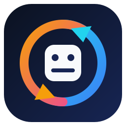
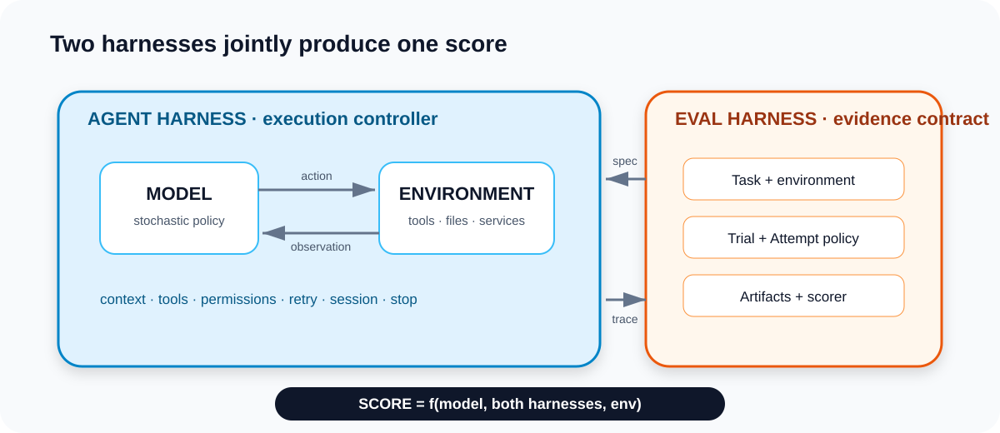
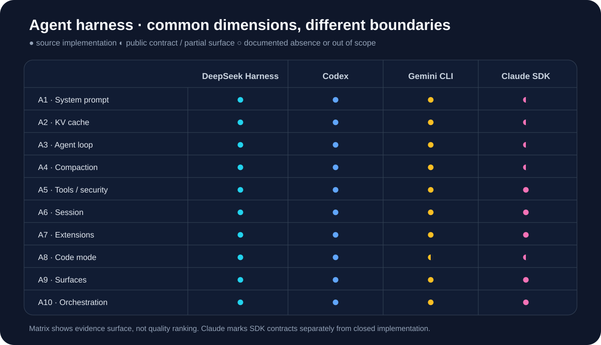
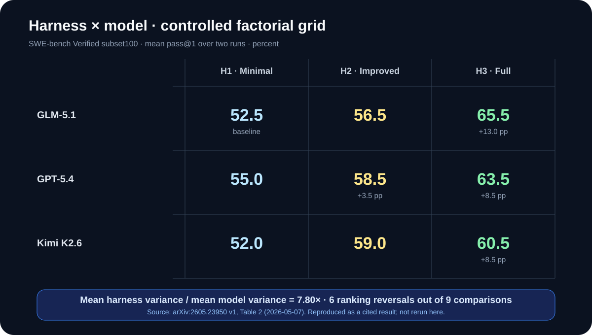

<p align="center">
  
</p>

<h1 align="center">Harness Internals</h1>

<p align="center">两种 harness，一个可核对的源码知识库</p>

<p align="center">
  <a href="README.en.md">English</a> ·
  <a href="https://github.com/plwslpld-arch/harness-internals/actions/workflows/verify.yml"></a>
  <a href="LICENSE-CODE"></a>
  <a href="LICENSE-DOCS"></a>
</p>

> 原名 `deepseek-harness-internals`。DeepSeek Harness 的逐包深读完整保留在 [`docs/deep/`](docs/deep/)。

## 这是什么

模型不会自己读文件、调工具、保留会话，也不会决定一个 benchmark 怎样判分。包在模型外面的两层软件，决定了任务如何执行、结果如何被解释：

- **agent harness** 把模型变成可行动的 agent：装配上下文、暴露工具、执行循环、处理权限、保存轨迹、恢复失败。
- **eval harness** 把一次运行变成可比较的证据：定义任务与环境、调度 Trial、收集产物、执行 scorer、冻结统计口径。

它们不能分开研究。最终分数同时受模型、agent harness、eval harness 和环境影响；只报模型名与一个 pass@1，会把这些变量压成一个无法归因的数字。这个仓库把四种 agent harness 与四种 eval harness 放在同一套维度、同一套 commit 锁和同一套 CI 证据门禁下。



## 从哪读

| 你的问题 | 入口 | 是否读代码 |
| --- | --- | --- |
| 第一次听到 harness | [概念入门](docs/concepts.md) | 不需要 |
| 做产品与交互 | [产品视角](docs/for-product.md) | 不需要 |
| 做成本、安全与部署决策 | [运维与风险](docs/for-ops.md) | 不需要 |
| 想理解 agent 是怎样跑起来的 | [Part A 总览](docs/00-overview.md#part-aagent-harness) | 可选 |
| 想理解 benchmark 分数怎样产生 | [Part B 总览](docs/00-overview.md#part-beval-harness) | 可选 |
| 深挖 DeepSeek Harness | [DSH 深度层](docs/deep/dsh-overview.md) | 需要 TypeScript |
| 自己复核结论 | [验证手册](docs/appendix-b-verification.md) | 需要命令行 |

## Part A：agent harness

对照主角是 DeepSeek Harness、OpenAI Codex、Gemini CLI，以及 Claude Agent SDK 所公开的 Claude 契约面。Claude Code 本体闭源；契约面之外不作源码级推断。

| 维度 | 文章 | 核心问题 |
| --- | --- | --- |
| A1 | [System Prompt](docs/a1-system-prompt.md) | 模型第一眼看见什么，谁决定顺序 |
| A2 | [KV-Cache](docs/a2-kv-cache.md) | 前缀怎样保持稳定，何时失效 |
| A3 | [Agent Loop](docs/a3-agent-loop.md) | 请求、工具和恢复怎样形成闭环 |
| A4 | [Compaction](docs/a4-compaction.md) | 超长轨迹怎样压缩，丢掉什么 |
| A5 | [Tools、Approval、Sandbox](docs/a5-tools-approval-sandbox.md) | 能做什么、谁批准、边界在哪里 |
| A6 | [Session](docs/a6-session.md) | 事件、轨迹与恢复怎样落盘 |
| A7 | [Extensions](docs/a7-extensions.md) | 插件与协议如何扩展能力面 |
| A8 | [Code Mode](docs/a8-code-mode.md) | 让模型写代码驱动工具意味着什么 |
| A9 | [Surfaces](docs/a9-surfaces.md) | CLI、Web、SDK 与协议怎样接入 |
| A10 | [Orchestration](docs/a10-orchestration.md) | 子代理、计划和工作流挂在哪里 |



DeepSeek Harness 的 15 篇原始逐包分析已经迁入 [`docs/deep/`](docs/deep/)；它们不是被压成摘要，而是作为单一实现的深度证据层继续维护。另有一张 [DSH 包组与 Codex crate 的子系统映射](assets/dsh-codex-subsystems.svg)，用于看不同目录结构如何落到共同抽象。

## Part B：eval harness

| 维度 | 文章 | 核心问题 |
| --- | --- | --- |
| E1 | [什么是 eval harness](docs/e1-what-is-eval-harness.md) | 它与 benchmark、agent runner 有何区别 |
| E2 | [Tasks 与 Environments](docs/e2-tasks-and-envs.md) | 输入、镜像、状态和隔离如何固定 |
| E3 | [Run 与 Score](docs/e3-run-and-score.md) | Trial、Attempt、产物和 scorer 如何连接 |
| E4 | [Harness 如何改变分数](docs/e4-harness-decides-score.md) | 模型、agent harness 与 eval harness 如何耦合 |

公开研究的一个受控网格显示：在 SWE-bench Verified 的 100 题子集上，同一模型从最小 harness 换到完整 harness，平均 pass@1 可移动 8.5–13.0 个百分点；该实验的平均 harness 方差是模型方差的 7.80 倍。这里引用的是 2026-05-07 的 [arXiv:2605.23950](https://arxiv.org/abs/2605.23950)，本仓库没有复跑，也不把它外推成普遍规律。



## 结论怎样被约束

每篇分析把依据分成四类：锁定 commit 下的源码、上游测试与 fixture、官方文档、以及正文明写的「这是推断」。仓库不会把 artifact 检查说成生产部署证明，也不会把第三方 benchmark pass 说成个人能力或发布授权。

CI 在普通链接和测试之外执行三道专门门禁：

1. **anchors**：逐条确认 `repo!path:line` 仍指向锁定源码中的真实行。
2. **coverage**：每篇 A/E 文章必须达到 frontmatter 声明的跨仓最低覆盖数。
3. **matrix**：标记过的对照矩阵中，每个数据格必须有源码锚点、官方 HTTPS 链接，或明确写「这是推断」。

训练奖励、checkpoint 选择与独立发布评估在文档中严格分开。Trial 是统计单位；Attempt 只用于恢复基础设施错误，不能把产品失败重试成通过。

## 本地验证

需要 Node.js 22.19 或更高版本；CI 使用 Node 24。

```bash
git clone https://github.com/plwslpld-arch/harness-internals.git
cd harness-internals
npm run bootstrap   # 按 lock 拉取 11 个上游 checkout
npm run check       # 来源、证据、许可、链接、敏感信息与测试
```

11 个来源按完整 commit 锁定，但不 vendor 到发布内容：DeepSeek Harness、Codex、Gemini CLI、Claude Agent SDK、OpenCode、pi、mini-swe-agent、lm-evaluation-harness、Inspect AI、Terminal-Bench 1、SWE-bench。机器可读清单见 [`sources/sources.lock.yml`](sources/sources.lock.yml)。

## 边界与许可

- 这不是 DeepSeek、OpenAI、Google、Anthropic 或任何 eval 项目的官方仓库、镜像或贡献入口。
- Claude 相关确定性结论只覆盖 MIT SDK 的公开契约；闭源实现只引用官方公开资料，不使用泄露的 prompt 转储。
- 本仓库不生产新的 benchmark 分数；公开结果会写明日期、来源、口径和是否复跑。
- 原创代码按 [MIT](LICENSE-CODE) 授权，原创文档按 [CC BY 4.0](LICENSE-DOCS) 授权；第三方边界见 [THIRD_PARTY.md](THIRD_PARTY.md)。

维护规则见 [AGENTS.md](AGENTS.md)，贡献方式见 [CONTRIBUTING.md](CONTRIBUTING.md)，变更记录见 [CHANGELOG.md](CHANGELOG.md)。
