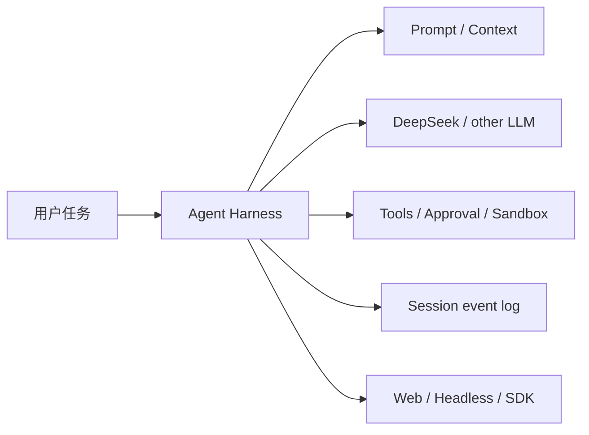

# 01｜项目定位：Harness 到底是什么

## 先讲人话

DeepSeek Harness 不是 DeepSeek 模型本身，也不是一个普通聊天页面。它是模型外面的“任务执行系统”。

模型负责生成文本、reasoning 和 tool call；Harness 负责把用户任务组织成可执行过程：

- 拼上下文；
- 选择模型；
- 暴露工具；
- 控制权限；
- 执行工具；
- 记录轨迹；
- 恢复会话；
- 把运行状态展示给 Web、headless 或 SDK。

如果把模型比作一个员工，Harness 就是工作台、权限系统、工具间、任务记录和主管流程。

## 它不是什么

| 容易误解 | 正确理解 |
| --- | --- |
| Harness 是模型 API 包装 | 它是 Agent runtime，API adapter 只是其中一层 |
| Harness 是评测框架 | 它可以被评测，但本体不是 SWE-bench/Terminal-Bench 这种评分系统 |
| Harness 是 Web UI | Web 只是产品表面，底层还有 headless、SDK、协议入口 |
| 有源码就代表功能可用 | 还要看 profile 是否挂载、运行是否 ready、权限是否允许 |
| 测试通过就代表生产可用 | 测试只证明特定契约，不等于真实业务闭环 |

## 系统位置



## 关键判断

读这个项目时要一直分清四层：

1. 源码存在：仓库里有代码。
2. 配置启用：profile/bundle 把它挂上了。
3. 运行激活：服务真的 ready。
4. 产品闭环：用户任务真的从输入到结果可复核完成。

很多错误判断来自把这四层混成一层。

## 本讲源码证据卡

| 要判断的问题 | 证据入口 | 看什么 |
| --- | --- | --- |
| Harness 是否只是模型 API 包装 | `packages/core/agent-loop/`、`packages/core/tools/`、`packages/core/session/` | 是否存在独立的任务循环、工具治理和事件账本 |
| Web 是否等于 Harness 本体 | `packages/bundle/web-app/`、`packages/bundle/headless/` | Web/headless 是否只是不同产品表面 |
| 功能是否默认可用 | `apps/cli/src/profile-boot.ts`、profile/bundle patch | 功能是否被 profile 装配并激活 |
| 当前成熟度如何判断 | `PROJECT_STATUS.md`、`docs/01-product/product-maturity.md` | 哪些是源码事实，哪些是推断或待验证 |

## 最小实验

不需要先调用模型。先做一个阅读实验：

```text
任务：选择一个能力，例如 Web 或 DeepSeek provider。
步骤：
1. 在 docs/00-course 找到对应课程。
2. 在 docs/13-source-studies 找到人工源码研究。
3. 在 docs/14-file-reference/generated/harness-file-cards.md 查这个能力的文件卡片。
4. 写出它处于“源码存在 / 配置启用 / 运行激活 / 产品闭环”哪一层。
过关：不能只回答“仓库里有代码”，必须说明证据层级。
```

## 检查题

- Harness 和模型的职责边界是什么？
- 为什么 Web 可访问不等于 Agent 任务完成？
- 为什么一个 package 存在不代表它是成熟社区插件？

## 延伸阅读

- [../01-product/README.md](../01-product/README.md)
- [../01-product/product-maturity.md](../01-product/product-maturity.md)
- [../00-start-here/paths/non-engineer.md](../00-start-here/paths/non-engineer.md)
