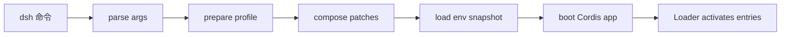

# 04｜启动与配置

## 先讲人话

用户输入的是命令，例如启动 Web 或 headless。但程序真正需要的是一棵插件树。

启动链路就是把：

```text
命令行参数 + profile + bundle patch + 用户 patch + 环境变量
```

合成：

```text
一棵可运行的 Cordis 插件树
```

## 系统位置



## 关键代码片段

入口文件：

- `apps/cli/src/bin.ts`
- `apps/cli/src/profile-boot.ts`
- `packages/boot/app-boot/src/index.ts`

理解形状：

```ts
args = parseDshArgs(process.argv)
env = loadLayeredEnv(process.cwd(), dshHome)
profile = prepareProfile(args.profile)
patches = composeProfile(profile, userPatch, homePatch, cliOverlay)
ctx = await boot(profile.root, patches, env)
```

## API Key 在哪里配置

真实 DeepSeek key 不应写进仓库。Harness 从环境变量读取：

```bash
export DEEPSEEK_API_KEY="your-own-key"
```

这意味着：

- 你本地可以用自己的 key。
- 别人 clone 仓库后也可以用自己的 key。
- CI 默认不需要真实 key。
- 文档、fixture、日志不能保存真实 key。

## 易错点

- `dump-config` 只能证明配置合成结果，不证明插件已经实际激活。
- `.env` 可以保存普通凭据引用，但不能承载会改变启动信任边界的变量。
- profile root、bundle patch、home patch、CLI overlay 的优先级会影响最终行为。

## 本讲源码证据卡

| 配置问题 | 证据入口 | 看什么 |
| --- | --- | --- |
| CLI 如何分发模式 | `apps/cli/src/bin.ts` | `profile`、`plugin`、`dump-config` 的分支 |
| profile 如何组合 | `apps/cli/src/profile-boot.ts` | bundle patch、home patch、CLI overlay 的顺序 |
| 环境变量如何加载 | `packages/boot/app-boot/src/index.ts` | inherited/project/user env 和 bootstrap-only 拒绝 |
| 插件如何真正启动 | `packages/boot/app-boot/src/index.ts` | `boot()`、Loader settle、activation assert |

## 最小实验

```text
任务：验证配置合成不等于运行 ready。
步骤：
1. 运行 Atlas 的 npm run sources:verify，确认源码基线一致。
2. 阅读 profile-boot 和 app-boot 的关键函数卡片。
3. 如果本机已安装 Harness 依赖，再运行 dump-config。
4. 记录 dump-config 输出只证明配置层，不证明 Agent 完成任务。
过关：能写出 profile、patch、env、boot 四个阶段各自证明什么。
```

## 检查题

- 为什么不能只看一个 `cordis.yml` 判断默认能力？
- `DEEPSEEK_API_KEY` 和 `DEEPSEEK_BASE_URL` 的风险为什么不同？
- 启动成功和 Agent 任务完成有什么区别？

## 延伸阅读

- [../04-boot-and-configuration/config-composition.md](../04-boot-and-configuration/config-composition.md)
- [../14-file-reference/key-function-walkthroughs.md](../14-file-reference/key-function-walkthroughs.md)
