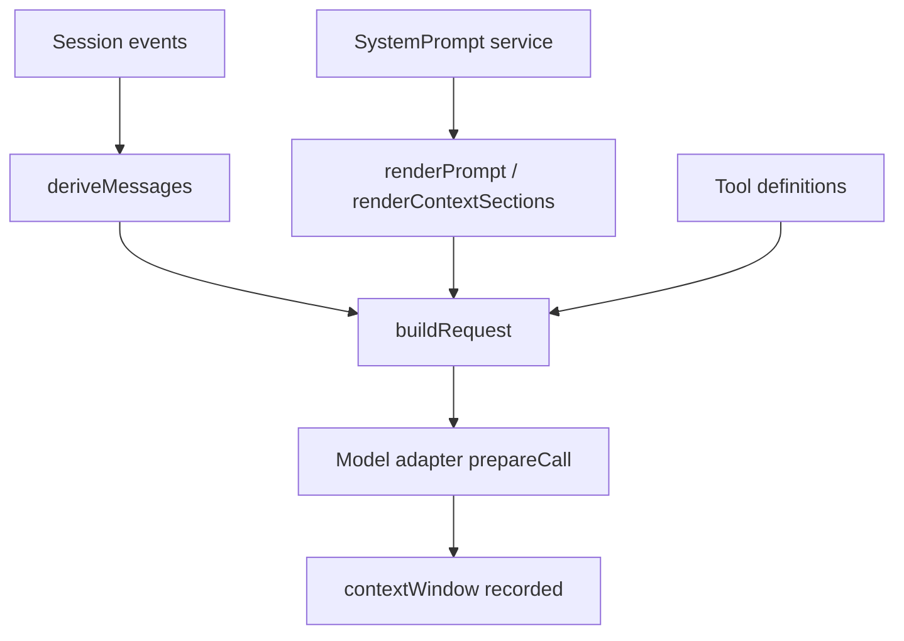

# 06｜Prompt 与上下文

## 先讲人话

模型看到的不是“全部历史日志”。Harness 会把系统身份、运行环境、工具说明、上下文片段、历史消息和压缩结果组装成一次模型请求。

所以 prompt 不是一个静态字符串，而是运行时产物。

## 系统位置



## 关键代码片段

源码入口：

- `packages/core/system-prompt/src/index.ts`
- `packages/core/session/src/surface.ts`
- `packages/core/agent-loop/src/runtime-context.ts`
- `packages/core/session/src/request-header.ts`

理解形状：

```ts
system = systemPrompt.assemble({
  identity,
  runtimeContext,
  tools,
  persona,
})

messages = session.deriveMessages()

request = buildRequest({
  system,
  messages,
  toolDefinitions,
  modelConfig,
})

prepared = adapter.prepareCall(request)
session.append(requestHeader)
session.append(requestContextWindow)
```

## 上下文窗口怎么处理

Adapter 会知道目标模型的窗口约束，并把 request 映射成 provider 可接受的形式。Harness 同时记录 context window 信息，方便后续分析为什么某次请求被压缩、截断或失败。

Compaction 的重点是：

- 它改变模型可见的 surface。
- 它不应该删除原始事实事件。
- 它要在 token 压力和任务成功率之间折中。

## 易错点

- Session event log 不是直接塞进模型的消息数组。
- 历史 reasoning 不一定全部回传；不同 adapter 有不同协议要求。
- prompt 变化会影响 benchmark 结果，不能只比较模型名。

## 检查题

- prompt 拼装在哪里配置？
- `deriveMessages()` 和完整 event log 的区别是什么？
- compaction 是删除事实，还是改变模型可见投影？

## 延伸阅读

- [../08-session-and-context/context-and-compaction.md](../08-session-and-context/context-and-compaction.md)
- [../06-model-adapter/deepseek-protocol.md](../06-model-adapter/deepseek-protocol.md)
