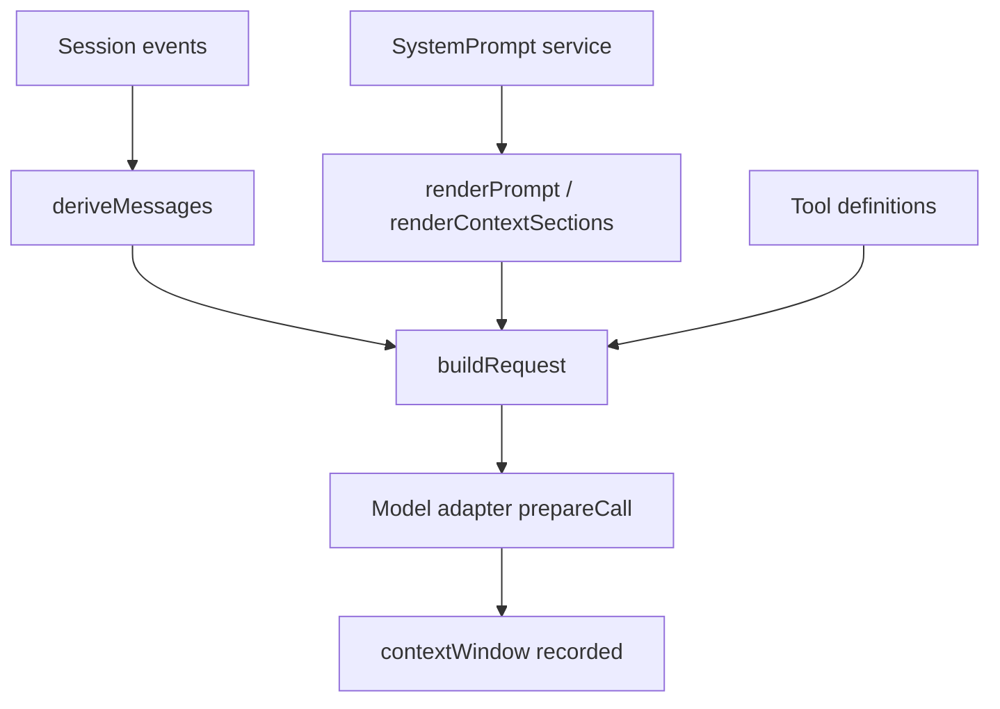

# 06｜Prompt 与上下文

## 先讲人话

模型看到的不是“全部历史日志”。Harness 会把系统身份、运行环境、工具说明、上下文片段、历史消息和压缩结果组装成一次模型请求。

所以 prompt 不是一个静态字符串，而是运行时产物。

## 系统位置



## 关键代码片段

源码入口：

- `packages/core/system-prompt/src/index.ts`
- `packages/core/session/src/surface.ts`
- `packages/core/agent-loop/src/runtime-context.ts`
- `packages/core/session/src/request-header.ts`

Prompt 的真实入口不是一个配置文件，而是 `SystemPrompt` 这个服务。它提供几类注册点：

```ts
systemPrompt.section({ name, order, text })
systemPrompt.context({ name, order, text })
systemPrompt.tools(provider)
systemPrompt.variable(name, provider)
systemPrompt.suppressRuntimeContext()
```

可以把它类比成“模型请求前的内容注册表”：

- `section` 进入 system prompt。
- `context` 进入当前 runtime context snapshot。
- `tools` 贡献工具 schema。
- `variable` 给 `{{name}}` 占位符提供值。
- `suppressRuntimeContext` 关闭动态上下文注入，但不删除提供上下文的服务。

真正 assemble 时，代码会做三件重要的事：

```ts
const sectionByName = this.layers.merge(scope, layer => layer.sections)
const contextByName = this.layers.merge(scope, layer => layer.contexts)
const transformed = await ctx.waterfall('system-prompt/assemble', assembly, context, next)
```

这说明 prompt 不是“全局一份”。它支持 scope：agent preset 可以覆盖全局 persona，局部插件也可以只影响某个 agent 的 prompt。

渲染规则也很直接：

```ts
renderPrompt(assembly)           // sections -> system string
renderContextSections(assembly)  // contexts -> named snapshot sections
joinContextSections(sections)    // sections -> user-role runtime snapshot
```

所以模型最终看到的是两块不同内容：

- system 字符串：身份、persona、工具指导等。
- user-role runtime snapshot：当前工作区、权限、环境、动态上下文。

历史消息来自 Session surface：

```ts
deriveEventMessage(event) {
  user/message      -> user message
  assistant/message -> assistant message, empty content skipped
  tool/result       -> tool result message
  other events      -> null
}
```

这意味着 `turn/start`、`step/start`、`assistant/chunk`、`request/header`、`request/context` 这些事件会留在账本里，但不会直接进入模型消息列表。它们是证据，不是 transcript。

最后由 Agent Loop 建请求：

```ts
preparedCall = await llm.prepareCall(proposedConfig, signal)
session.append('request/header', { header, reason })
session.append('request/context', { provider, model, contextWindow })
request = { ...header.config, messages, system, tools, sessionId, signal }
```

## 上下文窗口怎么处理

Adapter 会知道目标模型的窗口约束，并把 request 映射成 provider 可接受的形式。Harness 同时记录 context window 信息，方便后续分析为什么某次请求被压缩、截断或失败。

Compaction 的重点是：

- 它改变模型可见的 surface。
- 它不应该删除原始事实事件。
- 它要在 token 压力和任务成功率之间折中。

非研发可以这样理解：原始 Session 像“监控录像”，surface 像“给模型看的剪辑版”。剪辑可以替换一段历史摘要，但录像不能被偷偷删掉。研发改 compaction 时，要特别检查 `surfaceOp: replace`、`sourceEventSeqs`、`foldSurface()` 这类规则，否则模型看到的历史和真实账本会分叉。

## prompt 在哪里配置

常见配置入口有三类：

| 配置来源 | 对应实现 | 影响 |
| --- | --- | --- |
| profile / cordis.yml | Loader 挂载插件并传入 config | 决定哪些 prompt 插件、工具、模型 adapter 被装配 |
| `SystemPrompt.Config` | `includeHarnessIdentity`、`persona`、`toolOrder`、`includeRuntimeContext` | 决定基础 system prompt、persona、工具顺序、runtime context 是否注入 |
| 插件运行时注册 | `section/context/tools/variable` | 能力插件动态贡献 prompt 内容或工具说明 |

所以答案不是“在一个 prompts.ts 里”。Harness 的 prompt 是多插件共同 assemble 出来的。要改 prompt，应该先问：这是全局 persona、某个 agent preset、某个工具说明，还是某个运行时 context？

## 易错点

- Session event log 不是直接塞进模型的消息数组。
- 历史 reasoning 不一定全部回传；不同 adapter 有不同协议要求。
- prompt 变化会影响 benchmark 结果，不能只比较模型名。

## 本讲源码证据卡

| 上下文问题 | 证据入口 | 看什么 |
| --- | --- | --- |
| system prompt 在哪里拼 | `packages/core/system-prompt/src/index.ts` | section、context、tool、variable 如何 assemble |
| 历史消息怎么来 | `packages/core/session/src/surface.ts` | `deriveMessages()` 如何从事件生成模型可见消息 |
| 请求头如何记录 | `packages/core/session/src/request-header.ts` | provider/model/system/tools/config 证据 |
| 上下文窗口如何进入证据 | `packages/core/agent-loop/src/` 与 adapter prepare | `request/context` 与 contextWindow |

## 最小实验

```text
任务：验证 prompt/context 不是原始日志直传。
步骤：
1. 找一个已有 session 或跑一次 headless 任务。
2. 对比 session event 类型和 deriveMessages 后的模型可见消息。
3. 查 request/header 和 request/context 是否记录 provider、model、tools、contextWindow。
4. 如果触发 compaction，确认原始事件仍保留，模型可见 surface 被替换。
过关：能解释 event log、surface、request body 三者的区别。
```

## 检查题

- prompt 拼装在哪里配置？
- `deriveMessages()` 和完整 event log 的区别是什么？
- compaction 是删除事实，还是改变模型可见投影？

## 延伸阅读

- [../08-session-and-context/context-and-compaction.md](../08-session-and-context/context-and-compaction.md)
- [../06-model-adapter/deepseek-protocol.md](../06-model-adapter/deepseek-protocol.md)
