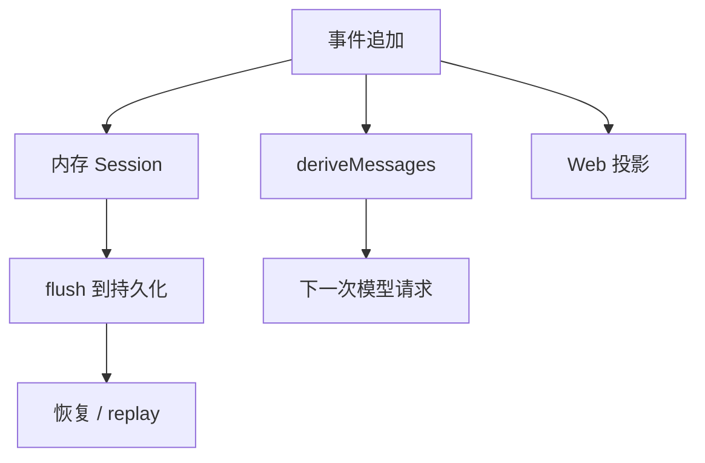

# 09｜Session、持久化与恢复

## 先讲人话

Session 是 Harness 的事实账本。它记录一次任务中发生过什么：用户说了什么、模型请求是什么、工具调用是什么、工具结果是什么、turn 怎么结束。

它不是 UI 状态，也不是普通日志。

## 系统位置



## 关键代码片段

源码入口：

- `packages/core/session/src/types.ts`
- `packages/core/session/src/surface.ts`
- `packages/core/session/src/repair.ts`
- `packages/session/session-persistence/src/coordinator.ts`
- `packages/session/session-persistence-jsonl/src/format.ts`
- `packages/session/session-persistence-sqlite/src/schema.ts`

理解形状：

```ts
session.append({ type: 'turn/start' })
session.append({ type: 'request/header' })
session.append({ type: 'assistant/message' })
session.append({ type: 'tool/result' })
session.append({ type: 'turn/end' })

await sessions.flush(session.id)
```

恢复时的核心不是“继续跑”，而是先判断账本是否完整：

```ts
if (hasOpenToolCall) markToolOutcomeUnknownOrNotStarted()
if (hasOpenStep) appendInterruptedStepEnd()
if (hasOpenTurn) appendInterruptedTurnEnd()
```

## 不变量

- Session event 是 append-only，不能随便改历史。
- UI 和 benchmark trajectory 都应该从同一事件词汇派生。
- 活跃会话和冷日志 repair 的规则不同。
- side-effectful tool 不应在恢复时盲目重试。

## 检查题

- Session event 和 UI state 有什么区别？
- 为什么 `TOOL_OUTCOME_UNKNOWN` 不能自动重跑？
- 为什么 flush 顺序会影响 headless 退出可靠性？

## 延伸阅读

- [../08-session-and-context/event-log-and-recovery.md](../08-session-and-context/event-log-and-recovery.md)
- [../08-session-and-context/context-and-compaction.md](../08-session-and-context/context-and-compaction.md)
- [../13-source-studies/core-runtime-study.md](../13-source-studies/core-runtime-study.md)
