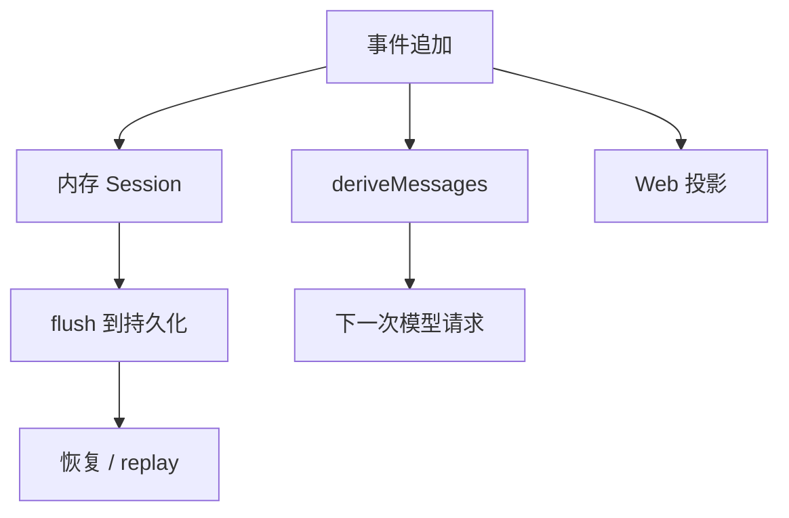

# 09｜Session、持久化与恢复

## 先讲人话

Session 是 Harness 的事实账本。它记录一次任务中发生过什么：用户说了什么、模型请求是什么、工具调用是什么、工具结果是什么、turn 怎么结束。

它不是 UI 状态，也不是普通日志。

## 系统位置



## 关键代码片段

源码入口：

- `packages/core/session/src/types.ts`
- `packages/core/session/src/surface.ts`
- `packages/core/session/src/repair.ts`
- `packages/session/session-persistence/src/coordinator.ts`
- `packages/session/session-persistence-jsonl/src/format.ts`
- `packages/session/session-persistence-sqlite/src/schema.ts`

Session 的基本语义可以先看事件追加：

```ts
session.append({ type: 'turn/start' })
session.append({ type: 'request/header' })
session.append({ type: 'assistant/message' })
session.append({ type: 'tool/result' })
session.append({ type: 'turn/end' })

await sessions.flush(session.id)
```

真实代码里，模型可见历史不是直接读取全部事件，而是通过 surface 投影：

```ts
deriveEventMessage(event) {
  user/message      -> message
  assistant/message -> message, but empty assistant content is skipped
  tool/result       -> message
  other events      -> null
}
```

这解释了为什么 Session 同时能服务三件事：

- 给模型提供下一次请求的历史。
- 给 Web/审计提供完整过程。
- 给恢复逻辑判断哪里中断了。

恢复时的核心不是“继续跑”，而是先判断账本是否完整。真实函数是 `interruptedTurnClosers(events)`，它扫描 open turn、open step、pending tool calls，然后合成缺失的结尾事件：

```ts
for pending tool calls:
  append synthetic tool/result
if open step:
  append step/end
if open turn:
  append turn/end with reason interrupted
```

它还区分两种工具状态：

| 状态 | 含义 | 恢复策略 |
| --- | --- | --- |
| `TOOL_NOT_STARTED` | 模型要求过工具，但 Harness 还没记录工具开始 | 如果仍需要，可以重新发起 |
| `TOOL_OUTCOME_UNKNOWN` | 工具已经记录开始，但结果没落盘 | 不能盲目重跑，先判断是否只读/幂等，或检查外部状态 |

持久化协调器的写路径也不是“每 append 一次就同步写磁盘”。它监听 Session 事件，放进 write-behind，再在 flush/dispose/load 等边界保证耐久化：

```ts
ctx.on('session/event', (session, event) => live.writes.enqueue(event))
ctx.on('session/flush', session => this.flush(session))

private async flush(session) {
  await live.init
  await live.writes.flush()
}
```

这就是 headless 退出前必须 flush 的原因：模型回答出现在屏幕上，不代表事件已经持久化完成。

## 不变量

- Session event 是 append-only，不能随便改历史。
- UI 和 benchmark trajectory 都应该从同一事件词汇派生。
- 活跃会话和冷日志 repair 的规则不同。
- side-effectful tool 不应在恢复时盲目重试。
- surface replacement 需要证明来源事件，不能无凭据覆盖模型历史。
- 持久化必须检测同 id 不同 cwd 或不同 prefix 的 collision。
- HMR/live adoption 不能把还活着的 open turn 错修成 interrupted。

## 本讲源码证据卡

| Session 问题 | 证据入口 | 看什么 |
| --- | --- | --- |
| 事件类型在哪里定义 | `packages/core/session/src/known-event-types.ts`、`types.ts` | turn/step/request/tool/assistant 等事件词汇 |
| 模型可见历史如何派生 | `packages/core/session/src/surface.ts` | event log 到 messages 的投影 |
| 不完整会话如何修复 | `packages/core/session/src/repair.ts` | interrupted closure、unknown tool outcome |
| 持久化如何落盘 | `packages/session/session-persistence*/` | coordinator、JSONL、SQLite 后端边界 |

## 最小实验

```text
任务：验证一次任务结束前 Session flush。
步骤：
1. 跑一次 headless 任务。
2. 找到本次 session id 或 persistence 位置。
3. 检查是否出现 turn/start、request/header、assistant/message、turn/end。
4. 人为中断一个实验时，观察 repair 是否把开放 turn/step/tool 关闭为 interrupted/unknown。
过关：能说明为什么恢复时不能盲目重跑副作用工具。
```

研发改这层时的最小回归：

- `core/session` 的 surface、repair、json、derived-cache 测试。
- `session-persistence` 的 coordinator contract。
- JSONL 和 SQLite 后端各自的 load/flush/repair 测试。
- headless “flush before exit” 测试。
- 至少一次手工中断恢复实验，确认 open tool 不会被当成成功。

## 检查题

- Session event 和 UI state 有什么区别？
- 为什么 `TOOL_OUTCOME_UNKNOWN` 不能自动重跑？
- 为什么 flush 顺序会影响 headless 退出可靠性？

## 延伸阅读

- [../08-session-and-context/event-log-and-recovery.md](../08-session-and-context/event-log-and-recovery.md)
- [../08-session-and-context/context-and-compaction.md](../08-session-and-context/context-and-compaction.md)
- [../13-source-studies/core-runtime-study.md](../03-agent-loop.md)
