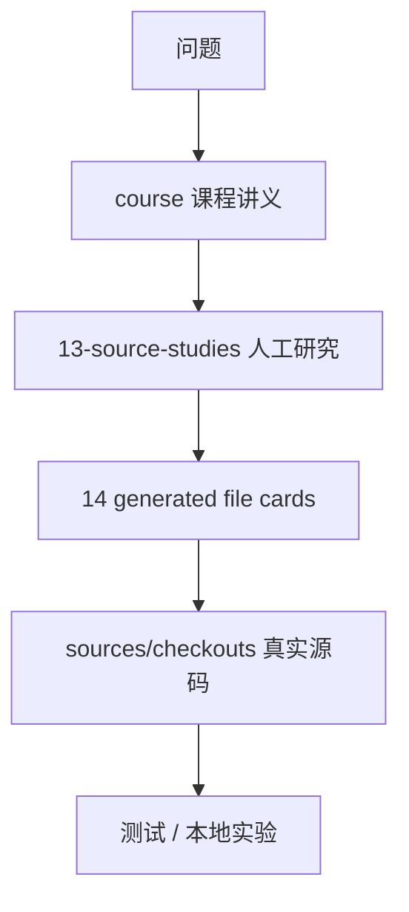

# 11｜源码阅读与本地实验

## 先讲人话

源码学习不能从 7,412 个文件卡片硬读。正确方式是先拿一个问题，再顺着主链路定位文件。

例如问题是“prompt 怎么拼”：

1. 先看课程第 06 讲。
2. 再看 `system-prompt` 和 `session/surface` 的人工研究。
3. 然后查文件卡片确认依赖和测试。
4. 最后跑一次本地实验看 request/header 和 request/context。

## 查源码的顺序



## 最小实验模板

```text
实验目标：
验证某条链路是否按预期工作。

源码基线：
deepseek-harness commit = 47f943...

环境：
Node 版本、系统、是否设置 DEEPSEEK_API_KEY。

命令：
写出可复现命令。

预期：
应该出现哪些事件、输出或退出码。

结果：
成功 / 失败 / 部分成功。

证据：
脱敏日志、artifact hash、相关 session id。

已知缺口：
没有验证哪些情况。
```

## 学核心 runtime 的最小闭环

1. 读对应课程。
2. 读人工源码研究。
3. 查文件卡片和测试索引。
4. 跑相关测试。
5. 跑一个本地正向实验。
6. 跑一个本地失败实验。
7. 写出改动前的不变量清单。

如果你的目标是“能深入改 Harness 核心 runtime 并保证不破坏行为”，再多加四步：

8. 先写出改动影响的事件词汇：会新增、删除、替换哪些 `session` 事件。
9. 写出失败路径：provider error、tool denial、abort、flush failure、resume repair 分别会怎样。
10. 找直接测试和相邻测试，不只跑你改的包；Agent Loop、tools、session、adapter 经常互相影响。
11. 把本地实验记录到 `research/runtime-evidence/`，只记录变量名和脱敏摘要，不记录真实 key。

这不是形式主义。Harness 的核心 runtime 很多 bug 不是“函数返回值错”，而是“账本还能跑，但 replay、UI、恢复或评测解释错了”。所以改核心时必须同时验证源码、测试、运行证据和用户可见行为。

## 本讲源码证据卡

| 学习动作 | 证据入口 | 看什么 |
| --- | --- | --- |
| 从问题定位文件 | `docs/14-file-reference/source-reading-guide.md` | 能力域到文件的路线 |
| 看重点文件 | `docs/14-file-reference/key-file-deep-dives.md` | 12 个核心文件的责任和边界 |
| 看关键函数 | `docs/14-file-reference/key-function-walkthroughs.md` | 关键代码块的正常/失败/边界路径 |
| 找测试映射 | `docs/14-file-reference/generated-index.md` | 先选索引文件，再查代码文件对应哪些直接测试 |
| 写实验记录 | `research/runtime-evidence/` | 命令、环境、结果、artifact hash、known gaps |

## 最小实验

```text
任务：从“prompt 怎么拼”完成一次源码到实验闭环。
步骤：
1. 读课程第 06 讲。
2. 查 system-prompt 和 session/surface 文件卡片。
3. 找对应测试。
4. 跑一个最小 headless 任务。
5. 记录 request/header、request/context 和 known gaps。
过关：能把一个产品问题追到源码、测试和运行证据。
```

本仓库提供一个本地证据草稿生成器：

```bash
npm run evidence:local -- --scenario prompt-context-smoke
```

它不会调用真实模型，也不会读取或打印 API key。它只会检查环境中是否存在 `DEEPSEEK_API_KEY`，并生成一份待填写的脱敏证据模板。真正跑 Harness 后，把命令、退出码、session 事件摘要和 known gaps 补进去。

如果你已经准备好真实 DeepSeek API，再按这个顺序做：

1. 无 key 运行一次，确认缺 key 是受控失败。
2. 设置 `DEEPSEEK_API_KEY`，跑纯文本任务。
3. 跑一个会触发工具的任务。
4. 跑一个审批拒绝或 sandbox 拒绝场景。
5. 把四次结果分别记录，不要合并成一句“跑通了”。

## 不要做的事

- 不要把生成索引当作教程正文。
- 不要只看 TypeScript 编译通过就说行为没变。
- 不要把真实 API key 写进任何文档或日志。
- 不要把一次本地成功扩展成“生产可用”结论。

## 延伸阅读

- [../14-file-reference/source-reading-guide.md](../14-file-reference/source-reading-guide.md)
- [../14-file-reference/key-file-deep-dives.md](../14-file-reference/key-file-deep-dives.md)
- [../14-file-reference/key-function-walkthroughs.md](../14-file-reference/key-function-walkthroughs.md)
- [../15-labs-and-tutorials/experiment-protocol.md](../15-labs-and-tutorials/experiment-protocol.md)
- [stage-checklists.md](stage-checklists.md)
