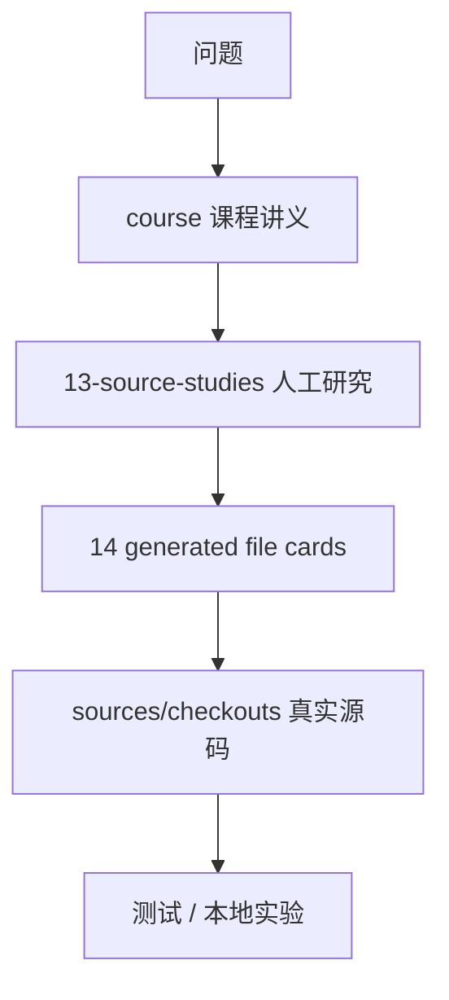

# 11｜源码阅读与本地实验

## 先讲人话

源码学习不能从 7,412 个文件卡片硬读。正确方式是先拿一个问题，再顺着主链路定位文件。

例如问题是“prompt 怎么拼”：

1. 先看课程第 06 讲。
2. 再看 `system-prompt` 和 `session/surface` 的人工研究。
3. 然后查文件卡片确认依赖和测试。
4. 最后跑一次本地实验看 request/header 和 request/context。

## 查源码的顺序



## 最小实验模板

```text
实验目标：
验证某条链路是否按预期工作。

源码基线：
deepseek-harness commit = 47f943...

环境：
Node 版本、系统、是否设置 DEEPSEEK_API_KEY。

命令：
写出可复现命令。

预期：
应该出现哪些事件、输出或退出码。

结果：
成功 / 失败 / 部分成功。

证据：
脱敏日志、artifact hash、相关 session id。

已知缺口：
没有验证哪些情况。
```

## 学核心 runtime 的最小闭环

1. 读对应课程。
2. 读人工源码研究。
3. 查文件卡片和测试索引。
4. 跑相关测试。
5. 跑一个本地正向实验。
6. 跑一个本地失败实验。
7. 写出改动前的不变量清单。

## 不要做的事

- 不要把生成索引当作教程正文。
- 不要只看 TypeScript 编译通过就说行为没变。
- 不要把真实 API key 写进任何文档或日志。
- 不要把一次本地成功扩展成“生产可用”结论。

## 延伸阅读

- [../14-file-reference/source-reading-guide.md](../14-file-reference/source-reading-guide.md)
- [../14-file-reference/key-file-deep-dives.md](../14-file-reference/key-file-deep-dives.md)
- [../14-file-reference/key-function-walkthroughs.md](../14-file-reference/key-function-walkthroughs.md)
- [../15-labs-and-tutorials/experiment-protocol.md](../15-labs-and-tutorials/experiment-protocol.md)
