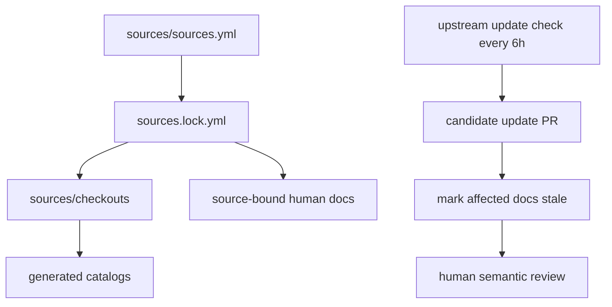

# 12｜生态、论文与维护

## 先讲人话

Harness 的生态不是“把一堆仓库复制过来”。这些仓库用来回答不同问题：

- Cordis 解释插件系统理论和实现来源。
- DeepSeek API / DSML 解释模型协议边界。
- MCP 解释外部工具如何接入。
- ACP 解释外部 Agent 或客户端如何控制 session。
- Codex、Claude Code、OpenCode、Qwen Code、mini-swe-agent 用来对比同类 Agent runtime。
- E2B 等沙箱生态用来理解执行隔离。

## Cordis 论文为什么重要

Cordis 论文关注的是“复杂插件系统如何在时间和空间上组合”。对 Harness 来说，它解释了为什么需要：

- Context：作用域；
- Service：能力注册；
- Event：生命周期通信；
- Fiber：插件生命周期；
- Effect：副作用清理。

论文不是 Harness 用户手册，但它能解释插件架构为什么这样设计。

## 生态证据等级

| 证据 | 用途 |
| --- | --- |
| 源码 | 判断实际实现 |
| 官方文档 | 判断官方意图 |
| 测试/运行记录 | 判断行为是否可复现 |
| Release/Tag | 判断版本变化 |
| Issue/PR/Discussion | 判断演进方向 |
| 社交媒体 | 判断关注点和社区温度 |
| 推断 | 只能作为待验证判断 |

社交媒体不能替代源码事实。

## 持续更新机制



## 开源维护边界

- 本仓库不是 DeepSeek 官方仓库。
- 受限许可证来源不应默认再分发。
- 真实 API key 不能进入仓库。
- 机器索引可以再生成，人工结论必须审核。
- 上游更新后，旧结论不能默认继续有效。

## 本讲源码证据卡

| 维护问题 | 证据入口 | 看什么 |
| --- | --- | --- |
| 跟踪哪些仓库 | `sources/sources.yml` | id、url、fetchPolicy、license |
| 当前固定版本 | `sources/sources.lock.yml` | 每个 source 的 commit 和 license hash |
| 文档如何绑定源码 | 每篇 `docs/**/*.md` frontmatter | `sources`、`last_verified`、`status`、`depth`、`evidence` |
| 上游更新如何处理 | `scripts/update-sources.mjs`、`.github/workflows/upstream-update.yml` | 更新检测、stale 标记、PR 流程 |

## 最小实验

```text
任务：模拟一次维护者复核。
步骤：
1. 查看 sources/upstream-update.md。
2. 查看 sources/stale-documents.md。
3. 任选一篇 source-bound 文档，确认它绑定的 repo/path/commit 存在。
4. 判断这篇文档是 reviewed、verified 还是 stale。
过关：能说明为什么自动更新只能提出候选 PR，不能替代人工语义审核。
```

## 检查题

- 为什么 219 个 workspace packages 不等于 219 个社区插件？
- Cordis 论文和 Harness vendored Cordis 的关系是什么？
- 上游更新后，为什么要标记 stale 文档？

## 延伸阅读

- [../13-source-studies/paper-annotation-method.md](../13-source-studies/paper-annotation-method.md)
- [../16-ecosystem-and-community/plugin-ecosystem.md](../12-comparison.md)
- [../17-version-tracking/README.md](../17-version-tracking/README.md)
- [../18-maintainer-guide/upstream-and-license.md](../18-maintainer-guide/upstream-and-license.md)
