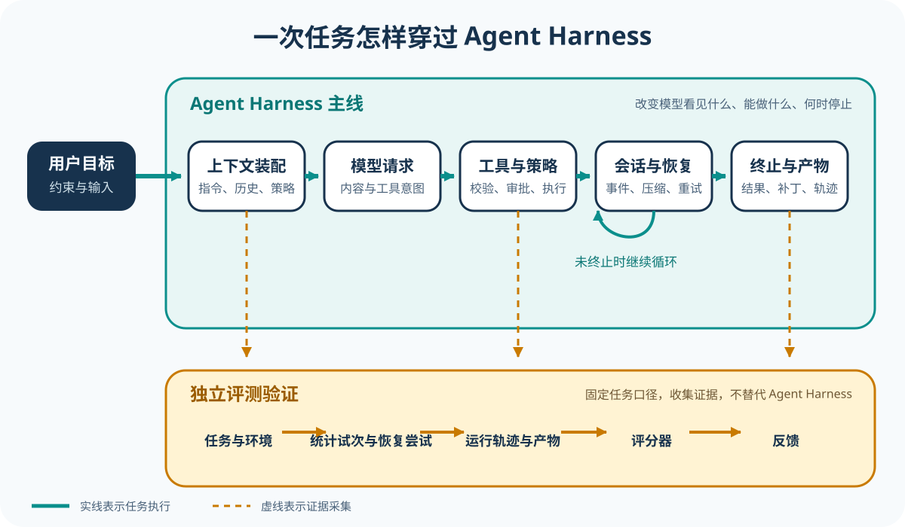

# 从这里开始：先跟完一次任务

如果你会一种编程语言，也用过 Git 和命令行，却还说不清模型给出意图以后 Agent Harness 还要做哪些工作，可以从这一页开始。读这套教材不要求你同时掌握 TypeScript、Rust 和 Python，也不用提前准备六家模型账号。

## 我们要完成的任务

后面的基础导读会反复回到同一个小仓库，我们会跟着一项具体任务往下走，看看 Harness 怎样接住模型的决定并推动任务。订单金额刚好达到 100 元时本应免运费，可测试失败了：

```text
用户：修复订单金额为 100 元时仍收取运费的问题，并运行测试确认。

仓库：
src/shipping.ts
tests/shipping.test.ts

失败：
expected shippingFee(100) to be 0
received 10
```

普通聊天模型或许会建议把 `>` 改成 `>=`，但它既看不到真实文件，也无法运行测试，因此证明不了这个建议确实修好了问题。编程智能体还得读取仓库、找到实现、修改文件、运行测试并观察结果，最后判断任务有没有完成。Harness 就是把这一串动作接起来并控制它们怎样往下走的运行系统，也是本仓库要研究的对象。

## 三个角色

| 角色 | 在案例中负责什么 | 不负责什么 |
| --- | --- | --- |
| Model | 根据当前消息决定读取文件、编辑代码、运行测试或给出答复 | 不直接拥有文件系统和终端权限 |
| Harness | 构造模型输入，解析工具请求，检查权限，执行或委托工具，保存状态并控制下一轮 | 不替模型决定业务修复内容 |
| Environment | 保存仓库文件，运行测试，返回真实输出 | 不解释任务是否已经满足用户目标 |

Trace（执行轨迹）会记下三者之间发生了什么，Eval（评测）则拿事先冻结的任务和判定方法来解释结果。两者都很重要，不过要等你看清执行链以后再展开。



## 一次任务的最小循环

```text
1. Harness 把用户目标、仓库信息和可用工具交给 Model
2. Model 请求读取 src/shipping.ts
3. Harness 检查请求并让 Environment 读取文件
4. 文件内容作为工具结果进入下一次模型输入
5. Model 请求把 > 修改为 >=
6. Harness 完成写入并返回结果
7. Model 请求运行测试
8. 测试输出进入下一轮
9. Model 根据通过结果生成最终答复
10. Harness 保存会话并结束循环
```

这十步不表示每个项目都会使用相同的函数或事件名，它们只是给你一张阅读地图。先记住动作顺序。进入任何源码仓库以后，你都可以顺着这张图去找：输入从哪里进来，谁作出决定，谁真正动手，结果怎样被观察，循环又在什么条件下停住。

## 六个阅读问题

完成任意一条源码课程后，你应该能回答：

1. 模型每一轮究竟看见了哪些消息、工具和状态？
2. 谁创建下一轮请求，谁判断任务继续或结束？
3. 模型给出的工具意图怎样变成真实文件或进程操作？
4. 工具可见、策略允许、用户批准和系统权限分别在哪里判断？
5. Session、Context、Memory 和压缩后的历史怎样保存与恢复？
6. 日志、事件、Trace、测试和 Eval 能核对哪些行为？

你可以拿这六个问题在不同项目之间定位，但不必要求各项目按同一种规范实现。有的项目把循环和工具分派放在同一个模块里，有的则把它们拆到服务端、协议层和多个客户端中，文章会照实保留这些差异。

## 先读五篇基础导读

1. [Model、Harness 与 Environment](foundations/01-model-harness-environment.md)：分清谁决定、谁控制、谁产生副作用。
2. [一次任务怎样形成 Agent Loop](foundations/02-one-agent-loop.md)：沿失败测试走完输入、工具结果和停止条件。
3. [工具、权限与执行边界](foundations/03-tools-permissions-execution.md)：区分工具可见、策略允许、用户批准和环境能力。
4. [Session、Context、Memory 与恢复](foundations/04-session-context-memory.md)：理解短期输入、运行状态和跨任务记忆。
5. [Trace、Eval 与结果核对](foundations/05-trace-eval.md)：把「过程结束」和「任务正确」分开。

基础导读只补上读源码必需的那点共同知识。如果你已经能独立画出一次模型与工具怎样来回交接，就可以直接选择一条项目课程。

## 再选择一条源码课程

- [DeepSeek Harness](harnesses/deepseek-harness/README.md)：适合观察多包 Harness 如何组合上下文、工具、会话和反馈。
- [Codex](harnesses/codex/README.md)：适合观察 Rust 核心、审批、Sandbox 和多种产品表面。
- [Gemini CLI](harnesses/gemini-cli/README.md)：适合观察 Turn、Scheduler、Policy 和工具生命周期。
- [Claude](harnesses/claude/README.md)：适合学习公开产品契约与 SDK 源码之间的证据边界。
- [pi](harnesses/pi/README.md)：适合从极简核心逐层理解编程智能体。
- [OpenCode](harnesses/opencode/README.md)：适合观察服务化 Session 和多客户端架构。

第一次读时只做三件事就够了：运行或观察一个任务，找到核心入口，再沿源码跟完一条调用链。Provider 兼容层、界面怎样渲染、遥测怎样导出以及发布脚本都可以暂时跳过。

如果你不确定该读到多深，可以先看[Starter、Builder 与 Maintainer 三层阅读路线](learning-paths.md)。这三层不是考试等级，它们只是把问题逐层推深：先看任务怎样完整跑一遍，再追踪配置如何改变行为，最后检查文章里的结论能不能稳定复现。

## 源码页面怎样读

每个「第 N 站」都是调用链中的一个停靠点：

```text
任务入口
  → 请求构造
  → 模型响应解析
  → 工具或文本分支
  → 权限与执行
  → 结果回送
  → 持久化与结束
```

每个源码站点都会给出锁定版本的链接，并说明谁调用这里、输入从哪来、代码改了哪些状态、结果回到哪里，以及下一步该读什么。长代码不会整段复制进仓库，链接负责提供完整 Context，正文则带你顺着数据和调用关系读下去。

## 三种核对深度

### 只用浏览器

打开永久链接以后，你可以依次确认文件、符号、谁调用谁以及测试写在哪里。只做到这一步，已经足以核对多数关于代码结构的结论。

### 使用本地 Checkout

运行上游测试或仓库提供的确定性脚本，你就能看见固定输入触发了哪些事件，又让哪些状态发生了变化。主线会尽量避开付费模型。

### 可选真实模型运行

只有某项结论确实要靠模型交互才能核对时，你才需要进入这一层。对应页面会说明要准备什么凭据、可能花多少钱、结果有哪些不确定性，以及看到什么才算成功。即使一次演示跑通，也不能据此断定整个产品都没有问题。

## 阅读完成的标志

学习不在于记住目录名。真正读懂一条课程以后，你应该能从用户输入讲起，用自己的话说明模型、工具和环境怎样接力改变状态，还能指出关键函数谁调用谁，并分别找到权限拒绝、执行失败和测试未通过记在了哪里。

[下一篇：Model、Harness 与 Environment](foundations/01-model-harness-environment.md)

[查看完整课程目录](README.md)
