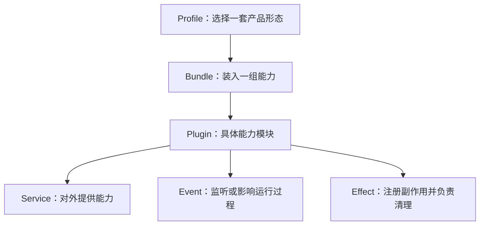
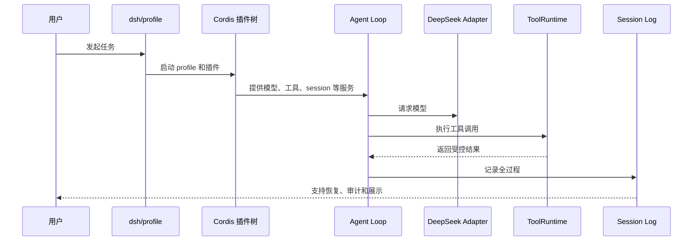

# 非研发导读：不用先会写代码，也能看懂 Harness

这篇给产品、运营、设计、战略、投资、管理同学看。目标不是把你训练成 TypeScript 工程师，而是让你能判断：DeepSeek Harness 到底是什么、为什么插件系统重要、它现在成熟到什么程度、后续如果要投入应该问哪些问题。

## 一句话理解

DeepSeek Harness 不是一个模型，也不只是一个聊天页面。它更像“AI 员工的工作台系统”：

- 模型负责思考和生成。
- Harness 负责把任务交给模型、给模型工具、控制工具权限、记录过程、恢复会话、把结果展示给用户。
- 插件系统负责把这些能力装配起来，让不同产品形态可以共用同一套底层能力。

如果把模型比作“会思考的人”，Harness 就像“办公室、电脑、权限卡、工作流、审计记录和前台界面”。

## 为什么不能只看模型

一个 Agent 能不能真正工作，不只看模型回答好不好。还要看：

| 问题 | Harness 负责什么 |
| --- | --- |
| 模型知道当前任务背景吗 | 组装 system prompt、上下文、文件、session 历史 |
| 模型能调用工具吗 | 暴露工具 schema、执行工具、返回结果 |
| 工具会不会乱执行危险操作 | 审批、权限、沙箱、scope 限制 |
| 任务失败能不能恢复 | session event log、persistence、resume |
| 能不能做成产品界面 | Web、headless、SDK、client runtime |
| 能不能扩展能力 | Cordis plugin、profile、bundle、patch |

所以 Harness 的价值不是“又包了一层 API”，而是把 AI 执行过程产品化、工程化、可治理化。

## 插件系统到底是什么意思

非研发可以这样理解插件：

> 插件就是一个可插拔能力单元。它可以提供模型、工具、界面、配置、权限策略、存储、协议适配，也可以监听运行过程中的事件。

但 Harness 的插件不是浏览器插件那种“给已有页面加个按钮”这么简单。它更接近“把产品能力拆成积木”：

例子：

- DeepSeek 模型适配是插件。
- Web 界面运行层是插件。
- 工具系统是插件。
- Session 持久化可以由插件提供。
- 权限审批和沙箱也可以作为插件或策略层接入。

这就是为什么插件系统是主线：它决定了 Harness 是一个“固定应用”，还是一个“可组合 Agent 平台”。

## 读源码时最重要的四个判断

看 Harness 不能看到一个文件就认为功能可用。要分四层判断：

| 层 | 代表什么 | 常见误判 |
| --- | --- | --- |
| 代码存在 | 仓库里有实现 | 误以为功能已经启用 |
| 配置 entry 存在 | profile 可能能装这个插件 | 误以为所有 profile 都启用 |
| 运行时激活 | 当前进程里真的加载成功 | 误以为用户路径已验证 |
| 产品闭环验证 | 用户能完成任务并有证据 | 误以为 HTTP 200 或启动成功就够 |

Atlas 的文档会刻意区分这四层。这样做不是保守，而是防止高估项目成熟度。

## 产品同学应该重点看什么

建议顺序：

1. [产品路线](product-path.md)：先判断它解决什么问题。
2. [产品成熟度](../01-product/product-maturity.md)：看 developer preview 的边界。
3. [系统架构](../02-system-architecture/README.md)：理解核心模块。
4. [插件系统全景](../03-cordis-foundation/plugin-system-mainline.md)：理解为什么插件是主线。
5. [生态与社区](../16-ecosystem-and-community/README.md)：看外部生态是否成熟。
6. [本地第一次跑通](../15-labs-and-tutorials/local-first-run.md)：亲眼看到一次任务闭环。

目标不是记住每个文件，而是能回答：

- 这是模型产品、开发者工具，还是 Agent 平台？
- 它的护城河在模型、插件系统、运行时治理，还是生态？
- 当前哪些能力只是源码存在，哪些已经能产品化？
- 如果要内部采用，风险最大的环节是什么？

## 工程负责人应该重点看什么

建议顺序：

1. [工程路线](engineering-path.md)
2. [完整学习路径](complete-learning-path.md)
3. [重点文件精读](../14-file-reference/key-file-deep-dives.md)
4. [关键函数代码块解析](../14-file-reference/key-function-walkthroughs.md)
5. [核心 runtime 修改路线](core-runtime-contributor-path.md)

目标是能判断：

- 改动应该落在插件、profile 还是核心 runtime。
- 哪些测试必须跑。
- 哪些行为不能被破坏。
- 哪些结论需要 runtime evidence 支撑。

## 学习时的最低完成标准

非研发不需要读懂每个 TypeScript 类型，但至少要能讲清楚这条链路：

如果能用自己的话解释这张图，你已经理解了 Harness 的产品和架构主线。

## 仍然需要研发参与的部分

以下内容不适合只靠非研发阅读完成：

- 判断某个 race condition 是否真实存在。
- 修改 Agent Loop、ToolRuntime、Session persistence。
- 设计新的权限/沙箱策略。
- 判断某个测试是否足以覆盖回归。
- 把第三方插件作为生产依赖引入。

这些需要工程同学一起看源码和测试。但非研发同学应该能提出正确问题，而不是只问“能不能跑”。
