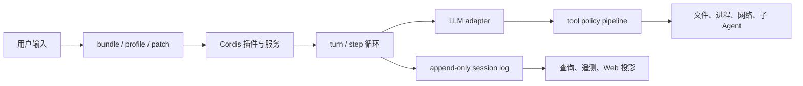

# 工程路线：从配置树到事实流

## 主链路

这条链路由官方架构、生命周期与工具流水线文档共同描述。`evidence: official-doc` 对应实现分布在 `packages/boot`、`bundle`、`core`、`llm`、`session`、`client` 和 `web` 等域。`evidence: code`

## 阅读顺序

1. [系统全景](../../02-system-architecture/runtime-topology.md)
2. [Cordis 底座](../../03-cordis-foundation/plugin-lifecycle.md)
3. [启动与配置](../../04-boot-and-configuration/config-composition.md)
4. [Agent 生命周期](../../05-agent-runtime/turn-step-tool-loop.md)
5. [模型适配](../../06-model-adapter/deepseek-protocol.md)
6. [工具执行](../../07-tools-permissions-sandbox/tool-policy-pipeline.md)
7. [事件与恢复](../../08-session-and-context/event-log-and-recovery.md)
8. [编排原语](../../09-orchestration/orchestration-primitives.md)
9. [Web 数据流](../../10-web-client/web-dataflow.md)

遇到具体符号时先用[人工源码研究](../../13-source-studies/README.md)理解“为什么”，再用[自动文件参考](../../14-file-reference/README.md)定位“在哪里”。

如果目标是进一步参与核心 runtime 修改，而不只是理解调用链，继续读[核心 runtime 修改路线](runtime-contributor.md)。这条路线会把学习重点从“看懂主链路”推进到“不变量、测试矩阵、改动边界和回归证据”。
