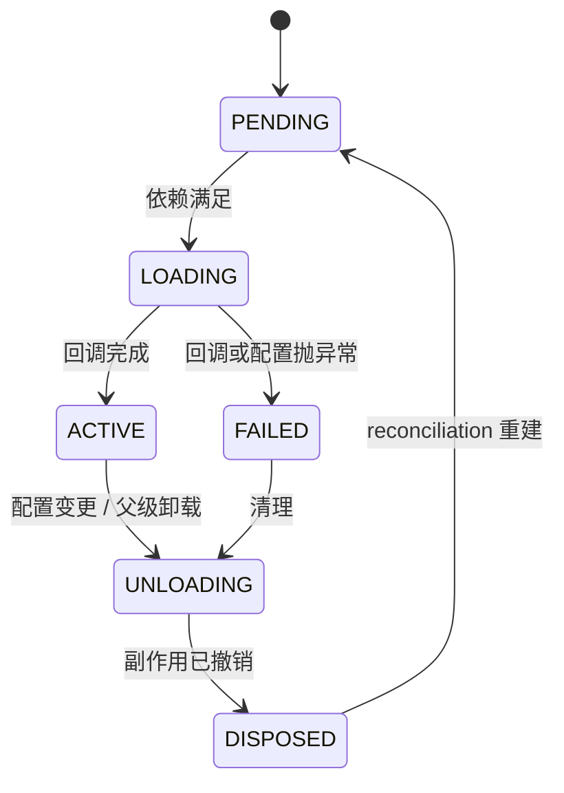

# 02｜Cordis 与启动：插件树如何装配

> 本文基线 `47f9438`。所有行号对应该 Commit。

## 一、产品现象

用户敲的是一条命令：

```bash
dsh --profile headless "把这个目录下的 md 文件统计一下"
```

程序需要的却是一棵**插件树**——里面有模型适配器、工具注册表、会话日志、沙箱策略、审批通道。从一条命令到一棵树，中间发生的事决定了三个用户可见的现象：

| 现象 | 背后是什么 |
| --- | --- |
| 换个 `--profile` 就换了一整套能力，命令没变 | 配置是分层补丁合成，不是一份写死的 YAML |
| 改了配置文件，不重启进程就生效 | HMR：旧 fiber 卸载、新 fiber 激活 |
| 某个功能「装了但没用上」 | 依赖没满足，fiber 停在 `PENDING` |

这三件事都由 **Cordis** 提供。它不是 dsh 的一个模块，是 dsh 站立的地面。

## 二、源码路径

### vendored，不是依赖

Cordis 是**源码内联**在 dsh 仓库里的，不是 npm 依赖。`vendor/` 下 9 个包： `evidence: code`

```
vendor/cordis/          核心（2,693 行）
vendor/loader/          配置到插件树（334 行）
vendor/include/         patch 合成
vendor/group/           分组
vendor/hmr/             热更新
vendor/timer/           定时
vendor/cosmokit/        工具库
vendor/schemastery/     配置校验
vendor/logger-console/  日志
```

`vendor/AGENTS.md` 的第一条规则是：**不要随意编辑 `vendor/*/src/`**，每一处与上游的偏离都必须在 `vendor/README.md` 的 "Local modifications" 一节里穷举登记。 `evidence: official-doc`

### 核心 API 行号锚点

| 位置 | 是什么 |
| --- | --- |
| `vendor/cordis/src/context.ts:42` | `class Context` |
| `vendor/cordis/src/context.ts:74` | `new Proxy<this>(this, ReflectService.handler)` |
| `vendor/cordis/src/context.ts:99` | `extend(meta)` |
| `vendor/cordis/src/context.ts:121` | `isolate(name, label?)` |
| `vendor/cordis/src/context.ts:141` | `intercept(name, config)` |
| `vendor/cordis/src/fiber.ts:147` | `export const enum FiberState` |
| `vendor/cordis/src/fiber.ts:194` | `public state = FiberState.PENDING` |
| `vendor/cordis/src/fiber.ts:415` | `effect(execute, label?)` |
| `vendor/cordis/src/events.ts:32` | `export type DispatchMode` |
| `vendor/cordis/src/service.ts:11` | `export abstract class Service<out T = never>` |
| `vendor/cordis/src/reflect.ts:277` | `provide(name, value?, check?)` |
| `vendor/cordis/src/registry.ts:300` | `inject(inject, callback)` |
| `vendor/cordis/src/registry.ts:316` | `plugin(plugin, config?, getOuterStack)` |
| `vendor/loader/src/index.ts:65` | `export class Loader extends EntryTree` |
| `apps/cli/src/profile-boot.ts:60` | `PROFILE_ROOT_CONFIG` |
| `packages/boot/app-boot/src/index.ts:93` | `BOOTSTRAP_NAMES` |
| `packages/boot/app-boot/src/index.ts:177` | `loadLayeredEnv()` |

## 三、机制

### Context 是一个 Proxy

这是理解一切的起点。`context.ts:74`： `evidence: code`

```ts
const self = new Proxy<this>(this, ReflectService.handler)
```

**普通属性读取会被转发到服务解析器。** 所以插件写 `ctx.tools`、`ctx.llm`、`ctx.sessions` 时，并不是在读一个字段，而是在向当前作用域查询一个服务。这就是为什么插件之间**靠标识符发现能力，不靠 import**。

三个派生方法都返回子上下文，且**都不修改父级**：

| 方法 | 行号 | 作用 |
| --- | --- | --- |
| `extend(meta)` | `:99` | 子上下文原型继承父级全部属性，`meta` 的自有属性遮蔽继承来的 |
| `isolate(name, label?)` | `:121` | 让 `name` 这个服务在子作用域里独立解析，可以换实现而不影响父级；传相同 `label` 会让两次 isolate 合流 |
| `intercept(name, config)` | `:141` | 给子作用域下启动的插件注入该服务的额外配置，祖先条目在前 |

`isolate` 是 profile 隔离和子 Agent 隔离的机制底座。想给某个子 Agent 换一套文件系统 provider，就是在它的作用域里 `isolate('fs')`。

顺带一个细节，`context.ts:61` 的 `Context.is()` 用全局符号做品牌检测，而不是 `instanceof`：

> Works across realms and across multiple copies of cordis

同一进程里存在多份 cordis 拷贝时仍然能正确识别——vendored 场景下这是必需的。

### 五个对象

| 对象 | 核心问题 | 在 dsh 里的产品含义 |
| --- | --- | --- |
| **Context** | 当前作用域能看见哪些服务与事件 | 能力边界与组合面 |
| **Service** | 哪项能力可被 provider 提供、consumer 使用 | 模型、文件、存储等可替换 seam |
| **Event** | 行为在哪个时点被观察、改写或拒绝 | 策略、遥测、UI、生命周期连接点 |
| **Fiber** | 哪个插件实例拥有依赖和副作用 | 装载、失败、重启、卸载的单位 |
| **Effect** | 注册行为如何随所有者撤销 | 防止 listener、timer、进程残留 |

### FiberState：真实是六态

`fiber.ts:147` 的枚举，连同 `:142-145` 的文档注释： `evidence: code`

| 状态 | 含义 |
| --- | --- |
| `PENDING` | 等待所需服务 |
| `LOADING` | 插件回调正在运行 |
| `ACTIVE` | 已加载并对外提供能力 |
| `FAILED` | 回调或其配置抛了异常 |
| `UNLOADING` | disposer 正在运行 |
| `DISPOSED` | fiber 已终结 |



初始状态在 `:194`：`public state = FiberState.PENDING`。状态迁移会发出 `internal/status` 事件。

**注意 `LOADING` 和 `FAILED` 这两态。** 一个插件「装了但没生效」，可能停在 `PENDING`（依赖没满足），也可能是 `FAILED`（起来时抛了）。这两种情况的排查方向完全不同，而在 `dump-config` 的输出里它们看起来一模一样。

`fiber.ts:172` 还有一条约束：`'cannot create effect on inactive context'`——非活跃上下文上不能创建 effect。

### Effect：可逆副作用

`fiber.ts:415-418` 的三个重载： `evidence: code`

```ts
effect(execute: () => SyncEffect, label?: string): Disposable<Promise<void>>
effect(execute: () => Effect, label?: string): AsyncDisposable<Promise<void>>
effect(execute: () => Effect, label = 'anonymous'): any
```

同步和异步两种签名，都返回 disposable。`label` 默认 `'anonymous'`——**给 effect 起名字，排查残留时会省很多事**。

上游 `AGENTS.md` 把这条写成硬约定：

> **Registrations are effects**: every contribution goes through `ctx.effect()` / `ctx.on()`; a registry's `register()` returns the disposer.

这就是「一切皆插件」能成立的原因：热插拔不靠约定，靠**每个副作用都携带它的逆操作**。

### 事件分发有五种模式，不是四种

`events.ts:32`： `evidence: code`

```ts
export type DispatchMode = 'emit' | 'parallel' | 'serial' | 'bail' | 'waterfall'
```

`:27-28` 的注释说明前三种：`emit` 运行同步监听器且不等待，`parallel` 一起等待全部监听器，`serial` 按顺序等待直到某个 bail。

| 模式 | 语义 |
| --- | --- |
| `emit` | 不等待，顺序观察 |
| `parallel` | 并发等待全部 |
| `serial` | 顺序等待，直到某个短路 |
| `bail` | 短路式分发 |
| `waterfall` | 环绕中间件，签名 `(...args, next)` |

**`waterfall` 是 dsh 所有拦截点的统一形状。** 上游规定：waterfall 监听器**必须调 `next()`** 才能委托下游，不调就是短路整条链。`agent/pre-step`、`agent/request`、`llm/stream`、`tools/*` 全是 waterfall。

### 启动：根配置是一个空列表

`profile-boot.ts:60` 的常量原文： `evidence: code`

```
# dsh profile root — an empty entry list. The tree is composed as patches:
# each bundle in package.json's dsh.profile.bundles, then cordis.patch.yml, then any
# --patch overlays. Edit cordis.patch.yml, not this file.
[]
```

**每个 profile 的根配置是 `[]`。** 整棵插件树完全由补丁叠加而成，顺序是：

```
package.json 的 dsh.profile.bundles 里每个 bundle 的 patch
  → profile 自己的 cordis.patch.yml
  → --patch overlay
  → telemetry 开关补丁
```

这解释了文章 01 里那个 9 行的 `bundle/base/src/index.ts`：装配层没有代码，因为装配就是往空列表上打补丁。

也解释了一个常见误判：**「YAML 里排在前面所以先启动」是错的**。YAML 顺序只决定补丁应用顺序，激活顺序由依赖满足关系决定。

### 环境变量分层，以及被拒绝的那一类

`loadLayeredEnv()` 在 `app-boot/src/index.ts:177`，语义在 `:168-175` 的文档注释里： `evidence: code`

- 三层：**inherited 进程环境** > **project `.env`**（调用目录）> **user `.env`**（`$DSH_HOME`）
- **两个文件都先解析完再应用**——「一个被拒绝时不能留下另一个已应用」
- 已接受的值**不覆盖**继承来的值
- 快照记录每个值来自哪一层

关键在 `isBootstrapOnly()`（`:125`）：某些变量**只允许来自继承的进程环境**，写进 `.env` 会直接抛错。名单在 `:93-117`：

```
进程启动与模块解析:  PATH HOME USERPROFILE SHELL NODE_OPTIONS NODE_PATH
                     NODE_EXTRA_CA_CERTS LD_PRELOAD LD_LIBRARY_PATH LD_AUDIT
解释器启动钩子:      BASH_ENV ENV SHELLOPTS BASHOPTS PERL5OPT PYTHONSTARTUP
                     PYTHONPATH RUBYOPT JAVA_TOOL_OPTIONS ...
版本控制命令钩子:    GIT_SSH GIT_SSH_COMMAND GIT_EXTERNAL_DIFF GIT_PAGER
                     GIT_EDITOR GIT_ASKPASS SSH_ASKPASS
前缀:                DSH_  XDG_  DYLD_  BASH_FUNC_
```

**这回答了「`DEEPSEEK_API_KEY` 和 `DEEPSEEK_BASE_URL` 风险为什么不同」**：两者都不在 bootstrap-only 名单里，都可以来自 `.env`。但 `DEEPSEEK_BASE_URL` 改变请求的去向——它决定你的 prompt 发给谁。名单拦住的是能改变**进程启动方式**的变量（`LD_PRELOAD` 能注入动态库、`GIT_SSH_COMMAND` 能换掉 git 的传输命令），一个仓库里的 `.env` 不该有这种权力。

### Loader：从配置到实例

`vendor/loader/src/index.ts:65`：`export class Loader extends EntryTree`。Loader 把 entry tree 变成真实插件实例：读 entry → import 插件模块 → 为 entry 建 fiber → 应用插件 → 跟踪 entry 状态 → 配置变化时卸载或重载。

所以**「功能存在」和「功能已挂载」是两件事**，这正是文章 01 那个四层证据阶梯的第 1 层和第 2 层。

### 论文层：时空可组合性

Cordis 的设计写在《A Programming Paradigm for Spatiotemporal Composability》（`cordiverse/paper`，2026-08-13 预印本，北大 + DeepSeek）。 `evidence: official-doc`

| 维度 | 定义 | 对应机制 |
| --- | --- | --- |
| **时间可组合性** | 组件移除时能完全撤销其副作用 | revertible effects：每个 context 变换携带一个逆操作，runtime 追踪 |
| **空间可组合性** | 声明并响应式管理组件间依赖 | reactive coeffects：context 每次变化按组件的 coeffect 规约通知它 |

论文把 effect context 与 coeffect context 统一成单一 context 类型，并给出动态组合的演算。

落到代码上：`ctx.effect()` 是 revertible effect，`inject` 是 coeffect。本仓库只做原创释义，不复制论文正文。

## 四、约束与失效条件

### dispose 是正确性问题，不是清洁度问题

如果 dispose 只发出停止请求而不等资源停稳，**新旧实例会同时持有端口、文件 watcher 或后台任务**。上游防御模式要求 dispose 达到完全停稳。 `evidence: official-doc`

检查一个插件时固定问四句：

1. 每个监听、timer、watcher、server、子进程是否由 effect 管理？
2. cleanup 是否幂等，是否等待异步资源完成？
3. 激活中途失败时，已创建的部分资源是否回滚？
4. HMR 之后，旧 provider 是否仍被 consumer 引用？

### vendored ≠ upstream

`vendor/README.md` 在基线 SHA 下登记了 **18 类**与上游的差异，涵盖： `evidence: code`

- HMR 移除对 YAML runtime hook 的依赖
- fiber 的 reentrant disposal / 生命周期加固
- Loader/Include 的**事务式配置 reconciliation 与 rollback**
- 精确的 config HMR watcher、序列化刷新与失败事件
- Include 子节点变更的串行化与 HMR 初次扫描抑制（避免交错与死锁）
- 配置写入队列、Windows rename 重试、teardown drain
- lazy Loader 配置解析，含依赖激活后的 `!!js`
- entry `disabled` 的唯一 metadata interpolation 规则
- 全部包 rescope 到 `@deepseek-ai`

**这是一份升级清单，不是一次性背景。** 同步上游时必须逐项重放、改写、退役或证明不再需要，不能覆盖目录后只跑一遍编译。

这也直接影响第三方插件：只要插件 `import` 了上游的 `cordis`、依赖未 rescope 的名称、假定上游的 interpolation 规则，或绕过 dsh 的 tools/session seam，**即使 TypeScript 编译通过，运行时也可能不兼容**。

### 三个典型误判

| 误判 | 为什么错 |
| --- | --- |
| 「YAML 里排在前面所以先启动」 | 顺序只决定补丁应用；激活由依赖满足决定 |
| 「dump-config 里有条目所以功能可用」 | 只证明第 2 层配置启用；fiber 可能停在 `PENDING` 或 `FAILED` |
| 「219 个 package 说明生态繁荣」 | 219 是第一方模块拆分数，说明 seam 粒度，不是社区插件数 |

### 第三方插件的兼容声明

一个可用的第三方插件至少要声明：支持的 Harness SHA/semver、vendored Cordis 版本、host/client/both、所需 services 与 events、配置 schema、profile 入口、Node/OS、权限与沙箱、数据出境、HMR 行为、持久化事件、license 与来源、测试层级。

### 供应链

第三方插件等价于**向宿主进程引入代码**。插件运行在宿主里，不是沙箱。安装前锁定版本与来源，检查 install scripts、依赖树、host/client 权限、网络与凭据访问；升级时审 diff，保留可回滚 profile。

让 Agent 自行生成并挂载插件的能力风险更高：**审批不能替代隔离**。

## 五、可复核实验

### 实验 1：数 vendored 包与本地修改（无需凭据）

```bash
cd sources/checkouts/deepseek-harness
ls -d vendor/*/ | wc -l                    # 期望 9
wc -l vendor/cordis/src/*.ts | tail -1     # 期望 2693
sed -n '/## Local modifications/,/^## /p' vendor/README.md
```

读完本地修改清单，回答：**如果上游 cordis 发了新版本，这 18 类里哪些必须重放？**

### 实验 2：证明根配置是空列表（无需凭据）

```bash
cd sources/checkouts/deepseek-harness
sed -n '59,66p' apps/cli/src/profile-boot.ts
```

应看到 `PROFILE_ROOT_CONFIG` 的值是 `[]` 加三行注释。

然后对比两个 profile 的合成结果：

```bash
pnpm install
pnpm dsh --profile web --dump-config > /tmp/web.yml
pnpm dsh --profile headless --dump-config > /tmp/headless.yml
diff /tmp/web.yml /tmp/headless.yml
```

**该记录**：命令、退出码、两份配置的条目数、差异集合。
**该得出**：这证明补丁合成有效，**不证明**任何一个 entry 的 fiber 到达了 `ACTIVE`。

### 实验 3：观察 bootstrap-only 拒绝（无需凭据）

```bash
cd sources/checkouts/deepseek-harness
echo 'LD_PRELOAD=/tmp/evil.so' > .env
pnpm dsh --profile headless --dump-config ; echo "exit=$?"
rm .env
```

期望：**抛错并拒绝启动**，而不是静默忽略或静默接受。错误信息里应出现被拒绝的变量名。

对照组用一个不在名单里的变量（例如 `DEEPSEEK_BASE_URL=http://127.0.0.1:1`），应当被接受——两者的差别就是本文第三节那份名单。

## 本篇尚未覆盖的源文件

- `vendor/cordis/src/reflect.ts`（418 行）与 `registry.ts`（337 行）—— 服务解析与注册表的完整语义
- `vendor/include/`、`vendor/group/`、`vendor/hmr/` —— patch 合成与热更新的实现细节
- `packages/boot/app-boot/src/index.ts:486` `mountRootInclude()` —— 根 Include 挂载
- `packages/preset/` —— 按会话组合 agent 的 preset cordis.yml
- `packages/extensions/`、`self-modification/` —— Agent 检视并挂载自己的插件
