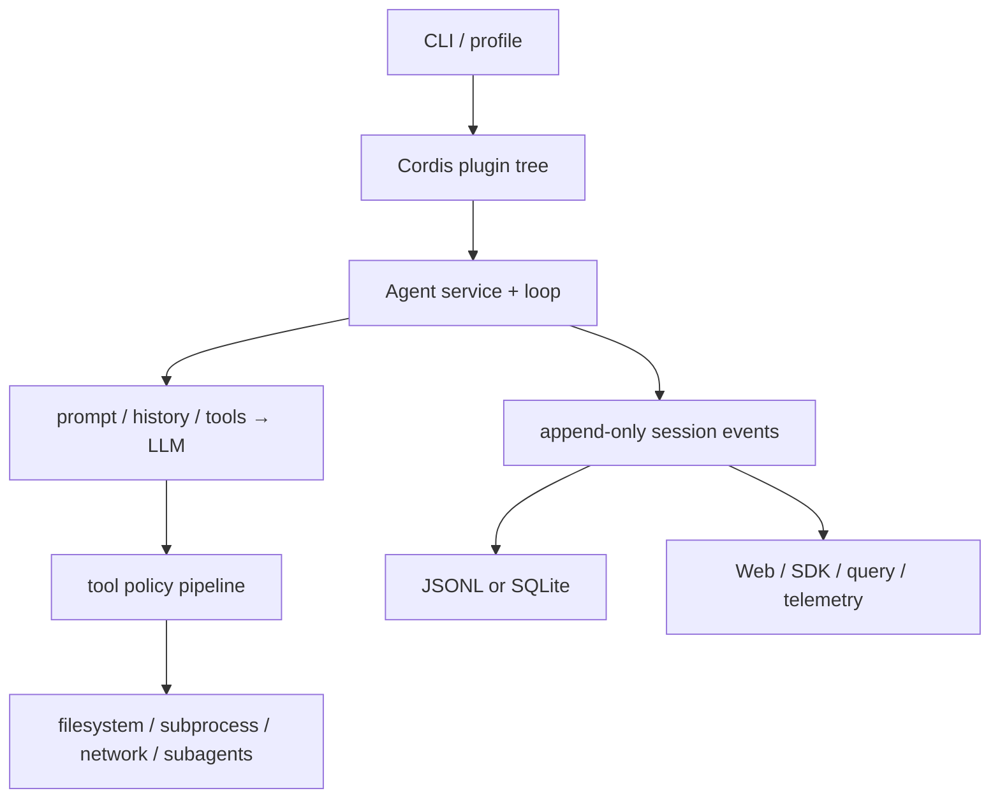

# 02｜系统架构：组合、执行与事实

DeepSeek Harness 可以用三条正交主轴理解：

- **组合轴**：bundle、profile 与 patch 形成 Cordis 插件树。
- **执行轴**：Agent 按 turn/step 推进模型请求与工具调用。
- **事实轴**：Session 以仅追加事件记录可回放事实，UI 和查询从中投影。

官方架构文档直接描述了这三条轴及其关系。`evidence: official-doc` `packages/bundle`、`core/agent-loop`、`core/session`、`session/*` 与 `client/*` 提供对应实现。`evidence: code`

一个关键不变量是“模型可见即已记录”：进入模型请求的内容必须能从会话日志重建。`evidence: official-doc` 因此，新增模型可见上下文不能只塞进内存变量，它需要可持久表达并参与历史派生。`evidence: inference`

继续阅读：[运行时拓扑](runtime-topology.md)、[Cordis](../03-cordis-foundation/README.md)与[启动配置](../04-boot-and-configuration/README.md)。

证据入口：[人工源码研究](../13-source-studies/README.md) · [自动文件参考](../14-file-reference/README.md)
