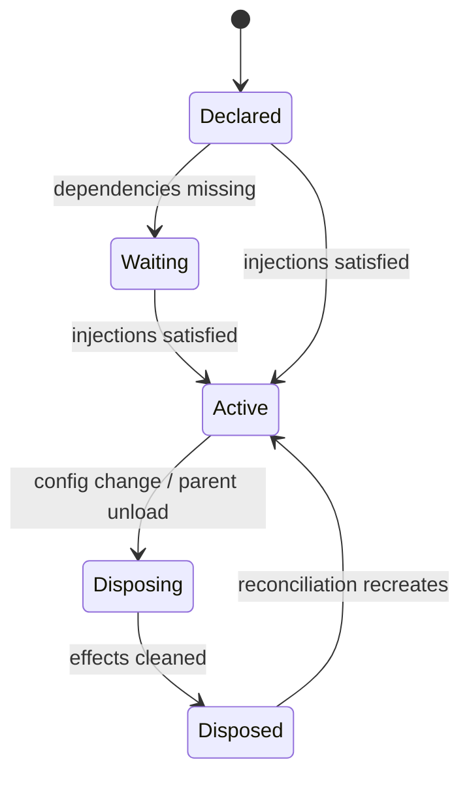

# 插件生命周期与可逆副作用

插件是否启动由依赖满足关系决定。`evidence: official-doc` 运行时用 fiber 表达实例与所有权，用 effect 把副作用的撤销动作绑定到插件生命周期。`evidence: code`

## 为什么 dispose 是正确性问题

如果 dispose 只发出停止请求却未等资源停稳，新旧实例可能同时持有端口、文件 watcher 或后台任务。官方防御模式要求 dispose 达到完全停稳。`evidence: official-doc`

检查一个插件时固定问：

1. 每个监听、timer、watcher、server、子进程是否由 effect 管理？
2. cleanup 是否幂等，是否等待异步资源完成？
3. 激活中失败时，已创建的部分资源是否回滚？
4. HMR 后，旧 provider 是否仍能被 consumer 引用？

Harness 的 vendored Cordis 包含配置 reconciliation、HMR 与 disposal 相关修正。`evidence: code` 这说明插件框架本身就是产品可靠性的一部分，而不是可忽略的基础库。`evidence: inference`

研读入口包括 `vendor/cordis/src/context.ts`、`service.ts`、`events.ts` 和 `fiber.ts`；固定快照定位见[源码研究](../13-source-studies/README.md)。
