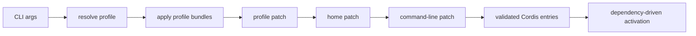

# 配置组合：从 CLI 参数到插件树

## 启动链

该组合顺序由官方架构文档声明。`evidence: official-doc` CLI 和 boot 包中可以定位 profile、bundle 与 runner 的实现。`evidence: code`

## 配置审查清单

- 记录 profile 名、源码 Commit 与 `DSH_HOME`。
- 比对 default config 和 composed config，避免把 overlay 当默认行为。
- 检查模型、凭据引用、工具模式、审批、沙箱、遥测和外部 provider。
- 不把环境变量值写入仓库；配置只保存 secret 引用名。
- 观察插件是否因缺少 injection 或非法组合而在装载期失败。

## 典型误判

“YAML 中排在前面，所以先启动”是错的；依赖满足才控制激活。`evidence: official-doc` “dump 中有条目，所以功能可用”也不充分；还需 provider 初始化与实际交互证据。`evidence: inference`

## 最小实验

导出 web 与 headless 两个 profile 的最终配置，只比较能力树差异，不调用模型。然后记录命令、退出码和脱敏产物。`evidence: runtime` 对应文件和配置 schema 从[自动文件参考](../14-file-reference/README.md)定位，语义解释从[人工源码研究](../13-source-studies/README.md)进入。
