# 07｜工具、权限与沙箱：从模型意图到真实副作用

模型只能提出 tool call；是否执行、在哪里执行、结果能否返回模型，由 Harness 的工具流水线决定。把策略集中在注册表和事件管道，而不是散落在每个工具里，是这一层的核心设计。`evidence: official-doc`

```mermaid
flowchart LR
  call["tool/call 已记录"] --> pre["tools/pre-execute"]
  pre --> guard["monotonic guards"]
  guard --> approval["必要时一次性审批"]
  approval --> around["tools/execute wrappers"]
  around --> body["tool body"]
  body --> post["tools/post-execute"]
  post --> final["finalize + tools/result"]
  final --> logged["tool/result 已记录"]
```

工具被拒绝或审批不可用时，默认跳过 body 并形成结构化错误结果，而不是静默绕过。`evidence: official-doc`

## 产品轨

工具真实能力取决于 schema、provider、guard、approval、sandbox、工作目录和凭据。UI 有一个工具卡只证明产品表面认识它。`evidence: inference`

## 工程轨

Guard 是单调的：下游不能把已有 deny 重新放开。`evidence: official-doc` 最终模型可见结果只有一份，并在 post/finalize 后冻结为权威 outcome。`evidence: official-doc`

继续阅读：[工具流水线](tool-policy-pipeline.md)、[信任边界](trust-boundaries.md)。

证据入口：[人工源码研究](../13-source-studies/README.md) · [自动文件参考](https://github.com/plwslpld-arch/deepseek-harness-internals/tree/gh-pages)
