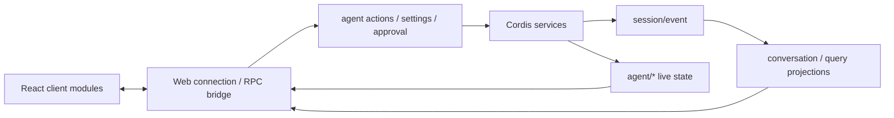

# Web 数据流：持久事实、实时状态与交互命令

该分层可从 client、web、session projection 与 SDK 包关系中定位。`evidence: code`

## 两类状态不能混用

- `session/event` 用于重载后仍成立的消息、工具结果和轮次事实。
- `agent/*` 用于 running/idle、inbox 与交互等待等实时状态。

页面刷新后若只依赖实时通知，会丢历史；若只看持久日志，又无法准确展示当前是否仍在运行。`evidence: inference`

## 审批体验

审批 UI 必须展示工具、参数摘要、作用域与一次性决策，并能处理拒绝、取消、断线和没有可回答客户端的情况。后端在不可回答时失败关闭。`evidence: official-doc` 前端不能把“请求已发送”当“操作已批准”。`evidence: inference`

## 可扩展 client modules

设置、会话、工具卡、目标、计划、工作流、子 Agent 和权限 preset 以模块组合。`evidence: code` 模块存在不等于 web profile 当前都挂载，仍需最终配置与界面运行证据。`evidence: runtime`

## TUI 历史边界

当前快照没有内置 TUI app 或 TUI bundle，CLI 的 built binary 测试拒绝 `tui` 入口。`evidence: code` 历史 note 与残留通用 terminal/client primitives 只说明技术谱系，不能写成“当前同时提供 Web 和 TUI”。`evidence: inference`

具体 client module 与服务边从[人工源码研究](../13-source-studies/README.md)进入，全量文件关系见[自动文件参考](../14-file-reference/README.md)。
