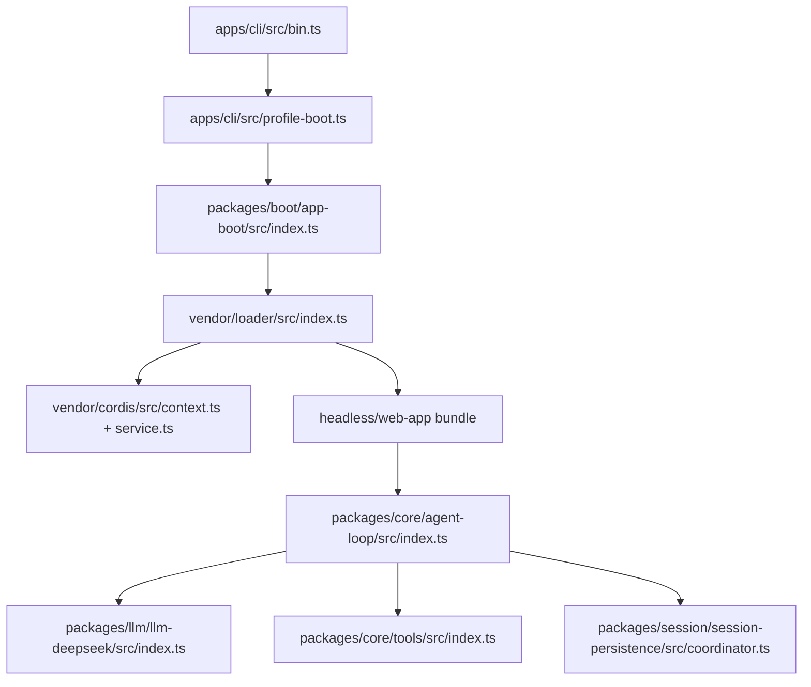

# 重点文件精读：第一批 12 个核心文件

这 12 个文件不是按目录顺序挑的，而是按一次 Harness 任务的主链路挑的：命令进入、profile 组合、Cordis 插件加载、Agent 创建、模型请求、工具执行、Session 持久化、Web/headless 产品表面。

阅读方式：先读本文件每节的“定位”和“执行路径”，再打开上游源码链接看对应实现，最后看“测试证据”确认边界。

## 1. `apps/cli/src/bin.ts`

源码：[apps/cli/src/bin.ts](https://github.com/deepseek-ai/deepseek-harness/blob/47f943859bef60e4160492346772ded9b24f765a/apps/cli/src/bin.ts)

| 项 | 内容 |
| --- | --- |
| 定位 | `dsh` 命令入口。它只负责解析 argv、读取版本、按模式动态导入真正执行模块。 |
| 主要职责 | 把 CLI 分成 `profile`、`plugin`、`dump-config` 三类路径；避免所有模式一启动就加载全部依赖。 |
| 关键依赖 | `parseDshArgs`、`loadLayeredEnv`、`profile-boot.ts`、`plugin.ts`、`dump-config.ts`。 |
| 测试证据 | `apps/cli/tests/args.spec.ts`、`source-launch.compat.spec.ts`、`lazy-search-startup.compat.spec.ts`。 |

正常路径：读取 `package.json` 得到版本 → `parseDshArgs()` 解析参数 → `profile` 模式加载环境并调用 `runProfile()`；`plugin` 模式进入插件管理；`dump-config` 模式输出配置。

失败路径：参数错误、`--help`、`--version` 在 parser 层处理，能进入 switch 的都是已识别模式。default 分支用 `satisfies never` 做类型穷尽检查，说明新增模式时必须同步这里。

容易误解点：`bin.ts` 不是 Agent 启动逻辑本体，它只是分发器。真正的 profile、配置层叠和 Cordis boot 在 `profile-boot.ts` 与 `app-boot`。

## 2. `apps/cli/src/profile-boot.ts`

源码：[apps/cli/src/profile-boot.ts](https://github.com/deepseek-ai/deepseek-harness/blob/47f943859bef60e4160492346772ded9b24f765a/apps/cli/src/profile-boot.ts)

| 项 | 内容 |
| --- | --- |
| 定位 | `dsh profile` 的启动编排层。 |
| 主要职责 | 解析 profile、组合 bundle/user/home/overlay patch、注入命令行参数和环境快照、安装 fail-loud 与进程关闭。 |
| 关键导出 | `homePatchPath()`、`prepareProfile()`、`resolveTelemetryPatch()`、`runProfile()`。 |
| 测试证据 | `apps/cli/tests/telemetry-switch.spec.ts`、`process-shutdown.spec.ts`、`memory-mcp-configs.spec.ts`。 |

正常路径：`prepareProfile()` 确保 profile 根配置是空 entry list → `composeProfile()` 按顺序合并 bundle、profile patch、home patch、命令行 overlay、telemetry patch → `runProfile()` 创建 shutdown 控制器 → `boot()` 启动 Cordis tree → watcher 保持用户 patch 可热更新。

失败路径：watcher 失败会进入 `suppressShutdownError()`；如果此时树已经在 shutdown 或 app exit 中，不把退出过程误报为配置失败。否则 fail-loud 会让启动错误显式暴露。

边界点：

- `$DSH_HOME/cordis.patch.yml` 是全局用户层，优先级高于 profile 内 patch。
- `DSH_TELEMETRY_DISABLED` 只要非空就禁用 telemetry；`0` 和 `false` 也算禁用。
- profile root `cordis.yml` 会被重写为空，因为真实 composition 来自 patch 层，防止 loader write-back 把合成结果烘焙进去。

## 3. `packages/boot/app-boot/src/index.ts`

源码：[packages/boot/app-boot/src/index.ts](https://github.com/deepseek-ai/deepseek-harness/blob/47f943859bef60e4160492346772ded9b24f765a/packages/boot/app-boot/src/index.ts)

| 项 | 内容 |
| --- | --- |
| 定位 | 应用级 boot glue。CLI、ACP demo 等入口复用这里。 |
| 主要职责 | `.env` 分层、config path 解析、patch 读取、Loader root include、fail-loud、配置 dump、harness source prompt。 |
| 关键导出 | `loadLayeredEnv()`、`loadOptionalPatches()`、`mountRootInclude()`、`installFailLoud()`、`assertEntriesActivated()`、`boot()`、`addHarnessSourceSection()`。 |
| 测试证据 | `packages/boot/app-boot/tests/app-boot.spec.ts`、`config-reload.spec.ts`、`config-dump.spec.ts`、`user-patches.spec.ts`。 |

正常路径：加载 inherited/project/user 三层环境 → 拒绝 `.env` 中的 bootstrap-only 变量 → 解析 `cordis.yml` 或 replay snapshot → 创建 Cordis `Context` → 挂载 Loader/Include/Group → 等待 entry load 与 activation → 返回可运行 context。

失败路径：配置解析失败、plugin activation rejection、Loader task rejection 都通过 fail-loud 汇总，避免后台 promise 被吞。`.env` 可缺失，但不能声明会改变进程启动、模块解析、VCS、代理或证书信任的变量。

边界点：

- `DEEPSEEK_API_KEY` 不是 bootstrap-only，可以放在项目或用户环境层；`DEEPSEEK_BASE_URL` 是 bootstrap-only，只能由启动环境提供。
- `resolveConfigPath()` 在 `DSH_SNAPSHOT=replay` 时把 `cordis.yml` 切到 `cordis.snapshot.yml`。
- `addHarnessSourceSection()` 不是业务逻辑，它把“当前 Harness 源码位置”加入 system prompt，帮助 Agent 理解自己运行在哪个 checkout。

## 4. `packages/bundle/headless/src/index.ts`

源码：[packages/bundle/headless/src/index.ts](https://github.com/deepseek-ai/deepseek-harness/blob/47f943859bef60e4160492346772ded9b24f765a/packages/bundle/headless/src/index.ts)

| 项 | 内容 |
| --- | --- |
| 定位 | headless 一次性 Agent driver。 |
| 主要职责 | 在没有 Web/Host 插件的情况下创建一个 Agent，发送一次用户任务，等待 idle，flush session，输出最后 assistant 文本并退出。 |
| 关键导出 | `name`、`inject`、`Config`、`apply()`。 |
| 测试证据 | `packages/bundle/headless/tests/headless.spec.ts`、`startup.spec.ts`。 |

正常路径：等待 Loader settle → 从 `agentDefaultModel` 读取当前模型 → `agents.create()` 创建 session 和 Agent → 安装模型选择 → `followup()` 注入用户消息 → 等待 Agent idle → `sessions.flush()` → 聚合最后 assistant 文本 → 根据 `turn/end.reason` 决定 exit code。

失败路径：`run()` 抛错时写 stderr 并 exit 1；如果树已经被提前 dispose，核心服务可能为 `undefined`，此时直接返回，不启动新任务。

边界点：

- 它不启动 Web，也不暴露浏览器产品面。
- `summarize()` 从本次 run 的 `firstSeq` 后开始看事件，避免把启动前已有历史当成本次输出。
- flush 在 exit 前执行；测试明确检查顺序是 `flush` 再 `exit`。

## 5. `packages/bundle/web-app/src/index.ts`

源码：[packages/bundle/web-app/src/index.ts](https://github.com/deepseek-ai/deepseek-harness/blob/47f943859bef60e4160492346772ded9b24f765a/packages/bundle/web-app/src/index.ts)

| 项 | 内容 |
| --- | --- |
| 定位 | Web 产品表面的 runtime glue。 |
| 主要职责 | 解析前端 dist、挂载 static fallback、注入 Web surface system prompt、注册 `DSH_WEB_URL`、打印 readiness URL。 |
| 关键导出 | `resolveLanTrust()`、`apply()`。 |
| 测试证据 | `packages/bundle/web-app/tests/web-app.spec.ts`、`trusted-hosts.spec.ts`、`startup.spec.ts`。 |

正常路径：根据 `webServer.host` 采样 LAN 地址 → `ctx.provide('webRuntime')` → `FrontendStatic` 接管 dist fallback → 可选注册 system prompt 和 shell env → 等待 Loader settle 后打印 `dsh web: http://127.0.0.1:<port>`。

失败路径：前端 dist 没构建时 `resolveDistIndex()` 抛错；Loader settle 失败时不打印 URL，避免把未就绪服务误报为 ready。

边界点：

- `trustedHosts` 是 trust fence 输入，不只是展示字段。
- URL line 是 readiness signal，因此必须等 sibling rows 挂载完成。
- `apps/web` 的 Vite shell 不是独立应用；只有 `dsh web` 注入 `window.__DSH_BOOT__` 后才是完整产品表面。

## 6. `vendor/cordis/src/context.ts`

源码：[vendor/cordis/src/context.ts](https://github.com/deepseek-ai/deepseek-harness/blob/47f943859bef60e4160492346772ded9b24f765a/vendor/cordis/src/context.ts)

| 项 | 内容 |
| --- | --- |
| 定位 | Cordis dependency container 和 plugin context 核心。 |
| 主要职责 | 创建 root context，挂载内置服务，提供 `extend()`、`isolate()`、`intercept()` 三个组合原语。 |
| 关键类 | `Context`。 |
| 测试证据 | Harness 里没有单独 vendor/cordis 测试目录；行为由 loader、bundle、agent、tools、settings 等上层测试覆盖。 |

正常路径：`new Context()` 返回一个 Proxy；Proxy 后面挂着 root fiber、reflect、registry、events、logger。插件拿到的 `ctx` 不是普通对象，而是带服务解析和事件分发能力的上下文。

失败路径：Context 本身很少主动抛错，主要错误来自服务解析、插件注册、fiber 生命周期和上层调用约束。

边界点：

- `extend(meta)` 创建子 context，不改父 context。
- `isolate(name)` 让某个服务名在子树内进入独立 scope。
- `intercept(name, config)` 给下游插件注入服务级配置，常用于 loader/config 组合。

## 7. `vendor/cordis/src/service.ts`

源码：[vendor/cordis/src/service.ts](https://github.com/deepseek-ai/deepseek-harness/blob/47f943859bef60e4160492346772ded9b24f765a/vendor/cordis/src/service.ts)

| 项 | 内容 |
| --- | --- |
| 定位 | Cordis service 基类。 |
| 主要职责 | 把服务实例注册到 `ctx`，并随当前 fiber 自动卸载。 |
| 关键类 | `Service`。 |
| 测试证据 | 通过所有继承 `Service` 的运行时服务间接覆盖，例如 `AgentLoop`、`ToolRuntime`、Loader。 |

正常路径：子类构造时调用 `super(ctx, name)` → `ctx.reflect.provide()` 注册服务 → 如果服务实现 `[Service.invoke]`，则把实例变成 callable service。

失败路径：服务基类本身不做业务校验；错误通常出现在服务的 `[Service.check]`、具体子类构造或调用阶段。

边界点：

- service 的自动清理由 owning fiber 负责，这正是插件热卸载/HMR 能工作的基础。
- `[Service.resolveConfig]` 会从 ancestor intercept 中合并配置；声明 `Config.merge` 的服务可控制合并语义。
- `Service` 不是隔离边界。插件代码仍在同一进程里执行，安全隔离需要工具权限、沙箱和运行策略另行承担。

## 8. `vendor/loader/src/index.ts`

源码：[vendor/loader/src/index.ts](https://github.com/deepseek-ai/deepseek-harness/blob/47f943859bef60e4160492346772ded9b24f765a/vendor/loader/src/index.ts)

| 项 | 内容 |
| --- | --- |
| 定位 | Cordis plugin loader service。 |
| 主要职责 | 管理 entry tree、动态导入插件、插值配置、监听配置更新、处理插件 self-dispose 和 HMR 写回。 |
| 关键类 | `Loader extends EntryTree`。 |
| 测试证据 | 由 app-boot、bundle、动态配置、HMR 和插件组合测试间接覆盖。 |

正常路径：构造 Loader → 设置 `ctx.baseUrl` → 注册 `loader` service → 监听 `internal/config` 做配置插值 → 监听 `internal/update` 写回 entry config → 监听 `internal/plugin` 标记 fiber ownership → 挂载 `isolate` 插件。

失败路径：entry 加载失败会被 Loader task 记录，并由 app-boot 的 fail-loud/assert 阶段暴露。self-dispose 如果来自真实 entry fiber，Loader 会把对应 entry 标为 disabled 并写回配置。

边界点：

- `Loader.Intercept.await` 可以让依赖 loader 的插件在 entry tasks 未完成时保持 pending。
- `unwrapExports()` 处理 ESM/CJS/default interop。
- Loader root tree 的 `write()` 是 no-op；真正持久化由具体 Include/EntryTree 子类承担。

## 9. `packages/core/agent-loop/src/index.ts`

源码：[packages/core/agent-loop/src/index.ts](https://github.com/deepseek-ai/deepseek-harness/blob/47f943859bef60e4160492346772ded9b24f765a/packages/core/agent-loop/src/index.ts)

| 项 | 内容 |
| --- | --- |
| 定位 | Agent 创建、恢复和生命周期工厂。 |
| 主要职责 | 注册 `agentLoop`，接管 `ctx.agents` factory，创建 `ReactLoopAgent`，绑定 session、agent registry、模型变量和生命周期 teardown。 |
| 关键类 | `AgentLoop extends Service implements AgentFactory`。 |
| 测试证据 | `packages/core/agent-loop/tests/agent.spec.ts`、`loop.spec.ts`、`tool-calls.spec.ts`、`cancel.spec.ts`、`resume.spec.ts`、`scope-lifecycle.spec.ts`。 |

正常路径：构造时安装 settings section → 设置 agents factory → 配置 system prompt 变量 `provider/model/cwd` → `createAgent()` 准备 session → `setupAndPublish()` 创建 Agent 并运行 caller setup → publish 到 session/agent registry → 事件通知 `agent/session-start`。

恢复路径：`resume()` 要求存在 `sessionPersistence`；`resumeWith()` 先从持久化层 prepare session，再 setup/publish。配置声明的 agent 如果有固定 `sessionId`，会尝试 restore，否则 create。

失败路径：

- agent options 非法时在 `prepare()` 前校验。
- caller signal、owner fiber unload、factory teardown 三个取消源会融合成同一个 abort。
- setup 阶段失败会 dispose 已创建机器，防止半发布 agent 泄漏。

边界点：

- Agent 和 Session 使用同一个 `SessionId` 做身份核心。
- teardown 是反向、幂等、memoized 的；多个 owner 同时触发只等待同一个 quiescence。
- `maxParallelToolCalls` 是 settings 读时生效，不中断正在运行的一组 tool calls。

## 10. `packages/llm/llm-deepseek/src/index.ts`

源码：[packages/llm/llm-deepseek/src/index.ts](https://github.com/deepseek-ai/deepseek-harness/blob/47f943859bef60e4160492346772ded9b24f765a/packages/llm/llm-deepseek/src/index.ts)

| 项 | 内容 |
| --- | --- |
| 定位 | DeepSeek 官方模型 provider route。 |
| 主要职责 | 注册 `deepseek-official` adapter，按请求解析 API key、base URL、thinking、model catalog、retry policy。 |
| 关键导出 | `Config`、`PUBLIC_BASE_URL`、`resolveAdapterOptions()`、`apply()`。 |
| 测试证据 | `packages/llm/llm-deepseek/tests/dynamic-config.spec.ts`、`adapter.spec.ts`、`serialize.spec.ts`、`sse.spec.ts`、`translate.spec.ts`。 |

正常路径：`apply()` 建立当前 config source → `resolveAdapterOptions()` 验证并生成连接事实 → `resolveApiKey()` 优先走 `ctx.credentials`，否则从 launch environment 读 `DEEPSEEK_API_KEY` → 注册 adapter 和 configurable provider。

动态配置路径：base URL、catalog、key 在下一次请求时解析；retry policy 是 registration-captured fact，变化时会原地 re-register route，避免 provider 短暂消失。

失败路径：

- 没有 key 时返回 `MISSING_CREDENTIAL`，不是插件加载失败。
- key 不能用于 HTTP header 时拒绝，并且测试保证错误信息不回显 secret。
- settings 快照 beyond-schema 失败时继续使用 last-good 配置，并记录错误。

边界点：

- 默认 key 名是 `DEEPSEEK_API_KEY`，适合每个使用者在自己机器上配置。
- `DEEPSEEK_BASE_URL` 只从受信启动环境层读取；默认是 `https://api.deepseek.com`。
- `thinking: disabled` 时只能配置 `reasoningEffort: off`。

## 11. `packages/core/tools/src/index.ts`

源码：[packages/core/tools/src/index.ts](https://github.com/deepseek-ai/deepseek-harness/blob/47f943859bef60e4160492346772ded9b24f765a/packages/core/tools/src/index.ts)

| 项 | 内容 |
| --- | --- |
| 定位 | 工具注册、展示、限制、审批、执行和结果规范化的核心 runtime。 |
| 主要职责 | 管理全局/ scoped tools、Code Mode `run_code` transport、pre/post execute waterfalls、approval seam、guard、并发分类、结果 materialization。 |
| 关键类 | `ToolRuntime extends Service`。 |
| 测试证据 | `packages/core/tools/tests/tools.spec.ts`、`code-mode.spec.ts`、`execution-mode.spec.ts`、`execution-signal-types.spec.ts`、`scoped.spec.ts`、`schema.spec.ts`。 |

正常路径：插件用 `tools.register()` 注册工具 → Agent scope 通过 `schemas()` 得到模型可见 schema → model 发起 tool call → `execute()` 创建 execution token 并 snapshot 参数 → 跑 `tools/pre-execute` → 可选 approval → guard 判定 → `tools/execute` around-dispatch → 调用 tool body → output schema 校验/render → `tools/post-execute` → `tools/result` 通知。

失败路径：

- 未知工具或 Code Mode 下直接调用非 `run_code` 会产生受控错误。
- 参数、输出、render、presentationMeta 必须可 lossless JSON materialize。
- approval 缺失或不可用时 ask 会降级为 deny，而不是默认允许。
- caller cancellation 分为 body 未开始和已开始两类，避免 started work 被丢弃。

边界点：

- `run_code` 是保留工具名，任何插件不能注册或 shadow。
- `restrict()` 只能在 agent scope 使用，不能在全局 context 上把所有 agent 的工具遮掉。
- scoped tools 可以 shadow global tools；限制只过滤继承来的能力，不过滤当前 scope 自己注册的工具。
- `tools/result` observer 失败只记录 warn，不能改变已经确定的工具结果。

## 12. `packages/session/session-persistence/src/coordinator.ts`

源码：[packages/session/session-persistence/src/coordinator.ts](https://github.com/deepseek-ai/deepseek-harness/blob/47f943859bef60e4160492346772ded9b24f765a/packages/session/session-persistence/src/coordinator.ts)

| 项 | 内容 |
| --- | --- |
| 定位 | Session 持久化协调器，位于抽象 session service 和具体 backend 之间。 |
| 主要职责 | create/load/prepare/inspect/readFrom/append 的一致性、按 session id 串行化、write-behind、恢复修复、HMR live adoption、dispose drain。 |
| 关键类 | `PersistenceCoordinator`。 |
| 测试证据 | `packages/session/session-persistence/tests/persistence.spec.ts`、`write-behind.spec.ts`、`preparations.spec.ts`。 |

正常写路径：`session/created` 初始化 live controller → `session/event` 进入 bounded write-behind → `append()` 对事件做 lossless JSON snapshot → `appendCore()` 校验事件形状和 seq 连续性 → backend `appendBatch()` 原子写入 → cursor 前进。

恢复路径：`prepare()` 先等 retirements，拒绝 live session 冲突 → 读取 stored prefix → 校验 id/version/event type → 对中断 turn 合成 closers → 返回带 release 语义的 `SessionPreparation`。`resume()` 由 AgentLoop 消费这个 preparation。

失败路径：

- session id 冲突、cwd 不一致、seed 不覆盖 persisted prefix 都拒绝。
- 新版本写出的未知 required event 会拒绝读取，ignorable event 可跳过解释风险。
- append seq 不连续直接失败，防止 durable log 出现洞。
- dispose 时先 flush 所有 live session，再等所有 per-id chains，最后关闭 backend。

边界点：

- `create()` 是 lazy materialization；没有事件时不一定马上产生持久 artifact。
- `load()` 对 cold stored log 会做修复提交，但 live session 视图不能被当作可修复 cold log。
- HMR adoption 不会把 open turn 当作 interrupted 关闭；live Session 仍是权威。
- 所有同 id 操作进入 `serialize()` 链，避免同一个 session 的写入交错。

## 学完这 12 个后能得到什么

读完第一批，应该能串起这条链路：

1. `dsh` 解析命令并选择 profile。
2. profile boot 组合 bundle、用户 patch、overlay 和环境。
3. app-boot 创建 Cordis context 并驱动 Loader。
4. Loader 挂载插件 tree，Cordis service/fiber 负责依赖注入和生命周期。
5. headless 或 web-app bundle 决定产品表面。
6. AgentLoop 创建或恢复 Agent。
7. DeepSeek adapter 在每次请求时解析 key、endpoint 和模型配置。
8. ToolRuntime 控制工具可见性、审批、执行和结果落账。
9. PersistenceCoordinator 把 Session 事件可靠写入后端，并支持恢复。

下一批如果继续扩展，建议做这 18 个方向：DeepSeek adapter 的 `adapter.ts`/`serialize.ts`、`ReactLoopAgent`、tool call scheduler、session core event model、web server/API bridge、client runtime、settings/credentials、sandbox policy、bash tool、ACP/MCP 协议入口和插件开发样例。
