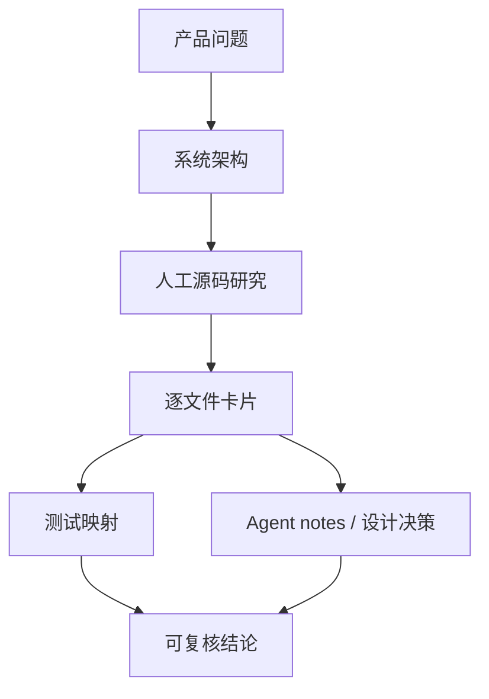

# 逐文件源码阅读指南

本页回答一个具体问题：已经有 7,412 个文件卡片，应该怎么把它们当成“逐文件源码解析”来学习，而不是被一个大表淹没。

## 先明确边界

Atlas 的逐文件源码解析分为两种产物：

- **全量文件卡片**：[`generated/harness-file-cards.md`](https://github.com/plwslpld-arch/deepseek-harness-internals/blob/gh-pages/harness-file-cards.md) 覆盖 DeepSeek Harness 固定基线中的每个跟踪文件。它回答“这个文件大概负责什么、导出什么、依赖谁、谁依赖它、有没有直接测试”。
- **人工源码研究**：[`../13-source-studies/`](../13-source-studies/README.md) 解释关键链路的实现原因、运行顺序、边界条件和风险。它回答“为什么这样设计、实际路径怎么走、哪些结论不能只靠静态文件名判断”。
- **重点文件精读**：[`key-file-deep-dives.md`](key-file-deep-dives.md) 先覆盖第一批 12 个核心文件，把启动、插件、Agent Loop、模型、工具和 Session 串起来。
- **关键函数 walkthrough**：[`key-function-walkthroughs.md`](key-function-walkthroughs.md) 不精确到行号，而是解释关键代码块的责任、输入、输出、失败路径和非研发类比。

没有把 7,412 个文件逐行翻译成中文注释。原因很直接：全仓逐行注释体量巨大、噪声高，并且上游一更新就会大面积过期。正确读法是先用人工研究建立模型，再用文件卡片追到具体文件和测试。

## 文件卡片每列怎么读

| 列 | 含义 | 使用方式 |
| --- | --- | --- |
| 路径 | 固定 commit 的上游文件链接 | 点击进入真实源码，确认具体实现 |
| 分类 | source、test、decision、documentation、config、fixture 等 | 先过滤 source/test/decision，避免从生成物或快照开始读 |
| 行数 | 文件规模 | 大文件先找导出符号和测试，小文件可以直接通读 |
| 文件职责 | 机器生成的职责摘要 | 用来定位，不作为最终语义结论 |
| 公开符号 | export 出来的函数、类、类型或常量 | 优先读公开符号；内部 helper 等追调用时再读 |
| 直接依赖 | 当前文件 import 的仓库内文件数量 | 依赖多表示它可能是组合层或门面层 |
| 反向依赖 | 有多少文件 import 它 | 反向依赖高通常表示核心抽象或公共服务 |
| 直接测试 | 静态匹配到的测试数量 | 有测试先读测试，测试往往比实现更快暴露约束 |

## 学习时不要按文件名从 A 到 Z 读

推荐用“能力域 → 人工研究 → 文件卡片 → 测试 → 设计决策”的顺序：

这样读可以避免两个常见错误：

- 看到某个文件存在，就误判这个功能已经在当前 profile 默认启用。
- 看到某个测试通过，就误判真实业务 E2E 或产品形态已经成熟。

## 第一轮源码阅读顺序

如果目标是搞懂 Harness 的核心实现，先读这 8 组，不要直接打开全量 7,412 个文件：

| 顺序 | 能力域 | 先读文档 | 再查文件卡片关键词 |
| ---: | --- | --- | --- |
| 1 | CLI 与启动 | [`../04-boot-and-configuration/README.md`](../04-boot-and-configuration/README.md) | `apps/cli/src/bin.ts`、`profile-boot.ts`、`app-boot` |
| 2 | Profile 与插件装配 | [`../03-cordis-foundation/plugin-lifecycle.md`](../03-cordis-foundation/plugin-lifecycle.md) | `packages/bundle/headless`、`packages/bundle/web-app`、`vendor/loader` |
| 3 | Cordis 底座 | [`../03-cordis-foundation/plugin-system-mainline.md`](../03-cordis-foundation/plugin-system-mainline.md) | `vendor/cordis/src/context.ts`、`service.ts`、`index.ts` |
| 4 | Agent Loop | [`../05-agent-runtime/turn-step-tool-loop.md`](../05-agent-runtime/turn-step-tool-loop.md) | `packages/core/agent-loop`、`packages/core/agent` |
| 5 | 模型适配 | [`../06-model-adapter/deepseek-protocol.md`](../06-model-adapter/deepseek-protocol.md) | `packages/llm/llm-deepseek`、`packages/llm/llm`、`llm-retry` |
| 6 | 工具与权限 | [`../07-tools-permissions-sandbox/tool-policy-pipeline.md`](../07-tools-permissions-sandbox/tool-policy-pipeline.md) | `packages/core/tools`、`packages/shell/tool-bash`、`packages/sandbox` |
| 7 | Session 与恢复 | [`../08-session-and-context/event-log-and-recovery.md`](../08-session-and-context/event-log-and-recovery.md) | `packages/core/session`、`session-persistence`、`session-query` |
| 8 | Web 与产品界面 | [`../10-web-client/web-dataflow.md`](../10-web-client/web-dataflow.md) | `packages/web/web`、`packages/client`、`packages/host/webserver` |

第一批已经整理成可直接阅读的人工精读：[重点文件精读：第一批 12 个核心文件](key-file-deep-dives.md)。读完文件级解释后，继续读[关键函数代码块解析](key-function-walkthroughs.md)。

## 插件系统应该怎么读

插件系统是主线，建议按这条路径：

1. 先读论文方法：[`../13-source-studies/paper-annotation-method.md`](../13-source-studies/paper-annotation-method.md)。
2. 再读插件全景：[`../03-cordis-foundation/plugin-system-mainline.md`](../03-cordis-foundation/plugin-system-mainline.md)。
3. 再读生命周期：[`../03-cordis-foundation/plugin-lifecycle.md`](../03-cordis-foundation/plugin-lifecycle.md)。
4. 然后读 fork 对照：[`../13-source-studies/cordis-fork-and-plugin-system.md`](../13-source-studies/cordis-fork-and-plugin-system.md)。
5. 最后去文件卡片里搜 `vendor/cordis`、`vendor/loader`、`profile`、`bundle`、`plugin`。

这里要区分三层：

- **Cordis 论文**：给出 context/service/effect/fiber 这类抽象的理论背景。
- **Harness vendored Cordis**：是真正被 Harness 使用的实现，和上游 Cordis 有分叉差异。
- **Harness 插件生态**：包括 profile、bundle、host/client 插件、能力插件、第三方扩展和供应链治理。

## 查某个具体源码文件时的步骤

假设你想读 `packages/llm/llm-deepseek`：

1. 打开 [`generated/harness-file-cards.md`](https://github.com/plwslpld-arch/deepseek-harness-internals/blob/gh-pages/harness-file-cards.md)，搜索 `packages/llm/llm-deepseek`。
2. 看该文件的公开符号、直接依赖、反向依赖和直接测试。
3. 打开 [`generated/harness-source-test-map.md`](https://github.com/plwslpld-arch/deepseek-harness-internals/blob/gh-pages/harness-source-test-map.md)，找它关联的测试。
4. 打开 [`generated/symbols.md`](https://github.com/plwslpld-arch/deepseek-harness-internals/blob/gh-pages/symbols.md)，确认关键函数或类型是否还有其他导出位置。
5. 回到人工研究 [`../13-source-studies/deepseek-adapter-study.md`](../13-source-studies/deepseek-adapter-study.md)，把文件细节放回模型适配链路里理解。

这个流程比“打开源码从第一行读到最后一行”更稳定，因为它同时检查实现、调用者、测试和人工解释。

## 后续增强方向

当前已经有全量逐文件导航、重点文件精读和关键函数 walkthrough。后续如果继续加深，可以增强三类内容：

- **重点文件精读**：为最关键的 30–50 个文件单独写 L2/L3 精读卡，包含 happy path、error path、edge case、测试证据和设计取舍。
- **真实运行证据**：使用个人配置的 `DEEPSEEK_API_KEY` 跑脱敏 E2E，把命令、环境、结果摘要和 artifact hash 写入 `research/runtime-evidence/`。
- **生态实测**：对第三方协议、插件样例、参考 Agent 做安装和兼容性验证，把结果沉淀到 `docs/16-ecosystem-and-community/` 与 `research/benchmarks/`。

优先级建议：先补重点文件精读，再补 DeepSeek API E2E，最后做生态实测。原因是重点文件精读能直接提升学习效率，也能为后续运行证据建立检查清单。
