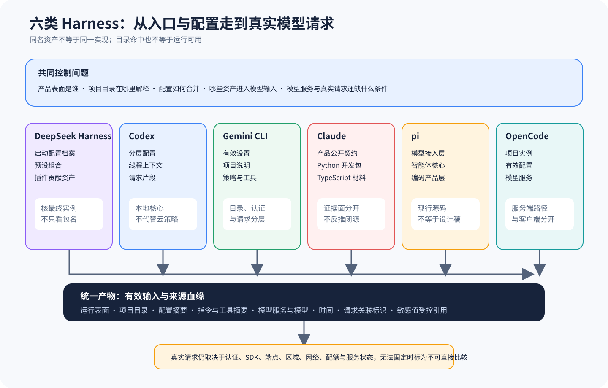

# 六类 Harness 的运行边界、配置与模型输入

## 比较问题

用户输入同一句「修复失败测试」，六类 Harness 实际发给模型的请求不会相同。差异早在模型调用之前就出现：启动入口选择哪个产品表面，工作目录怎样变成项目上下文，全局、用户、项目和运行覆盖配置按什么规则合并，系统指令、项目说明、工具 Schema、会话历史与动态状态放在请求的哪个位置，以及 Provider/Model 从目录条目走到真实流请求还要跨过哪些条件。

本篇不统计谁的配置项更多。关注点是每一步的决定权、读者怎样取得最终有效输入，以及发生漂移时应在哪一层定位。六条主线使用不同术语，矩阵只把它们映射到共同问题，不把 Profile、Thread、Settings、SDK Options、Coding Agent Resources 与 Instance Config 强行说成同一种对象。

## 共同抽象

横向比较先把六方都映射成一条可观察管线：产品入口确定运行表面，项目解析确定工作目录与信任域，配置归并形成有效设置，资源装配加入指令与工具，Provider 解析把模型名称变成客户端，最后序列化一次真实请求。这个抽象只规定要找的检查点，不规定项目必须拥有六个同名模块；同一函数可以承担多步，一个服务也可以把一步拆到多个进程。

每个检查点都用相同的四元组记录：`输入来源`、`合并或选择规则`、`有效结果`、`失败位置`。例如「模型为 X」只是有效结果，不能代替它来自哪个配置层、怎样覆盖、Provider 是否载入和 Stream 是否成功。若某方只能观察公开命令而看不到内部请求，就把不可见字段标为未知，不用其他 SDK 的实现补空白。

配置 Provenance 是这篇比较的主轴。一个字段的值相同，不代表形成路径相同；全局默认与项目显式值都可能得到 `model=X`，但治理、复现和迁移风险不同。数组、工具表面与指令尤其不能套用标量的「最后一个覆盖」假设，必须从项目源码、文档或运行 Artifact 核对真实合并语义。

模型目录、Provider、Language/Client 与 Stream 则构成四级可用性。Catalog 命中只证明元数据可发现；Provider Map 命中证明适配器被解析；客户端构造还受认证与 SDK 影响；真实 Stream 才能证明该时刻、账户、区域和配置下请求可达。四级状态能跨实现迁移，具体类名和错误码仍保留原项目语义。

## 控制变量

为了让比较有归因价值，先固定任务文本、初始文件树、可用工具类别和目标模型能力类别；若六方不能使用同一 Provider/Model，就记录模型差异，不用输出质量反推配置架构。比较范围限定在各自主线锁定版本，Claude 只使用公开产品契约与 SDK 可见实现，不能从 Python 或 TypeScript SDK 倒推出 Claude Code 闭源内部 Prompt。

第二组控制变量是运行表面。CLI、交互终端、网页、桌面、编辑器协议或远端服务可能采用不同默认值、路径语义和凭据来源。任何实验必须把表面、启动命令、工作目录、环境变量名称、有效配置摘要、Provider/Model ID 和请求关联标识写入 Artifact；只保存用户配置文件，无法证明运行时最终采用了什么。

第三组控制变量是时间和外部状态。模型目录、托管策略、组织权限、区域、网络、配额和服务端模型状态都可能变化。源码能证明解析链和失败位置，不能证明今天某个账户可以调用某个模型；在线可用性结论需要带时间的真实请求证据，并与源码结论分开保存。

## 对照证据

机器可读矩阵位于 `evidence/matrices/01-runtime-config-model-input.yml`。下表只展示主结论；能力状态和证据等级取自主 Claim，不是对项目打分。

| 主线 | 可核对的装配核心 | 最容易误判的边界 | 主 Claim |
| --- | --- | --- | --- |
| DSH | Boot Profile 与 Preset 组合运行组件 | 包或 Preset 存在不等于最终实例采用 | `deepseek-harness.boot.profile-preset-composition` |
| Codex | 分层配置进入 Thread 与请求上下文 | 本地核心结论不覆盖全部云端托管策略 | `codex.config.layered-and-thread-scoped` |
| Gemini CLI | 全局、工作区、环境与运行参数形成有效 Settings | 模型目录与真实认证、区域、请求可用性不同 | `gemini-cli.config.layered-effective-settings` |
| Claude | 闭源产品契约与两个 SDK 证据面分开 | SDK 入口不能证明 Claude Code 内部 Prompt 顺序 | `claude.architecture.product-sdk-boundaries` |
| pi | AI、Agent、Coding Agent 分层组合资源 | 设计文档和扩展示例不是现行默认能力 | `pi.architecture.layers-are-composed` |
| OpenCode | Project/Instance、Config 与 Provider 构建当前实例 | Catalog 命中不是 Language 或 Stream 成功 | `opencode.config.layers-build-instance` |

DSH 的核对重点落在 Boot 阶段：Profile、Preset 和依赖怎样组合成运行实例。它适合追踪「谁贡献了某段 Prompt 或工具」，但若只看静态清单，仍会遗漏平台覆盖、用户选择和运行期状态。相关完整链见 [DSH 启动与 Preset](../harnesses/deepseek-harness/01-boot-preset.md)。

Codex 将配置、Thread 和 Turn 分开。配置可以决定模型、指令、工具与策略，Thread 再保存持续状态；同一配置文件在不同线程、工作区或表面上不必产生完全相同请求。应同时读取有效配置与线程上下文，不能用某个默认值推断所有会话。见 [Codex 配置、Prompt 与 Context](../harnesses/codex/01-config-prompt-context.md)。

Gemini CLI 的 Settings、GEMINI.md、Prompt Provider、Policy 与 Tool 表面相互连接。Settings 合并顺序决定有效值，项目说明与扩展资源又改变模型输入；模型出现在目录中，只能证明元数据可发现。见 [Gemini CLI 配置、Prompt 与 Context](../harnesses/gemini-cli/01-config-prompt-context.md)。

Claude 必须保留不对称证据边界。Claude Code 是闭源产品，可比较的是官方公开行为契约；Python Agent SDK 有主体源码和测试，可以核 Transport、Options 与消息流；TypeScript Agent SDK 在锁定材料中不含主体运行源码，只能核 README、CHANGELOG 与 Session Store 示例。三者不能拼成一份虚构的内部架构。见 [Claude 证据与产品边界](../harnesses/claude/01-evidence-product-sdk-boundaries.md)。

pi 把模型 Provider 归一化放在 AI 层，把循环放在 Agent 层，再由 Coding Agent 装配资源、Session、工具和扩展。这个分层让最小核心容易替换，但有效模型输入分散在组合层；只看 Agent Core 会漏掉产品资源。见 [pi 证据与运行边界](../harnesses/pi/01-evidence-runtime-design-boundaries.md)。

OpenCode 先以 Project/Instance 固定 Directory 与 Worktree，再合并 Config，构建当前 Provider Map，最后才解析 Language Model 并发起 Stream。它的服务化结构便于多个客户端共享项目与会话，却要求调试者明确「客户端路径」「服务端目录」和「实例有效配置」的区别。见 [OpenCode 入口、项目与 Provider](../harnesses/opencode/01-runtime-project-config-provider.md)。

## 差异解释

六方真正的结构差异可以归为三类。第一类是组合所有权：DSH 倾向由 Boot/Preset 组合能力，Codex 和 Gemini CLI 有明显的配置与会话入口，pi 由小层组合，OpenCode 以服务实例聚合，Claude 则因闭源产品与 SDK 分离而只能做契约级比较。它们都能形成模型请求，但寻找「最终输入是谁决定的」要走不同路线。

第二类是动态资产的位置。项目指令、工具 Schema、权限模式、会话历史、压缩摘要和运行环境信息可能在启动时、会话建立时或每一轮请求前注入。位置会影响可观察性、热更新、缓存稳定和复现难度。静态配置易审计却可能滞后；动态装配更灵活，却必须额外保存有效输入和来源血缘。

第三类是模型可用性的延迟绑定程度。目录条目越早出现，界面越容易展示丰富模型列表，但距离真实请求还隔着 Provider 载入、认证、SDK、端点、区域、配额和服务端状态。比较 UI 列表数量没有意义；更可靠的指标是失败能否准确归层、有效配置能否导出、真实请求能否与锁定 Artifact 关联。

因此这里没有「最佳配置系统」。单机 CLI、组织托管、嵌入式 SDK、服务化多客户端对默认值、可移植性、可治理性和调试成本的取舍不同。选型应从部署表面与责任人出发，而不是把某项可选配置当成所有场景的优势。

## 失败与限制

第一，比较矩阵引用的是锁定 Claim。上游版本漂移后，相关单元应先标记过期并重新核对，不能因为字段名仍相同就沿用结论。第二，Claude 列的证据形态与开源主线不同；较低可见度不等于能力缺失，也不能被换算成分数惩罚。

第三，本篇没有调用六方真实付费模型，因此不能比较延迟、成本、回答质量或在线可用率。源码和上游测试只能支持装配机制与失败语义。第四，Provider 名称相同也不保证请求模板、工具协议、系统指令或服务端版本相同，控制实验必须保存真实请求可见部分和不可见条件声明。

第五，有效配置导出也可能泄露 Secret、Token、组织标识和内部端点。Artifact 应保存字段来源与无密钥摘要，敏感值使用受控引用，不能为了复现把凭据提交到仓库。第六，缓存命中受服务端实现影响；从 Prompt 稳定性推断缓存效果仍需对应 Provider 的运行证据。

## 验证方法

为每条主线准备同一个临时仓库和无破坏任务，依次设置全局、项目、环境与运行覆盖，使同一字段在各层取不同标记。启动指定表面后导出或观察最终有效配置、项目目录、模型 ID、系统与项目指令摘要、工具 Schema 摘要和请求关联标识，核对哪个来源胜出以及数组、权限等非标量怎样合并。

再设置四类模型状态：只在目录中存在、Provider 未载入、认证缺失、完全可用的本地测试 Provider。分别执行 List、Resolve、Language/Client Construction 和 Stream，记录失败发生的层级。闭源 Claude Code 只核公开命令与官方契约；SDK 实验单独运行，不能把结果转写成产品内部实现。

最后改变工作目录、远端服务地址和客户端表面，确认路径在服务端还是客户端解释。把每次结果写成独立 Artifact，并用矩阵 Claim 回链来源。若两方无法固定模型或环境，就把该输出标为不可直接比较，不做排名。

## 迁移练习

选择一个未进入六条主线的 Agent Harness，完成一张「有效模型输入血缘表」。从一个无副作用任务开始，分别在全局配置、项目配置、环境变量和命令参数中写入互相冲突的标记；随后记录入口、项目根、最终有效值、系统与项目指令摘要、工具 Schema 摘要、模型目录条目和真实请求结果。禁止只抄配置文档，至少有一个字段要沿源码或运行日志定位到合并点。

然后把该 Harness 映射到本篇四级可用性：Catalog、Provider、Client、Stream。为每一级制造一个确定性失败，例如未知模型、Provider 未注册、认证缺失和本地测试端点拒绝连接。你的结论应能指出失败停在哪一级；若产品不暴露某一级，就写明证据不可见及替代观测，不能把缺少观测写成缺少能力。

最后将迁移对象与六条主线中的一条做受控对照，只回答一个问题：同一配置冲突怎样形成最终模型输入。交付物包括字段血缘表、两份脱敏请求摘要、四级失败记录和一页边界说明。验收标准是复核者能从有效值反查来源，并能区分「配置解析成功」与「在线模型可用」；练习不产出综合排名。

## 自检

### 问题 1

模型出现在目录中，为什么仍不能说它可用？

**答案：** 目录只是元数据入口；Provider 载入、认证、SDK、区域、网络、配额和真实 Stream 都可能继续失败。

### 问题 2

为什么不能用 Python Agent SDK 源码解释 Claude Code 内部 Prompt？

**答案：** 两者是不同证据面。SDK 源码证明 SDK 行为，Claude Code 闭源产品只能按官方公开契约描述。

### 问题 3

比较配置系统时最少要固定哪些条件？

**答案：** 至少固定任务、工作区、运行表面和模型能力类别，并记录有效配置、路径语义、Provider/Model、时间与外部服务条件。

### 问题 4

本篇能否得出哪套 Harness 配置系统最好？

**答案：** 不能。不同部署表面对集中治理、嵌入能力、动态扩展和调试成本的需求不同，本篇只提供可追溯差异和适用条件。
