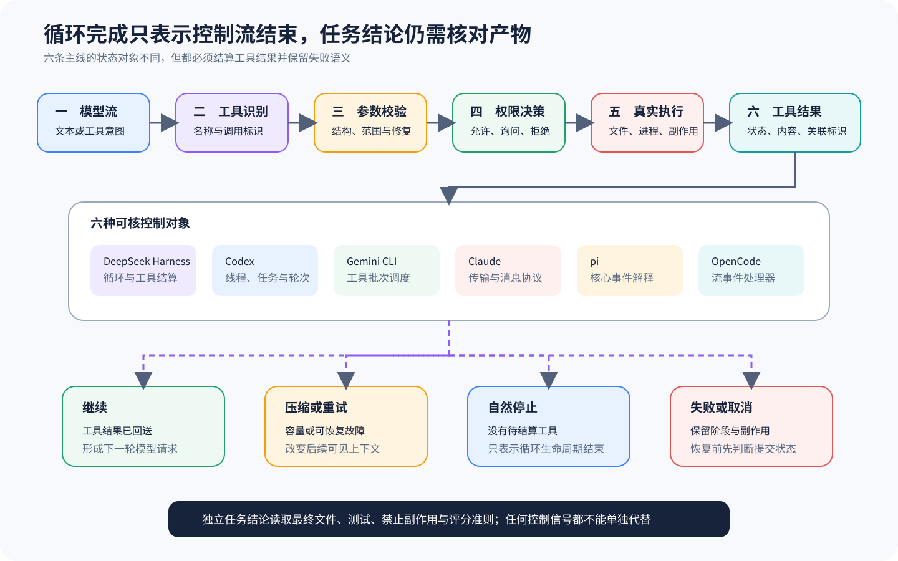

# 六套 Harness 怎样完成模型—工具闭环

[上一篇：运行时、配置与模型输入](01-runtime-config-model-input.md) · [返回课程总目录](../README.md) · [下一篇：权限、状态与恢复](03-permissions-state-recovery.md)

模型输出 Tool Call 时，只是表达了一个结构化意图，后面还需要 Harness 解析调用、找到实现、检查策略、执行副作用、保存结果，再把新的观察送回下一轮。本篇沿用同一个运费修复任务，看看六套实现把这条闭环放在哪里，以及为什么并发、失败和停止条件无法缩成一个 `while`。



## 最小闭环不是「模型调用一次工具」

```text
模型流产生 Tool Call
  → Harness 验证名称与参数
  → 路由到具体工具
  → 权限与环境决定是否执行
  → 工具产生成功、拒绝或错误结果
  → 结果按 Call ID 写入消息与 Session
  → Harness 决定再次采样、压缩、取消或结束
```

运费任务至少会经历读取、编辑和测试三个动作，而其中任何一步失败，都应该变成下一轮能够解释的观察，不能只往终端扔一行错误。即使模型最后说了「完成」，这句话也不能替代目标测试的实际结果。

## 同一问题在六套实现中的落点

| 课程 | 谁主要控制下一轮 | 工具路由与结果回填 | 代表性细节 | 继续阅读 |
| --- | --- | --- | --- | --- |
| DeepSeek Harness | Agent Loop | Core Loop 与 Tool/Code Mode 包 | 模型消息、工具调用和 Session 事件跨包组合 | [Agent Loop、模型与工具结果](../harnesses/deepseek-harness/03-loop-model-tool.md) |
| Codex | Thread/Turn 内的 Core 任务 | Tool Router 与各 Handler | 工具可以并发执行，但历史提交保持调用顺序 | [模型响应与工具循环](../harnesses/codex/03-model-tool-loop.md) |
| Gemini CLI | Turn 与 Scheduler | Scheduler 管理 Tool Call 生命周期 | Policy、Confirmation、取消和结果事件围绕调度器展开 | [Turn、Scheduler 与路由](../harnesses/gemini-cli/02-turn-scheduler-routing.md) |
| Claude | 闭源 CLI 控制产品内部循环；SDK 处理公开消息与控制请求 | SDK 暴露权限回调、Hook、MCP 与消息流 | 只能证明公开 SDK 边界，不能画出产品内部 Router | [消息流与生命周期](../harnesses/claude/03-messages-stream-lifecycle.md) |
| pi | `agent-loop.ts` 的双层循环 | Agent Core 执行工具批次并追加 Tool Results | Steering 与 Follow-up 在不同时间点插入；截断 Tool Call 不执行 | [Agent Loop、双队列与工具批次](../harnesses/pi/02-agent-loop-tools.md) |
| OpenCode | Session Prompt Loop | Processor 归约流事件与 Tool Parts | `continue/compact/stop` 控制 Session，不是任务评分 | [Session Prompt、LLM 与 Processor](../harnesses/opencode/02-session-llm-processor.md) |

表中的「谁控制下一轮」，指的是公开源码里创建下一次模型请求的控制点——也就是下一轮的发起位置——它并不要求某个类名必须叫 Agent。Claude 这一行特意保留了证据边界，因为 SDK 暴露异步流，不等于我们就能看到 CLI 内部的完整 Loop。

## 一次工具调用至少有五种结果

如果 Tool Result 只有成功和失败两种值，恢复时需要的信息就会被丢掉，因此更实用的做法是把结果细分为：

| 结果 | 副作用是否发生 | 下一步通常是什么 |
| --- | --- | --- |
| 成功 | 已发生 | 把结果送回模型 |
| 策略拒绝 | 未发生 | 解释限制，换方案或请求授权 |
| 用户取消 | 未发生 | 停止或等待用户，不应自动重试 |
| 执行错误 | 可能未发生，也可能部分发生 | 依据工具语义检查环境，再决定重试 |
| 状态未知 | 无法确认 | 先观察环境，禁止盲目重放 |

未知工具名或参数校验失败时，副作用通常还没有发生，但 Shell 超时时子进程可能已经启动，网络请求断开时服务端也可能已经处理完请求。Harness 必须让工具实现能够表达这些差异，Session 才有条件安全恢复。

## 并发比较要同时记录两种顺序

并发工具有「完成顺序」和「提交顺序」：

```text
模型声明：读取源码 A，读取测试 B
实际完成：B 先，A 后
历史提交：仍按 A、B 对齐各自 Call ID
```

Codex 用测试明确核对了并发完成与确定性历史的区别，pi 会针对整个 Tool Batch 计算终止条件，而 Gemini CLI 的 Scheduler 负责管理多个调用状态。其他实现即使选择串行执行，也仍然需要保证 Tool Result 与 Call ID 对应。

如果历史只按网络到达顺序随意写入，模型就可能把 B 的结果配给 A，后续重放也会产生不稳定的 Context。确定性提交无须强迫所有工具串行运行，只要让因果关系能够重建就够了。

## Stop Reason 为什么不能直接结束任务

Provider 的 `stop`、`toolUse`、`length` 或 `error` 只描述当前这次模型响应。pi 遇到 `length` 截断时，会拒绝执行可能不完整的 Tool Call，而 OpenCode 即使已经收到 Finish Reason，只要 Parts 中还有 Tool Call 就会继续。DeepSeek Harness、Codex 和 Gemini CLI 也都要结合工具状态与队列，才能决定是否发起下一轮。

任务级结束还需要判断：

- 是否仍有未结算工具；
- 是否有 Steering、Follow-up 或用户新输入；
- 是否需要 Compaction 后继续；
- 是否被取消、预算耗尽或协议错误阻断；
- 是否已经产生足以回答用户的环境证据。

最后一项通常还要交给 Eval 或应用规则判断，单看模型的 Stop Reason 并不足以判定任务结果。

## Hook、Extension 和 Processor 可以改变什么

不同项目会暴露调用前阻断、调用后改写结果、Context Transform、事件订阅和子任务委托等多个介入点，所以比较时一定要问清它发生在副作用之前还是之后。

- 调用前 Hook 可以阻止动作发生；
- 调用后 Hook 只能改变模型看见的结果，不能假装撤销副作用；
- Context Transform 可以隐藏或摘要历史，但不改变环境；
- Event Subscriber 观察事实，不应反向改写核心状态；
- 子 Agent 拥有另一条 Loop，需要保留父子身份。

如果把所有扩展都统称为 Middleware，这些不同的安全边界就会被藏起来。

## 回到运费任务：六套实现共享的事实链

具体函数名可以不同，但一次能够复核的修复仍然应该保留下面这条事实链：

```text
用户目标
→ read 调用与文件结果
→ edit 调用、批准和实际 Diff
→ test 命令、工作目录、退出码与输出
→ 最终模型文本
→ 独立结果判定
```

对 DeepSeek Harness、Codex、Gemini CLI、pi 和 OpenCode，我们可以沿公开核心源码追踪到不同深度，但 Claude 这条线只能通过公开 SDK 消息和控制契约观察边界外显的事实。一旦某一层缺少证据，就应该明写「当前来源不可核对」，不能拿另一套 Harness 里的常见实现来填补空白。

## 一次可复核的本地实验

即使不调用模型，也可以验证 Loop 语义。可以先实现一个脚本化 Model Stub，让它依次返回 `read`、`edit`、`bash test` 和最终文本，再让第二组输入在编辑之后产生测试失败。实验至少要断言：

1. Tool Result 与原 Call ID 对齐；
2. 失败结果进入下一轮，而不是让 Loop 崩溃；
3. 截断或非法参数不会产生副作用；
4. 并发完成顺序变化时，历史仍可重放；
5. 模型自述「完成」不会覆盖测试失败。

这个实验只能验证通用机制，它无法证明任何上游项目在所有配置下都采用了相同实现。

## 练习：沿两套源码解释同一个失败

假设测试工具返回退出码 1，请选择两条课程，指出结果在哪里被转换成 Tool Result，又会写入何种 Session/Message 对象，并找到决定再次请求模型的控制点。如果用户在这时取消，还要说明取消信号怎样与普通工具失败区分。

<details>
<summary>查看核对标准</summary>

答案必须给出两条课程内的真实文件或源码站点，并且把状态变化解释清楚。只写「Agent 会重试」不合格，因为工具失败未必可以重试，用户取消更不应该被反复尝试成一次成功。

</details>

[下一篇：权限、Sandbox、Session 与恢复不能压成一个开关](03-permissions-state-recovery.md)
