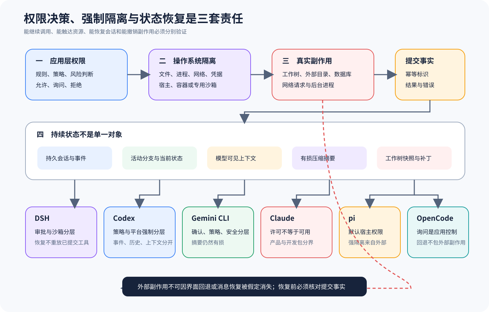

# 六类 Harness 的权限、状态与恢复

## 比较问题

「用户点了允许，所以命令是安全的」「会话能恢复，所以副作用可以回滚」「压缩后仍能继续，所以历史没有丢」是三种不同的证据滑坡。应用层权限决定 Harness 是否继续某次调用；操作系统隔离决定进程实际可触达哪些文件、网络、凭据和子进程；Session、Context、Summary 与 Snapshot 又保存不同状态。把它们压成一个安全开关，会让故障恢复和事故取证同时失真。

本篇沿一条副作用链比较六方：模型提出操作，应用策略给出允许、询问或拒绝，执行环境施加强制边界，工具修改状态，Session 记录事件，下一轮模型只看到派生 Context；中断后，恢复机制选择继续、分叉、回退或停止。每一层都要回答「谁作决定、事实保存在哪里、哪些副作用仍在外部」。

## 共同抽象

本篇把安全与恢复统一成两条相交但不合并的链。决策链依次记录工具可见性、参数规范化、应用策略、用户批准、隔离计划与执行结果；状态链依次记录 Session 事件、模型 Context、Summary、工作树 Snapshot 和外部副作用。两条链通过调用 ID、参数哈希和 Artifact 引用连接，任何一个「允许」或「恢复」布尔值都不足以代替它们。

安全状态用「谁允许、谁强制、实际发生什么」三个问题表达。应用策略可以允许，OS 后端仍然拒绝；容器可以允许工作区写入，业务策略仍然拒绝；两者都允许，命令也可能因普通错误失败。共同抽象只要求三类事实分开，具体后端可以是本地沙箱、容器、远程执行或宿主治理。

恢复状态用「权威记录、派生视图、可逆范围、外部残留」四个问题表达。Session 可以完整而 Context 已压缩，Snapshot 可以恢复工作树而远端请求仍存在，UI 可以重新打开而调用提交状态未知。项目没有某种恢复能力时标记缺失；闭源或外部实现无法核对时标记未知，不能互相替换。

最后用 Trial/Attempt 约束恢复。基础设施故障允许在同一 Trial 内追加 Attempt，但 Canonical 选择必须预登记；产品错误已经回答评测问题，不能通过 Fork、Resume 或新 Session 变成通过。调用副作用状态未知时先核验或阻断，这是安全与统计共同的底线。

## 控制变量

安全比较固定三个无破坏探针：在项目内写文件、尝试写入项目外临时目录、请求受控本地服务。每个探针分别在应用允许、询问后允许、拒绝三种状态运行，再在普通宿主与受限容器中重复。这样才能观察 Permission Decision 和 OS Enforcement 是否真是两层，而不会把提示框当作沙箱。

状态比较固定一段包含文本、工具调用、工具结果、补丁和错误的多轮会话。记录持久 Session、发送给模型的 Context、压缩前后 Summary、活动分支、工作树 Hash 和外部服务计数。任何「恢复成功」都必须同时报告这些对象，不能只看聊天窗口重新出现。

中断点至少放在工具开始前、文件已写但结果未回送、结果已记录但下一轮未请求、压缩生成中和恢复提交中。每次恢复都使用幂等键或明确的规范 Attempt，检查是否重复执行。产品性失败仍属于原 Trial，不能以新会话或新分叉隐藏。

## 对照证据

机器矩阵位于 `evidence/matrices/03-permissions-state-recovery.yml`。主 Claim 选择各方最能说明权限与强隔离边界的一条结论；同篇还需回到会话课程核对状态投影。

| 主线 | 应用控制 | 强制与恢复边界 | 主 Claim |
| --- | --- | --- | --- |
| DSH | Guard、审批与升级决策 | 平台 Sandbox 和 Session 恢复另层处理 | `deepseek-harness.security.approval-sandbox-separation` |
| Codex | Approval Policy 与 Exec Policy | 平台 Sandbox、Rollout、History、Context 分开 | `codex.security.approval-policy-sandbox-separation` |
| Gemini CLI | Confirmation、Policy 与 Safety | Sandbox、记录历史和压缩摘要分开 | `gemini-cli.security.confirmation-policy-sandbox-separation` |
| Claude | Allowed Tools 与权限契约 | 工具可用性、闭源 Checkpoint、SDK Store 不同 | `claude.permissions.allowed-tools-are-not-availability` |
| pi | 默认宿主权限，确认与隔离多为扩展 | Session Context 是持久历史投影 | `pi.security.examples-are-not-default-boundaries` |
| OpenCode | Permission Rule、Ask/Allow/Deny | Snapshot/Revert 不覆盖所有外部副作用 | `opencode.permission.ask-is-not-os-sandbox` |

DSH 将工具 Guard、审批和 Sandbox 升级路径分开。审批回答的是「是否允许继续」，Sandbox 才尝试约束可见资源；会话恢复还要避免重放已经提交的工具。完整证据见 [DSH 工具与安全](../harnesses/deepseek-harness/04-tools-security.md) 和 [DSH 会话与压缩](../harnesses/deepseek-harness/05-session-compaction.md)。

Codex 的 Approval Policy、Exec Policy、Sandbox Policy 和平台实现具有不同责任。Rollout 保存事件，History 支持发现和恢复，模型 Context 可能经过压缩；恢复线程不表示操作系统副作用被撤销。见 [Codex 执行策略与沙箱](../harnesses/codex/04-exec-policy-sandbox.md) 与 [Codex 历史和恢复](../harnesses/codex/05-rollout-history-memory.md)。

Gemini CLI 还引入 Safety 与 Confirmation Bus。Safety 判断风险类别，Policy 决定规则，Confirmation 取得用户答复，Sandbox 执行强制边界；它们不能互换。Session Record、模型历史和压缩摘要也具有不同完整性，见 [Gemini CLI 策略与沙箱](../harnesses/gemini-cli/04-confirmation-policy-safety-sandbox.md)。

Claude 的公开证据要继续分层。Allowed Tools 只说明允许集合，不证明对应程序、MCP 服务或网络可用；Claude Code 的 Checkpoint 与 Resume 按官方产品契约描述，Python SDK 的 Session Store 是外部持久化接口，不能合并成同一底层事务。见 [Claude 工具、权限与 Hook](../harnesses/claude/04-tools-permissions-hooks.md) 和 [Claude Session](../harnesses/claude/05-sessions-resume-store.md)。

pi 的默认 Coding Agent 继承宿主进程权限，不内建覆盖文件系统、进程、网络和凭据的统一强隔离。确认提示、容器方案和 Sandbox 示例属于扩展或外部部署。Session 追加历史可以持久，而模型 Context 是经过选择和压缩的投影，见 [pi 产品表面与权限](../harnesses/pi/07-cli-tui-permissions-containerization.md)。

OpenCode 的 Permission 使用规则匹配和用户答复控制调用，外部目录检查也是应用逻辑。Snapshot/Revert 能处理工作树范围的部分变化，但网络、数据库、项目外目录和后台进程可能继续存在。见 [OpenCode 工具权限](../harnesses/opencode/03-tools-permission-question-patch.md) 与 [OpenCode 历史恢复](../harnesses/opencode/04-storage-history-compaction-revert.md)。

## 差异解释

六方在安全上的主要差异并非有没有「允许」按钮，而是强制边界在哪里。某些实现内建平台沙箱策略，某些依赖外部容器或宿主治理；有的能把审批与执行策略关联得很细，有的保持小核心让部署者自行组合。应用提示越丰富，越要防止用户把可见交互误当内核强制。

状态方面的差异来自权威对象。追加式事件或消息库适合审计，当前活动分支适合继续交互，模型 Context 为推理预算服务，Summary 是有损派生，Snapshot 针对工作树。一个系统可能保留完整 Session，却只向模型发送压缩投影；也可能恢复 UI 会话，却无法撤销已经发送的请求。

恢复策略还影响统计。基础设施中断可以产生新 Attempt，前提是同一 Trial 分母不变，并且规范 Attempt 选择预先声明。若工具已提交但回执丢失，简单重跑可能重复付款、发消息或发布包。可靠恢复需要 fencing、幂等键、提交记录和副作用探针，单靠聊天历史不够。

因此「安全最强」或「恢复最好」都缺少场景。离线临时仓库、企业多租户服务、个人桌面工具和 CI 自动化对权限摩擦、隔离强度、可恢复性与取证成本的权重不同。公开比较只展示控制位置和条件，不生成综合排名。

## 失败与限制

源码中的 Sandbox 配置不证明部署时已经启用；容器存在也不证明挂载、网络、用户、内核能力和凭据正确收紧。反过来，仓库未发现内建沙箱不能被写成产品永远无法隔离，外部部署仍可能提供强边界。

权限测试往往覆盖规则匹配和模拟答复，无法替代恶意参数、路径别名、符号链接、子进程继承和网络外带测试。用户批准也可能基于不完整摘要；高风险动作需要最小权限、参数固定和执行后取证。

Session 恢复测试若只检查消息数量，会漏掉文件、进程、数据库与外部服务。Summary 质量依赖模型且有损，无法作为审计原文。Snapshot 对 Git 忽略文件、项目外路径或异步进程的覆盖范围也需实测。

Claude 闭源产品的内部沙箱和 Checkpoint 实现不可见。本篇只能引用公开契约，不把证据较少解释为能力较弱。所有上游漂移都可能改变默认模式，需重新核对。

## 验证方法

先运行三类副作用探针，保存应用决策事件与 OS 层实际结果。询问后允许时，确认工具参数与展示内容一致；拒绝时检查工具未启动；宿主允许但容器拒绝时，应记录为应用放行、系统阻断，而不是笼统失败。

再构造长会话触发压缩，比较原始 Session、模型 Context、Summary、活动分支和工作树。故意在摘要中遗漏一个早期约束，下一轮模型可能看不到它，但审计历史仍应能够找回原文；这能证明 Context 与 Session 不同。

最后在四个中断点恢复，使用外部服务计数器检测重复调用。产品错误不得通过 Fork 或重试变成通过样本；基础设施错误的新 Attempt 必须回链同一 Trial，并保存 Canonical Attempt 选择理由。

## 迁移练习

选择一个新的 Harness，建立二维状态表：横轴放置 `可见、策略、批准、隔离、执行`，纵轴放置 `Session、Context、Summary、Snapshot、外部状态`。对项目内写入、项目外写入和受控本地请求三类探针逐格填写直接证据、推断或未知；没有证据的格子保持空白并解释原因，禁止用一个成功截图填满整行。

随后运行四个中断点：执行前、文件提交后回执前、Session 记录后下一轮前、Summary 生成中。恢复时记录是否新建 Attempt、是否复用幂等键、工作树是否变化、外部计数是否增加和模型看到哪份 Context。故意让摘要遗漏「禁止外部请求」约束，验证审计 Session 仍能找回原文，同时承认下一轮模型可能因派生 Context 缺失而犯错。

交付物包括二维证据表、四份恢复清单、一份外部计数器日志和 Canonical Attempt 判定。验收要求策略拒绝路径零执行、隔离拒绝与策略拒绝可区分、已提交副作用零重复、产品失败不因恢复改写。练习只支持锁定环境下的结论，不把外部容器或闭源实现的未知状态写成缺失。

## 自检

### 问题 1

用户批准命令后，是否已经获得操作系统沙箱？

**答案：** 没有。批准是应用层调用决策，进程能触达的文件、网络、凭据和子进程仍由宿主或外部强制边界决定。

### 问题 2

Session 能恢复是否意味着外部副作用已回滚？

**答案：** 不意味着。消息和工作树可能恢复，网络请求、数据库写入、项目外文件和后台进程仍可能存在。

### 问题 3

压缩摘要为什么不能代替审计历史？

**答案：** 摘要是为模型预算生成的有损投影，可能遗漏细节；审计需要保留原始消息、工具结果和产物引用。

### 问题 4

恢复实验为什么要检测工具是否已提交？

**答案：** 中断可能发生在副作用完成但回执丢失之后；盲目重跑会重复执行，必须依赖幂等、fencing 和提交记录判断。
