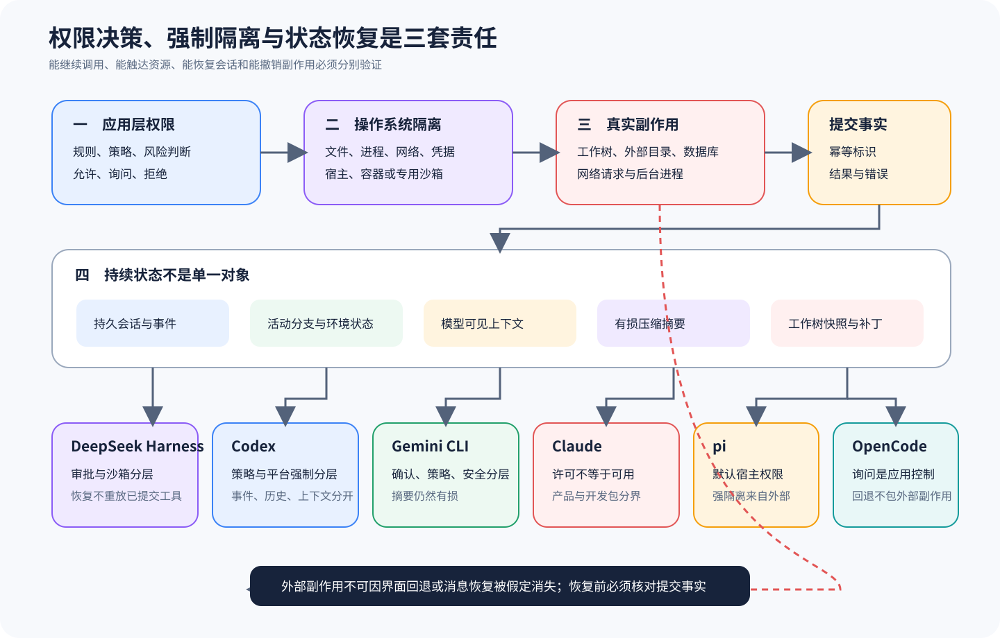

# 权限、Sandbox、Session 与恢复不能压成一个开关

[上一篇：Agent Loop、工具与执行](02-loop-tools-execution.md) · [返回课程总目录](../README.md) · [下一篇：编排、协议与产品表面](04-orchestration-protocol-surfaces.md)

问「这个 Agent 有权限吗」时，其实至少在问五件事：工具是否可见，策略是否允许，用户是否批准，执行环境能否做到，以及中断后能否安全恢复。本篇把六套 Harness 放到同一条动作链上，由此看清界面上的 Allow 为什么既不能证明操作系统已经隔离，也不能承诺副作用随时可以撤销。



## 五层边界

```text
模型可见性：本轮是否提供这个 Tool Schema
  ↓
参数与策略：名称、参数、路径或命令是否符合规则
  ↓
用户决定：是否需要一次性或持续批准
  ↓
执行能力：宿主、容器、Sandbox 或远程环境实际允许什么
  ↓
恢复语义：中断后能否确认副作用并安全继续
```

前四层共同决定动作能不能发生，第五层则决定系统在动作做到一半时——也就是副作用状态尚未明确时——还能不能诚实地处理现场。任何一层被省略，都会带来不同的失败模式。

## 六条课程各自暴露了什么

| 课程 | 应用层判断 | 执行或隔离边界 | 状态与恢复入口 | 深入阅读 |
| --- | --- | --- | --- | --- |
| DeepSeek Harness | 工具、安全策略与 Code Mode 配置 | 普通工具与代码执行路径需要分别说明真实宿主 | Session 与 Compaction | [工具、权限与 Code Mode](../harnesses/deepseek-harness/04-tools-security.md) |
| Codex | Exec Policy、审批和具体工具策略 | OS Sandbox/执行环境与审批分开 | Rollout、Thread Store、压缩与恢复 | [执行策略、审批与 Sandbox](../harnesses/codex/04-exec-policy-sandbox.md) |
| Gemini CLI | Policy、Confirmation 与 Safety | Sandbox 是独立执行边界 | Session、历史与压缩 | [Confirmation、Policy、Safety 与 Sandbox](../harnesses/gemini-cli/04-confirmation-policy-safety-sandbox.md) |
| Claude | SDK Options、`can_use_tool` 与 Hooks 的公开契约 | 实际 CLI/产品执行边界不能由公开 SDK 全部证明 | Session/Resume/Store 的公开接口 | [动态权限决策](../harnesses/claude/05-permission-decisions.md) |
| pi | 工具 Hook、项目 Trust 与交互表面 | 默认继承宿主权限；Sandbox Extension 可能回退本地 | Session Tree、JSONL 与 Resume | [CLI、TUI、权限与外部隔离](../harnesses/pi/06-surfaces-permissions-isolation.md) |
| OpenCode | Tool Registry、Permission Rules 与 Question | Permission 是应用规则，不自动构成 OS Sandbox | Storage、Compaction、Patch/Revert | [Tools、Permission、Question 与 Patch](../harnesses/opencode/03-tools-permission-patch.md) |

看到「项目提供 Sandbox 选项」，还不能推断所有工具、Extension、Plugin 和外部进程都会经过它，因为这个结论只有沿着具体工具执行器和失败回退继续追踪才能成立。

## 运费任务里的三个动作风险不同

| 动作 | 常见策略 | 仍需注意的环境事实 |
| --- | --- | --- |
| 读取 `shipping.ts` | 工作区内可自动允许 | 符号链接、外部目录和敏感文件 |
| 编辑比较符 | 展示 Diff 或请求批准 | 实际写入范围、并发修改、编码与回退 |
| 运行测试 | 按命令和工作目录判断 | 子进程、网络、环境变量、后台任务和超时 |

一个合理的系统无须对所有动作弹出同样的确认框，因为风险可以按照资源、作用域和可逆性分层建模。不过，即使动作已经获得批准，它仍然应该在只拥有所需最小能力的环境中运行。

## Allow、Ask、Deny 只是产品策略

应用层 Permission 通常接收工具名和规范化 Pattern，再输出 Allow、Ask 或 Deny。OpenCode 使用有序规则并采用最后匹配，Gemini CLI 把 Policy 和 Confirmation 放进工具生命周期，而 Codex 把 Exec Policy、审批和 Sandbox 拆成不同责任。Claude SDK 虽然公开了 `can_use_tool` 回调，但这仍然无法证明闭源产品的所有内部决策。

用户选择 Always 时，通常只是扩大了当前应用规则的放行范围，并不会因此改写操作系统 ACL。反过来也一样，OS 能够执行某个动作，不代表产品就应该放行它，因为宿主用户可能拥有整个磁盘的权限，而 Harness 仍需限制 Agent 只操作当前工作区。

## Sandbox 约束能力，不解释意图

Sandbox 可以限制路径、进程、网络和系统调用，却无法理解「修改测试来让测试通过」是否违反了任务。业务约束需要由 Policy 或独立 Eval 判断，而 Sandbox 负责在动作获准之后仍然守住已配置的资源边界。

检查真实隔离至少要问：

1. 哪些工具被重定向到隔离环境；
2. 工作区以只读还是读写方式挂载；
3. 网络默认允许、拒绝还是经网关；
4. 凭据是否进入环境；
5. 初始化失败时失败关闭还是回退宿主；
6. Plugin/Extension 是否能直接使用宿主 API 绕过工具执行器。

pi 的示例 Sandbox Extension 明确存在本地回退，所以「代码库里有 Sandbox」还不足以证明所有动作默认都处于隔离环境中。

## Session 保存历史，不自动保存环境

Session 通常能够恢复消息、工具结果、模型选择、分支和摘要，却不会自动复原已经退出的进程、远端事务和后来变化的工作区。因此，Resume 之前要重新观察环境：

```text
加载 Session
→ 找到最后已结算事件
→ 检查未完成 Tool Call
→ 读取文件、Diff、进程或远端状态
→ 判断副作用已发生、未发生或未知
→ 构造下一轮 Context
```

消息重放和副作用重放必须分开处理。如果编辑工具已经写入，却在完成记录之前崩溃，Session 只能把它视为「状态未知」，此时恢复流程应该先读文件，不能直接再次应用同一 Patch。

## Compaction 会让恢复变得更难

摘要可能写着「代码已经修复」，却遗漏了「测试尚未运行」，因此完整 Session 记录、模型有效 Context 与环境现场状态之间必须保持可追溯关系。Codex Rollout、Gemini CLI Session、DeepSeek Harness Session、pi Entry Tree 和 OpenCode Message/Part 采用了不同的投影方式，但它们都需要防止摘要被误当成精确执行账本。

恢复所依赖的 Tool Call ID、工具状态、目标路径、命令、退出码、工作区版本和未完成事项，都应尽量以结构化形式保留。自然语言摘要可以帮助模型继续任务，但不应该拿来判定副作用是否真的发生过。

## Revert 不是通用事务

文件 Snapshot 或 Git Patch 可以逆转工作区修改，却通常不能撤销：

- 已发送的网络请求；
- 数据库写入；
- 发布到外部系统的包或消息；
- 工作区外删除；
- 启动后仍在运行的后台进程。

OpenCode 明确把 Patch/Revert 与 Session 后缀一起处理，但它仍然保留了上述边界。其他 Harness 即使依赖 Git，也必须说明哪些状态并未纳入版本控制，而高风险工具则应优先使用幂等键、事务或预演，不要在事后把希望都寄托给 Revert。

## 练习：设计一次崩溃恢复

场景：Harness 已经请求把 `>` 改成 `>=`，但进程随后崩溃，而 Session 里只有 Tool Call 和「开始执行」，没有最终结果。请为两条课程分别写出恢复步骤，并指出应该在哪一层确认用户批准仍然有效。

<details>
<summary>查看核对标准</summary>

合格答案必须先检查文件或 Diff，在没有确认现场之前不能直接重放编辑，同时还要区分应用批准、实际环境状态和 Session 记录。一次性批准通常不能自动延伸到新的 Tool Call，除非项目契约明确允许安全恢复同一次调用。

</details>

[下一篇：编排、Skills、Plugins、MCP 与产品表面如何分类](04-orchestration-protocol-surfaces.md)
