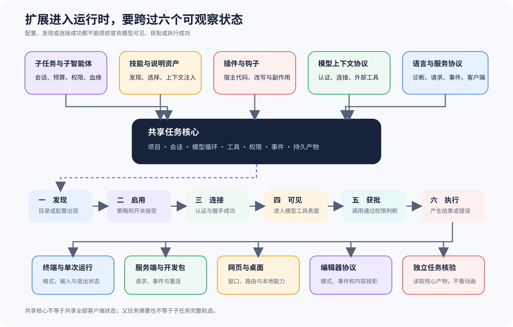

# 编排、Skills、Plugins、MCP 与产品表面如何分类

[上一篇：权限、状态与恢复](03-permissions-state-recovery.md) · [返回课程总目录](../README.md) · [下一篇：可观测性与独立 Eval](05-observability-eval-deployment.md)

Agent 生态经常把 Agent、Sub-Agent、Skill、Plugin、Hook、MCP、Protocol、Server 和 UI 都叫作「扩展能力」，可它们插手运行过程的位置并不一样。有的会改模型输入，有的会添工具，有的会另起一条循环，还有的只是让另一个客户端接入同一 Session。要分清这些边界，你得先看每种机制负责什么，再比较六套 Harness 怎样实现它们。

## 先按责任分类

| 类别 | 改变什么 | 是否拥有独立 Loop | 典型风险 |
| --- | --- | --- | --- |
| Agent/Preset | 模型、Prompt、工具和权限组合 | 可能 | 配置身份混淆 |
| Sub-Agent/Task | 创建另一项受控任务 | 是 | 权限升级、上下文泄漏、递归爆炸 |
| Skill/Context | 给模型增加按需知识或流程 | 否 | 提示注入、过期指令 |
| Tool/MCP | 增加观察或动作接口 | 否 | 远端副作用、能力声明与现实不一致 |
| Plugin/Extension/Hook | 修改装配、调用前后或 Context | 通常否 | 进程内高权限、不可见改写 |
| Protocol/Server | 让外部 Client 控制 Session | 否 | 身份、重连、事件重复与版本错配 |
| CLI/TUI/Web/Desktop/IDE | 展示和采集用户交互 | 否 | 把 UI 状态误当核心状态 |

同一个项目里的名词可能横跨两类责任，例如 Plugin 既能注册 Tool，也能安装 Hook，所以你分析它时要看清这两个动作各自改了什么。这两个作用不能混。

## 六条课程的代表机制

| 课程 | 编排与扩展 | 协议或表面 | 最值得核对的边界 |
| --- | --- | --- | --- |
| DeepSeek Harness | Bundle、Preset、扩展与子任务 | CLI、ACP 等表面 | 多包装配如何仍保留单一运行主链 |
| Codex | 子代理、任务编排、扩展与 Code Mode | CLI、exec、IDE、app-server 协议 | Thread/Turn 事件如何被多个表面投影 |
| Gemini CLI | Agents、Hooks、Skills 与 MCP | CLI 输出和协议表面 | 扩展介入 Turn/Scheduler 的哪个阶段 |
| Claude | SDK Hooks、MCP、Agents 与 Skills 的公开契约 | Python/TypeScript SDK 与 CLI 边界 | 公开控制协议不能补全闭源内部实现 |
| pi | Resource Loader、Extensions、Coding Agent | TUI、Print、JSON、RPC、Protocol Server/Client | 最小 Agent Core 如何被逐层组合而不是复制 |
| OpenCode | Agent、Task、Skill、Plugin、MCP、LSP | Server、Protocol、TUI、Web、Desktop、ACP | 服务端 Session 是共享真值，客户端只持有投影 |

详细证据还得回到六条课程里讲扩展和产品表面的章节逐项查，因为这个比较页只帮你判断各类机制负责哪一层，不能替代上游源码站点。

## 子 Agent 是另一条任务链

子 Agent 一旦接下任务，系统做的就不只是「再调用一次模型」，还得为这条任务链处理下面这些事情：

- 独立或可区分的 Session/Task 身份；
- 明确的输入投影，而不是无边界复制父 Context；
- 权限派生规则；
- 深度、并发、预算和取消限制；
- 返回父 Agent 的结果投影；
- 父子 Trace 关联。

OpenCode 用 Task Tool 创建子 Session，同时沿用父端的 Deny 和外部目录限制。Codex 课程会带你看子代理怎样参与编排，DeepSeek Harness 则靠装配和任务机制扩展运行。pi 的 Follow-up 仍在同一个 Agent Run 里接收追加消息，所以不能把它算作子 Agent。

运费任务可以让子 Agent 去「检查回归测试范围」，但父任务明令禁止修改测试，这条约束不能因为执行者换了名字就失效。子任务结束以后，父端不能只收到一句「完成」，还要拿到 Child Session ID 和可供核对的结果。

## Skill 不是 Tool，MCP 也不是单一能力

Skill 通常把流程和知识写给模型看，所以是否加载 Skill 会改变 Context。Tool 提供可调用的接口，执行以后会返回观察，也可能产生副作用。MCP Server 还能分别声明 Tools、Prompts、Resources 或 Templates，因此连上 Server 只说明通道已经建立。连接成功还不够。

因此要分开检查：

1. 资源有没有被发现；
2. 当前 Agent 是否有权看见；
3. 能力是否进入本轮输入；
4. 调用时是否还需要批准；
5. 远端 Server 实际能否执行；
6. 返回结果怎样关联到 Session。

如果界面只亮起一个绿色的「已连接 MCP」，用户很容易误以为能力已经可用，却看不到后面至少还有五道门槛。这个绿灯很会骗人。

## Plugin 与 Extension 是高信任代码

Prompt、Skill 和 Tool Schema 主要决定模型能看到什么，进程内的 Plugin/Extension 却可以直接读文件、发网络请求、注册 Provider、改写 Tool Result，甚至绕开正常的权限入口。项目 Trust 只能决定是否加载这段代码，一旦把它装进进程，宿主不会自动收窄它的权限。

做安全审计时，你需要记下代码从哪里来、用的是哪个版本、安装脚本做了什么、按什么顺序加载，以及每个 Hook 在哪里插手。调用前拦截和调用后改写要分别记录。两边都要留证。如果用了 Context Transform，最好再保存经过安全脱敏的转换前后摘要。

## 多客户端只共享核心事实

CLI、Web、Desktop、IDE 或 RPC（远程过程调用）Client 可以同时观察同一个 Session，但它们应该从服务端共享事件、消息和状态。界面控件不能当核心事实。协议想让多个客户端可靠地共享这些事实，至少要处理下面几项：

- Server/Project/Session 身份；
- 请求与响应关联；
- Event Cursor 或 Revision；
- 重连基线与去重规则；
- 取消和权限问题的路由；
- 版本或能力协商。

pi Protocol 用 Frame（帧）、CBOR、Schema 和 Attach Lease 控制远程 Session，OpenCode 用 HTTP/Event 服务和 History/Cursor，Codex 则通过协议与 app-server 接入多个产品表面。界面显示「Done」，只说明这个客户端投影收到了某种终态。你要判断它究竟代表什么，仍得回到核心事件。

## 设计取舍：进程内组合还是服务化核心

pi 从轻量的进程内 Agent Core 起步，再逐层组合到 Protocol Server。OpenCode 把 Session 放在服务端，让多个客户端直接共享核心，Codex 则用 Rust Core 和协议支撑多种产品表面。DeepSeek Harness 通过 Bundle 组合多个包的能力。这几种做法各有侧重，没有哪一种能适合所有场景：

- 进程内组合部署简单、延迟低，但客户端与运行时耦合更紧；
- 服务化核心便于共享 Session 和远程控制，但必须解决身份、并发和重连；
- 闭源产品 + 公开 SDK 给出稳定契约，却限制了内部实现可核对深度。

所以比较这些设计时，你要从任务真正需要什么出发，不能看到「支持更多表面」就断定 Harness 更强。

## 练习：给六个对象分类

你可以任选一条课程，从中找出一个 Agent/Preset、一个 Tool、一个 Skill/Context 来源、一个 Hook/Extension、一个 Session 协议对象和一个 UI 表面，再逐个说明它改动了模型输入、控制流、环境还是展示层。

查看核对标准

一个对象可以同时跨越多层，但答案必须把每一层的动作说清楚。例如 Plugin 注册 Tool 时会改变能力表，安装 Hook 时又会改动控制流，只写「它扩展了 Agent」还不合格。如果所选项目没有公开某类机制，如实写明不可用或当前来源无法核对就可以。

[下一篇：运行证据怎样进入独立 Eval](05-observability-eval-deployment.md)
