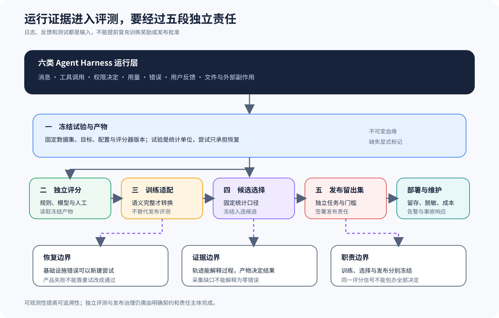

# 六类 Harness 的可观测性、独立评测与部署维护

## 比较问题

Agent Harness 会留下消息、工具调用、权限决定、耗时、用量、错误、用户反馈和最终文件。这些记录能回答「运行时发生了什么」，却不能单独回答「任务是否正确」「哪个候选可上线」或「这份反馈能否直接成为训练奖励」。本篇比较六条主线可提供的运行证据，以及这些证据怎样进入独立评测、训练适配、候选选择和发布治理。

比较单位是一个不可变 Trial。Trial 固定 Dataset 条目、Target 版本、Harness 配置、模型、工具环境和 Scorer 版本；网络抖动或基础设施错误可以生成新的 Attempt，但产品失败不能靠反复重试改写成通过。最终选择一个规范 Attempt 进入统计，并保留其他尝试用于恢复审计。

## 共同抽象

六方原生观测先映射到一条追加式证据链：冻结 Trial 描述评测问题，Attempt 记录基础设施恢复，Trace 保存时序与因果，Artifact 保存大对象和最终环境事实，Scorer 产生版本化判断，Feedback 保存后续解释。映射允许字段不可用，却不允许把缺失值写成零，也不允许用 Harness 自报的完成状态替代 Scorer。

最小跨 Harness Schema 只统一身份与血缘：Dataset、Target、Harness、Model、Environment、Trial、Attempt、Trace、Artifact、Score 和 Feedback 都有版本或哈希。各项目的原生事件作为附加字段保留，避免为了统一而丢掉权限原因、缓存状态或协议错误。转换器还要记录哪些字段直接映射、哪些经过推断、哪些无法取得。

质量闭环分成四个责任面。独立 Scorer 判断锁定 Artifact；RewardAdapter 只有在方向、范围、聚合和缺失语义完整时生成训练信号；候选选择使用开发或验证集合；独立发布 Eval 在候选冻结后使用未被前面环节消费的 Holdout。四者可以共享基础设施，却不能共享可改写的数据用途。

部署证据再增加采集契约：事件是否生成、是否进入队列、是否导出、后端是否确认、保留与删除是否生效。Telemetry enabled 只覆盖第一个配置状态；端到端完整性需要数量对账、失败状态和脱敏检查。生产可用、组织发布授权与个人能力仍需独立证据，不由仓库课程或一次绿色运行代替。

## 控制变量

对照实验使用同一组版本化任务，每个任务有稳定标识、输入快照和验收契约。六类 Harness 只替换运行适配层；外部 Scorer、运行次数、超时、资源上限、随机种子策略、统计口径与发布阈值保持一致。工具服务返回固定夹具，并把每次副作用写入独立审计日志。

采集层固定一份最小 Artifact Schema：Trial ID、Attempt ID、Dataset 版本、Target 版本、Harness 配置摘要、开始与结束时间、退出分类、消息与工具事件、权限决定、文件散列、用量、环境指纹和血缘。原生遥测字段可以附加，不能覆盖这些跨 Harness 字段的语义。

评分层在 Harness 进程之外读取冻结产物。规则评分器验证文件、测试和结构化输出；模型评分器必须锁定提示、模型和重试策略；人工复核记录盲审分配与分歧裁决。训练集、候选选择集和发布 Holdout 分别冻结，禁止用发布结果回写同一轮候选选择。

## 对照证据

机器矩阵位于 `evidence/matrices/05-observability-eval-deployment.yml`。矩阵只描述公开证据允许得出的边界，不给项目打总分，也不推断闭源服务内部的数据处理。

| 主线 | 可核对的运行证据 | 外部责任 | 主 Claim |
| --- | --- | --- | --- |
| DSH | Feedback 与消息级运行记录 | Scorer、统计门槛、训练适配和发布治理 | `deepseek-harness.feedback.is-not-training-reward` |
| Codex | Rollout Trace、Telemetry、Feedback | 固定 Trial、独立评分和发布批准 | `codex.feedback-trace.is-not-release-eval` |
| Gemini CLI | 工具决定与运行遥测 | Artifact Scorer、Holdout 与统计判定 | `gemini-cli.telemetry.tool-decisions-are-not-eval` |
| Claude | 公开消息、Usage 与 Feedback 契约 | 训练用途未知，发布评测由使用方定义 | `claude.feedback.is-not-training-or-release-reward` |
| pi | Telemetry Schema 与 Eval Harness | Score 语义、RewardAdapter 和发布阈值 | `pi.telemetry.contract-is-not-scorer` |
| OpenCode | OpenTelemetry、Share 与上游测试 | 版本化 Trial、Scorer、训练适配与发布留出集 | `opencode.telemetry-and-tests-are-not-release-eval` |

DSH 的反馈类型可以把用户判断和消息关联起来，运行记录也能成为外部评测输入。然而反馈的采样偏差、标签语义和责任主体仍需另行定义，不能把「点了赞」直接当作可比较 Reward。参见 [DSH 表面、反馈与评测](../harnesses/deepseek-harness/07-surfaces-feedback-eval.md)。

Codex 的 Rollout Trace 与 Telemetry 有助于重建一次运行，Feedback 则提供用户侧信号。它们没有自动冻结 Dataset、选择规范 Attempt 或批准发布；本地、应用服务和云端表面的可见字段与保留期限还要分别核对。参见 [Codex 表面、轨迹与评测设计](../harnesses/codex/08-surfaces-trace-eval-design.md)。

Gemini CLI 能记录工具调用决定和其他遥测事件，适合定位确认、执行与错误链。采集开关、导出器和后端留存属于部署条件；工具被允许或成功执行也不代表任务满足验收。参见 [Gemini CLI 遥测与评测设计](../harnesses/gemini-cli/08-telemetry-errors-eval-design.md)。

Claude 的公开 SDK 类型能核对消息、用量、错误和部分反馈表面，闭源产品与服务内部训练管线不可见。本仓库只讨论使用方能保存并独立评分的 Artifact，不推断 Anthropic 如何使用数据。参见 [Claude 错误与评测设计](../harnesses/claude/08-surfaces-errors-eval-design.md)。

pi 同时提供遥测契约和评测相关包，因此更容易接入统一运行记录；但 Schema 说明「记录什么」，Scorer 才定义「怎样判分」。Session 分享、遥测、测试产物和训练 Reward 需要分别治理。参见 [pi 遥测、评测与数据契约](../harnesses/pi/08-telemetry-evals-data-contracts.md)。

OpenCode 可通过 OpenTelemetry 关联运行，并可把会话生成分享副本；上游测试则验证实现行为。这三类证据用途不同，都没有自动形成独立发布门禁。参见 [OpenCode 分享、遥测与评测边界](../harnesses/opencode/08-share-telemetry-eval-boundaries.md)。

## 差异解释

六条主线的首要差异是观测面，而非评测结论。有的提供结构化 Trace，有的强调事件遥测，有的存在用户反馈或分享表面。统一平台应保留原生事件，同时映射到跨 Harness 的最小 Schema；映射失败的字段标记 unavailable，不能用空值伪装零错误或零用量。

第二个差异是恢复语义。Attempt 允许基础设施恢复，却不能改变 Trial 的任务、Target 或评分器。若第一次产物已经表现出产品失败，第二次成功可以用于诊断稳定性，但原失败仍进入 Trial 结果；否则系统会通过重试预算把质量指标「洗高」。

第三个差异是反馈可用性。用户反馈、规则分、模型裁判分和人工标签的采样机制不同。RewardAdapter 只有在方向、范围、缺失值、聚合、裁剪和版本语义完整时才能把 Score 转成训练信号；语义不完整时应返回 partial 或 unavailable，并保留独立发布评测。

部署维护还要求把采集成本纳入设计。全量消息和工具参数可能包含秘密、个人信息或客户代码；过度采集增加泄露面，采集不足又无法复盘。团队要按事件类型定义脱敏、访问、地域、保留和删除策略，并用实际部署配置证明策略生效。

## 失败与限制

Telemetry「已启用」不保证后端收到完整事件。导出器可能排队、丢弃、采样或在进程崩溃前来不及刷新；时钟偏差和多进程乱序也会破坏时间线。验证时要比较本地审计日志、导出计数和后端接收量，并为缺口保留明确状态。

Trace 完整也不等于任务正确。模型可能在轨迹中给出合理解释，最终文件却缺失；工具返回成功，副作用却写入错误项目。独立 Scorer 必须读取最终 Artifact 和受控环境事实，不能只评价最后一段自然语言。

模型评分器自身具有漂移、偏置和非确定性。固定版本与提示只能降低变化，不能消除误判；高风险发布需要规则核验、重复抽样或人工复核。训练中使用过的评分器也不能独占发布判断，否则容易奖励投机。

本篇没有证明六个项目的任何托管环境已经按该责任链部署。源码与本地实验只能说明接口和可复现实验契约；真实生产的留存、权限、规模、成本、地域与事故响应必须由部署证据补齐。

## 验证方法

先运行同一批受控任务，为每方生成 Trial、Attempt、消息、工具事件、权限决定和文件散列。故意制造一次可恢复传输错误与一次产品错误，确认前者产生新 Attempt，后者不会被后续成功覆盖。所有事件引用同一个 Trial，并能从评分结果回到原始 Artifact。

再关闭遥测、让导出器拒绝连接、制造进程崩溃和乱序事件。检查系统能否区分「未采集」「未导出」「后端未确认」和「字段不适用」。任何缺失观测都不得自动解释为零错误，UI 与报表还应展示采集条件。

最后冻结 Scorer 与三套数据分区。训练集只产生训练反馈，选择集用于选择候选，发布 Holdout 由独立作业在候选冻结后运行。发布报告列出样本数、置信区间、失败簇、阈值、豁免和签署人；Harness 原生日志只作为可追溯输入。

## 迁移练习

为一个新 Harness 编写最小 `TargetAdapter`，用两个确定性任务运行四个 Trial。每个 Trial 预先冻结环境、预算与 Scorer；注入一次容器启动失败、一次产品错误和一次遥测导出失败。转换器把原生事件映射到共同 Schema，并为不可取得的字段写 `unavailable` 与原因，禁止填零。

随后实现一个独立规则 Scorer，从 Artifact 哈希和最终文件判断结果；再实现 RewardAdapter 的能力声明。若 Feedback 缺少方向或去重键，适配器应返回 `partial` 或 `unavailable`，不能输出伪造奖励。把训练、候选选择和发布 Holdout 分成三份清单，故意让一条发布样本被开发阶段读取，门禁必须把它标成污染并阻止发布结论。

最后关闭导出后端并让进程在刷新前崩溃，对账本地事件数、队列接受数和后端确认数。交付物包括 Trial manifest、Attempt 表、Trace/Artifact 血缘、Score、RewardAdapter 声明、数据用途账本和遥测对账报告。验收要求产品失败不能被恢复洗掉、观测缺失不能解释为零、发布 Holdout 无污染，且所有结论都限定在锁定任务与环境。

## 自检

### 问题 1

有完整遥测，是否已经完成评测？

**答案：** 没有。遥测记录运行事实，评测还需要固定任务、冻结产物、版本化 Scorer、统计口径与独立判定。

### 问题 2

为什么 Trial 和 Attempt 必须分开？

**答案：** Trial 是统计单位，Attempt 是恢复过程；两者混合会让重试改变分母，并把产品失败改写成通过。

### 问题 3

用户反馈可以直接用于训练吗？

**答案：** 只有标签语义、方向、范围、缺失值、聚合和版本都明确时，RewardAdapter 才能转换；否则只能作为待解释信号。

### 问题 4

为什么训练评测之后还要独立发布 Holdout？

**答案：** 训练和候选选择会适应已见评分器与数据，独立留出集用于检测投机、过拟合和未预期退化，并保留单独发布责任。
