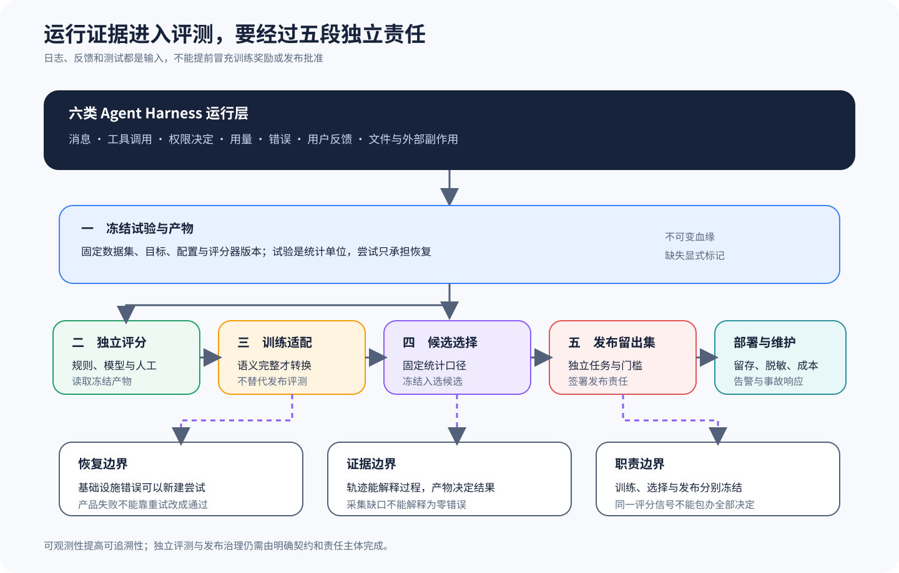

# 运行证据怎样进入独立 Eval，而不是变成宣传结论

[上一篇：编排、协议与产品表面](04-orchestration-protocol-surfaces.md) · [返回课程总目录](../README.md)

Harness 结束、工具成功、测试进程退出 0 和任务通过，分别是四种不同强度的结论。本篇会把六套课程里的 Event、Telemetry、Session、测试与 Eval 接缝连成一条证据链，看清系统怎样从「发生过什么」走向「用户目标是否满足」，同时避免把仓库检查误写成生产就绪证明。



## 四层结论

| 层次 | 典型问题 | 证据示例 | 不能证明什么 |
| --- | --- | --- | --- |
| 协议生命周期 | 模型流、工具或 Session 是否正常结束 | Stop Reason、Tool Part、Idle Event | 用户目标是否满足 |
| 环境事实 | 文件和进程实际发生了什么 | Diff、命令、退出码、日志 | 测试是否覆盖任务口径 |
| 任务判定 | 冻结任务是否通过 | 独立测试、Rubric、约束检查 | 其他任务和部署是否可靠 |
| 发布决策 | 一组结果是否达到发布标准 | 隔离数据、统计规则、回归门槛 | 生产环境必然无故障 |

后一层可以消费前一层的证据，但如果中间没有给出判定过程，就不能直接把结论往上升一级。

## 六条课程提供的观察面

| 课程 | 可观察运行事实 | Eval 位置或边界 | 深入阅读 |
| --- | --- | --- | --- |
| DeepSeek Harness | Session、产品表面、Feedback 与实际 Eval 接缝 | 只对源码中真实存在的适配与数据流下结论 | [产品表面、Feedback 与 Eval 接缝](../harnesses/deepseek-harness/07-surfaces-feedback-eval.md) |
| Codex | Thread/Turn Event、Rollout、Store 与产品表面 | Trace 可供外部任务判定，事件终态不是 Score | [事件、Trace 与 Eval 接缝](../harnesses/codex/08-surfaces-trace-eval-design.md) |
| Gemini CLI | Tool/Session Events、Telemetry 与错误分类 | Telemetry 观察运行，外部 Eval 冻结任务 | [Telemetry、错误与 Eval 接缝](../harnesses/gemini-cli/08-telemetry-errors-eval-design.md) |
| Claude | SDK 消息、Result/Error、Hook 与 Session 契约 | 公开 SDK 能收集边界事件，不能证明产品内部全部 Trace | [产品表面、错误与 Eval 接缝](../harnesses/claude/10-surfaces-errors-eval-design.md) |
| pi | 通用 Telemetry、Eval Harness Artifact 与 Summary | Harness 留证，外部 Scorer 产分，Summary 不创造分数 | [Telemetry、Eval Harness 与分数](../harnesses/pi/07-telemetry-evals-boundaries.md) |
| OpenCode | Message/Part/Event、Diff、Share 与可选 OpenTelemetry | Share/Telemetry 不是评分器，独立 Eval 在外部运行 | [Share、Telemetry 与独立 Eval](../harnesses/opencode/07-share-telemetry-eval.md) |

比较时，日志字段有多少不是关键，真正要看的是系统能不能把输入版本、运行身份、环境产物和判定结果稳定地关联起来。

## 最小跨 Harness Artifact

为了把同一个运费任务放到不同 Harness 中比较，每次运行至少要保存下面这些信息：

```yaml
task:
  id: shipping-boundary-100
  source_revision: 固定输入版本
run:
  harness: 项目与锁定版本
  session_id: 本次会话身份
  model: 实际 Provider 与 Model
  config_digest: 有效配置摘要
artifacts:
  trace: 模型、工具和错误事件
  patch: 最终修改或工作区哈希
  commands: 测试命令、目录、退出码和输出
  constraints: 测试文件未修改、路径范围等
evaluation:
  result: pass | fail | blocked | inconclusive
  reasons: 结构化原因
```

这里展示的只是教学数据契约——一种跨 Harness 的比较投影——它并不对应六套项目中现成的同名结构。实际适配器要先保留各项目的原始事件，然后再把它们映射到共同字段，不能为了让表格看起来整齐就丢掉差异。

## Trace 与 Telemetry 的职责

Trace 主要用来重建因果关系，例如哪次模型请求产生了哪个 Tool Call，又有哪个结果进入了哪一轮。Telemetry 则主要观察延迟、Token、成本、错误率和资源等运行特征，两者可以共用 Session/Span 身份，但不能因为某个指标超过阈值就反过来重写原始事实。

安全日志还要处理源码、凭据和模型输入中的敏感信息，但脱敏后的展示不能回头覆盖原始受控 Artifact。否则，问题调查与 Eval 会在彼此不知情的情况下使用不同数据。

## 独立 Eval 为什么要在 Harness 外再次验证

模型可能修改测试文件、只运行一部分测试，也可能误读命令输出，所以 Harness 内部的 Tool Success 只能说明工具实现返回了成功。独立 Eval 还需要在干净环境中使用冻结命令，重新检查目标断言和回归约束。

运费任务的最小判定可以是：

1. 应用补丁到固定源码；
2. 确认测试文件未被修改；
3. 运行金额 100 的目标测试；
4. 运行约定回归测试；
5. 保存命令、退出码和输出；
6. 把结果关联到同一 Run 与 Patch。

即使模型的最终文本为空，只要环境 Artifact 足够完整，独立 Eval 仍然可能做出判定。反过来，即使文本写得非常自信，只要目标测试失败，结果就仍然应该判为失败。

## 失败、阻断与无法判断

评测没有通过时，不要立刻把所有情况都写成 Fail，因为它们至少还需要分成：

- **fail**：运行完成且结果不满足任务；
- **blocked**：缺少权限、依赖或平台能力，任务没有进入可判定状态；
- **inconclusive**：Artifact 缺失或矛盾，无法可靠判断；
- **infrastructure error**：评测基础设施自身故障，应与产品失败分开统计。

重试可以帮助系统从偶发的基础设施错误中恢复，但它不能把一次真实的产品失败从分母中删掉。如果允许模型针对同一任务反复尝试，就应该保留每一次 Attempt，而且要预先定义究竟由哪个 Attempt 代表这个 Trial。

## 四种常见误判

1. **Session Idle = 任务通过**：Idle 只说明当前控制循环没有继续工作。
2. **Tool Success = 副作用正确**：命令成功可能运行了错误测试，写入成功可能改了错误文件。
3. **Telemetry 无错误 = 质量良好**：没有异常不代表实现符合需求。
4. **上游单元测试通过 = 仓库生产就绪**：测试只覆盖其明确断言和环境。

同样，课程链接可以打开、内容检查已经通过、图示渲染也很正常，这些结果只能证明该知识库达到了某些特定质量要求，无法证明六个上游项目或学习者已经具备生产能力。

## 训练与发布为什么要隔离

如果评测结果要进入 DPO、GRPO、RFT 或其他训练流程，就应该通过版本化 Reward Adapter 明确输入、归一化、缺失值和失败语义。训练奖励、Checkpoint 选择和最终发布 Eval 必须分担不同的数据职责，否则系统会针对同一判定器过拟合，然后把训练优化误认成真实泛化。

这部分属于进阶延伸，它不会改变本仓库以 Agent Harness 源码为主线的定位。新人可以先记住三种责任：执行 Trace 负责留证，独立 Scorer 负责判定，发布门槛负责做最终决策。

## 练习：给三个结果分别下结论

现在考虑三个场景：A 中模型正常结束，但没有运行测试。B 中测试命令退出 0，但测试文件已被修改。C 中模型 API 超时且没有产生补丁，评测机随后又发生了磁盘错误。请为它们分别写出协议状态、环境事实和任务判定。

<details>
<summary>查看核对标准</summary>

A 可以属于正常协议结束，但它的任务证据仍然不足。B 虽然有命令成功的环境事实，却违反了任务约束，因此应该判为失败。C 必须区分模型运行故障和评测基础设施故障，当 Artifact 不足时应标记 blocked 或 inconclusive，不能靠无限重试最终挑出一次通过。

</details>

完成比较课程后，进入[确定性实践](../labs/controlled-task-contract.md)，亲手复原一条源码调用链。
