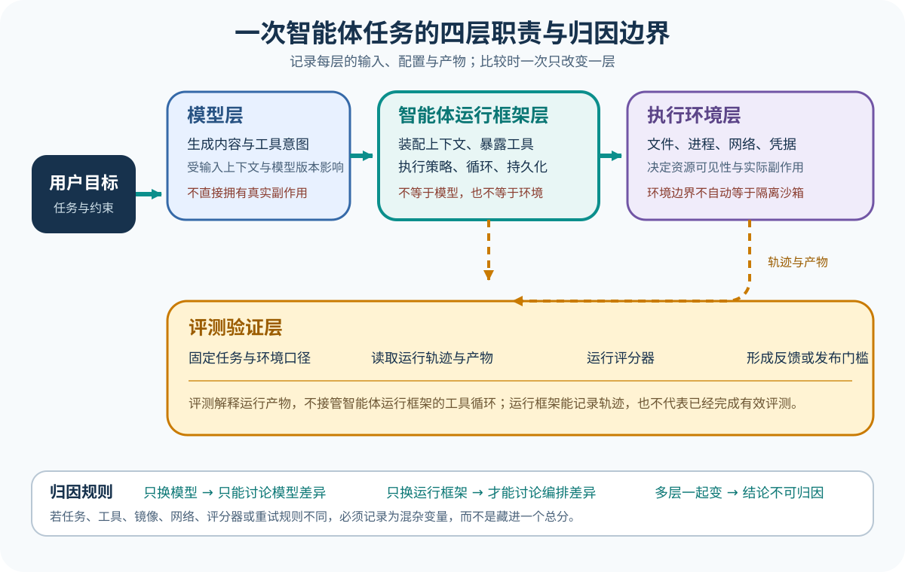

# Model、Harness 与 Environment：先分清谁在做什么

[返回学习入口](../00-start-here.md) · [下一篇：一次任务怎样形成 Agent Loop](02-one-agent-loop.md)



第一次读 Agent 源码，人们很容易把什么都算在模型头上。模型说「我读了文件」，文件却可能根本没打开。终端返回成功，用户交代的事也未必办完。所以读实现前，你得先分清 Model、Agent Harness（智能体框架）和 Environment（运行环境）各自做了什么。下文把 Agent Harness 简称为 Harness。

## 从失败测试开始

这里继续用订单运费这个例子。

```text
用户目标：修复订单金额为 100 元时仍收取运费的问题，并运行测试。

失败断言：
shippingFee(100)
期望：0
实际：10
```

模型想改对代码，得先看到任务、相关源码和失败输出。Harness 会把这些信息组成模型输入，还会告诉模型可以请求哪些工具。Environment 里放着真实文件，测试也在那里跑。少了任何一方，这件事都走不完。

## Model：产生候选决定

Model 拿到一组消息和工具定义后，可以吐出文本、推理数据，也可以发出结构化的工具请求。它可能看着失败断言，猜边界条件写错了，也可能先要求读取 `src/shipping.ts`，等拿到证据再动手。

下面把模型输出简化成一个教学示例，这种写法不对应任何上游项目的精确协议。

```json
{
  "type": "tool_call",
  "name": "read_file",
  "arguments": {"path": "src/shipping.ts"}
}
```

这只是一个候选动作，文件还没有打开，因为 Model 不知道宿主进程能不能读文件，也不知道产品策略会不会放行这个路径。

读到 Model 这一侧，你要找两个动作：请求在哪里建，响应又在哪里拆。常见线索有 Provider（模型提供商）、Client、Request、Response、Stream（流）、Message 和 ToolCall（工具调用）。先查模型实际收到了什么，又吐回了什么，这比从工具实现反猜模型协议靠谱。

## Harness：把候选决定接入任务循环

Harness 夹在 Model 和 Environment 中间，通常要做好下面六件事。

1. 把系统提示、用户消息、历史、工具定义和动态状态组合成模型输入；
2. 发起模型请求并消费流式或非流式响应；
3. 区分文本完成、工具请求、错误、取消和超时；
4. 检查工具名称、参数、权限和用户确认；
5. 调用执行器并把结果重新写入消息历史；
6. 保存 Session、发送事件，并决定继续还是结束。

各个项目拆这六件事时，切法并不一样，Codex 把核心循环、协议和多种界面分到不同 crate 里。OpenCode 让多个客户端连到服务化的 Session。Claude 的 Agent SDK（智能体开发工具包）只公开应用进程能看到的 SDK 和控制协议，我们仍然看不到 Claude Code 内部怎么做。职责看着相似，模块名称却未必对得上。

回到运费案例，Harness 先把 `read_file` 请求交给工具注册表，检查路径是否落在工作区内，然后才调用读文件的实现。读到的内容会进入下一轮，变成模型的新输入。

```json
{
  "type": "tool_result",
  "tool_call_id": "call-1",
  "content": "export function shippingFee(total) { return total > 100 ? 0 : 10 }"
}
```

Model 看到这个结果，才知道边界条件真写错了，也才有根据提出把 `>` 改成 `>=`。

## Environment：副作用真正发生的地方

Environment 里有工作区文件、进程、网络、凭据、数据库、浏览器，也可能连着远程服务。工具最后落到哪个 Environment 里执行，就由那里的真实权限决定能不能做成。

产品策略放行 `src/shipping.ts` 之后，文件仍然可能打不开，原因很具体：文件不存在，宿主进程没权限，Sandbox 没挂载该目录，或者远程工作区断了线。这些都是执行失败，记成策略拒绝就把账算错了。

反过来看，宿主进程也许有能力删掉整个仓库，Harness 却不该因此批准删除。系统实际能做什么，产品又授权它做什么，这两笔记录必须分开。

| 观察 | 更可能属于哪一层 | 下一步检查 |
| --- | --- | --- |
| 模型没有请求任何工具 | Model 或输入构造 | 模型请求、工具定义、上下文 |
| 工具请求被判定为未知 | Harness | 工具注册和名称解析 |
| 请求被规则拒绝 | Harness | 权限策略和确认结果 |
| 请求获准但文件打不开 | Environment | 路径、挂载和系统权限 |
| 测试进程退出码为 0 | Environment 事实 | 继续检查测试是否覆盖用户目标 |

## Trace 与 Eval 在哪里

Trace（执行轨迹）会记下任务里出现过的消息、工具调用、决定和输出，并保留它们发生的顺序。Eval 再拿任务说明、环境事实和判定方法去看这些记录，连同最后留下的产物一起判断。

如果测试进程根本没启动，Harness 仍有可能按自己的流程正常收尾，但你还不能判定任务成没成。如果测试只跑了 `shippingFee(101)`，退出码即使是 0，也证明不了金额 100 的问题已经修好。Eval 要判断的是任务结果，不能只盯着进程状态。

初学时先记住这个分工：Trace 留下发生过的事，Eval 再按明确口径来判断。第五篇基础导读会继续拆开这两件事。

## 用一条数据流检查理解

先看一段教学伪代码。

```text
messages = Harness.构造输入(用户目标, Session, tools)
response = Model.生成(messages)

如果 response 是工具请求:
    decision = Harness.检查(response)
    result = Environment.执行(decision)
    Harness.把结果写回 Session
    进入下一轮

如果 response 是最终文本:
    Harness.保存并结束
```

这段代码有意略掉了流式事件、并行工具、取消、重试和压缩，只想让你看清三方各管哪一段，后面读真实项目时，文章会把每一行对到具体文件和函数上。

## 常见混淆

### 「模型会调用工具」

更准确地说，模型只会提出调工具的请求。Harness 拿到请求后决定怎么处理，Environment 最后才真正执行。把中间两层略掉，你就看不出是谁拦了请求，也分不清失败算在哪一层。

### 「有权限系统就有 Sandbox」

权限系统决定产品愿不愿意做这个动作。Sandbox 则卡住进程，限定它真执行时能碰到什么。前一层可以由规则和用户确认来做决定，后一层得靠操作系统、容器或远程执行环境真正限住。

### 「测试通过就完成了」

测试通过要成为有效证据，必须同时对上三件事：它覆盖了用户目标，跑的是修改后的代码，输出也确实来自这次任务。Harness 还得把这些事实挂到正确的 Session 和任务上。

## 读源码时的落点

打开一个新仓库时，你可以先找出下面这些位置。

- 模型请求入口；
- 消息和工具调用的数据类型；
- 核心循环或状态机；
- 工具注册与执行接口；
- Session 或事件存储；
- 用户可见输出入口。

位置找齐了，再逐个问：这段代码是在适配 Model，还是由 Harness 控制流程？哪个函数又把动作交给了 Environment？把这几个问题答清，你不必先读完整个仓库，也能画出第一张靠谱的地图。

## 练习：给一句运行记录归属

请把下面四句话分给 Model、Harness、Environment 或 Eval，看看每句是谁作出的判断。

1. 「下一步应当把 `>` 改成 `>=`。」
2. 「本次写入需要用户确认。」
3. 「`shipping.test.ts` 返回退出码 0。」
4. 「边界值测试通过，而且测试文件未被修改，因此任务结果合格。」

<details>
<summary>查看核对要点</summary>

四句话依次对应 Model 提出的候选做法、Harness 按策略作出的决定、Environment 里真实发生的执行结果，以及 Eval 对整个结果的判定。第三句不能单独推出第四句，因为你还得确认这个退出码对应正确命令、正确工作区和本次补丁。

</details>

## 现在应该能解释

模型提出 `edit_file` 时，文件可能还一个字都没变。Harness 批准了请求，系统也未必真能执行。测试进程返回 0，同样不能保证用户目标已经达成。分别去看 Model 吐出了什么、Harness 怎么决定，以及 Environment 里真发生了什么。

[下一篇：一次任务怎样形成 Agent Loop](02-one-agent-loop.md)
