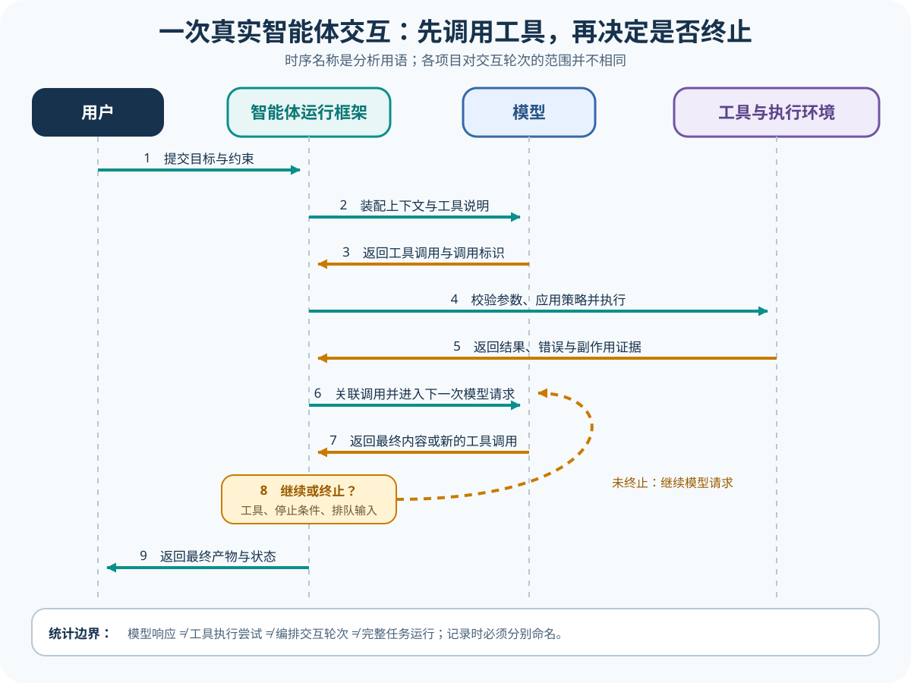

# 一次真实 Agent Turn

## 读者会得到什么

本页从一个可核对的工具调用例子出发，完整走过用户输入、模型响应、工具执行、结果回送、再次采样和最终终止。读完后，你应该能看懂事件日志里哪些记录属于同一次模型请求，哪些属于工具执行，哪些只是流式分片，以及 Agent Harness 为什么需要自己决定继续或停止。

你还会得到一套不会被项目术语误导的计数方式。`Turn`、`step`、`response` 和 `run` 在不同仓库里并不等长：Gemini CLI 的 `Turn.run()` 主要把一次模型响应流转换成服务端事件，pi 的循环则对每次模型响应发出 `turn_start` 与 `turn_end`。所以本页会先定义分析单位，再把上游原名保留在证据旁，不宣称存在一个跨项目统一的 Turn 协议。

先看完整链，再数次数。

## 核心概念



Claim: foundation.turn.continue-or-stop

### 四个容易混淆的单位

本仓库把「模型响应」定义为一次 Provider 请求产生的完整响应事件集合。流式文本、推理片段、工具参数增量和最终完成事件都可能属于同一次模型响应，不能因为收到十个 chunk 就记成十次模型调用。请求重试是否算新的模型响应必须由适配器明确记录，不能靠时间戳猜。

「工具执行尝试」是某一个工具调用标识从准备、参数校验到执行结束的过程。它可能在实际进入操作系统前就因未知工具、Schema 错误或策略拒绝而结束；也可能启动进程后超时。为了避免和 Eval 的 `Attempt` 混淆，事件字段宜使用 `tool_attempt` 或 `tool_execution`，评测层的恢复尝试则使用 `eval_attempt`。两者统计目的不同，不能共用一个递增编号。

「Harness 交互 Turn」在本页指一个已被 Agent Harness 接受的用户输入，直到 Harness 对外产生一个稳定结果：最终回复、明确失败、取消或等待外部输入。一个交互 Turn 可以包含多次模型响应与多个工具执行尝试。项目源码若把每次模型采样称为 Turn，应继续使用项目原名，并在分析表中注明映射关系。

「任务 Run」是更外层的端到端执行。它可以包含多个用户 Turn、恢复、分支、人工审批与 Eval Trial，也可以由一次 Turn 完成。Run 结束不等于产品已通过；Eval 仍要读取对应 Trace 和 Artifact。相反，一次模型响应结束也不代表 Run 结束，因为模型可能刚刚请求了工具。

| 观察到的事件 | 能说明什么 | 不能直接说明什么 |
| --- | --- | --- |
| 文本流结束 | 当前响应的内容流暂时结束 | Agent 已完成任务 |
| 模型给出工具调用 | 模型提出带调用标识的行动意图 | 工具已获批或副作用已发生 |
| 工具返回结果 | 某次工具执行尝试有了输出或错误 | 模型已经理解结果 |
| Provider 给出完成原因 | 当前响应有明确结束原因 | 整个任务运行已经终止 |
| Harness 发出最终事件 | 当前实现按其状态机结束本轮 | Eval 已判定通过 |

结束不等于成功。

### 继续与终止是状态机，不是关键词

最小循环至少要维护当前消息历史、待执行工具、工具结果、排队输入、取消信号和终止状态。模型返回工具调用后，Harness 先建立调用关联，再做参数和策略处理；工具结果必须进入下一次模型可见上下文，模型才有机会基于真实输出继续。若结果只显示在 UI 而没有回送模型，下一段文字可能看似合理，却不是对工具结果的响应。

没有工具调用时也不能机械终止。实现可能还有用户在模型运行期间排队的 steering 消息、外部审批、后台任务或显式 `shouldStopAfterTurn` Hook。另一方面，模型发出工具调用也不保证继续：工具可以返回 `terminate`，取消信号可以中止，输出长度截断可能使参数不安全，策略也可以把调用转成错误结果或等待状态。

终止因此需要一个有优先级的决策表。错误与取消通常先结束当前执行；工具批次的终止信号可以阻止下一次采样；仍有工具结果或排队消息时通常继续；没有待处理工作时才形成稳定终态。具体优先级必须从源码和测试获取。本页只提供需要回答的问题，不替上游补一套不存在的通用枚举。

不要主观猜测。先确认调用标识。再确认执行边界。最后检查结果是否进入下一次请求。

让事件说话。

### 锁定源码怎样做

pi 的锁定源码在 `packages/agent/src/agent-loop.ts:169-174` 明确区分外层 follow-up 循环和处理工具调用、steering 消息的内层循环。模型响应为 `error` 或 `aborted` 时，`196-200` 发出 Turn 与 Agent 结束事件后返回；存在工具调用时，`202-216` 执行工具批次，并根据批次的 `terminate` 更新是否还有后续工具回合。

同一文件的 `247-267` 还允许 `shouldStopAfterTurn` 显式终止，或者在 Agent 原本会停止时接入 follow-up 消息继续。也就是说，pi 中是否继续既取决于模型内容，也取决于工具结果和外部队列。这个结论只描述锁定的 pi 实现；其他项目未必提供相同 Hook。

Gemini CLI 的 `packages/core/src/core/turn.ts:380-413` 把响应中的 function call 转成工具调用请求事件，并且只在响应存在 `finishReason` 时发出 `Finished`。对应测试 `turn.test.ts:357-415` 覆盖 `STOP`、`MAX_TOKENS` 和 `SAFETY`。这里的 `Finished` 是该 Turn 响应流的事件，不能只凭名字推断整个 Agent Run 一定结束；上层调度如何处理工具请求还要沿调用者继续追踪。

关键 Claim 保持 D 级。pi 源码与测试直接证明 pi 的循环行为，Gemini CLI 源码与测试直接证明其响应事件语义；「继续或终止是 Harness 对多类事件的解释」是把两种实现映射到共同问题后的推断。它有证据链，但不是任何一个上游声明的行业标准。

名字不能代替边界。

## 最小例子

pi 的上游测试 `packages/agent/test/agent-loop.test.ts:274-369` 提供了一个足够小且可重复的例子。用户输入是 `echo something`；第一次模型响应给出调用标识 `tool-1`，请求工具 `echo`，参数为 `{"value":"hello"}`，停止原因为 `toolUse`；工具返回文本 `echoed: hello`；第二次模型响应返回 `done`，停止原因为 `stop`。

下面把测试对象压缩成便于阅读的事件序列。字段值来自该锁定测试，但这是确定性 Mock 测试，不是一次真实模型服务调用，也不能拿其中 token 或耗时做性能结论：

```jsonl
{"type":"user_message","content":"echo something"}
{"type":"model_response","stop_reason":"toolUse","tool_call":{"id":"tool-1","name":"echo","args":{"value":"hello"}}}
{"type":"tool_execution_start","tool_call_id":"tool-1"}
{"type":"tool_result","tool_call_id":"tool-1","content":"echoed: hello","is_error":false}
{"type":"model_response","stop_reason":"stop","content":"done"}
{"type":"agent_end","outcome":"completed"}
```

第一行只创建用户输入，不触发副作用。第二行是模型的行动意图；`tool-1` 是后续关联的关键，名称和参数还要经过 Harness。第三、四行属于一个工具执行尝试，结果必须保留相同调用标识。第五行是看到工具结果后的第二次模型响应。第六行才是 Harness 的稳定终态，不应提前在第二行或第四行记为完成。

意图不是副作用。响应结束也不是任务结束。更不是评测通过。

这个最小例子包含两次模型响应、一次工具执行尝试、一个本页意义上的 Harness 交互 Turn，以及一个可以由它完成的任务 Run。若 UI 把工具结果折叠了，计数也不能减少；若模型响应被分成很多流式事件，计数也不能增加。统计单位跟随语义边界，而不是跟随界面行数。

再看一个失败分支。pi 对 `stopReason === "length"` 的工具调用不会直接执行，因为参数可能被截断；源码 `agent-loop.ts:208-214` 把这些调用转成失败结果，上游测试 `agent-loop.test.ts:371-441` 断言工具没有执行，并让循环继续，使模型可以重新发出完整调用。这里的「继续」不是重试已经发生的副作用，而是把安全错误作为工具结果送回模型。

若未知工具、参数校验失败或策略拒绝，合理的实现可以返回结构化错误结果继续，也可以按配置终止。文章不能仅从最终回复推断采取了哪条路径；必须检查 `tool_call_id`、执行开始事件是否存在、错误由哪一层产生，以及第二次模型请求实际包含了什么。

先暂停执行。查清错误来源。确认安全再继续。

### 调用链逐步核对

1. Harness 接受用户输入，为交互 Turn 分配稳定标识，并把输入写入或准备写入会话。
2. Harness 从指令、历史、运行上下文和工具注册表装配模型请求；一次发送对应一次模型请求边界。
3. 模型流式返回内容与工具调用。Harness 合并增量，得到完整调用标识、名称和参数后再进入执行路径。
4. Harness 校验工具、参数与策略，必要时等待用户批准；未到真实执行阶段的拒绝也要形成可追踪结果。
5. 执行环境运行工具，Harness 收集输出、错误、退出状态和副作用证据，并用原调用标识形成工具结果消息。
6. 若状态机允许继续，Harness 把工具结果和必要历史装入下一次模型请求；模型可以给出更多工具调用或最终内容。
7. Harness 结合错误、取消、工具终止信号、排队输入和项目特有 Hook 决定继续或结束，并保存最终状态。

## 常见误区

第一，把流式 chunk 当成 Turn。chunk 只是传输增量；只有请求与响应完成边界、调用关联和状态迁移才能支持计数。网络断开后续传或重试更需要显式事件，否则同一响应可能被重复计算。

第二，把 Provider 的 `finishReason` 直接等同于任务成功。`STOP`、长度限制或安全停止描述的是响应结束原因，不是 Scorer 结果。响应可以正常停止却没有完成任务，也可以因长度停止而留下不得执行的半截工具参数。

第三，工具调用出现就认为工具执行了。模型只提出意图；参数校验、策略、审批、执行后端和环境都可能阻断。至少要同时看到调用请求、执行开始、执行结束和带相同调用标识的结果，才能说明这次工具执行尝试走到了哪一步。

第四，工具报错就结束 Agent。很多 Harness 会把可恢复错误作为工具结果回送模型，使其修正参数或换路径；但产品失败不能无限重试成通过。Agent Loop 的局部恢复与 Eval 的 Trial/Attempt 统计必须分开设计。

第五，把上游事件名当共同语义。pi 的 `turn_end`、Gemini CLI 的 `Finished`、Codex 的 Turn 和 DSH 的 turn/step 都需要回到各自调用者与测试。比较表应先写项目原语义，再写仓库映射，不能只因名字相同就合并。

## 验证方法

验证一个 Turn 的第一步是固定输入和模型响应。优先使用上游已有的确定性测试，或用录制响应替代不稳定的活模型；记录模型响应次数、完整工具调用和停止原因。活模型实验可以补充真实 Provider 行为，但不能取代可重复的状态机测试。

第二步是对事件建立不变量：每个工具结果必须引用一个先前工具调用；每个真实执行结束必须有对应开始；被策略拒绝的调用不得伪造执行开始；进入第二次模型请求的工具结果顺序必须可解释；最终事件之后不得静默产生新的副作用。并行工具可以按完成顺序发事件，但持久化顺序与模型可见顺序需要单独声明。

事件必须闭合。

少一个引用，链就断了。

第三步是注入失败。至少覆盖未知工具、非法参数、策略拒绝、用户取消、执行超时、输出截断、多个并行工具、工具请求终止和排队 follow-up。每个分支都要断言是否再次采样、哪些消息进入历史、最终状态是什么，以及副作用是否可能重复。

第四步是核对计数。对本页最小例子，期望是两次模型响应、一次工具执行尝试、一次交互 Turn；若实现自己的 `turn_start` 数量不同，要在映射表解释，不修改上游事件。进入 Eval 时再把完整任务绑定到 Trial，并明确基础设施恢复是否创建新的 `eval_attempt`。

最后检查证据边界。本页的 pi 测试证明确定性 Mock 下工具被执行且结果回到循环，Gemini CLI 测试证明完成事件随 `finishReason` 产生；它们不证明所有 Provider、所有工具和所有客户端共享同一终止策略。缺少平台或模式证据时，应降级为 D 或 U，而不是用一个成功例子补齐未知分支。

## 自检

### 问题 1

模型返回一个工具调用后，为什么不能把当前模型响应的结束记成整个任务结束？

**答案：** 因为工具调用只是行动意图。Harness 还要校验、审批和执行，把结果关联回下一次模型请求，再根据新响应与终止条件决定是否结束。当前响应结束只确定一个模型响应边界。

### 问题 2

最小 `echo` 例子分别包含多少次模型响应、工具执行尝试和交互 Turn？

**答案：** 两次模型响应、一次工具执行尝试和一个本页定义的 Harness 交互 Turn。上游实现自己的 `turn_start` 计数可能不同，必须在映射时保留。

### 问题 3

看到 `finishReason: STOP` 是否足以判断 Eval 通过？

**答案：** 不足。它只描述当前模型响应的结束原因。Eval 还要检查任务 Artifact、Trace、Scorer 与 Trial 口径，正常停止的回复也可能没有完成任务。

### 问题 4

为什么截断的工具调用可以让 Agent 继续，却不应该直接执行？

**答案：** 截断参数可能恰好能解析但语义不完整，直接执行会产生错误副作用。安全做法是形成可追踪错误结果，让模型重新发出完整调用；这属于循环恢复，不是把已经发生的产品失败重试成通过。
