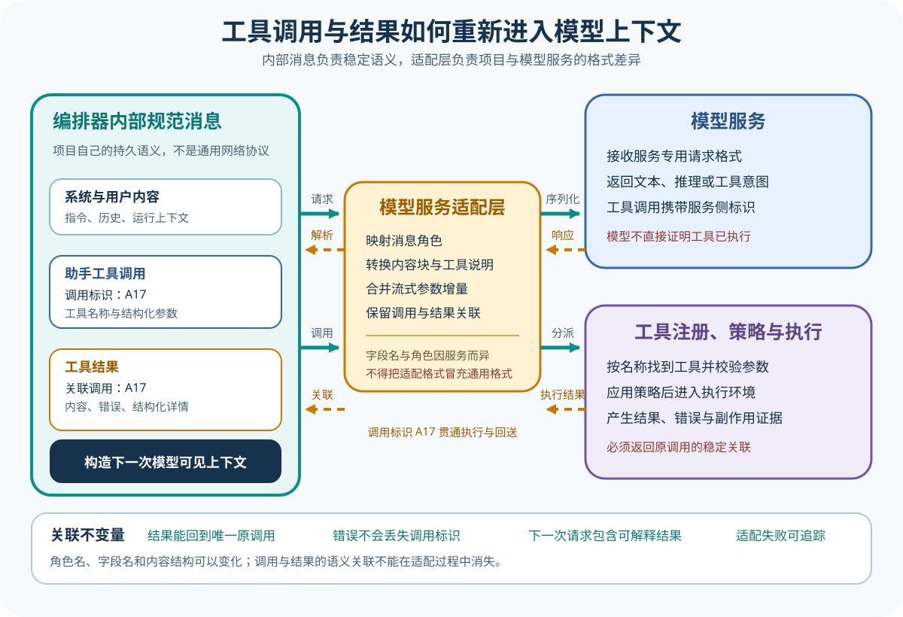

# 一次任务怎样形成 Agent Loop

[上一篇：Model、Harness 与 Environment](01-model-harness-environment.md) · [返回学习入口](../00-start-here.md) · [下一篇：工具、权限与执行边界](03-tools-permissions-execution.md)


Agent Loop（智能体循环）不是把模型一遍遍重新调用就算完事。每一轮都得组好输入，接住模型吐出的内容，再走工具或文本对应的分支。Agent Harness（智能体框架）还要存下新状态，根据已经看到的信号判断下一步。下文把 Agent Harness 简称为 Harness。任何一环没说清，任务都可能打转、过早收尾，或在恢复后重复产生副作用。

## 一轮和一个任务不是同一个单位

回到运费案例，这件事要走好几轮才能办完。

1. 用户提出修复目标；
2. 模型请求读取实现；
3. 文件结果返回后，模型请求编辑；
4. 编辑结果返回后，模型请求运行测试；
5. 测试结果返回后，模型给出最终答复。

模型发出一次请求并收到响应，可以算一轮。一个任务通常会串起多轮，Harness 还要在轮次之间调工具、存状态，出错时也得接住。

不同项目会说 Turn（回合）、Step（步骤）、Cycle、Iteration、Run、Task 或 Thread。这些词不能直接画等号。每条课程开头都会先说明，该项目把它们分到了哪一层。

## 第一轮：构造模型真正看见的输入

用户只说了一句话，模型真正收到的输入却通常还有系统指令、工具定义、会话历史和当前运行状态。

```json
{
  "system": "你在受控工作区中修改代码。修改后运行相关测试。",
  "tools": ["read_file", "edit_file", "run_command"],
  "messages": [
    {
      "role": "user",
      "content": "修复订单金额为 100 元时仍收取运费的问题，并运行测试。"
    }
  ],
  "runtime": {
    "workspace": "当前仓库",
    "approval_mode": "按风险询问"
  }
}
```

这些都是教学数据，不对应任何厂商 API。真实项目可能把 system、tools 和 runtime 拆到不同请求字段，也可能把动态状态直接写进系统提示。读源码时，请一直追到最后发给 Provider（模型提供商）的那个对象，别在配置文件的原始值处停下。

## 第二步：消费模型输出

模型吐出的内容可能长成下面这几种样子。

- 普通文本；
- 一个工具调用；
- 多个可并行工具调用；
- 流式文本和工具参数片段；
- 明确结束原因；
- 被取消、不完整或解析失败的响应。

Harness 要把这些输出拆成内部事件或状态。如果工具参数是一片片流过来的 JSON，Harness 必须等它们拼完且解析成功，才能把请求交给工具层。响应若在参数到齐前中断，那半截参数绝不能当成有效命令。

在运费案例里，第一轮最好先要求读文件，不要看见失败断言就立刻动手修改。

```json
{
  "id": "call-read-1",
  "name": "read_file",
  "arguments": {"path": "src/shipping.ts"}
}
```

调用 ID 必须保持稳定，后面的权限决定、执行结果和下一轮消息，都要靠它找回对应的模型请求。

## 工具结果怎样进入下一轮



文件工具读完文件后，Harness 通常会生成一条结果消息，再用调用 ID 把它挂回原请求。

```json
{
  "tool_call_id": "call-read-1",
  "status": "success",
  "content": "export function shippingFee(total) { return total > 100 ? 0 : 10 }"
}
```

下一轮不会只把工具结果单独发走。Harness 会重新装配系统指令、必要历史、工具定义和这条新结果。有些 Provider 能缓存稳定前缀，有些项目则会在预算吃紧时压缩旧历史。怎么装，会直接改变模型下一轮能用哪些信息。

编辑和测试也照这个节奏走，模型先提请求，Harness 再控制执行，完成后把结果交给下一轮。

## 循环状态应该显式保存什么

一个能恢复的 Loop（循环）至少得存住下面这些状态。

| 状态 | 用途 |
| --- | --- |
| 任务或 Session 标识 | 把多轮事件归到同一任务 |
| 当前消息历史 | 构造下一次模型输入 |
| 工具调用 ID 和执行状态 | 防止结果错配或重复副作用 |
| 取消与超时信号 | 让模型请求和工具执行可以停止 |
| Token 或轮次预算 | 防止无限循环 |
| 最后一个持久化位置 | 崩溃后判断从哪里恢复 |

如果只存最后的聊天文本，恢复时就无法确认某次写文件究竟执行过没有。系统可能又执行一遍同一工具，也可能因为丢了上次结果，让模型再次提出同一请求。副作用就这样重复了。

## 什么时候继续

出现下面这些情况时，Loop 通常还得继续往前走。

- 模型提出了一个可以处理的工具请求；
- 工具执行结束，结果需要交给模型解释；
- 权限被拒绝，但拒绝原因作为新观察允许模型选择替代方案；
- 可恢复错误已经转化为结构化反馈。

继续循环不等于照原样重跑一遍，因为权限被拒后，模型可以改用只读工具。命令跑失败后，它也可以根据错误输出修正参数，下一轮要带上这些新信息。

## 什么时候结束

常见的收尾条件有下面几种。

- 模型返回最终文本且没有待处理工具；
- 达到轮次、Token、时间或成本上限；
- 用户取消；
- 协议错误无法恢复；
- Environment 不再可用；
- 产品策略要求停下并交给用户。

「模型没有调工具」只是一个收尾信号。如果测试还在失败，模型写下「已经修复」也不会让任务自动变对。Harness 可以结束这次运行，任务是否完成仍要交给测试或 Eval 来判断。

## 一个最小状态机

下面这张教学状态机，把上面说的状态怎么转换画在了一起。

```text
准备输入
  │
  ▼
请求模型 ──错误──> 记录失败 ──可恢复──> 准备输入
  │                              └─不可恢复──> 结束
  ▼
解析响应
  ├─最终文本──────────────> 保存输出 ──> 结束
  └─工具请求
       │
       ▼
    检查与执行
       │
       ▼
    写入工具结果 ─────────> 准备输入
```

真实项目可能用异步生成器、事件总线、递归函数或显式 reducer 来写这段逻辑，看起来未必像图里的状态机。别被写法带跑。你只要找出它保存了哪些状态，又用什么条件把状态推到下一步。

## 过早结束的三个例子

### 编辑成功就结束

文件写成功，只能说明补丁已经落盘。代码能不能编译，测试能不能过，还得继续调验证工具去查。

### 命令退出码为 0 就结束

命令就算跑错了测试文件，也有可能返回 0。Harness 还要让模型或验证器对一遍命令，确认它真的在检查用户交代的问题。

### 模型说完成就结束

模型写下的文本只是候选解释。任务既然能验证，收尾时就应当带上环境里的真事实，比如相关测试输出和预期的文件差异。

## 无限循环从哪里来

下面几种情况，很容易让 Loop 一直转下去。

- 模型反复读取同一文件，没有新的状态提示；
- 工具输出被截断，模型每轮都重新请求完整内容；
- 权限拒绝没有作为结果返回，模型不知道请求被拒；
- 失败命令只返回「失败」，缺少可以修正的错误信息；
- 历史压缩丢掉了已经完成的步骤。

只设一个最大轮数，到点硬停，解决不了这些问题。Harness 还得把调用次数、拒绝原因、结构化错误、已完成的步骤和压缩摘要送回模型能看见的状态里。模型得知道哪里变了。

## 阅读真实 Loop 的顺序

进入源码后，你可以按下面的顺序找。

1. 找到公开入口怎样创建任务或 Session；
2. 找到发起模型请求的函数；
3. 找到响应类型和流式消费逻辑；
4. 找到工具请求分支；
5. 找到工具结果写回消息的位置；
6. 找到最终文本、限制、取消和错误的结束分支；
7. 找到状态持久化发生在转换前还是转换后。

先把这条调用链从头跟到尾，再去看并行工具、子代理、压缩和恢复。一上来就钻进扩展功能，你很容易把真正推动状态前进的那条主链看丢。

## 回到运费案例

这个任务要走完，下面这条事实链就得完整留下来。

```text
失败测试
→ 读取实现
→ 确认边界条件
→ 编辑比较符
→ 运行目标测试
→ 观察金额 100 的断言通过
→ 生成最终答复
```

少了「目标测试」或「金额 100 的断言」，最后的答复就没有东西可以核对。Loop 把任务一步步往前推，任务判定再根据留下的事实解释结果。到这里，过程和判定才真正接上。

## 练习：补出缺失的一轮

现有历史是「用户目标 → 读取文件 → 文件内容 → 编辑成功」，模型却直接回复「已经修复」。请你补出 Harness 至少还要推动的一轮，并说清这一轮会带回什么新事实。

<details>
<summary>查看核对要点</summary>

下一轮要让模型请求运行覆盖金额 100 的目标测试。Harness 跑完后，把命令、退出码、标准输出和错误输出都填回去，让模型看到新事实。测试若失败，Loop 就继续诊断。测试过了，模型才有根据写最终答复。工具具体叫什么不重要，环境验证的结果必须真正回到决策过程里。

</details>

## 现在应该能解释

一轮只算一次模型交互，一个任务则会串起多轮交互和它们之间的工具执行。工具做完之后，结果要变成下一轮能看见的新事实。判断是否收尾时，既要看协议和资源限制，也要防止模型把自己的说法冒充成环境事实。声明不是事实。

[下一篇：工具、权限与执行边界](03-tools-permissions-execution.md)
