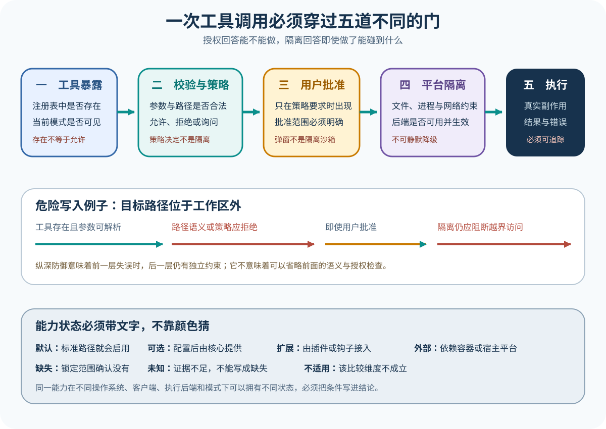

# 工具、权限与执行边界：模型提出动作之后发生什么

[上一篇：一次任务怎样形成 Agent Loop](02-one-agent-loop.md) · [返回学习入口](../00-start-here.md) · [下一篇：Session、Context、Memory 与恢复](04-session-context-memory.md)



工具让模型能够读取或改变外部世界，也把它的不确定输出连到了真实副作用上。因为「工具出现在请求里」「策略允许」「用户批准」和「操作系统执行成功」分属不同责任层，所以读源码时不能把它们压成一个布尔值，更不能把各层失败当成同一件事。

## 同一个动作经过五道边界

在运费案例中，模型想运行测试：

```json
{
  "name": "run_command",
  "arguments": {
    "command": "npm test -- tests/shipping.test.ts"
  }
}
```

这个请求在真正运行之前，至少要经过五个阶段：

1. **工具可见性**：模型输入中是否声明了 `run_command`；
2. **协议校验**：工具名和参数是否符合 Schema；
3. **产品策略**：当前模式和规则是否允许运行该命令；
4. **用户确认**：风险达到阈值时是否获得即时授权；
5. **执行环境**：宿主、Sandbox 或远程运行器是否真的能执行。

只有第五步会真正产生进程副作用，而前四步做的都是资格审查，用来决定这个请求能否进入执行环境。

## 工具可见不等于可以自动执行

工具定义通常包含名称、用途和参数结构：

```json
{
  "name": "run_command",
  "description": "在当前工作区运行命令并返回退出码和输出",
  "input_schema": {
    "type": "object",
    "properties": {
      "command": {"type": "string"}
    },
    "required": ["command"]
  }
}
```

把工具告诉模型，只说明模型可以按这套协议生成请求，至于请求能否自动执行，还要继续检查权限模式、命令内容、路径范围、网络需求和用户选择——工具可见，权限未定。

反过来，如果工具没有进入模型输入，那么模型即使知道系统可能支持终端，也无法通过约定协议发出请求。有些 Harness 会根据当前模式动态筛选工具，另一些则始终暴露工具，等请求产生后再由策略拒绝。这两种设计会以不同方式影响模型行为和 Token 使用，阅读时需要分开追踪。

## Schema 校验保护协议，不保护业务安全

Schema 可以拒绝缺少 `command`、类型错误或未知字段的请求，却无法判断命令是否危险：

```text
npm test -- tests/shipping.test.ts    结构合法，通常低风险
删除整个工作区                         结构同样可能合法，风险完全不同
```

因为参数合法只表示 Harness 能理解请求，并不表示请求应当被批准，所以参数校验和权限策略不能合并成同一道判断——合法不等于安全。

在请求进入执行环境之前，Harness 还可能补全工作目录、超时、环境变量和输出上限等执行参数。因此，正文需要交代原始参数怎样变成了最终参数，否则审计者只能看到模型最初生成的文本。

## 产品策略怎样作决定

权限策略可能读取：

- 工具名称；
- 命令和参数；
- 当前工作区；
- Session 模式；
- 用户或组织规则；
- 请求来源；
- 是否已有同范围授权；
- 动作是否可逆。

返回值如果只有简单的 `true` 或 `false`，读者就无法知道策略为什么作出这个选择，因此它还要携带可解释的决定理由：

```json
{
  "decision": "ask",
  "reason": "命令会启动本地进程",
  "scope": "本次调用",
  "final_arguments": {
    "command": "npm test -- tests/shipping.test.ts",
    "timeout_ms": 120000
  }
}
```

不同项目可能使用 allow、deny、ask、always allow、workspace scope 或模式枚举，但名称相似不等于语义相同，而真正比较时，要追到每个选项的实际优先级和持久化范围。

## 用户确认是策略的一部分，不是 Sandbox

用户点击「允许」表达的只是当下意图，这个动作既不能扩大操作系统权限，也不能保证命令本身安全，而批准不会穿透系统边界。由于确认界面可能运行在 CLI、IDE、桌面端或远程客户端，不同表面也未必拥有相同的交互能力。

如果无头模式没有确认通道，Harness 就必须明确选择拒绝请求、使用预先配置的策略，或者把请求发送给外部审批者，因为静默自动允许会直接改变安全边界，文章不能跳过这个细节。

确认结果应当同时绑定调用 ID 和授权范围，因为只保存「用户曾经允许 run_command」这一条宽泛记录，会让后续完全不同的命令误用旧授权。

## Sandbox 限制已经获准的动作

Sandbox 关注执行时能碰到什么：

- 哪些目录可读写；
- 是否能够访问网络；
- 能否看到宿主凭据；
- CPU、内存、磁盘和时间限制；
- 子进程和系统调用范围；
- 执行完成后是否保留工作区。

一个项目可能有完善的权限询问，命令却默认在宿主进程中执行，而另一个项目可能把所有命令都放进远程隔离环境，产品策略却依然很宽，两种设计防的并非同一类风险。

在运费案例里，即使测试命令获准，Environment 仍可能返回：

```json
{
  "status": "failed",
  "exit_code": 127,
  "stderr": "npm: command not found",
  "executed": true
}
```

这是执行失败，不是权限拒绝。只有看到准确错误，模型才能改用仓库支持的测试命令，或者把实际的环境问题告诉用户。

## 工具结果怎样安全地回到模型

工具输出可能很长、包含二进制内容或敏感数据。Harness 通常需要：

- 保存退出码和错误类型；
- 截断过长输出并提供完整结果位置；
- 标记 stdout 与 stderr；
- 过滤不应进入模型的敏感字段；
- 保留原调用 ID；
- 说明动作是否实际执行；
- 把结果转换成 Provider 接受的消息格式。

只返回一句「工具失败」会丢掉修正所需的线索，而把几万行日志全部塞回上下文，又会迅速挤占 Token 预算。信息太少和太多都有代价，而如何在信息量与上下文成本之间取得平衡，正是 Harness 必须负责的结果转换。

## 四条失败路径

| 路径 | `executed` | 应记录什么 | 模型下一轮可以做什么 |
| --- | --- | --- | --- |
| 未知工具 | `false` | 工具名和可用工具提示 | 改用现有工具 |
| 参数不合法 | `false` | Schema 错误和字段位置 | 修正参数 |
| 策略或用户拒绝 | `false` | 决定来源、理由和范围 | 选择低风险替代方案 |
| 环境执行失败 | `true` 或状态未知 | 退出码、错误、部分输出 | 修正命令或报告阻塞 |

一旦这些路径全部折叠成 `error`，恢复、审计和 Eval 就无法判断副作用究竟有没有发生。

## 恢复时最危险的情况

如果工具开始执行后进程突然崩溃，Session 里就可能只留下「开始」事件，却没有对应的「结束」事件。此时不能自动假设工具从未执行，因为对写文件、发消息、支付和部署这类有副作用的动作来说，盲目重跑很可能制造重复结果。

更安全的记录包含：

- 稳定调用 ID；
- 审批后冻结参数；
- 开始执行时间；
- 执行环境标识；
- 完成、失败、取消或未知状态；
- 可用于查询或补偿的外部操作 ID。

有了这些记录，恢复逻辑才能按照工具性质选择查询、补偿、重新执行，或者把无法自动确认的情况交给人工判断。

## 在真实源码中怎么找

与其只搜索 `permission`，不如沿着工具请求的数据类型继续追踪：

1. 工具定义在哪里进入模型请求；
2. 模型响应怎样解析成内部 ToolCall；
3. 工具注册表怎样从名称找到实现；
4. 参数在何处校验或改写；
5. 策略与用户确认的调用顺序；
6. 执行器使用宿主、Sandbox 还是远程环境；
7. 结果怎样转换并回到消息流；
8. 拒绝、取消、超时和未知状态有哪些测试。

阅读 Claude 课程时还要额外核对证据边界，因为公开 SDK 能够展示回调和控制协议，却不足以证明我们能看到 Claude Code 内部的所有策略与执行细节。

## 回到运费案例

读取源码、编辑比较符和运行测试可能分属不同风险级别，因此合理的流程可以自动允许工作区内读取，编辑前先展示差异，遇到命令时再按策略决定是否询问，并且始终把执行范围限定在工作区内。

任务正确的证据不是「所有工具都获准」，而是危险请求没有越界，必要动作确实执行，并且覆盖边界值的目标测试最终通过。

## 练习：判断阻断发生在哪一层

请分别判断下面四种失败最可能属于哪一层：工具名称不存在、命令被策略拒绝、用户取消确认、进程在 Sandbox 中无法访问工作区外文件，并解释为什么它们不应都返同一个「执行失败」。

<details>
<summary>查看核对要点</summary>

它们依次属于工具解析或注册、产品策略、交互批准和执行环境能力。如果统一折叠成「执行失败」，模型可能会反复重试本来永远不会被允许的动作，恢复逻辑也无法判断副作用究竟有没有发生。

</details>

## 现在应该能解释

工具可见、Schema 合法、策略允许、用户批准和系统执行是五个不同判断。权限控制的是产品意图，Sandbox 限制的是执行能力，而工具结果只有准确携带副作用是否发生的事实，才能支持下一轮处理和安全恢复。

[下一篇：Session、Context、Memory 与恢复](04-session-context-memory.md)
