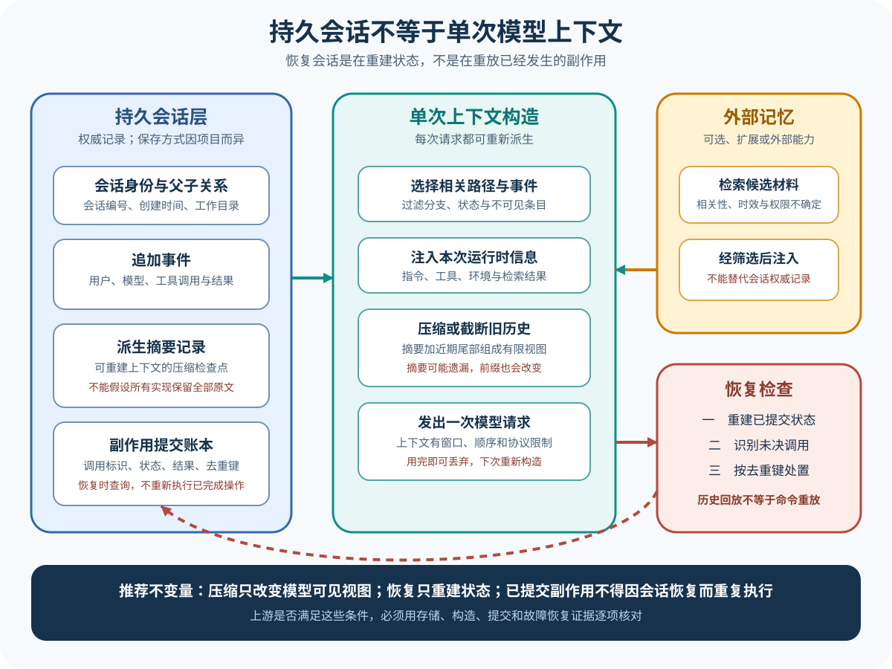

# Session、Context、Memory 与恢复：状态究竟保存在哪里

[上一篇：工具、权限与执行边界](03-tools-permissions-execution.md) · [返回学习入口](../00-start-here.md) · [下一篇：Trace、Eval 与结果核对](05-trace-eval.md)



Session、Context 和 Memory 经常被当作同义词。阅读实现时必须把它们分开：Context 是某次模型请求能看见的输入，Session 是一项任务跨多轮的运行记录，Memory 是跨任务保留的信息。Compaction 则是把过长历史转换成更短表示的过程。

## 用中断后的任务观察差异

运费修复已经完成读取和编辑，测试尚未运行时进程退出。重新启动后，系统需要回答：

- 用户原始目标是什么；
- 哪个文件已经修改；
- 编辑工具是否完成；
- 下一步应该运行什么测试；
- 之前的模型消息是否全部重新发送；
- 这次任务结束后，有哪些信息值得跨任务保存。

这些问题分别落在 Session、工具状态、Context 构造和 Memory 策略中。

## Context：当前这一轮模型能看见什么

Context 通常由以下内容组合：

```text
稳定部分：系统指令、工具定义、项目规则
任务部分：用户目标、附件、初始环境信息
历史部分：模型消息、工具请求和工具结果
动态部分：工作目录、剩余预算、任务进展、权限模式
检索部分：按需加载的文件、记忆和外部知识
```

Context 不是数据库里的全部 Session。Harness 会根据模型窗口、缓存策略和任务阶段选择本轮实际发送的内容。

在运费案例里，恢复后的下一轮至少要让模型知道目标、已经应用的修改和尚未运行的测试。若只发送最近一句「编辑成功」，模型可能不知道为什么编辑，也无法选择正确测试。

## Session：任务的连续运行记录

Session 将多轮消息和执行事实关联到同一任务。一个实用 Session 往往包含：

- 稳定标识；
- 创建和更新时间；
- 用户消息与模型消息；
- 工具调用、决定和结果；
- 当前运行配置；
- 取消、错误和结束原因；
- 压缩摘要及其覆盖范围；
- 外部产物引用。

Session Store 可以是文件、数据库、服务端存储或宿主应用提供的接口。存储形式不同，语义仍要回答「哪些事件已经持久化」和「恢复从哪个提交点继续」。

聊天界面显示的消息只是 Session 的一个投影。内部还可能保存不显示给用户的控制事件、Token 统计、审批记录和工具原始输出。

## Runtime State：尚未成为消息的运行事实

有些状态不适合直接写入消息历史，例如：

- 当前正在执行的工具；
- 取消令牌；
- 流式响应已经接收的片段；
- 并行工具的完成集合；
- 尚未持久化的事件；
- 当前工作区句柄或进程 ID。

这类 Runtime State 可能只存在于内存。进程退出后，如果没有持久化接缝，恢复只能把它标为未知，不能假装完整重建。

源码文章应说明哪些状态可以恢复，哪些只能在当前进程中使用。一个 `resume(session_id)` API 的存在不代表所有正在执行的副作用都能无损恢复。

## Memory：跨任务保留的信息

Memory 服务于未来任务，不等同于把所有 Session 永久塞进模型输入。常见内容包括：

- 用户偏好；
- 项目约定；
- 已确认的环境事实；
- 经过整理的解决方案；
- 可复用 Skill 或指令；
- 外部知识索引。

运费修复中的具体工具调用通常不值得成为长期记忆。若项目约定「金额单位使用整数分」或「提交前运行 shipping 测试」，这些稳定规则可能适合写入项目文档或 Memory。

Memory 写入需要来源和更新策略。未经验证的模型猜测若直接跨会话保存，会在后续任务中持续误导。

## Compaction：历史太长时保留什么

当消息历史接近模型窗口或成本预算，Harness 可以：

- 丢弃可重新获取的旧工具输出；
- 截断长日志并保留文件引用；
- 把早期消息总结成摘要；
- 保留最近若干轮原文；
- 固定关键任务状态和未完成步骤；
- 重新建立稳定前缀。

Compaction 不是简单删除旧消息。摘要必须保留影响后续决策的事实，尤其是用户目标、已经产生的副作用、未完成步骤、约束和关键错误。

一个适合运费案例的教学摘要可能是：

```text
目标：修复金额 100 时仍收费的问题。
已读取：src/shipping.ts。
已修改：条件 total > 100 改为 total >= 100。
尚未完成：运行 tests/shipping.test.ts 并确认边界断言。
```

若摘要只写「已修复运费问题」，模型可能跳过测试并过早结束。

## 恢复流程的四个检查点

### 1. 加载 Session

确认 Session 存在、版本兼容，并找到最后一个完整持久化事件。

### 2. 重建可恢复状态

恢复消息、配置、工作区引用和压缩摘要。进程句柄等不可恢复对象重新创建或标记失效。

### 3. 处理未完成副作用

如果工具只有开始事件，没有结束事件，根据工具类型查询实际结果、请求用户判断或执行补偿。不能统一重跑。

### 4. 构造下一轮 Context

把原目标、已完成工作、未完成步骤和新环境状态交给模型。恢复只需重建足以安全继续的事实，无须回放全部历史。

## 消息重放与副作用重放不同

重新把旧消息发送给模型通常不会改变外部世界；重新执行旧工具可能会。Session 恢复必须区分：

| 对象 | 是否通常可以重建 | 主要风险 |
| --- | --- | --- |
| 用户和模型文本 | 可以 | 版本差异导致解释变化 |
| 工具结果消息 | 可以从存储恢复 | 原始输出可能已被截断 |
| 只读工具 | 可能重新执行 | 环境已经变化，结果不再相同 |
| 写入、支付、发送等工具 | 不能盲目重跑 | 重复副作用 |
| 进程内流式片段 | 常常不完整 | 无法知道 Provider 是否已结束 |

幂等键、外部操作 ID 和事务记录可以降低重复风险，但每个工具都需要明确语义。

## 在源码里怎么找

从公开入口搜索 create、load、resume、fork、compact、history、store 等符号，再回答：

1. Session ID 由谁生成；
2. 消息何时持久化；
3. 工具开始和结束是否分别记录；
4. Compaction 由长度、Token 还是显式请求触发；
5. 摘要怎样进入后续 Context；
6. 恢复是否重新连接 Provider 或执行环境；
7. 多客户端是否共享同一 Session 真值；
8. 哪些状态只存在于宿主内存。

只有数据结构没有调用路径，仍无法说明恢复行为。继续查找创建、写入、读取和消费这些结构的函数。

## 回到运费案例

进程在编辑后退出。安全恢复需要确认写入工具已有完成记录，加载修改后的工作区，向模型提供「测试尚未运行」的状态，然后继续到验证步骤。若无法确认写入是否完成，应先读取文件或检查差异，而不是再次应用同一编辑。

任务结束后，可以保存 Session 作为审计记录；长期 Memory 只接收经过验证、未来仍有价值的项目规则。

## 练习：恢复时哪些动作不能重放

Session 最后两条事件是「开始编辑 `shipping.ts`」和「进程意外终止」，没有工具完成记录。恢复后应该直接再次编辑、直接运行测试，还是先读取文件和差异？说明理由。

<details>
<summary>查看核对要点</summary>

应先观察文件和差异，确认副作用是否已经发生。消息可以重放，副作用不能盲目重放；否则可能重复插入内容或覆盖其他修改。确认文件状态以后，Harness 才能决定补做编辑还是继续测试。

</details>

## 现在应该能解释

Context 是一轮输入，Session 是一项任务的连续记录，Runtime State 是当前进程的运行事实，Memory 服务未来任务，Compaction 改写过长历史。恢复的核心不是重新聊天，而是安全重建状态并避免重复副作用。

[下一篇：Trace、Eval 与结果核对](05-trace-eval.md)
