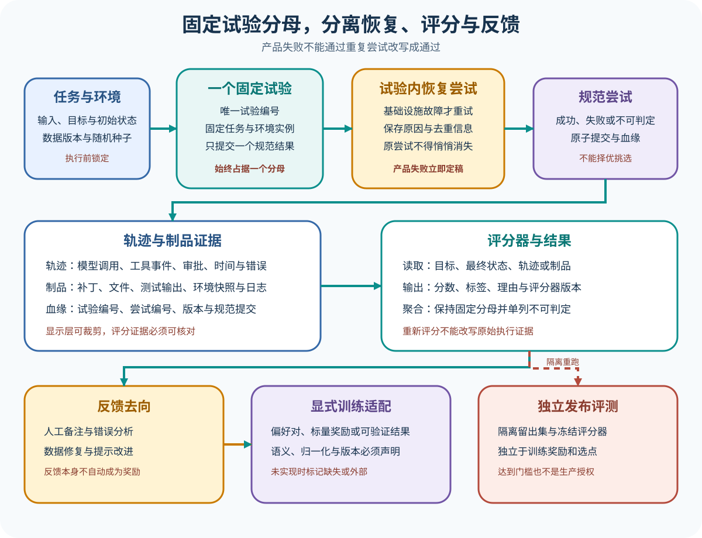

# Trace、Feedback 与评测接入

## 读者会得到什么

本页解释 Agent Harness 怎样接入评测，而不是再建立一套并列的 Eval Harness 百科。我们把一项预先登记的任务与环境实例称为 Trial，把基础设施恢复过程称为 Attempt；规范 Attempt 留下 Trace 和 Artifact，Scorer 基于明确输入产出 Score、标签和理由，Feedback 再流向调试、数据或显式训练适配器。

这里最容易作弊的地方是重试。模型或 Agent 已经给出可评分的错误结果，就属于产品失败；再次运行并挑出成功结果，会改变实验问题和分母。只有网络中断、环境启动失败、日志写入故障等使本次无法形成有效产品结果的基础设施失败，才可能在同一个 Trial 内恢复。

分母必须固定。恢复不能挑优。结果不能挑选。

## 核心概念



Claim: foundation.eval.trial-attempt-stability

### 为什么 Eval 是横切验证

Agent Harness 负责把目标变成模型与工具的多步交互；Eval 从外部固定任务、环境、预算和判定，观察这条交互是否满足要求。二者共享消息、工具、Session 和 Trace，但职责不同。Eval 不替 Agent 决定下一步，Agent 也不应知道隐藏答案或修改 Scorer。

横切意味着同一条项目主线可以在单元测试、回放、沙箱实验和基准任务上被验证。共同抽象只规定证据和统计边界，不抹平 Inspect AI、Terminal-Bench、SWE-bench 或项目内测试的术语。每个参照仍要按锁定版本解释。

### Trial 是固定统计单位

本仓库把 Trial 定义为执行前登记的一个任务实例：数据版本、样本编号、环境镜像、初始状态、随机种子、预算、目标和评分配置共同确定它。无论最后通过、失败、阻塞或不可判定，它都保留同一个 Trial ID，并占据预先确定的统计分母。

固定分母不是说所有状态都强行算成零分。报告可以把基础设施阻塞和不可判定单列，也可以同时给出产品成功率与运行健康率；关键是不能悄悄删除困难样本、用新增成功样本补位，或让重试次数改变 Trial 数。分母和排除规则必须在运行前冻结。

上游名词可能不同。Terminal-Bench 的锁定 `models.py:28-49` 同时定义 `n_attempts` 与 `TrialResults`，后者带 `failure_mode`；测试 `26-39` 又把同一 `task_id` 的三个 `TrialResults` 称作多个 attempts。它的 pass@k 在项目自身语义下合理，但不能直接等同本仓库的恢复 Attempt。

### Attempt 只记录恢复过程

Attempt 是 Trial 内的一次执行尝试，目的是让基础设施故障可诊断、可恢复，而不是增加模型抽样机会。每个 Attempt 都应有编号、开始和结束时间、失败分类、环境实例、调用预算、去重键及日志位置。Trial 通过原子或带防护令牌的提交，只选择一个规范 Attempt 进入评分。

基础设施失败是评测系统没有提供承诺条件，例如容器无法启动、Provider 连接在收到任何模型结果前断开、制品存储不可用。产品失败是被测系统在已提供条件下做错了事，例如生成错误答案、测试失败、调用不存在的工具、超预算或破坏环境。后一类已经回答了评测问题，不能重试成通过。

边界也有未知状态。远端工具可能已经产生副作用，但确认响应丢失；此时不能假装是纯基础设施失败并直接重试。应先用幂等键和真实环境核验，无法判定则标为 blocked 或 inconclusive，并保留在分母与运行健康报告中。

### Trace、Artifact 与结果血缘

Trace 是随执行产生的结构化事件序列，可以包含模型请求与响应、工具调用与结果、审批、时间、令牌、错误和状态转换。Artifact 是需要单独保存或散列的大对象，例如补丁、文件、测试输出、终端录制、环境快照和日志。Trace 可以引用 Artifact，二者都必须关联 Trial、Attempt、版本和规范提交。

显示层不等于证据层。为了浏览速度，UI 可以只载入近期事件或折叠大输出；用于评分和复核的逻辑历史必须能够定位所需事件或明确报告不可用。Inspect AI 的锁定 Transcript 在 bounded 模式下区分内存驻留事件与可由历史提供器读取的逻辑历史，`_transcript.py:194-240` 明确写出这层差别。

Artifact 也不能只存文件名。证据必须可追。应保存内容散列、生成者、时间、媒体类型、大小和保留位置；环境类 Artifact 还要记录镜像、依赖与初始状态。没有血缘的 `result.json` 无法证明属于哪次 Trial，也无法防止用另一运行的成功制品替换。

### Scorer 应该读什么

Scorer 接收事先声明的输入，例如最终环境状态、目标答案、规范 Attempt 的 Trace 或 Artifact，并输出分数、标签、解释和自身版本。确定性测试、规则匹配、模型裁判和人工审核可以并存，但它们的失败、缺失与不一致要分别呈现。

评分可以晚于执行。Inspect AI 的 `score.py:438-493` 从已保存 sample events 重建 Transcript，逐个运行 Scorer，追加 ScoreEvent，再把新分数和事件写回 sample。上游测试 `405-424` 从未评分日志调用 `score_async()` 并断言评分样本存在。这证明该锁定实现支持重新评分，不表示任意 Artifact 都足够，也不表示重新评分可以改写原始执行。

重新评分必须锁定评分器版本、参数、目标与输入血缘。若只替换 Scorer，原始 Trace 和 Artifact 不变，得到的是同一执行的另一套判定；若同时重跑 Agent，则已经是新的执行样本。两种操作必须在 Run 与 Trial 标识上可区分。

### Feedback 不是 Reward

Feedback 是对行为、结果或证据的附加判断，可以是人工好评、差评、备注、Scorer 理由、错误标签或改进建议。它适合问题定位、数据清洗和复核排队，但没有显式映射就不是训练奖励。正负按钮尤其不能自动代表标量效用、偏好对或发布通过。

DSH 的锁定中文文档 `feedback.zh.md:1-7` 把单条助手消息的可编辑反馈与不可变 Session 级事件分离，并明确它是本地存储伴随记录，不执行遥测交接；`188-200` 描述版本、乐观并发和持久化顺序。另一条 `/feedback` 命令表面由 Web 端到端测试 `feedback-command.e2e.ts:78-95` 证明会记录反馈并显示确认。两者是不同反馈表面，不能互相替代证据；它们也都不是 RewardAdapter 已实现的证明。

要把 Feedback 送入训练，需要显式 RewardAdapter 契约：输入是哪类 Feedback，怎样去重、聚合、归一化和处理冲突，输出是偏好对、标量奖励、可验证结果还是只用于筛选。若适配器在仓库内不存在，应标 `absent`；由外部训练平台提供则标 `external`；只看到接口名但无法核对语义则标 `unknown`。不能用流程箭头暗示已经接通。

### 训练奖励、选点和发布门槛

训练奖励用于更新参数或构造 DPO、GRPO、RFT 等训练信号。Checkpoint 选择在候选模型间比较开发集或验证集指标。独立发布 Eval 使用未被训练和选点消费的隔离留出集，决定是否满足预先冻结的质量与安全门槛。三者的 Dataset、Scorer、版本和访问权限必须分开登记。

同一条 Scorer 代码可以被复用，但数据不能因此失去隔离。若发布留出集的结果被反复用于提示调参、奖励设计或 Checkpoint 选择，它已经变成开发信号，应另换独立集合。发布 Eval 通过也只证明锁定范围达到门槛，不等于生产部署安全、组织授权或个人能力被证明。

## 为什么这样设计

Trial 固定而 Attempt 可追加，是为了把产品质量和基础设施可靠性同时保留下来。只记录最后一次成功会掩盖恢复成本，按每次启动扩张 Trial 又会改变分母。固定 Trial 回答「预登记任务中有多少满足目标」，Attempt 日志回答「为了得到可评分结果经历了哪些故障」；两套指标可以并列，但不能互相替代。

规范提交不按得分择优，是为了阻止恢复机制变成隐形 Best-of-N。多个 Attempt 可能因竞态同时完成，提交权应由租约、防护令牌或预登记顺序决定，而不是谁分数更高。非规范 Attempt 仍保留为运行证据，却不能进入产品分子。这样基础设施容错不会悄悄改变被测系统拥有的抽样预算。

Trace 与 Artifact 分开，是为了兼顾事件因果和大对象完整性。Trace 适合按序连接模型、工具、审批和状态，Artifact 适合保存补丁、文件、录像与完整日志；哈希和引用把二者合成血缘。若 Scorer 只接收路径而不核对哈希，它可能读取被后来运行覆盖的文件；若只把大输出塞进 Trace，裁剪与浏览优化又可能破坏评分输入。

Feedback、Reward、选点和发布 Eval 分层，是为了阻止开发信号污染独立结论。反馈只有经过显式适配才能成为训练语义，训练或选点消费过的数据不能继续充当独立发布留出。这个设计不会自动保证统计有效，但它迫使每次数据消费留下用途、版本与访问记录，使污染可以被发现并停止。

## 最小例子

考虑四个预先登记的 Trial，分母在运行前固定为四。下面是本仓库规范示例，不是某个上游的默认数据结构：

| Trial | Attempt | 发生了什么 | 规范结果 |
| --- | --- | --- | --- |
| T1 | A1 | 容器在 Agent 启动前失败 | 基础设施失败，允许恢复 |
| T1 | A2 | Agent 完成，但测试失败 | 产品失败，T1 记失败 |
| T2 | A1 | Agent 完成且测试通过 | T2 记通过 |
| T3 | A1 | Agent 调用错误工具并结束 | 产品失败，T3 记失败 |
| T4 | A1 | 远端提交响应丢失，状态无法核验 | T4 记不可判定，不盲目重试 |

结果报告仍以四个 Trial 为固定分母：通过一个、产品失败两个、不可判定一个；另报一次可恢复基础设施 Attempt。不能删除 T4 后写成 `1/3`，也不能给 T3 再运行十次并挑一个成功版本覆盖失败。若研究问题本来就是多次独立采样的 pass@k，则应预先登记多个采样 Trial 或采用该基准的明确统计定义，而不是借恢复 Attempt 临时扩样。

T1 的规范 Artifact 包括最终补丁、测试输出和环境状态，Trace 还保留 A1 的容器失败与 A2 的工具过程。Scorer 只读 A2 的规范产品结果，但运行健康报告读取全部 Attempt。这样既不把基础设施故障算成模型错误，也不让恢复过程从审计链消失。

### Feedback 怎样进入后续流程

Scorer 可以为 T1 输出 `fail` 和「边界条件测试未通过」理由；人工审核再添加「测试本身有效」备注。这两条 Feedback 可以进入错误分析。只有 RewardAdapter 明确把同版本 Scorer 的失败理由映射成训练样本或奖励，并保存血缘时，才可以说它进入训练闭环。

训练后产生多个 Checkpoint，可以用独立验证集选点；最终候选再跑隔离发布 Eval。T1 至 T4 若已经参与错误分析或训练，就不能继续冒充发布留出。独立性靠数据血缘和访问策略证明，不靠文件夹名。

## 最小实现

可以用两个固定任务和一个故障注入器实现最小评测管线，重点验证分母、提交和血缘：

1. 运行前生成 Trial manifest，冻结任务、环境、预算、Scorer、随机种子和 Trial 数量；为每个 Trial 创建初始 Attempt。
2. 执行时追加 Trace，并把大输出写成带哈希的 Artifact；故障分类器只允许基础设施失败创建恢复 Attempt。
3. 使用 Trial 租约提交一个 canonical Attempt；提交对象引用 Trace、Artifact 与分类，产品失败立即成为规范结果，禁止择优重试。
4. Scorer 只读取规范引用，输出版本化 Score 与理由；Feedback 另表保存，未配置 RewardAdapter 时不得生成训练奖励字段。

```ts
type TrialResult = {
  trialId: string;
  canonicalAttemptId: string;
  outcome: 'pass' | 'product_fail' | 'blocked' | 'inconclusive';
  traceHash: string;
  artifactHashes: string[];
  scorerVersion: string;
};
```

教学实现还应有一个原子提交断言：同一 Trial 的第二个 Attempt 即使更早完成或分数更高，也不能覆盖已持有防护令牌的规范结果。真正分布式系统需要持久租约、幂等写入与时钟边界；本练习只证明状态机和选择规则，不把单进程测试冒充生产一致性证据。

## 常见误区

第一，把每次命令启动都算一个 Trial。这样基础设施恢复会扩大分母，运行质量与产品质量混在一起。

第二，把产品失败标成可重试。重试后挑成功结果会系统性抬高指标，尤其伤害复杂任务的可比性。

第三，只保存最终分数。没有 Trace、Artifact、版本和理由，无法复核失败归因，也无法安全重新评分。

第四，把人类好评当训练 Reward。Feedback 缺少去重、尺度、冲突和目标语义时，只是原始判断。

第五，用训练集指标作为发布门槛。奖励、选点和发布 Eval 未隔离时，门槛已经被优化污染。

第六，把基准通过写成生产就绪。评测只覆盖锁定任务、环境、预算与 Scorer，证据边界之外仍是未知。

## 验证方法

先验证运行清单。执行前生成不可变 Trial manifest，包含数据、环境、种子、预算、Scorer 和预期分母；运行后对照每个 Trial ID，任何缺失、重复或额外样本都必须解释。排除规则要版本化。

再验证失败分类。分别注入容器启动失败、网络在模型返回前断开、Agent 错答、工具业务错误、超预算和远端状态未知，断言哪些生成恢复 Attempt，哪些立即提交产品失败，哪些进入不可判定。故障分类器本身也要有版本和审计记录。

然后验证规范提交。并发启动两个恢复 Attempt，确认只有一个能以防护令牌提交为 canonical，另一条保留为非规范证据；对有副作用工具复用去重键。不能用完成时间或得分择优选择规范 Attempt。

接着验证 Trace、Artifact 与 Scorer。删除一个 Artifact、篡改散列、替换评分器版本并重放评分，检查系统是否拒绝或产生新的评分血缘；原始执行事件不得被覆盖。UI 折叠不能影响 Scorer 读取的逻辑证据。

最后验证反馈与发布隔离。追踪一条人工 Feedback 是否只进入分析、是否经明确 Adapter 进入训练，以及哪些 Dataset 用于奖励、选点和独立发布。若任一环节缺少适配语义或独立留出，能力表必须按事实写 `optional`、`extension`、`external`、`absent` 或 `unknown`，不能宣称完整闭环。

## 验证练习

冻结四个 Trial，并准备六种确定性结果：两个正常产品结果、一个容器启动失败、一个模型错答、一个远端状态未知、两个并发恢复 Attempt。先让容器失败的 Trial 恢复后得到产品失败，再让并发 Attempt 分别产生通过和失败，故意使通过结果稍晚提交。

验收时确认分母始终是四，容器失败只增加 Attempt 数，模型错答不会创建恢复 Attempt，远端未知保留为不可判定，并发 Trial 只接受预登记提交规则选出的一个规范结果。然后篡改一个 Artifact，确认 Scorer 因哈希不符拒绝；替换 Scorer 版本重新评分时生成新评分血缘，但原 Trace 不变。

最后添加一条人工好评。没有 RewardAdapter 时，系统只能把它登记为 Feedback；实现一个明确的二元偏好适配器后，也只能对满足去重、版本和成对条件的样本产生训练数据。交付物包括 Trial manifest、Attempt 表、Trace/Artifact 哈希、Score、反馈去向图和独立发布数据清单。任何一项缺失都应降低结论，而不是补一张成功截图。

## 自检

### 问题 1

模型已经给出错误答案，Provider 没有报错，可以在同一 Trial 里再试一次吗？

**答案：** 不可以。它已经形成可评分产品结果，应提交失败。再次独立采样需要在实验设计中预先登记，不能伪装成基础设施恢复。

### 问题 2

为什么不可判定 Trial 仍不能从分母中静默删除？

**答案：** 删除会让运行困难的样本消失并改变预定问题。可以单列不可判定与运行健康率，但必须保持 Trial 清单和排除规则可见。

### 问题 3

保存了人工好评，是否证明 RewardAdapter 已接入训练？

**答案：** 不证明。还要有去重、聚合、语义映射、版本和输出格式的适配契约，以及真实训练消费血缘；否则只是 Feedback。

### 问题 4

为什么 Trial/Attempt Claim 是 D 级而不是 Terminal-Bench 的 C 级事实？

**答案：** Terminal-Bench 对 Trial、attempts 和 pass@k 有自己的命名与统计。本文定义是本仓库为防止分母漂移采用的规范性抽象，只引用上游差异和重新评分证据，不声称上游默认相同。
