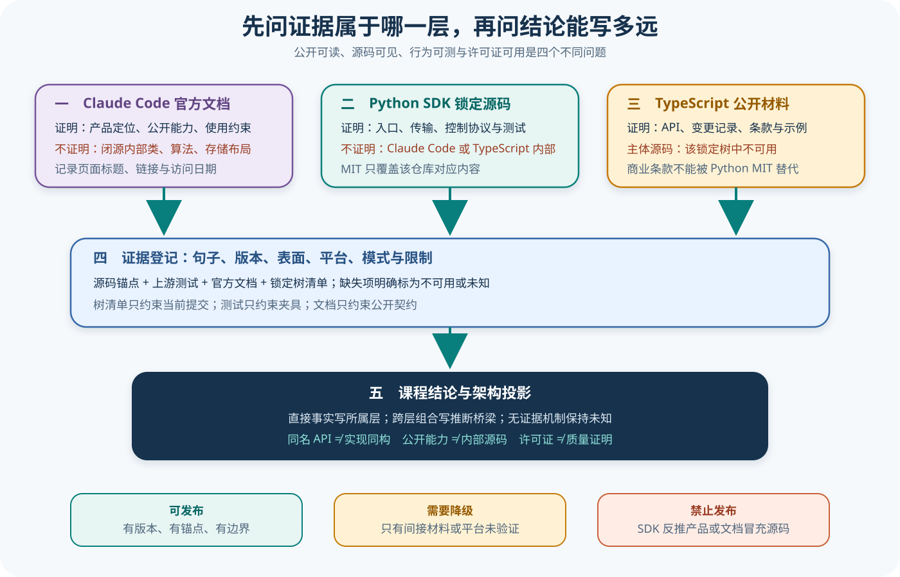

# Claude 产品、SDK 与许可证证据边界

## 读者会得到什么

读完后，你可以给 Claude 相关结论标出准确来源层：官方产品文档、Python SDK 源码、Python 上游测试、TypeScript 公开 API、TypeScript 锁定仓库材料、可复现树清单或课程推断。这个分层用来避免把「SDK 这样连接 CLI」写成「Claude Code 内部一定这样调度」，是可核对分析的最低条件。

官方 Agent SDK 总览说明 SDK 提供 Claude Code 的工具、智能体循环与上下文管理，也明确区分 Agent SDK、终端 CLI、直接 Client SDK 和 Managed Agents。它能证明产品公开定位和能力承诺，不能证明闭源产品内有哪些类、数据库表、队列、缓存或调度算法。

Python SDK 锁定仓库提供完整主体源码和测试。我们可以检查入口怎样选择 Transport、控制请求怎样配对、消息怎样解析、Session Store 怎样材料化和清理。这些是 Python SDK 实现事实；即便文件名包含 `Query` 或 `session`，也不能把对象所有权迁移到 Claude Code 产品内部。

TypeScript SDK 的证据形态不同。锁定 Git 树只有 33 个文件：README、CHANGELOG、LICENSE、工作流、脚本以及 PostgreSQL、Redis、S3 的 Session Store 示例。它没有 SDK Runtime 的主体源码目录和包入口文件，所以课程只能使用官方 API 参考和真实可见材料描述公开契约。缺失结论只约束这个 Commit，不外推 npm 包、私有仓库或未来版本。

证据强弱取决于问题，不取决于厂商名字。

## 核心概念

证据边界先解决「这句话究竟在描述谁」。Claude Code 产品、Agent SDK 的公开契约、Python SDK 实现、TypeScript SDK 公开材料和课程自己的架构推断是五个不同对象。它们可以共同解释一条外部调用链，却不能因为名称相同就共享源码事实。

| 概念 | 含义 | 可以证明 | 不能自动证明 |
| --- | --- | --- | --- |
| 产品契约 | 官方文档承诺的能力、输入输出和使用限制 | 某表面公开支持什么 | 闭源内部用哪些类和算法 |
| 实现证据 | 锁定提交中的真实源码、分支和类型 | 对应 SDK 在该版本怎样工作 | 其他语言 SDK 或 Claude Code 同构 |
| 行为证据 | 在固定版本与环境中记录的可重复观察 | 该实验条件下发生了什么 | 未覆盖平台、配置和生产行为 |
| 阴性证据 | 对完整、锁定搜索空间的缺失检查 | 指定树中没有匹配文件 | 其他包、私有仓库或未来版本也没有 |
| 推断 | 由多条事实连接出的责任模型 | 明示前提下的解释与风险判断 | 上游已经公开确认的内部事实 |
| 许可证证据 | 某个仓库内容的使用与分发条款 | 对应材料适用什么许可文本 | 能力正确、安全或获产品授权 |

### 来源层与对象层

来源层说明证据来自哪里，对象层说明结论指向谁。官方文档并不天然比源码「更强」：如果问题是产品公开支持哪些权限模式，官方文档是直接证据；如果问题是 Python SDK 怎样把回调结果转换成控制响应，源码才是直接证据。先写问题，再选择证据，不能先拿到一个权威页面就让它回答所有问题。

同样，`src/claude_agent_sdk/_internal/query.py` 中的 internal 只描述 Python 包的模块可见性。它没有把类的所有权变成 Claude Code 产品内部。课程允许画「Python Query 通过 Transport 与 CLI 交换帧」，因为两端连接有源码；不允许画「Claude Code 内部复用 Python Query 调度器」，因为连接之后是不透明边界。

### 直接事实、实验观察与推断

直接事实可以定位到文档段落、源码符号或许可证文本；实验观察必须连同版本、平台、输入和输出保存；推断则需要列出桥梁。例如「Python SDK 默认构造 CLI 子进程」与「官方说 Agent SDK 提供 Claude Code 工具」可以推断应用责任图，但不能推断工具注册器位于哪个闭源模块。

阴性证据需要封闭搜索空间。「我用编辑器没找到 TypeScript Runtime」很弱；对锁定 Commit 执行完整树清单，证明 33 个路径中没有主体目录，更可复核。即便如此，结论也只能写成「该提交的主体源码不可用」，因为 npm 分发包和私有实现不在搜索空间内。

## 为什么这样设计

第一，Agent Harness 横跨产品、SDK、CLI、模型服务和本地环境。若不先划对象边界，一个真实的 Python 分支很容易被写成整个产品架构，一个 TypeScript API 名又会被误认为存在同名类。这样的文章看似源码丰富，实际把读者带到无法核对的内部想象。

第二，证据会以不同速度漂移。在线文档可能今天更新，锁定源码仍停在旧提交；实验还受平台和配置影响。把访问日期、Commit 和实验环境分别记录，才能在差异出现时说清是公开契约变化、实现版本差异，还是观察条件变化，而不是让最新页面覆盖全部历史事实。

第三，缺失与未知必须保留。知识库的价值不只是给出答案，也要告诉读者哪些问题当前不能回答。使用 `unknown` 或 `unavailable` 会暂时留下空白，却避免未来读者把推测当成源码；一旦获得新证据，结论可以在不改写旧对象边界的情况下升级。

第四，许可证和技术证据解决不同风险。MIT 文本可能允许使用 Python 仓库代码，但不会证明 API 兼容、运行安全或 Claude Code 开源；商业条款也不会告诉读者控制协议怎样工作。分开审计，才能同时避免技术夸大和材料误用。

这套设计还让读者知道该去哪里继续查证。遇到产品能力问题就回到官方契约，遇到 Python 控制流就沿锁定源码，遇到 TypeScript 内部实现空白就明确列出所需证据。知识库不会用一张总架构图终止追问；它把每个追问送到正确的证据入口。

## 实现思路

这里实现的是一套可放进知识库 CI 的「结论登记器」，与 Claude 产品实现无关。它把一句自然语言结论拆成对象、谓词、条件和证据，再根据证据覆盖范围决定能否发布。该蓝图是课程方法，不是上游 SDK 组件。

1. **把结论缩成原子句。** 一句话只保留一个主体和一个可证伪谓词，例如「Python SDK 默认构造子进程 Transport」，不要同时塞入产品内部调度和 TypeScript 等价性。
2. **标记对象与版本。** 选择 `claude-code-product`、`python-sdk`、`typescript-sdk`、`environment` 或 `course-inference`，并绑定文档访问日、源码 Commit 或实验版本。
3. **登记证据覆盖范围。** 每条来源记录证据类型、真实路径或 URL、锚点、能支持的字段与明确排除项；阴性证据还要记录搜索全集。
4. **执行覆盖判断。** 检查来源对象是否等于结论对象，条件是否包含结论条件，时间范围是否兼容；跨对象只能生成带前提的推断，不能升级成直接事实。
5. **生成发布处置。** `supported` 可以进入正文，`inference` 必须显示桥梁，`partial` 要缩小句子，`unsupported` 或 `unknown` 保留待补证据清单。
6. **独立检查许可证。** 对每个复制、摘录或派生材料绑定所属仓库许可证，不允许从相邻仓库继承条款。

```text
判断(结论, 证据集):
    如果 结论.主体 为空 或 结论.版本 为空:
        返回 partial("先限定对象与版本")
    直接证据 = 过滤(证据集, 对象覆盖结论且条件覆盖结论)
    如果 直接证据 能支持全部谓词:
        返回 supported(直接证据)
    如果 存在跨层事实且桥梁前提已显式登记:
        返回 inference(事实, 桥梁, 限制)
    返回 unsupported(缺失的对象、版本与证据类型)
```

数据记录不宜只保存链接。在线页面需要标题、URL、访问日期和用于判断的段落；源码需要仓库、Commit、路径、行号与摘录哈希；实验需要命令、环境、原始输出和退出状态。CI 可以验证锚点仍存在，却不能自动判断自然语言是否偷换主体，所以仍需要对抗复核。

一条结论更新时，不覆盖旧证据。先新增新版本记录，再比较哪些字段发生变化；若在线契约新增能力而锁定 SDK 尚无对应实现，文章应并列描述，不把「当前公开支持」写成「锁定代码已经实现」。

## 贯穿案例

假设作者准备写下：「Claude 的 Python 与 TypeScript Agent SDK 内部都由同一个 Query 控制器驱动 Claude Code。」这句话读起来顺畅，也符合很多跨语言 SDK 的常见设计，但现有证据不能支持它。下面沿审计流程把它改成可发布结论。

1. **拆解主体。** 原句同时包含 Python SDK 实现、TypeScript SDK 实现和 Claude Code 产品三个主体，还包含「同一个控制器」的内部同构断言。先拆成三个候选句，分别审查。
2. **核对 Python。** 锁定源码能看到公开 `query()` 委托 `InternalClient`，再进入内部 Query 与 Transport。这支持 Python 版本的外部控制路径，但不触及 CLI 后面的闭源实现。
3. **核对 TypeScript。** 锁定树的 README 与 CHANGELOG 证明公开 `query` 表面和版本变化，完整树清单却没有 Runtime 主体源码。此处只能登记公开契约，内部控制器保持未知。
4. **核对产品。** 官方总览说明 Agent SDK 提供 Claude Code 的工具、循环和上下文管理。这支持能力边界，不支持产品内部复用任一 SDK 类。
5. **缩小并发布。** 最终写成「两个 SDK 都公开查询表面；Python 锁定源码可核对其 Transport 与控制路径，TypeScript 锁定仓库的 Runtime 主体源码不可用，因此不能证明二者内部同构。」

```json
{
  "statement":"Python 与 TypeScript SDK 内部使用同一个 Query 控制器",
  "subjects":["python-sdk","typescript-sdk"],
  "required":"两个同版本 Runtime 的实现证据",
  "available":["Python 主体源码","TypeScript README 与 CHANGELOG","TypeScript 完整树清单"],
  "disposition":"unsupported"
}
```

```json
{
  "publishedStatement":"两个 SDK 都公开查询表面；只有 Python 锁定实现可核对控制路径，TypeScript 内部同构未知",
  "facts":["Python query 委托链","TypeScript 公开 query 表面","锁定树缺少 Runtime 主体"],
  "boundary":"不推断 Claude Code 内部类，也不推断其他分发渠道",
  "disposition":"supported-with-explicit-unknown"
}
```

案例还可以加入一次版本变化：若未来 TypeScript 仓库出现主体源码，不应删除旧结论，而应新增提交并重新判断。新证据可能把 `unknown` 升级为 supported，也可能证明两个实现并不同构；证据治理的目标是允许结论被纠正，不是保护原文永远正确。

最后对许可证重复同样的主体检查。Python MIT 只能绑定 Python 仓库材料，TypeScript 的商业条款引用绑定 TypeScript 仓库，Claude Code 服务另有产品条款。即使技术 API 相似，也不能合并许可证对象。

## 真实输入与输出

### 输入

把要判断的句子连同证据来源提交给边界分类器。这里的「分类器」是课程中的审计方法，不是仓库运行时功能。

```json
{"statement":"TypeScript SDK 内部使用与 Python 相同的 Query 控制器","sources":["TypeScript README","Python _internal/query.py"]}
```

### 输出

两个来源都不能证明该句。Python 文件只约束 Python 实现；TypeScript README 只约束公开契约。正确处置是把实现同构标为未知，并给出可验证条件。

```json
{"disposition":"unsupported","known":["两个 SDK 都公开 query 表面"],"unknown":["TypeScript Runtime 内部控制器"],"requiredEvidence":["同版本 TypeScript Runtime 源码或官方明确实现说明"]}
```

同名表面不是同构实现。

## 调用链



Claim: claude.evidence.closed-product-not-inferred-from-sdk

Claim: claude.evidence.typescript-runtime-source-unavailable

1. 先写出最小可证伪句子，标明对象是 Claude Code 产品、Python SDK、TypeScript SDK、外部环境还是 Eval。
2. 若句子描述产品能力或公开 API，就寻找 Anthropic 官方文档，并记录页面标题、HTTPS URL 与访问日期；文档更新后旧结论不能自动保持当前性。
3. 若句子描述 Python 进程、类、分支或清理顺序，就绑定 Python 锁定 Commit、真实路径、行号摘录和上游测试；Mock 条件必须一起保留。
4. 若句子描述 TypeScript 表面，就使用同版本官方 API、README、CHANGELOG 和示例；先运行锁定树清单，避免引用不存在的 Runtime 路径。
5. 若要跨层综合架构，必须明确写出 inference 和限制，使用 D 级；没有证据的内部机制使用 U 或 unknown，不能用熟悉的设计模式补齐。
6. 最后独立核对许可证。每个仓库的条款只约束自己的内容；产品服务、模型 API 和其他组件仍按各自条款处理。

## 源码证据

Python 入口的真实源码证明 `query()` 委托给 `InternalClient`，而不是公开 Claude Code 内部循环：

```source
src/claude_agent_sdk/query.py:118-126
if options is None:
    options = ClaudeAgentOptions()
client = InternalClient()
async for message in client.process_query(...):
    yield message
```

Python LICENSE 明确是 MIT License，并要求在复制或实质部分中保留版权与许可文本。这个文件不包含 TypeScript 仓库，也不包含 Claude Code 产品源码。

```source
claude-agent-sdk-python/LICENSE:1-13
MIT License
...
The above copyright notice and this permission notice shall be included in all copies or substantial portions of the Software.
```

TypeScript 锁定仓库的许可证只有一行，指向 Anthropic 商业条款；不能用 Python MIT 许可证替代它。

```source
claude-agent-sdk-typescript/LICENSE.md:1
© Anthropic PBC. All rights reserved. Use is subject to Anthropic's Commercial Terms of Service.
```

可复现实验 `claude-typescript-tree-inventory` 对锁定提交执行 `git ls-tree -r --name-only`，得到 33 个文件和空的 Runtime 主体目录集合。这个阴性证据比「我没找到源码」更强，因为它绑定完整树和提交；但它仍不证明其他分发渠道没有实现文件。

许可证边界和实现边界必须同时成立。

## 证据分级与可写结论

| 证据 | 可以写 | 不可以写 |
| --- | --- | --- |
| 官方产品文档 | 公开能力、表面差异、使用约束 | 闭源内部类、算法、存储布局 |
| Python 源码 | Python SDK 控制流、类型与资源生命周期 | Claude Code 内部实现、TypeScript 同构 |
| Python 上游测试 | 锁定夹具下的可重复行为 | 线上模型、真实工具或生产部署 |
| TypeScript 官方 API | 类型、参数、返回值和公开语义 | Runtime 进程管理与私有实现 |
| TypeScript 锁定仓库 | README、CHANGELOG、许可证、示例行为 | 不存在的 SDK 主体源码行号 |
| 树清单实验 | 该 Commit 的文件全集与缺失目录 | npm 包、私有仓库和未来版本 |
| 课程推断 | 明示前提的责任图和风险模型 | 伪装成上游原话或实现事实 |

一句结论可以同时引用多个层，但不能借此抹平层级。例如「Python SDK 默认启动 CLI，官方说 SDK 提供 Claude Code 能力」支持一张外部责任图，却仍不支持「CLI 内部复用 Python Query 类」。

## 许可证不是能力证明

MIT 允许在满足保留通知等条件下使用和分发 Python 仓库代码，但不证明代码安全、完整、适合生产，也不证明 Anthropic 为本课程背书。许可证解决法律许可的一部分，不解决实现真实性和运行质量。

TypeScript 仓库的商业条款引用也不能被改写成开源许可证。公开可读取不等于允许任意再分发；本知识库只记录元数据、分析、短摘和路径，不复制上游主体内容。

官方总览说明具体组件可能由各自 LICENSE 覆盖。这正是为什么要逐仓记录：统一的产品条款与组件级许可证可以并存，不能用其中之一消灭另一个。

条款决定可做什么，证据决定能说什么。

## 失败与限制

第一，公开 API 可能比锁定仓库更新。官方文档访问日期是 2026-08-24，而两个仓库绑定各自提交；出现字段差异时必须把「当前文档」和「锁定实现」并列，不用一个覆盖另一个。

第二，目录缺失是阴性证据。树清单能证明该提交没有匹配文件，却不能证明代码从未存在、没有发布在包中或没有私有实现。课程使用 `unavailable`，不使用「TypeScript SDK 没有实现」。

第三，上游命名可能引导错误归属。Python `_internal` 只表示该 Python 包内部模块，不表示 Claude Code 内部；`Session Store` 示例只证明适配器契约可映射到某类存储，不证明产品实时状态就在该 Store。

第四，许可证解释不是法律意见。本课程核对文件内容和再分发策略，只用于仓库治理；涉及商业集成、品牌、终端用户或二次分发时应由适格人员审阅最新条款。

第五，产品行为观察不能代替源码。一次 CLI 输出、界面截图或会话经验可以形成实验 Artifact，但只能约束观察到的版本、平台与配置，不能自动揭示内部算法。

边界缺失时，结论应缩小，而不是证据被放大。

## 验证方法

运行来源门禁确认两个 Checkout 正好位于锁定 Commit；分别读取 `LICENSE` 与 `LICENSE.md`，计算文本哈希并保留仓库归属。再对 TypeScript 锁定树执行清单命令，核对 33 个路径和 Session Store 示例根目录，搜索 `src`、`package.json` 与包入口候选是否存在。

对每条 Claim 运行锚点验证：源码摘录必须出现在声明行号内，官方文档必须有访问日期，实验 ID 必须指向真实记录。任何 U 级结论不得伪造源码证据，D 级结论必须写明推断桥梁。

做一次反向归属审计：把文章中的所有类名和文件名列出，确认它们只出现在所属 SDK 框；把所有「内部」「默认」「同样」「完整」等词逐句检查，要求版本、表面和条件。

最后检查公开树不包含上游主体复制、绝对路径、凭据或私有会话。通过这些门禁只证明证据治理自洽，不证明产品安全、生产就绪或课程结论永不漂移。

能复核，才可发布。

## 自检

### 问题 1

官方说 Agent SDK 提供 Claude Code 的智能体循环，为什么仍不能画出 Claude Code 内部类？

**答案：** 官方说明的是能力和产品契约，没有公开内部类与源码；具体内部结构仍是未知。

### 问题 2

TypeScript 锁定树没有 Runtime 主体源码，最准确的表述是什么？

**答案：** 该 Commit 的 Runtime 主体源码不可用；不能扩大为 TypeScript SDK 没有实现或其他分发渠道也没有源码。

### 问题 3

Python MIT License 能否覆盖 TypeScript 仓库？

**答案：** 不能。两个仓库分别提供许可证文件，MIT 只覆盖 Python 仓库对应内容，TypeScript 仓库遵循自己的条款。

### 问题 4

上游单元测试通过后能否把结论升级为生产验证？

**答案：** 不能。测试只约束锁定夹具和 Mock 条件；线上模型、真实工具、平台与部署仍需独立证据。
