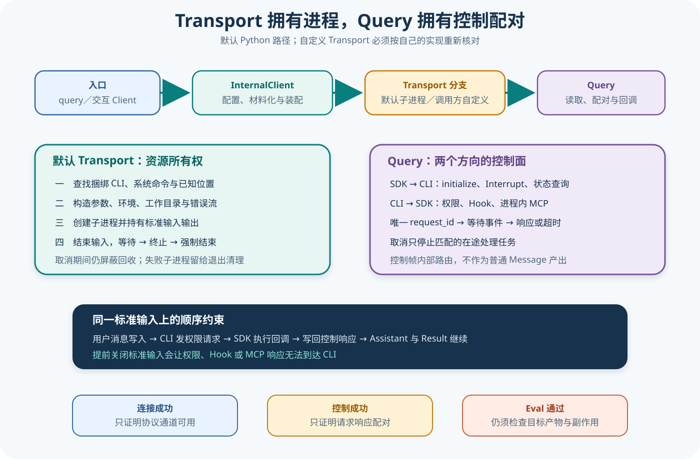

# Claude Python 入口、Transport 与控制协议

## 读者会得到什么

这篇沿着 Python SDK 中真实可见的主链，解释 `query()`、`ClaudeSDKClient`、`InternalClient`、`SubprocessCLITransport` 与 `Query` 各自拥有哪部分生命周期。核心结论是：Transport 不只是发送 Prompt 的薄层，它拥有 CLI 进程、标准流、环境、缓冲与关闭升级；Query 也不只是消息解析器，它同时维护 SDK 发起和 CLI 发起的控制请求。

`query()` 适合一次性或单向流式交互，连接管理由 SDK 完成；`ClaudeSDKClient` 提供可复用连接、后续消息、Interrupt 和更多交互方法。两者共享许多内部组件，却不共享完全相同的调用方责任。后续课程会细分消息与 Session；本文只回答从入口到协议通道怎样建立和关闭。

默认 Transport 会启动 Claude Code CLI 子进程。它优先使用包内捆绑 CLI，再搜索可执行路径和已知安装位置；显式 `cli_path` 则直接进入所给路径的验证和启动流程。这个选择影响 CLI 版本、平台兼容和关闭责任，必须写进复现实验。

控制协议是双向的。SDK 为 initialize、Interrupt 等操作生成 `control_request` 并等待匹配响应；CLI 也会为权限、Hook 和进程内 MCP 发出 `control_request`，SDK 执行回调后写回 `control_response`。只读取普通 Assistant 消息而忽略控制帧会导致运行停住。

一条标准输入，承载两个方向的等待关系。

## 真实输入与输出

### 输入

下面是 SDK 在 initialize 之后写入默认 Transport 的用户消息。真实运行还会在它之前出现带唯一 `request_id` 的初始化控制请求。

```json
{"type":"user","session_id":"","message":{"role":"user","content":"把结果写入报告"},"parent_tool_use_id":null}
```

### 输出

当 CLI 需要应用判断写文件权限时，它向 SDK 发出控制请求；上游测试用可编程 Transport 真实验证了 SDK 回写成功响应后，Assistant 与 Result 才继续出现。

```json
{"type":"control_response","response":{"subtype":"success","request_id":"perm_1","response":{"behavior":"allow","updatedInput":{"file_path":"/tmp/x","content":"hi"}}}}
```

测试中的路径和内容是夹具，不是生产授权建议。真正的权限回调必须检查工具名、输入、上下文与策略，不能固定全放行。

## 调用链



Claim: claude.python.transport-owns-cli-process

Claim: claude.python.control-protocol-is-bidirectional

1. `query()` 创建 `InternalClient`；`ClaudeSDKClient.connect()` 则在对象上保存 Transport 与 Query，以便后续多次发送和中断。
2. 默认路径构造 `SubprocessCLITransport`。若调用方未给 `cli_path`，连接阶段在线程中查找捆绑 CLI、系统命令和已知安装位置；构造对象本身不提前做文件系统搜索。
3. Transport 构造 `stream-json` 输入输出命令，合并受控环境、工作目录、stderr 目标和选项，再通过 AnyIO 创建子进程；标准输入、输出和错误流分别包装。
4. `InternalClient` 构造 Query，先启动 `_read_messages()`，再发 initialize。读取任务必须先运行，否则 SDK 会写出请求却无人接收对应响应。
5. Query 为 SDK 发起的控制请求生成唯一标识，登记 Event，写入标准输入并带超时等待；读取循环按标识填充结果并唤醒等待者。
6. CLI 发起的权限、Hook 或 MCP 控制请求走反方向：读取循环派生处理任务，回调完成后把成功或错误响应写回同一 Transport。取消帧会取消对应在途处理任务，而不是终止全部会话。
7. 普通消息进入内存流供应用消费；控制响应、控制请求与 Transcript Mirror 被内部路由，不作为普通 SDK Message 直接产出。
8. 关闭时 Query 先取消子任务并让 Transport 结束输入；Transport 在屏蔽取消的范围内等待、终止或杀死仍存活子进程。成功回收后从活动子进程集合移除；无法回收则保留给进程退出清理器。

## 源码证据

默认 Transport 的归属点位于 `InternalClient`，自定义 Transport 是显式分支：

```source
src/claude_agent_sdk/_internal/client.py:88-98
if transport is not None:
    chosen_transport = transport
else:
    chosen_transport = SubprocessCLITransport(prompt=prompt, options=configured_options)
await chosen_transport.connect()
```

Transport 在连接阶段创建子进程并保存三条标准流；这些资源属于 Transport，而不是入口函数的局部变量：

```source
src/claude_agent_sdk/_internal/transport/subprocess_cli.py:787-877
async def connect(self) -> None:
    ...
    self._process = await anyio.open_process(...)
    _ACTIVE_CHILDREN.add(self._process)
    self._stdout_stream = TextReceiveStream(self._process.stdout)
    self._stdin_stream = TextSendStream(self._process.stdin)
```

Query 的读取循环同时处理两个方向的控制帧。CLI 发来的请求会派生处理任务，SDK 发出的请求则由匹配 `request_id` 的响应唤醒：

```source
src/claude_agent_sdk/_internal/query.py:308-338,598-643
if msg_type == "control_response":
    event = self.pending_control_responses[request_id]
    event.set()
elif msg_type == "control_request":
    self._spawn_control_request_handler(request)
...
await self.transport.write(json.dumps(control_request) + "\n")
await event.wait()
```

上游权限测试建立了一个顺序约束：用户消息先写，CLI 才发权限请求；SDK 写回权限响应后，Transport 才产生 Assistant 和 Result。测试最终断言回调收到 `Write`、只有一个成功控制响应、普通消息按预期出现并最终结束输入。

```source
tests/test_query.py:1051-1065
assert state["callback_calls"] == ["Write"]
assert len(responses) == 1
assert responses[0]["response"]["response"]["behavior"] == "allow"
assert [type(m) for m in messages] == [AssistantMessage, ResultMessage]
assert state["ended"] is True
```

取消路径测试使用临时假 CLI 启动真实子进程，在外层取消已经生效时调用 `close()`，仍断言子进程退出且不再留在活动集合。它给进程所有权 Claim 提供 B 级行为证据，但只在测试平台和夹具范围内成立。

## Transport 的真实责任

Transport 负责把 `ClaudeAgentOptions` 投影成 CLI 参数，其中包括输出格式、输入格式、权限模式、模型、系统 Prompt、MCP 配置、Session 参数和额外目录。它还负责拒绝不安全或平台不兼容的可执行形式，例如 Windows 批处理脚本路径。

环境不是原样继承。源码从系统环境、调用方 `options.env` 和 SDK 默认值组合出子进程环境，并注入入口标识；调用方显式值可能覆盖部分默认项。复现实验应保存允许公开的有效键集合和 CLI 版本，不能保存密钥值。

stderr 可以继承、管道化或交给回调。错误流是否被消费会影响诊断和缓冲行为；「SDK 没有抛异常」不等于 stderr 为空。子进程退出码、最后一条错误 Result 和 JSON 解码错误也有不同映射，后续错误课程再展开。

读取端还要面对单行缓冲上限。超长 JSON、无换行输出、破损 UTF-8 或进程提前退出都可能中断协议；这些属于 Transport 故障，不应被重试成模型质量失败。

## 控制协议的配对规则

SDK 发起请求时，唯一 `request_id` 同时存在于写出的请求、待响应 Event 和结果表。收到错误 subtype 时，结果表保存异常；超时会清除两个待定表项。迟到响应不会重新创建已删除等待者。

CLI 发起请求时，SDK 按 subtype 分流到 `can_use_tool`、Hook 或 MCP。成功与失败都要保留原请求标识；`control_cancel_request` 只取消匹配的处理任务，避免一个慢回调拖住关闭。

控制帧不属于普通消息流。应用的 `async for message` 看不到 initialize 请求或权限响应；如果评测需要审计权限链，就必须在 Adapter 中额外记录回调输入、决定、耗时和匿名化错误，而不是期待 Result 还原全部控制轨迹。

控制成功只说明协议配对，不说明授权正确。

## 失败与限制

第一，捆绑 CLI 优先级可能让「系统 claude 版本」与真实运行版本不同。只执行系统命令的版本检查不足以复现 SDK；应记录 Transport 最终解析出的可执行文件版本，但公开 Artifact 不保存本机绝对路径。

第二，自定义 Transport 不归 `SubprocessCLITransport` 管理。它可以没有子进程、标准流或相同关闭升级；进程所有权 Claim 明确限定默认 Transport。

第三，初始化和普通运行使用不同超时语义。initialize 可能等待 MCP Server 启动，普通控制请求有自己的超时；把所有超时都分类成模型超时会误导恢复策略。

第四，外层取消不能省略资源回收。源码使用屏蔽取消的关闭区间，是因为取消状态会让普通 await 立即退出；测试覆盖了 POSIX 假 CLI，不代表所有 Windows 进程树和外部工具后代都已验证。

第五，允许回调的成功响应不等于工具执行成功。CLI 收到决定后还要继续自己的权限、工具和执行流程；SDK 只证明决定已交付。

资源归属必须跟着实际实现分支走。

## 验证方法

静态检查默认和自定义 Transport 分支，核对 CLI 查找顺序、命令参数、环境合并、标准流、活动子进程集合、缓冲上限和关闭升级。每条摘录必须绑定锁定 Commit 与行号。

运行不需要真实模型的上游测试：`test_transport.py` 核对命令构造与连接，`test_query.py` 核对双向控制顺序，`test_close_cancellation.py` 用假 CLI 核对取消下的进程回收。Windows 专属行为和 POSIX 专属行为必须分开报告。

注入失败：CLI 不存在、工作目录不存在、初始化响应丢失、控制响应迟到、回调抛异常、超长 JSON、stderr 大量输出、用户提前停止迭代和外层取消。记录哪个对象持有资源、哪个 finally 执行、是否仍有活动子进程以及错误怎样投影。

最后把协议证据接入 Eval Artifact：保存实际表面、CLI 版本、匿名化有效配置、消息类型序列、控制请求配对、退出状态和目标文件差异。基础设施故障与产品任务失败分开计数，Attempt 不改变 Trial 分母。

先证明通道收敛，再分析任务质量。

## 自检

### 问题 1

为什么默认 Transport 而不是 `query()` 拥有 CLI 子进程？

**答案：** Transport 创建并保存进程与标准流，也执行关闭和回收；`query()` 只创建 InternalClient 并迭代消息。

### 问题 2

控制协议为什么叫双向？

**答案：** SDK 会向 CLI 发 initialize 或 Interrupt 请求，CLI 也会向 SDK 发权限、Hook 和 MCP 请求；双方都要按标识返回响应。

### 问题 3

收到 Result 后是否总能立即关闭标准输入？

**答案：** 不能。若仍有后台任务，后续 Hook 或 MCP 控制响应还需写回；生命周期课程会进一步区分回合 Result 与运行结束。

### 问题 4

权限控制响应为 success 是否证明文件已正确写入？

**答案：** 不证明。它只证明决定已交付 CLI；工具执行、产物正确性和独立 Eval 仍是后续层。
