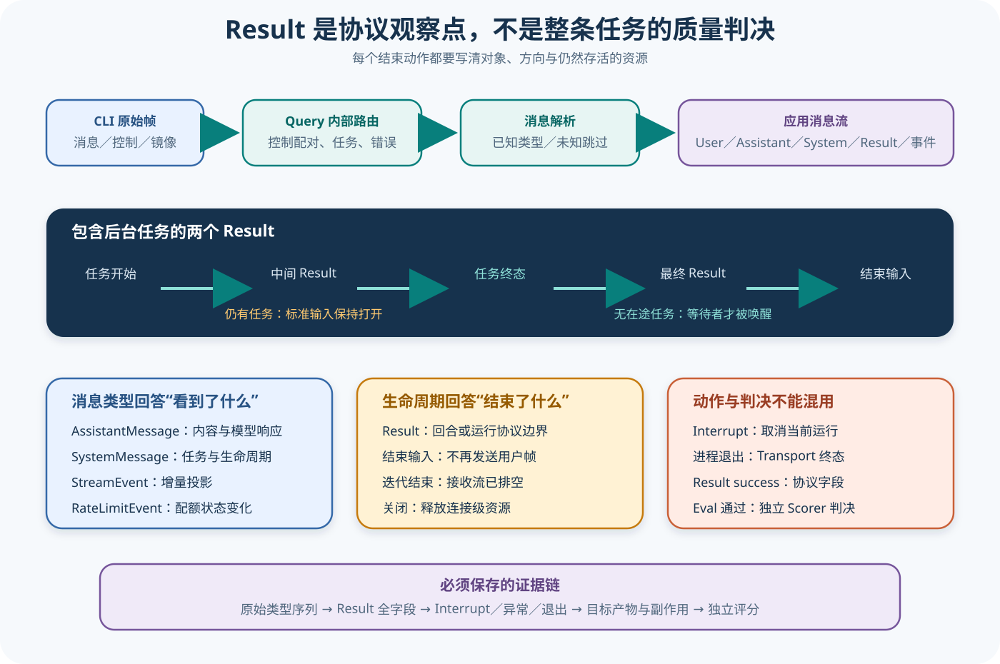

# Claude 消息流与生命周期

## 读者会得到什么

读完后，你能区分七个经常被误写成同一件事的边界：一条 Assistant 响应结束、一个 Result 帧出现、一次输入流结束、SDK 消息迭代器结束、CLI 进程退出、运行被 Interrupt 取消，以及独立 Eval 判定通过。它们可能按相近顺序出现，却由不同对象拥有，也有不同失败语义。

Python SDK 把 CLI 的 NDJSON 帧解析为 `UserMessage`、`AssistantMessage`、`SystemMessage`、`ResultMessage`、`StreamEvent`、`RateLimitEvent` 和 `ConversationResetMessage`。部分 System subtype 会进一步变成任务、镜像错误或 Hook 生命周期子类；这仍是 SDK 的协议投影，不是 Claude Code 内部对象图。

`ResultMessage` 携带 subtype、耗时、错误标志、轮数、Session、成本、使用量、权限拒绝、延迟工具调用、错误列表和 terminal reason。字段丰富不等于语义无限：它说明 CLI 为一个回合或运行边界发布了 Result，不能单独证明用户目标正确。

更关键的是，一个长运行可以出现多个 Result。锁定实现追踪后台任务；有任务在途时，Result 只结束当前回合，标准输入保持打开，等任务终态唤醒父流程后再出现一个没有在途任务的 Result。把第一个 Result 当整次运行结束会静默破坏后续 Hook 和进程内 MCP。

协议终态是观察点，不是质量判决。

## 核心概念

消息类型回答「收到了什么」，生命周期状态回答「哪个对象结束了什么」。二者必须一起读：Result 是一种消息，也可能触发输入关闭条件；Interrupt 是控制动作，不一定关闭连接；进程退出是 Transport 事实，不等于独立评测已经给出结论。

| 概念 | 所属层 | 表示什么 | 不表示什么 |
| --- | --- | --- | --- |
| Assistant stop reason | 模型响应 | 一次生成停止的原因 | 工具、副作用或整个运行结束 |
| `ResultMessage` | CLI 协议投影 | 一个回合或运行终态报告 | 用户目标已经正确完成 |
| 在途任务集合 | Query 生命周期 | 后台任务是否仍可能注入后续回合 | 操作系统进程一定仍存活 |
| `end_input()` | SDK 到 CLI 的方向 | 不再发送新用户帧 | 输出已经排空或连接已销毁 |
| 消息迭代结束 | SDK 接收表面 | 缓冲排空并关闭或发生异常 | CLI 必然正常退出 |
| Interrupt | 控制面 | 请求中止当前运行 | Disconnect、回滚或资源释放 |
| Eval 结果 | 独立评分层 | Artifact 是否满足目标与约束 | 上游 Result subtype 的别名 |

### 完整消息与增量消息

`StreamEvent` 适合实时界面，它携带 API 增量；`AssistantMessage` 则是 SDK 产出的完整消息投影。若消费者把每个增量拼接后又追加完整消息，同一文本会重复统计。正确做法是先选目标表面：实时延迟分析使用增量，最终内容和工具块分析使用完整消息；需要两者时用消息或内容块标识关联，而不是相加。

工具请求通常位于 Assistant 内容块中，但出现 ToolUse 只证明模型提出动作。工具是否执行、是否被拒绝、结果怎样，需要后续工具结果、权限轨迹和副作用证据。按 role 统计也不够，因为 UserMessage 可能承载工具结果、重放或任务注入，并非每条都来自人类。

### 回合终态与运行终态

没有后台任务时，一个 Result 往往同时是当前响应的终态和输入关闭触发点；有后台任务时，第一个 Result 只结束当前回合。Query 追踪任务开始和终止事件，集合清空后的 Result 才唤醒等待输入结束的协程。这是为什么「看到 Result 就 close stdin」在简单夹具里可行，却会破坏子任务场景。

连接级结束更晚。`ClaudeSDKClient` 可以在一个 Result 后继续接收新输入；只有 Disconnect / close 才开始取消内部任务、关闭 Transport 和接收流。独立 Eval 则在选定完整 Artifact 后运行，甚至可以晚于进程退出。

## 为什么这样设计

第一，编码 Agent 不再是单次请求响应。后台 Agent、延迟工具和 Hook 可以跨过一个模型回合继续产生事件；把回合与运行分开，主循环才能等待真正的任务终态，而不关闭仍需回写控制响应的通道。

第二，实时界面与可靠持久化需要不同消息投影。增量事件降低首字延迟，完整消息便于恢复和评分。保留两者而不强行合并，可以让消费者按用途选择，也要求它们显式处理去重与缺失。

第三，中止当前工作与释放整个连接是不同用户意图。Interrupt 允许停止一次失控运行后继续使用同一 Session；Disconnect 用于最终清理。如果一个取消按钮直接杀死连接，应用会丢失终态、缓冲消息和可恢复上下文。

第四，协议成功与产品成功必须隔离。Result 能说明 CLI 如何结束、消耗了多少轮、是否报告错误，却不知道用户要求的文件是否正确。独立 Scorer 消费产物和副作用，避免 SDK 改一个 subtype 就改变评测标签。

这种多维状态看起来比单个完成标志复杂，却把复杂度放在唯一能够解释它的位置。调用方可以只订阅自己需要的投影；恢复器、界面和评测器则共享同一事件事实，不必根据彼此的提示文本猜测运行到底停在何处。

边界清楚以后，失败注入也能逐层命中，而不必靠杀死整个进程制造所有异常。

## 实现思路

教学实现可以把消息归一化器与生命周期状态机分开。归一化器只负责从原始帧得到类型化事件；状态机消费事件并更新回合、任务、输入、连接和评测五个维度。该设计用于帮助读者实现兼容消费者，不声称是 Claude Code 内部结构。

1. **确定目标消息表面。** 为实时 UI、最终 Transcript 和 Eval 分别声明消费哪些类型、怎样关联增量与完整消息、未知类型怎样保留计数。
2. **维护独立状态维度。** 至少记录连接状态、输入方向、当前回合、在途任务集合、最近 Result 和接收流状态；不要压成一个 `finished`。
3. **按事件更新状态。** task_started 加入集合，任务终态移除；Result 总是产出给应用，只有集合为空时才满足最终 Result 条件；输出 EOF 与 Result 分别处理。
4. **分开 Interrupt 与 close。** Interrupt 发送控制请求后继续读取直到终态；close 阻止新输入、取消内部任务、排空或关闭缓冲，再释放 Transport。
5. **构造 Artifact。** 保存原始类型序列、归一化消息、去重后的最终内容、控制动作、所有 Result、异常与副作用，再交给独立 Scorer。

```text
状态 = {连接: ready, 输入: open, 回合: running, 在途任务: {}, 最近Result: null}

处理(event):
    如果 event 是 task_started: 在途任务.add(event.task_id)
    如果 event 是 task_terminal: 在途任务.remove(event.task_id)
    如果 event 是 result:
        产出给应用(event)
        最近Result = event
        回合 = terminal
        如果 在途任务为空: final_result_event.set()
    如果 event 是 output_eof:
        接收流标记结束，并报告没有终态的异常情况

结束输入():
    await final_result_event
    transport.end_input()
```

未知顶层类型不应静默等于「无事发生」。兼容消费者可以跳过解析，但要记录类型名、CLI 与 SDK 版本及原始帧哈希；若未知事件可能影响任务集合或权限，运行状态应降级为不完整，而不是继续给出完整性结论。

错误去重也需要相关性。若先收到 `is_error=true` 的 Result，随后进程非零退出，Artifact 保留两份原始事实，但故障分析只建立一个根事件，并说明 ProcessError 是否被更具体的 ResultError 取代。这样统计不会把一个失败算两次。

## 贯穿案例

用户要求「让后台 Agent 检查测试失败并返回结论」。主 Agent 启动子任务，当前回合先返回一个 Result；子任务完成后注入通知，模型生成总结并返回第二个 Result。期间用户点击一次 Interrupt，但不关闭客户端。这个案例能检验所有容易混淆的结束边界。

1. **启动回合。** Assistant 产生任务调用，System `task_started` 把 `task-1` 加入在途集合。此时一次模型响应可以结束，但后台任务仍运行。
2. **收到中间 Result。** SDK 向应用产出 Result r1；状态机把当前回合标成 terminal，却因任务集合非空而保持输入开启。Eval 也不能开始最终评分。
3. **处理任务终态。** `task_notification(completed)` 移除 `task-1`，任务结果触发后续注入回合。此时集合为空并不自动等于运行结束，还要等待对应 Result。
4. **收到最终 Result。** 总结 Assistant 后出现 r2，集合为空，final result 事件触发，输入生产者可以结束；输出仍需排空。
5. **中止下一轮而不断开。** 用户提交第二个目标后调用 Interrupt。SDK接收终止 Result，连接保持可用；最终 Disconnect 才释放 Query、Transport 与接收流。

```json
{"event":"result","uuid":"r1","inflightTasks":["task-1"],"stdin":"open","connection":"ready"}
```

```json
{"event":"result","uuid":"r2","inflightTasks":[],"stdin":"closing","connection":"ready"}
```

```json
{
  "artifact":{
    "resultIds":["r1","r2","r3-interrupted"],
    "inputEndedAfter":"r2",
    "messageStreamDrained":true,
    "processExitedAfterDisconnect":true,
    "eval":"由产物与约束独立计算"
  }
}
```

若实现错误地在 r1 后关闭输入，子任务通知仍可能出现在输出，却无法触发需要回写的后续控制；测试应明确断言 r1 后 stdin 仍开。若 Interrupt 后立即杀进程，应用可能看不到 r3 的 terminal reason；测试应先接收终态，再独立验证 Disconnect 回收资源。

最后把 r2 的 subtype 改成 success，但让目标报告文件缺失。生命周期仍可判定完整，独立 Eval 必须失败。这个反例证明状态机负责「是否收敛」，Scorer 负责「结果是否正确」。

## 真实输入与输出

### 输入

下面是包含后台任务的消息序列抽象。`task_started` 先把任务加入在途集合，第一个 Result 到达时任务仍未结束。

```json
[{"type":"assistant"},{"type":"system","subtype":"task_started","task_id":"task-1","task_type":"local_agent"},{"type":"result","uuid":"uuid-r1"},{"type":"system","subtype":"task_notification","task_id":"task-1","status":"completed"},{"type":"result","uuid":"uuid-r2"}]
```

### 输出

SDK 仍向应用产出两个 `ResultMessage`，但只在第二个 Result 前任务集合已清空，因此等待协程才结束标准输入。上游测试直接断言中间 Result 后仍打开、最终 Result 后关闭。

```json
{"resultCount":2,"stdinAfterFirst":"open","stdinAfterSecond":"closed","evaluation":"not-run"}
```

这个夹具 Mock 了 Transport 与 CLI，不证明真实子智能体或工具完成；它证明 SDK 的生命周期判定和消息顺序。

## 调用链



Claim: claude.messages.result-is-protocol-terminal

Claim: claude.lifecycle.close-and-cancel-are-distinct

1. Transport 从 CLI 标准输出读取原始字典；Query 先截获 control、Transcript Mirror 和任务生命周期帧需要的内部状态。
2. 普通帧进入内存消息流；`InternalClient` 调用 `parse_message()`，把已知类型转换成 SDK dataclass。缺少必填字段会抛 `MessageParseError`，未知顶层类型为向前兼容返回 `None` 并被跳过。
3. Assistant 内容可以是完整块，也可以通过 `StreamEvent` 表示部分更新；消费方不能同时把两者重复计入最终文本。
4. Result 到达时，Query 先刷新待写 Session Mirror，再检查在途任务。仍有任务就只产出该 Result，不触发关闭输入事件；没有任务才唤醒等待者。
5. 输入流生产者结束后，SDK 根据双向控制需要决定立即 `end_input()`，还是等待无在途任务的 Result 再结束标准输入。结束输入只是告诉 CLI 不再有新的用户帧。
6. CLI 标准输出结束或读取失败时，读取任务刷新 Mirror、解除 Result 等待并关闭发送端；接收端先排空缓冲，再让 SDK 迭代器结束或抛出类型化异常。
7. `ClaudeSDKClient.interrupt()` 发送控制请求，要求终止当前运行；连接仍可存在。`disconnect()` / `Query.close()` 则取消内部任务、关闭 MCP Bridge 与 Transport，并由消费方关闭接收流。
8. Eval Adapter 将选定 Target 表面的完整消息、终态、异常、产物和副作用组成 Artifact；Scorer 独立判定，不复用 Result subtype 作为标签。

## 源码证据

公开 Message 联合类型明确列出七个顶层家族；任务和 Hook 消息通过 SystemMessage 子类保持兼容：

```source
src/claude_agent_sdk/types.py:1477-1485
Message = (
    UserMessage | AssistantMessage | SystemMessage | ResultMessage
    | StreamEvent | RateLimitEvent | ConversationResetMessage
)
```

Result 自身同时允许 `is_error`、错误列表和终止原因，说明 subtype 不能被简化为布尔任务成功：

```source
src/claude_agent_sdk/types.py:1319-1350
class ResultMessage:
    subtype: str
    is_error: bool
    permission_denials: list[Any] | None = None
    errors: list[str] | None = None
    terminal_reason: str | None = None
```

Query 对 Result 的处理先检查后台任务。只有在途集合为空时才设置等待事件；无论哪种情况，该原始 Result 都会进入普通消息流。

```source
src/claude_agent_sdk/_internal/query.py:362-399
if msg_type == "result":
    ...
    if self._inflight_tasks:
        ...
    else:
        self._first_result_event.set()
...
await self._message_send.send(message)
```

上游测试安排两个 Result，并验证第一个保持输入打开、任务终态后的第二个关闭输入。它是 B 级行为证据，但 Transport、MCP Server 和消息源仍是测试对象。

```source
tests/test_query.py:503-566
assert open_after_intermediate_result is True
assert closed_after_final_result is True
results = [m for m in messages if isinstance(m, ResultMessage)]
assert len(results) == 2
```

Interrupt 与关闭是两条不同代码路径。前者发送 `subtype: interrupt` 控制请求；后者把 Query 标为关闭，取消子任务，停止 MCP Bridge、读取任务和 Transport。上游 Streaming Client 测试直接检查 Interrupt 控制帧。

## 消息家族怎样使用

`UserMessage` 不只表示人类新输入，也可能是 CLI 重放、任务通知或工具结果投影；`origin` 和 `parent_tool_use_id` 帮助归属，但缺失 origin 不等于人工输入。评测若只按 role 聚合，会把注入回合混入用户 Trial。

`AssistantMessage` 保存内容块、模型、使用量、stop reason、错误和 Session。一个 AssistantMessage 可以包含 Text、Thinking、ToolUse 等块；工具请求出现不意味着工具已执行，工具结果还要从后续 UserMessage 或相关事件确认。

`SystemMessage` 是开放 subtype 容器。锁定解析器为任务开始、进度、通知、更新、镜像错误和 Hook 事件构造更具体子类；未知 System subtype仍可保留为通用消息。未知顶层 type 则被跳过，这是兼容策略，也意味着旧 SDK 可能丢失新类型的可见性。

`StreamEvent` 携带原始 API 增量事件，适合实时界面；最终 AssistantMessage 更适合一次性产物。两者来自不同投影，不能把增量和最终完整内容直接拼接后统计 Token 或文本重复率。

`RateLimitEvent` 表达配额状态变化，`rejected` 适合触发退避；它不是 API 调用错误 Result，也不是模型拒答。`ConversationResetMessage` 表示连接内会话被替换，后续累计成本和 Session 归属需要重新建立。

类型帮助消费，不能替代状态机。

## 六种结束必须分开

Assistant 的 stop reason结束一次模型响应；Result 结束一个 CLI 协议回合或报告运行终态；`end_input()` 结束 SDK 到 CLI 的用户输入方向；消息迭代器结束表示接收流排空或关闭；进程退出由 Transport 管理；Eval 通过属于外部 Scorer。

Interrupt 是控制动作，不是资源销毁。它可能让 Result 的 `terminal_reason` 变成 `aborted_streaming` 或 `aborted_tools`，应用仍应继续接收该终态，并可在同一 Client 连接上发起后续操作。Disconnect 才释放连接级资源。

错误也可能跨边界重复出现。CLI 先发送 `is_error: true` 的 Result，随后按 shell 语义非零退出时，Query 会用包含 Result 数据的 `ResultError` 取代信息贫乏的 `ProcessError`。Artifact 应保留原始 Result 和最终异常归因，避免把同一故障计数两次。

关闭接收流也有所有权：Query.close 留出缓冲供消费者排空，消费完成后 `close_receive_stream()` 才关闭接收端。提前关闭会丢缓冲消息，永不关闭则可能产生资源警告。

## 失败与限制

第一，未知顶层消息被跳过是向前兼容，而不是「消息无关」。新 CLI 配旧 SDK 时，关键新事件可能不可见；版本漂移检查应报告未知类型数量。

第二，一个 Result 不一定结束运行。后台任务、注入回合和多消息输入都可能改变边界；源码还明确记录多消息 AsyncIterable 在一发事件上的已知限制，不能宣称任意长输入都完美保持控制通道。

第三，Result subtype success 与 `is_error` 可能组合，API error status 也可能存在。消费方应按完整字段和版本解释，不能只比较 subtype 字符串。

第四，Interrupt 的响应成功只说明 CLI 接受控制请求。真实工具进程是否停止、已有副作用是否回滚、Session 是否仍一致，需要额外 Artifact；关闭连接更不等于回滚文件。

第五，上游解析测试和生命周期测试没有验证线上模型。它们证明锁定消息形状、错误处理与 Mock 顺序，不证明任务质量、费用准确性或生产可靠性。

结束了什么，必须写出主语。

## 验证方法

先对 `types.py` 和 `message_parser.py` 建立类型—必填字段—缺失行为表，核对未知 System subtype 与未知顶层 type 的不同处置。再验证 Result 的 `is_error`、errors、permission denials、deferred tool use、API error status 和 terminal reason 是否全部保留。

运行上游消息解析测试和 Result/后台任务测试，记录两个 Result、在途集合、输入关闭时点和缓冲排空。分别注入未知类型、缺字段、错误 Result 后非零退出、任务只发 terminal update、不发 notification 等情况。

对交互 Client 做状态实验：连接、提交目标、在工具运行时 Interrupt、继续接收直到 Result、再提交一个简单目标，最后 Disconnect。记录每一步连接状态、控制响应、Result terminal reason、子进程与文件差异。

Eval 以固定 Trial 为单位：Artifact 保存原始消息类型序列、去重后的最终内容、控制动作、Result 全字段、异常、退出状态与产物哈希。Scorer 只检查目标与安全约束；生命周期字段用于解释，不直接充当分数。

不要用一个 success 覆盖整条轨迹。

## 自检

### 问题 1

为什么一次 `query()` 可以产出两个 ResultMessage？

**答案：** 后台任务可跨越回合边界；第一个 Result 结束当前回合但任务仍在途，任务终态触发后续回合，再产生最终 Result。

### 问题 2

未知顶层消息会怎样处理？

**答案：** 解析器为向前兼容返回 None，InternalClient 跳过它；这避免旧 SDK 崩溃，也可能降低新事件可见性。

### 问题 3

Interrupt 与 Disconnect 有什么区别？

**答案：** Interrupt 是连接内控制请求，用于终止当前运行；Disconnect 关闭 Query、MCP Bridge、Transport 和接收流并清理连接资源。

### 问题 4

Result subtype success 能否直接作为 Eval 标签？

**答案：** 不能。它是协议字段，必须结合 is_error、terminal reason、异常、目标产物和副作用，由独立 Scorer 判定。
