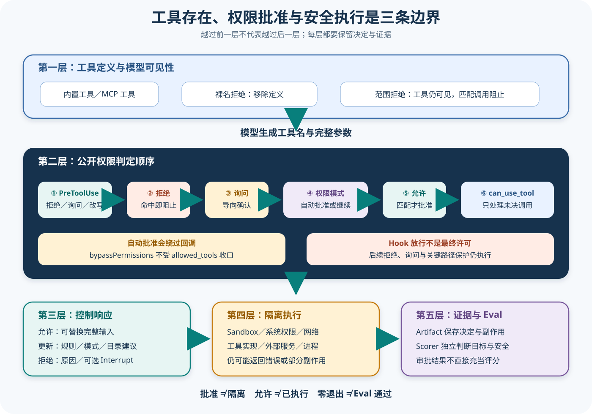

# Claude 工具、权限与 Hook

## 读者会得到什么

读完后，你能把工具定义是否进入模型上下文、声明式允许或拒绝规则、权限模式、`can_use_tool` 回调、`PreToolUse` Hook、参数改写、最终工具执行和操作系统隔离分开。它们共同影响一次工具调用，却不是同一个开关，也不能用一个「已允许」覆盖整条安全链。

Python SDK 的 `allowed_tools` 是自动批准规则来源，不是工具可用性清单。未列出的工具默认仍可能出现在 Claude 的工具集中，并继续落入权限模式和回调。裸名 `disallowed_tools` 才能从请求中移除整个工具定义；带范围的拒绝规则则保留工具，但阻止匹配调用。

官方公开契约给出的判定顺序是：先运行 Hook，再检查 deny、ask、权限模式和 allow，最后才把未决调用交给 `can_use_tool`。因此自动批准、`bypassPermissions` 或裸名 allow 可能让回调根本收不到调用；需要覆盖每次工具请求的检查应放在 `PreToolUse`，而不是假设回调总是最终守门人。

`PermissionResultAllow` 可以返回 `updated_input` 和 `PermissionUpdate`，`PermissionResultDeny` 可以携带原因和 `interrupt`。这些是 Python SDK 对控制协议的公开投影：允许回调修改当前调用或建议更新后续权限，但不证明 Claude Code 闭源产品怎样内部存储、合并或审计规则。

审批回答「策略是否允许继续」，Sandbox 回答「进程实际上能触碰什么」。没有隔离的 `bypassPermissions` 可能把完整系统权限交给智能体；即使 Hook、规则或回调批准，最终执行仍可能因路径保护、平台权限、网络策略、工具自身校验或进程错误失败。

## 核心概念

先不要把「工具权限」想成一个总开关。一次工具调用至少跨过工具装配、模型选择、Hook、声明式规则、权限模式、应用回调、真实执行和系统隔离八个控制面。它们处理不同时间点的问题；只看到最终的 allow 或 deny，无法解释模型为什么看到了工具、参数有没有被改写、回调为何没有触发，以及副作用是否真的发生。

| 概念 | 它回答的问题 | 不等于什么 | 本篇中的可观察证据 |
| --- | --- | --- | --- |
| 工具定义 | 模型知道工具名称、描述和参数模式吗 | 工具已获执行许可 | 初始化后的工具集合、裸名 deny 的效果 |
| 工具请求 | 模型这一次想调用什么、参数是什么 | 工具已经运行 | 工具名、调用 ID、原始输入 |
| `PreToolUse` Hook | 每次调用在权限规则前是否要拒绝、询问、延后或改写 | 最终执行许可 | Hook 输入、决定、`updatedInput` |
| deny / ask / allow 规则 | 当前输入命中了哪条声明式策略 | 操作系统权限 | 匹配规则、来源层级和决定 |
| 权限模式 | 未决调用默认怎样处理 | 完整安全策略 | `default`、`acceptEdits`、`plan`、`dontAsk`、`bypassPermissions`、`auto` |
| `can_use_tool` | 应用怎样处理前面仍未决的调用 | 每次调用都必经的守门人 | stdio 控制请求与 Allow / Deny 响应 |
| 参数改写 | 实际批准的输入是否不同于模型原始输入 | 局部 JSON 补丁 | before、after 和最终冻结参数 |
| Sandbox / 系统权限 | 已批准进程实际上能访问哪些资源 | 任务结果正确 | 文件差异、网络、进程、退出状态 |

### 工具存在、模型可见与自动批准

这三个状态最容易混淆。工具实现存在于宿主，不代表其定义已经进入本轮模型上下文；定义进入上下文，也只代表模型可以提出请求；请求命中 allow 规则，才代表权限流水线可以自动批准。`allowed_tools=["Read"]` 只改变第三个状态：Read 获得自动批准，但它没有声明 Bash、Write 或 Edit 从工具集合消失。

因此「模型没调用 Bash」有至少三种解释：Bash 根本不可见；Bash 可见但模型没选；模型选择后被拒绝。三者对模型能力评测、权限评测和产品诊断的含义完全不同。文章与实验必须保留初始化工具集合和每次请求，不能只从最终会话文本倒推。

裸名 deny 与范围 deny 正好展示这种差异。`disallowed_tools=["Bash"]` 的公开语义是移除整个工具定义；`disallowed_tools=["Bash(rm *)"]` 保留 Bash，但拒绝匹配的命令。前者改变模型的动作空间，后者改变动作进入执行器的条件。

### 规则、模式与回调

规则是对具体工具或输入模式的声明，模式是剩余调用的默认处理方式，回调则把仍未决的调用交给应用代码。三者不是并列投票。公开权限顺序决定了早期 deny 可以直接终止调用，某些模式或 allow 可以提前批准，而 `can_use_tool` 只会看到流到最后的未决请求。

这解释了为什么 SDK 会对「回调被遮蔽」发出警告。如果使用 `bypassPermissions`，或用裸名 allow 自动批准某个工具，再把组织合规检查只写进 `can_use_tool`，那些调用不会经过检查。需要覆盖所有请求的约束应位于更早的 `PreToolUse`，但 Hook 的 allow 仍不能跳过后续 deny、ask 和隔离。

### 改写、审批与实际执行

`updated_input` 不是「给原参数补几个字段」的承诺，而是批准方返回的完整替代输入。审计必须保存模型原始输入、Hook 改写结果、回调改写结果和最终执行输入。任何一次改写后，都要重新检查路径、命令、工具模式和资源范围；否则策略批准的是旧参数，执行器运行的却是新参数。

审批只产生策略决定，不产生副作用。即使调用获得最终 allow，Sandbox、文件权限、进程超时、网络策略或工具自身仍可能让执行失败；执行成功也不证明修改目标正确。安全判断至少需要「请求是否合法」和「环境是否限制副作用」，任务判断还需要独立检查产物。

## 为什么这样设计

### 第一条边界：概率输出不能直接变成系统副作用

模型生成工具名和参数，是在提出候选动作。系统提示词可以教模型避免危险命令，却不能提供强制保证；模型可能误解任务、被仓库内容诱导，也可能生成格式正确但目标错误的调用。Harness 因此必须在模型输出与真实执行之间建立可编程的授权边界，让规则、Hook、用户确认和隔离拥有独立于模型的否决能力。

### 第二条边界：组织策略、即时用户意图与系统能力不是一回事

固定 deny 适合表达任何人都不应绕过的组织规则，ask 和 `can_use_tool` 适合表达本次会话的即时授权，Sandbox 则限制进程即使获准也不能越过的资源边界。如果三者合并成一个回调，非交互运行会缺少确认通道，回调错误会同时破坏策略和执行隔离，日志也无法分辨是「禁止做」「用户没同意」还是「系统做不到」。

分层后，每层可以采用不同的失败策略。强制 deny 应当闭合失败；交互确认超时应当拒绝或中止，而不是猜测同意；Sandbox 配置失败应当阻止高风险执行；结果记录失败则不能把未知副作用伪装成普通工具错误。这里的重点不是层数越多越安全，而是每个责任拥有明确输入、输出和默认失败行为。

### 第三条边界：全量策略与末端交互需要不同接缝

`PreToolUse` 位于权限规则之前，适合对每次调用执行参数规范化、租户边界检查和强制阻断。`can_use_tool` 位于流水线末端，适合弹出界面确认、返回用户原因、建议更新后续权限。把二者分开，可以让无人值守策略不依赖 UI，也能让交互应用只处理真正需要人的少数请求。

这种顺序同时带来一个必须正视的代价：回调不能充当「万能最终守门人」。自动批准路径可能不触发它，Hook 的改写又可能改变后续规则的匹配对象。实现和测试必须围绕实际顺序构造矩阵，而不是假定所有控制面都会被调用一次。

### 第四条边界：运行事实要能被恢复与评测

一次调用至少需要记录原始请求、Hook 结果、命中规则、模式决定、回调结果、最终参数、执行状态和副作用摘要。若只保存最终 allow，恢复时不知道调用是否已经运行；若只保存工具输出，评测时不知道危险请求是没有发生，还是发生后恰好返回空文本。

统一事件链让 UI、会话恢复和独立 Eval Adapter 使用同一事实来源。评测器可以分别判断工具选择是否合理、策略是否合规、产物是否正确和副作用是否越界，而不把一次「命令退出码为零」扩大解释为整条链路通过。

## 真实输入与输出

### 输入

下面的抽象输入同时配置自动批准、范围拒绝、默认权限模式、回调与 Hook。`Read` 会在 allow 阶段自动批准，`Bash(rm *)` 会在 deny 阶段阻止匹配命令；其他未决调用才可能到达回调。

```json
{"tool":"Bash","input":{"command":"rm -rf build"},"allowed_tools":["Read"],"disallowed_tools":["Bash(rm *)"],"permission_mode":"default","can_use_tool":"configured","hooks":["PreToolUse"]}
```

### 输出

这次调用在 Hook 没有先拒绝的情况下仍会被范围 deny 阻止；不会执行，也不进入 `can_use_tool`。安全审计应记录每层结果，而不是只保存最后一个布尔值。

```json
{"visibleToModel":true,"hookDecision":"pass","denyMatched":true,"callbackInvoked":false,"executed":false,"sandboxResult":"not-reached"}
```

如果输入改成未命中规则的 `Bash "ls"`，默认模式会把未决请求送到回调。回调可返回 `PermissionResultAllow(updated_input=...)`，SDK 会把 Python 字段转换成控制协议的 `updatedInput`；若返回 Deny 且 `interrupt=true`，则拒绝调用并请求中断当前运行，而不等于关闭整个 Client。

## 调用链



Claim: claude.permissions.allowed-tools-are-not-availability

Claim: claude.hooks.can-modify-or-deny

1. 应用通过 SDK 选项、设置来源和 MCP 配置形成候选工具；Claude Code 产品契约决定哪些定义实际进入模型上下文。裸名 deny 可以提前移除定义，范围 deny 只保留工具并拦截匹配输入。
2. 模型产生工具名与参数后，`PreToolUse` 在权限流水线最前执行。它可放行、拒绝、要求询问、延后或替换完整输入；多个 Hook 冲突时，公开契约规定拒绝优先。
3. 未被 Hook 终止的调用依次经过 deny 和 ask。deny 在 `bypassPermissions` 下仍有效；ask 把调用导向交互确认，在 `dontAsk` 下则直接拒绝。
4. 权限模式处理剩余调用。`default` 继续向后路由；`acceptEdits` 只自动批准约定范围内的文件操作；`plan` 把写操作导向回调；`bypassPermissions` 自动批准到达这一层的大多数调用；`dontAsk` 不弹出权限询问；可用环境中的 `auto` 则把权限提示交给模型分类器。
5. allow 规则只自动批准匹配调用。裸名 `allowed_tools=["Read"]` 不会删除 Bash、Write 或 Edit；它们继续沿后续路径处理。早期已批准的调用不会再调用 `can_use_tool`。
6. Python SDK 通过 stdio 控制协议接收 `can_use_tool` 请求，构造 `ToolPermissionContext`，调用应用回调，并把 Allow、Deny、`updated_input`、`PermissionUpdate` 或 `interrupt` 序列化回 CLI。
7. 策略批准后才进入真实工具实现。文件、Shell、MCP 或外部服务还要面对工作目录、Sandbox、凭据、网络和系统权限；任何一层都可失败，并应生成独立 Artifact。
8. Eval Adapter 收集原始工具请求、每层决定、改写前后参数、工具结果、副作用和隔离证据。Scorer 检查目标正确性与安全约束，不能把 allow 或零退出直接当作通过。

## 源码证据

锁定 Python README 直接说明 `allowed_tools` 是权限 allowlist，未列出工具继续落入模式与回调；要阻止工具应使用 `disallowed_tools`：

```source
README.md:57-64
allowed_tools is a permission allowlist: listed tools are auto-approved,
and unlisted tools fall through to permission_mode and can_use_tool.
It does not remove tools from Claude's toolset.
```

权限更新与回调结果是显式类型。Allow 可携带改写后的输入和权限更新，Deny 可携带解释与中断标志：

```source
src/claude_agent_sdk/types.py:238-252
class PermissionResultAllow:
    behavior: Literal["allow"] = "allow"
    updated_input: dict[str, Any] | None = None
    updated_permissions: list[PermissionUpdate] | None = None
class PermissionResultDeny:
    behavior: Literal["deny"] = "deny"
    message: str = ""
    interrupt: bool = False
```

`PermissionUpdate` 支持增删替换规则、切换模式和增删目录，并可指定更新目标。它描述协议形状，不保证应用必须接受建议，也不证明规则已经持久化。

`can_use_tool` 与 `permission_prompt_tool_name` 互斥。SDK 在配置回调后把权限提示通道设为 stdio；同时对会被 `bypassPermissions` 或裸名 allow 遮蔽的回调发出警告。

```source
src/claude_agent_sdk/types.py:1896-1919
if options.permission_prompt_tool_name:
    raise ValueError(...)
_warn_if_can_use_tool_shadowed(options)
return replace(options, permission_prompt_tool_name="stdio")
```

控制请求处理器保留原始输入；Allow 未提供 `updated_input` 时回送原值，提供时回送新值。Deny 只有在标志为真时附加 `interrupt`。Hook 回调走另一种 `hook_callback` subtype，再转换 Python 安全字段名。

```source
src/claude_agent_sdk/_internal/query.py:502-526
response = await self.can_use_tool(...)
if isinstance(response, PermissionResultAllow):
    response_data = {"behavior": "allow", "updatedInput": ...}
elif isinstance(response, PermissionResultDeny):
    response_data = {"behavior": "deny", "message": response.message}
    if response.interrupt:
        response_data["interrupt"] = response.interrupt
```

官方文档补足闭源产品层的公开契约：权限判定按六层执行；裸名 deny 移除工具定义，范围 deny 保留工具但阻止匹配；`PreToolUse` 在参数生成后、执行前运行，可以 allow、deny、ask、defer 或替换输入。课程只引用这些公开语义，不把它们画成 Claude Code 内部源码类。

## 实现思路

下面给出的是**教学用最小权限引擎蓝图**，帮助读者把公开契约落实为可测试接口；它不是 Claude Code 闭源内部实现的复刻。可以直接核对的事实是 Python SDK 的公开类型、控制协议转换和官方权限顺序；事件表、合并器和持久化结构属于本课程为解释责任边界给出的实现方案。

### 先定义状态，不先写一串条件判断

最小实现至少需要四类对象：模型提出的 `ToolRequest`、每一层产生的 `DecisionRecord`、审批后的 `FrozenCall` 和执行结束后的 `ToolOutcome`。请求与冻结调用分开，才能证明执行器收到的参数是哪一版；决定记录使用列表而不是单个布尔值，才能保留 Hook、规则、模式和用户各自的理由。

```text
ToolRequest {
  调用标识, 工具名, 原始输入, 会话标识, 轮次
}
DecisionRecord {
  阶段, 结果, 规则或回调来源, 理由, 输入前, 输入后, 时间
}
FrozenCall {
  调用标识, 工具名, 最终输入, 已通过的决定记录哈希
}
ToolOutcome {
  调用标识, 状态, 输出, 错误, 副作用摘要, 隔离证据
}
```

`ToolOutcome.status` 不宜只用成功与失败两个值。至少区分 `not_executed`、`succeeded`、`failed`、`timed_out` 和 `state_unknown`：被规则拒绝属于未执行，进程返回非零属于执行失败，宿主在开始事件后崩溃则属于状态未知。恢复逻辑看到 `state_unknown` 时不得静默重跑有副作用的调用。

### 把权限流水线实现为有序阶段

1. **装配工具表面。** 合并内置工具、MCP 工具、Agent 工具和设置来源；应用裸名 deny 后，把最终定义及来源写入初始化记录。此时只决定模型能看到什么，不产生单次调用授权。
2. **解析并冻结原始请求。** 验证工具名存在、输入符合模式，为调用分配稳定 ID；原始对象只读保存，后续改写产生新版本，不能原地覆盖证据。
3. **运行 `PreToolUse`。** 收集每个匹配 Hook 的决定与完整替代输入；按公开契约处理 deny 优先等冲突，并对改写后的输入重新做模式、路径和命令校验。
4. **依次处理 deny、ask、权限模式和 allow。** 每一层只消费上一步的未决状态。命中终止决定后停止继续路由，但仍写入「后续阶段未到达」，避免把没有执行误读为通过。
5. **调用 `can_use_tool`。** 只有仍未决或被明确路由到确认通道的调用进入回调。验证 Allow / Deny 返回类型，保存 `updated_input`、`PermissionUpdate` 和 `interrupt`，再次校验最终输入。
6. **提交执行并记录结果。** 先持久化 `tool_execution_started`，再把不可变 `FrozenCall` 交给受控执行器；无论成功、失败、取消或超时都追加结束事件和副作用摘要。
7. **生成多种结果投影。** 给模型的观察可以截断，给 UI 的信息可以增加解释，给评测的 Artifact 则保留决定链和哈希。三种投影都引用同一个调用 ID，不各自发明状态。

### 决定合并器的伪代码

```text
请求 = 解析并保存原始请求(模型输出)
当前输入 = 请求.原始输入

Hook结果 = 运行全部匹配Hook(请求.工具名, 当前输入)
记录(Hook结果)
如果 Hook结果.包含拒绝: 返回 未执行(Hook拒绝原因)
如果 Hook结果.包含改写: 当前输入 = 校验完整替代输入(Hook结果.最终输入)

对 阶段 属于 [deny, ask, permission_mode, allow]:
    决定 = 阶段.评估(请求.工具名, 当前输入, 会话上下文)
    记录(决定)
    如果 决定.终止: 返回 决定对应的未执行结果
    如果 决定.批准: 跳到执行提交

回调结果 = can_use_tool(请求.工具名, 当前输入, 权限上下文)
记录(回调结果)
如果 回调结果.拒绝: 返回 未执行(原因, 是否中断当前运行)
如果 回调结果.改写: 当前输入 = 校验完整替代输入(回调结果.updated_input)

执行提交:
冻结调用 = 创建不可变调用(请求.调用标识, 当前输入, 全部决定记录)
先保存开始事件，再由Sandbox执行(冻结调用)，最后保存结束事件
```

伪代码里的「跳到执行提交」只表示权限流水线已经解决，不表示绕过 Sandbox 或工具自身校验。实现时还要明确 ask 在没有交互通道、超时或用户取消时怎样关闭失败；`dontAsk` 必须把未预批准请求转成拒绝，不能因为没有 UI 就默认放行。

### 规则匹配与来源优先级

规则匹配器应返回结构化证据：规则文本、来自用户设置还是项目设置、匹配的是裸名还是参数范围、使用了哪个规范化输入。不要只返回 `true`。如果路径相对当前工作目录，匹配前应解析并验证规范化路径，但审计同时保留用户输入，避免 `../`、符号链接或大小写差异在记录中消失。

设置来源也属于安全边界。项目仓库可以携带 Hook 或规则时，宿主必须区分受信用户配置与未经信任的仓库配置，并让界面或启动策略决定是否加载。Hook 本身是进程，应该拥有超时、最小环境变量、输出大小限制和独立错误分类；Hook 崩溃不能被记录成「规则允许」。

`PermissionUpdate` 最好作为建议事件处理，而不是回调一返回就悄悄写入永久规则。应用应展示更新目标、变更范围和持续时间，再由明确的宿主策略决定仅作用于本轮、当前会话还是某个设置文件。Python 类型证明协议可以表达这些更新，不证明闭源产品如何持久化它们。

### 恢复、幂等与评测出口

执行有副作用的调用前，开始事件必须先于进程启动持久化；结束事件写入后再把工具结果交给下一轮模型。会话恢复遇到只有开始事件的调用，应查询可查询的外部状态，或标成 `state_unknown` 请求人工处理。用同一调用 ID 自动重跑会把网络请求、发布或删除重复执行。

Eval Adapter 不应解析终端文案推断权限结果，而应读取结构化事件：模型是否看到了工具、提出了什么、Hook 和规则怎样决定、回调是否触发、最终参数为何、执行产生了什么。独立 Scorer 再分别评价任务正确性、策略合规性与副作用；这条出口才让权限系统既可教学，也可核对。

## 规则与模式怎样组合

工具存在、模型可见与自动批准是三个问题。SDK 默认说明 Claude 可访问完整 Claude Code 工具集；候选工具还可能来自 MCP、Agent 或设置。`allowed_tools` 只向 allow 规则表加项，不能把未列工具变成不存在。若目标是固定无提示表面，可把明确 allow 与 `dontAsk` 组合；若目标是彻底隐藏，应使用裸名 deny 或受支持的工具装配选项，并核对初始化结果。

`disallowed_tools=["Bash"]` 与 `disallowed_tools=["Bash(rm *)"]` 不等价。前者让模型看不到整个 Bash 定义，后者让模型仍可提出 Bash，只在实际输入匹配时拒绝。评测工具选择能力时必须记录这种差异，否则「模型没有选择」与「选择后被拦截」会被混成一个失败。

`bypassPermissions` 的名字很强，但不是「关闭所有安全层」。Hook、deny、显式 ask 和关键路径保护仍可能先行；同时它会自动批准大量未列入 `allowed_tools` 的工具，所以不能用 allowlist 给它收口。官方文档明确要求只在受控环境中使用；对子智能体的继承还会扩大自主系统访问面。

`acceptEdits` 也不是无限文件写。官方契约只对工作目录或额外目录内的一组编辑与文件系统操作自动批准，受保护路径和关键删除仍有例外。`plan` 则把编辑和写 Shell 操作送到回调，适合让写操作保持显式确认；这仍依赖回调存在且没有被错误配置。

`dontAsk` 的含义是未预批准调用拒绝，而不是「没有回调就默认允许」。它不会调用 `can_use_tool`。在无人值守运行中，这种硬拒绝通常比依赖一个不存在或超时的 UI 更可核对，但仍要验证必要工具是否提前批准。

`auto` 也不能被简化为普通 allow。当前公开文档把它描述为由模型分类器处理权限提示，并给部分关键路径路由附加 Claude Code 版本条件。它引入了新的概率决定与可用性差异；实验必须记录实际 Claude Code 版本、分类器是否可用、请求为何进入分类器及最终结果，不能把其他模式的确定性规则直接套过来。

## Hook 与权限回调的责任差异

`PreToolUse` 面向每次工具调用，适合强制组织策略、输入规范化和高风险阻断。它运行得比 allow 和权限模式更早；Hook 的 allow 也不会跳过后续 deny 与 ask，因此「Hook 放行」不是最终执行许可。Hook 超时、非零退出、无效 JSON 和不同事件的输出语义各不相同，不能把所有 Hook 当成同一种布尔拦截器。

`can_use_tool` 只处理前面没有解决、或被 ask/plan 等明确路由来的调用。它更适合应用 UI 的即时批准、把 `PermissionUpdate` 建议交给用户，以及在 Allow 时安全地修正输入。自动批准调用绕过它，所以把合规检查只写在回调里会产生静默缺口。

参数改写必须保留完整对象。官方 Hook 契约说明 `updatedInput` 替换整个输入，而不是局部补丁；Python 回调的 `updated_input` 同样被完整序列化。审计应同时保存 before 与 after，并重新执行目标路径、命令与参数校验，防止改写后权限规则的含义发生变化。

`interrupt=true` 比普通 Deny 更强：普通拒绝可把原因作为工具错误反馈，让智能体调整；中断标志请求停止当前运行。它不等于 `disconnect()`，也不证明已经启动的外部子进程或远端动作回滚。是否继续会话、清理副作用和恢复 Session 属于另外的生命周期责任。

## 贯穿案例

设定一个贴近仓库维护的任务：用户要求「修正文档中的一处链接，运行文档检查，但不要提交或删除文件」。宿主暴露 Read、Edit 和 Bash；Read 自动批准，Edit 需要确认，Bash 只允许文档检查命令；`PreToolUse` 负责把相对路径限制在仓库内并拒绝任何网络上传，执行器运行在仓库可写、外部目录只读且默认禁网的 Sandbox 中。

这个案例不是 Claude Code 内部日志格式，而是按照前述公开契约设计的教学 Artifact。它的目的，是让读者沿着同一个调用 ID 看清可见性、规则、回调和执行状态，避免把一段顺利的终端输出当成完整权限证据。

### 初始策略

```json
{
  "allowed_tools": ["Read", "Bash(npm run check:docs)"],
  "disallowed_tools": ["Bash(git push *)", "Bash(rm *)"],
  "permission_mode": "default",
  "can_use_tool": "stdio",
  "hooks": ["PreToolUse:仓库路径规范化与禁网上传"],
  "sandbox": {"workspace":"read-write","outside":"read-only","network":"disabled"}
}
```

策略没有把 Bash 从模型上下文删除，因为任务确实需要运行检查；它只拒绝已知危险范围。Read 的裸名 allow 会让读取自动批准，所以合规检查不能只放在 `can_use_tool`。路径约束放入 `PreToolUse`，Sandbox 则为策略遗漏提供最后的资源边界。

1. **读取目标文件：自动批准但仍经过 Hook。** 模型请求 `Read`，输入是相对路径。Hook 把路径规范化为仓库内路径并放行；Read 命中 allow，权限流水线到此解决，`can_use_tool` 不会触发。执行器成功后回传文件片段。

```json
{
  "callId": "tool-01",
  "tool": "Read",
  "originalInput": {"file_path":"docs/start.md"},
  "hook": {"decision":"pass","updatedInput":{"file_path":"docs/start.md"}},
  "rule": {"stage":"allow","matched":"Read"},
  "callbackInvoked": false,
  "outcome": {"status":"succeeded","sideEffects":[]}
}
```

这里的教学重点不是 Read 成功，而是回调缺席属于预期顺序，不是 SDK 故障。如果组织要求每次访问都检查租户路径，把检查写在回调就会漏掉这次自动批准；放在 Hook 才能覆盖它。

2. **编辑链接：由末端回调收集用户意图。** 模型提出 Edit，Hook 验证文件位于仓库并保留输入。没有 deny、ask 或 allow 解决它，默认模式将未决调用送到 `can_use_tool`。应用展示 before / after 差异，用户只批准当前调用；回调返回 Allow，但不建议永久放宽权限。

```json
{
  "callId": "tool-02",
  "tool": "Edit",
  "originalInput": {
    "file_path":"docs/start.md",
    "old_string":"../old.md",
    "new_string":"./overview.md"
  },
  "decisions": [
    {"stage":"PreToolUse","decision":"pass","reason":"目标在仓库内"},
    {"stage":"can_use_tool","decision":"allow","reason":"用户批准本次差异"}
  ],
  "outcome": {"status":"succeeded","sideEffects":["docs/start.md 内容改变"]}
}
```

如果回调返回 `updated_input`，事件还必须出现第三份「最终输入」，并再次检查目标路径。批准 `docs/start.md` 后再把输入改写成仓库外路径是典型的检查后改写漏洞；完整替换语义要求改写后的对象重新走参数与资源校验。

3. **运行文档检查：范围规则与实际命令必须对应。** 模型请求 Bash 运行仓库已有检查脚本。Hook 拒绝包含上传、管道到网络客户端或越界工作目录的命令；规则若只预批准精确的文档检查模式，则匹配后自动批准。执行器即使获准，也在禁网和限定目录中运行，结果记录退出码与文件差异。

```json
{
  "callId":"tool-03",
  "tool":"Bash",
  "finalInput":{"command":"npm run check:docs","cwd":"仓库根目录"},
  "decisions":[
    {"stage":"PreToolUse","decision":"pass"},
    {"stage":"allow","decision":"allow","matched":"Bash(npm run check:docs)"}
  ],
  "outcome":{"status":"failed","exitCode":1,"networkAttempted":false,"changedFiles":[]}
}
```

这里故意让检查返回 1。权限系统仍然正确完成了授权与隔离，但任务尚未完成；模型应读取错误、修正文档后重试。若评测器把「已允许」当成功，会漏掉产品错误；若把退出 1 当权限拒绝，又会误诊安全策略。

4. **危险清理：范围 deny 在执行前终止。** 检查输出提到缓存目录后，模型错误地请求 `rm -rf build`。Hook 可以先放行普通本地命令，但范围 deny 随后命中，调用不进入回调，也不进入 Sandbox 执行器。结果必须显式记录 `not_executed`，不能伪造成进程退出 1。

```json
{
  "callId":"tool-04",
  "tool":"Bash",
  "originalInput":{"command":"rm -rf build"},
  "decisions":[
    {"stage":"PreToolUse","decision":"pass"},
    {"stage":"deny","decision":"deny","matched":"Bash(rm *)"}
  ],
  "callbackInvoked":false,
  "outcome":{"status":"not_executed","reason":"命中删除规则","sideEffects":[]}
}
```

拒绝观察应告诉模型改用无副作用的检查，例如先列出目录或运行项目定义的清理验证；普通 Deny 允许模型调整。若这是必须立即停止的违规请求，应用回调才可能返回 `interrupt=true`，但本例在到达回调前已被声明式 deny 解决。

5. **完成与独立核对。** 模型修正导致检查失败的另一处链接，再次获得 Edit 的单次批准，随后文档检查通过。任务完成条件同时要求目标链接正确、检查退出为零、没有提交或删除、没有网络访问，以及四类调用都拥有完整决定链。

```json
{
  "taskResult":"passed",
  "productChecks":{"linkFixed":true,"docsCheckExitCode":0},
  "policyChecks":{"commitAttempted":false,"deleteExecuted":false,"networkUsed":false},
  "evidence":{"toolCalls":6,"decisionChainsComplete":6,"unknownStates":0}
}
```

### 怎样用这个案例做实验

第一组变化把 Read 的 allow 删除，确认它会继续流向回调，而不是从工具集合消失。第二组把范围 deny 改成裸名 `Bash`，确认模型初始化后不再获得 Bash 定义；这两组实验能验证「可见性」和「自动批准」的差异。

第三组让 Hook 把 Edit 目标改写到临时仓库内文件，核对 before、after 与最终执行输入；再尝试改写到仓库外，确认重新校验会拒绝。第四组让执行器在开始事件后模拟崩溃，确认恢复时状态为 `state_unknown`，不会自动重做 Edit。

最后分别关闭网络 Sandbox 与路径 Hook：前者验证环境边界能否独立阻止联网，后者验证策略层是否真的覆盖自动批准路径。实验不是鼓励运行危险命令；所有拒绝场景应使用替身执行器或临时目录，并把「未执行」作为一等可观察结果。

## 失败与限制

第一，官方权限与 Hook 页面随 Claude Code 版本演进。当前文档包含关键路径保护、auto 模式和版本条件；课程记录访问日期，但锁定 Python SDK 与当日在线 CLI 契约不一定完全同版。

第二，Python 源码只证明 SDK 怎样配置回调、转换结果和发送控制响应。它没有公开 Claude Code 内部规则合并器、工具注册器、Classifier 或 Sandbox 实现，不能从 `Query` 类反推闭源产品对象图。

第三，`allowed_tools` 与 `disallowed_tools` 的规则语法存在裸名、范围、路径锚点和 MCP 命名差异。示例只说明核心边界，不能替代对真实规则解析和工作目录的版本化测试。

第四，Hook 自身就是可执行扩展面。恶意项目配置、环境变量泄露、超时脚本或不安全输出都可能引入新风险；必须限制设置来源、固定 Hook 代码、记录来源层级，并为 Hook 进程设置最小权限和超时。

第五，审批不是 Sandbox，Sandbox 也不是正确性证明。工具在允许且隔离的情况下仍可能修改错误文件、产生错误答案或留下网络副作用；Eval 必须检查目标产物、行为约束和副作用清单。

## 验证方法

先建立权限矩阵：工具是否进入初始化上下文、deny 形式、ask 规则、权限模式、allow 形式、是否到达 Hook、是否到达回调、是否执行、隔离结果。至少覆盖裸名 deny、范围 deny、裸名 allow、范围 allow、未列工具和所有主要模式。

运行锁定 SDK 的选项警告测试，确认 `bypassPermissions` 与裸名 allow 会提示回调被遮蔽，带参数范围的 allow 不会被误判为整个工具遮蔽。再用 Mock Transport 注入 `can_use_tool` 控制请求，分别返回 Allow 原输入、Allow 改写输入、权限更新、普通 Deny 与中断 Deny，核对控制响应。

为 `PreToolUse` 构造四组夹具：无决定、拒绝、询问、改写后允许。记录匹配器来源、输入 before/after、多个 Hook 冲突优先级、超时和非法输出。不要用真实危险命令验证拒绝；使用临时目录和无副作用替身工具。

最终做隔离实验：同一工具请求分别在无 Sandbox、只读 Sandbox 和受控可写目录运行。Artifact 保存权限轨迹、系统调用或文件差异、进程退出、工具结果及清理状态。独立 Scorer 分别给策略合规、目标正确和副作用三个分量，任何一个都不能由 allow 字段替代。

## 自检

### 问题 1

为什么 `allowed_tools=["Read"]` 不能证明 Bash 对模型不可用？

**答案：** 因为它只为 Read 增加自动批准规则；未列出的 Bash 默认仍可能存在，并继续经过权限模式与回调。要隐藏整个 Bash，应使用裸名 deny 或核对工具装配结果。

### 问题 2

为什么 `can_use_tool` 不能作为每次调用的唯一合规检查？

**答案：** 因为权限模式或 allow 规则可能更早自动批准，回调不会被调用。必须覆盖每次调用的检查应放在最前面的 PreToolUse Hook，并保留后续 deny 和隔离层。

### 问题 3

`updated_input` 应怎样审计？

**答案：** 把它视为完整参数替换，保存改写前后对象，重新校验命令、路径和规则含义，再将实际执行参数写入 Artifact。

### 问题 4

`bypassPermissions` 是否等于不受任何限制？

**答案：** 不等于。Hook、deny、ask 和关键路径保护仍可能生效；但它会自动批准大量到达模式层的调用，所以必须在受控、最小权限且可观测的隔离环境中使用。
