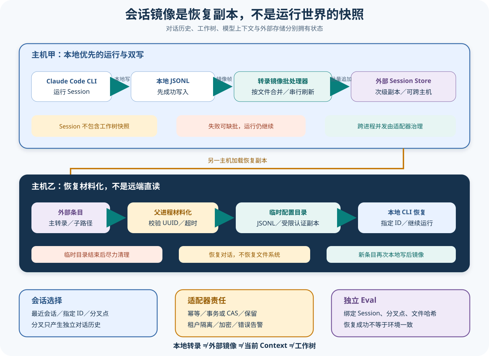

# Claude 会话、恢复与外部存储

## 读者会得到什么

读完后，你能区分会话标识、对话转录、本次模型上下文、工作目录中的真实文件、SDK 的 Transcript Mirror、外部 Session Store、恢复材料化和分叉历史。它们彼此关联，却没有一个对象能独自代表「运行时全部状态」。

官方公开契约把 Session 定义为提示、工具调用、工具结果和响应组成的对话历史。它持久化对话，不持久化文件系统。恢复旧 Session 可以让模型重新看到此前对话，却不会把磁盘文件自动还原到旧版本；分叉也只分叉对话历史，同一工作目录中的真实文件仍可被不同分支共同修改。

Python SDK 的外部 `SessionStore` 采用双写架构。Claude Code 子进程先把转录写到本地 JSONL，SDK 再消费 `transcript_mirror` 帧，把二次副本批量追加到 Store。Store 写失败不回滚本地历史，也不终止 Session；这保证模型循环不被慢适配器阻塞，同时意味着外部镜像可能落后、缺批或重复。

跨主机恢复也不是让 CLI 直接读取 S3、Redis 或数据库。SDK 父进程先按 `project_key` 与 `session_id` 调用 Store，创建临时 `CLAUDE_CONFIG_DIR`，写入主转录、可枚举的子智能体转录和经过处理的认证配置，然后把具体 `resume` ID 交给本地 CLI 子进程。子进程仍从本地文件启动，结束后 SDK 尽力删除临时目录。

外部持久化是恢复输入和审计副本，不是正在运行的 Claude Code 内存、模型 Context 或文件系统快照。

## 核心概念

会话问题难，不是因为只有一种状态太大，而是因为多种状态恰好共享同一个 Session ID。对话转录、模型当前 Context、本地 JSONL、外部镜像、工作树和远端副作用的更新时间与权威来源都不同。恢复前必须先问「准备恢复哪一种状态」。

| 概念 | 保存什么 | 谁先写 | 不包含什么 |
| --- | --- | --- | --- |
| Session ID | 对话链的逻辑标识 | Claude Code / SDK 协议 | 文件快照和完整运行状态 |
| 本地转录 | 提示、工具轨迹、响应等 JSONL | CLI 子进程 | 当前模型 KV、未落盘内存 |
| Transcript Mirror | CLI 发给 SDK 的转录副本事件 | 本地写入之后产生 | 同步提交保证 |
| 外部 Session Store | 按 project、session、subpath 保存的二次副本 | SDK Batcher 追加 | 唯一权威和自动文件恢复 |
| 恢复材料化 | 把外部条目重建为临时本地布局 | SDK 父进程 | CLI 直接连接数据库 |
| `fork_session` | 从旧转录派生新对话 ID | CLI 公开行为 | Git 分支或工作树复制 |
| 工作目录 | 工具真正读写的文件状态 | 工具与操作系统 | 自动随 Session 回滚 |

### 权威与新鲜度

本地转录是子进程首先写入的运行记录；外部 Store 只收到后续 Mirror。因而 Store 可以更耐久、更适合跨主机，却可能比本地尾部旧。所谓权威必须带问题：恢复对话时 Store 是输入来源，判断当前文件时磁盘才是来源，判断本轮模型看见什么还要看压缩后的 Context。

Mirror 的批量与重试进一步拉开新鲜度。一个 Result 成功不保证最后一批已经进入远端；Store load 成功也不保证末尾完整。适配器应记录最后成功 UUID、批次序号和错误，应用在跨主机恢复前检查完整性标记。

### 继续、指定恢复、分叉与截断

`continue_conversation` 是按项目范围选择最近候选，适合单用户便利入口；显式 `resume` 用确定 Session ID；`fork_session` 产生新对话分支；`resume_session_at` 选择转录节点。四者改变的是历史选择，不负责恢复 Git、数据库或远端服务。

多租户环境尤其不能只依赖 cwd 和最近时间。应用应把租户、逻辑项目和 Session 的映射保存在自己的授权域，调用 Store 时由服务端重新验证，而不是让知道 UUID 的客户端自由指定项目键。

## 为什么这样设计

第一，CLI 本地写入保持热路径简单可靠。若每个转录条目必须等待远端数据库确认，网络抖动会直接卡住模型循环；次级 Mirror 允许用户任务继续，同时把远端不完整性显式交给监控和恢复策略。

第二，材料化复用了 CLI 已有的本地恢复格式。SDK 可以对接 S3、Redis 或数据库，却不要求闭源 CLI 内置每种后端驱动；适配器只实现统一 Store 契约，父进程负责把数据转换成本地布局。

第三，对话分叉与工作树分叉被刻意解耦。不同应用可能选择共享目录、独立 worktree、容器快照或远端沙箱，SDK 不能假定一种文件事务模型。代价是宿主必须把 Session ID 与环境快照 ID 明确绑定。

第四，Mirror 失败不终止 Session，保护了可用性，却使「运行成功」与「可跨主机恢复」成为两个完成条件。把这两个条件分开记录，比在 Store 暂时故障时终止所有工作更灵活，也要求发布门禁不能只检查 Result。

最后，临时材料化把远端适配器与 CLI 的本地格式隔开。新后端只需遵守 Store 契约，不需要进入闭源 CLI；同时敏感配置的复制和清理集中在父进程，便于逐项审计。这个接缝提升可移植性，但不消除临时凭据风险，也让后端故障能够被单独替换和验证。

## 实现思路

教学实现由本地转录观察器、顺序 Batcher、Store Adapter、恢复材料化器和完整性检查器组成。前四个对象可对应锁定 SDK 的公开责任；版本标记、租户授权和工作树绑定是宿主需要补齐的生产蓝图。

1. **定义复合键。** 使用受服务端控制的 tenant / project / session / subpath，禁止客户端直接拼接物理路径；稳定 UUID 条目作为幂等键。
2. **本地成功后入队。** 每个 Mirror 保存来源文件、条目序号与 UUID；单进程按入队顺序分组，达到 Result、容量或关闭边界时刷新。
3. **区分重试条件。** 明确未提交失败、可能部分提交和不可取消超时；只有可证明安全的失败重试，其他情况依赖 UUID 幂等和后续对账。
4. **发布完整性水位。** 每个 Session 保存最后本地 UUID、最后远端 UUID、待刷新数量与 Mirror 错误；跨主机恢复必须读取水位。
5. **材料化到临时目录。** 授权后 load 主转录与子路径，原子写入受限目录，复制最少认证配置，移除 refresh token 和会触发安装的设置。
6. **绑定外部环境。** Artifact 同时记录 Session ID、转录水位、工作树 Commit / 哈希和远端资源版本；恢复后先校验环境漂移。
7. **清理并对账。** 正常、失败和取消都清理临时目录；启动时扫描遗留目录，Store 后台任务对缺批和重复进行审计。

```text
append_mirror(session_key, entries):
    entries = 按稳定UUID去重但保留无UUID条目(entries)
    await store.append(session_key, entries)
    更新远端水位(session_key, entries.last.uuid)

resume(request):
    验证租户对 project_key 和 session_id 的授权
    如果 远端水位 < 请求要求水位: 返回 incomplete
    temp = 创建受限临时配置目录()
    原子写入 temp 的主转录与子路径
    复制最少认证配置并删除 refresh token
    返回 {resume_id, temp, cleanup, environment_snapshot}
```

Store Adapter 的 conformance 只能证明基本追加、加载、隔离和删除语义。生产实现还要测试两个进程并发追加、部分提交后超时、索引晚于对象可见、TTL 与法律保留冲突、加密密钥轮换和租户越权。缺少这些证据时只能标为 partial。

恢复器还应输出明确的 readiness，而不是直接返回可执行 Session。只有授权、远端水位、转录结构、认证材料和环境快照都通过，才进入 CLI；任何缺项都保留为可解释状态，由用户或调度器选择等待、降级或重新开始。

## 贯穿案例

用户在主机 A 让 Agent 修改一个报告，随后进程结束；主机 B 从外部 Store 恢复并继续。为了证明恢复不是「只要拿到 Session ID 就行」，案例同时跟踪转录水位和工作树哈希。

1. **主机 A 运行。** CLI 先写本地条目 u1 到 u42，工具把报告改成哈希 H2；Batcher 只成功镜像到 u40，最后两条因 Store 超时仍待处理。
2. **阻止不完整恢复。** 应用看到本地水位 u42、远端水位 u40，标记 Session `mirror_incomplete`。主机 B 即使能 load，也不能宣称完整恢复，只能等待补传或让用户选择降级。
3. **完成对账。** 后台补传 u41、u42，稳定 UUID 防止部分提交造成重复；远端水位变为 u42。应用同时把工作树快照 H2 放到主机 B 的独立 worktree。
4. **材料化与启动。** SDK 父进程将主转录和子路径写入临时配置，移除 refresh token，把 resume ID 交给本地 CLI；启动后先核对工作树哈希 H2。
5. **分叉继续。** 用户选择 fork，得到新 Session ID s2；s1 与 s2 对话分开，但若继续共享同一工作树，后续文件仍会互相影响，因此 Artifact 保留 worktree ID。

```json
{"session":"s1","localTail":"u42","remoteTail":"u40","workspaceHash":"H2","resumeReady":false}
```

```json
{"session":"s1","localTail":"u42","remoteTail":"u42","workspaceHash":"H2","resumeReady":true}
```

```json
{
  "restored":{"host":"B","session":"s1","entries":42,"subpaths":1,"workspaceHash":"H2"},
  "fork":{"session":"s2","conversationIndependent":true,"filesystemIndependent":false},
  "cleanup":{"tempConfigRemoved":true,"startupSweepRequired":true}
}
```

把工作树故意保留在 H1 再恢复，会话可以成功加载，但模型历史声称报告已修改，磁盘却没有对应内容。正确状态是 `environment_mismatch`，要求重新读取文件或恢复快照；不能把它算作 Session Store 故障，也不能直接继续危险操作。

再让主机 A 在 Store append 部分提交后超时。重试会再次携带相同 UUID，Adapter 必须幂等；没有 UUID 的元数据则按契约追加。该实验验证的是适配器一致性，不证明跨区域数据库具备全局线性化。

## 真实输入与输出

### 输入

下面是另一台主机恢复指定 Session 的抽象输入。Store 中保存主转录和一个子智能体子路径；应用同时给出相同逻辑项目范围和工作目录。

```json
{"cwd":"/workspace/project","resume":"550e8400-e29b-41d4-a716-446655440000","session_store":{"project_key":"workspace-project","mainEntries":42,"subkeys":["subagents/agent-a"]},"fork_session":false}
```

### 输出

SDK 在启动 CLI 前把外部条目材料化为临时本地布局；控制选项被改成具体 `resume`，`continue_conversation` 清空。运行中新条目仍先落到临时本地 JSONL，再通过 Mirror 回写 Store；清理是尽力而为，不应被当作凭据绝不残留的形式证明。

```json
{"materialized":true,"localMainJsonl":42,"localSubkeys":1,"resumeId":"550e8400-e29b-41d4-a716-446655440000","continueConversation":false,"mirrorAuthority":"secondary-copy","cleanup":"best-effort"}
```

如果 `continue_conversation=True`，SDK 先列出当前 `project_key` 的 Session，按 `mtime` 从新到旧加载候选，跳过无效 UUID、空条目和 sidechain，选取最近的主会话。Store 空时回退为新 Session；显式 `resume` 无条目时则把原 ID 继续交给普通 CLI 路径，并不伪造一份外部历史。

## 调用链



Claim: claude.sessions.resume-materializes-external-state

Claim: claude.sessions.mirror-is-not-runtime-history

1. 新运行创建或接收 `session_id`；Result 和初始化消息让应用捕获标识。`ClaudeSDKClient` 在同一连接内维护连续 Session，单次 `query()` 则可用 `continue_conversation`、`resume` 或 `fork_session` 选择历史。
2. Claude Code 子进程在有效配置目录的 projects 树中写本地 JSONL。Session 记录对话与工具轨迹，不冻结工作目录、远端服务、环境变量或已发生副作用。
3. CLI 产生 `transcript_mirror` 帧；Python Query 截获它们而不把它们当普通 Assistant 消息。`TranscriptMirrorBatcher` 按文件路径聚合，保持单进程入队顺序，并在 Result、容量阈值、显式关闭或 eager 模式触发刷新。
4. Batcher 把本地文件路径映射为 `SessionKey(project_key, session_id, subpath)`，调用 Store 的 `append`。超时不重试，避免不可取消写入与新重试并发重复；其他异常最多重试三次，最终失败发出 Mirror 错误但运行继续。
5. 外部 Store 至少实现 `append` 与 `load`；列举、摘要、删除和子路径枚举是可选能力。适配器负责持久性、加密、租户隔离、TTL、幂等、跨进程并发和索引一致性。
6. 跨主机 `resume` 先调用 `load`，在父进程创建临时配置目录，写主 JSONL，若可枚举则恢复子路径。SDK 复制必要配置，移除 OAuth refresh token 和会触发临时插件安装的设置，再让 CLI 从临时本地文件恢复。
7. `fork_session=True` 让 CLI 从已有对话历史创建新 Session ID；`resume_session_at` 可从指定转录 UUID 截断恢复。两者分支的是对话链，不复制或回滚工作树。
8. Eval Adapter 应把 Session ID、Store key、恢复来源、镜像错误、选定分叉点、文件快照哈希和外部副作用分别保存。Scorer 不能把「恢复成功」等同于环境一致或任务通过。

## 源码证据

公开 `SessionStore` 协议明确说明外部适配器只接收二次副本，子进程仍写本地磁盘；`append` 在本地写成功后调用：

```source
src/claude_agent_sdk/types.py:1587-1613
class SessionStore(Protocol):
    The subprocess still writes to local disk ...
    the adapter receives a secondary copy.
    async def append(...):
        Called AFTER the subprocess's local write succeeds
```

协议要求同一进程按调用顺序持久化，但跨并发进程按存储提交时间排序。带 UUID 的条目应作为幂等键；缺 UUID 的标题、标签和模式标记不能简单去重。失败批次最终可被丢弃，运行继续。

```source
src/claude_agent_sdk/types.py:1618-1627
Within a single process, persist entries in append-call order;
across concurrent processes, order is by storage commit time, not call time.
Most entries carry a stable uuid ... idempotency key
```

恢复桥接器把 Store 条目写入临时本地配置目录。没有 Store、没有恢复请求、Store 为空或 Session ID 非 UUID 时不材料化；Store 超时或异常会带上下文抛出 `RuntimeError`。

```source
src/claude_agent_sdk/_internal/session_resume.py:130-158
async def materialize_resume_session(options):
    store = options.session_store
    if store is None: return None
    if options.resume is None and not options.continue_conversation: return None
    ...
    if _validate_uuid(options.resume) is None: return None
```

上游恢复测试把两个条目写入内存 Store，断言临时主转录逐行深度相等，再调用 cleanup 并确认目录消失。另一个测试证明复制凭据时保留 access token 但去掉 refresh token。这是 B 级锁定夹具，不证明所有平台上的杀进程、杀电或防病毒锁文件场景都完成清理。

```source
tests/test_session_resume.py:121-153
m = await materialize_resume_session(opts)
assert json.loads(lines[0]) == entries[0]
assert json.loads(lines[1]) == entries[1]
await m.cleanup()
assert not m.config_dir.exists()
```

Mirror 的 pending 队列与刷新路径是另一套状态。刷新会按文件路径合并条目，串行等待前一个 eager flush；Store 超时不会重试，普通异常有限重试，最终错误只回报而不抛进模型循环。

```source
src/claude_agent_sdk/_internal/transcript_mirror_batcher.py:149-219
by_path: dict[str, list[SessionStoreEntry]] = {}
...
await self.store.append(key, entries)
...
except TimeoutError:
    ... not retrying
...
errors.append((key, str(last_err)))
```

并发测试让第一次 eager flush 阻塞，同时入队第二批；解除门闩后断言 `[1, 2]`，证明锁定实现的单 Batcher 顺序化。它不证明两个 SDK 进程、两个容器或不同 Store Adapter 之间具备全局线性化。

## continue、resume、fork 与截断恢复

`continue_conversation` 按当前项目范围寻找最近主会话，适合单对话应用从进程重启继续。它依赖 `list_sessions` 和可信 `mtime`；相同项目有多个用户会话时，最近者可能不是目标，因此多租户系统应保存并使用明确 `session_id`，不要把 cwd 当租户边界。

`resume` 指定 Session ID。官方契约允许当前 CLI 跨目录查找同机 Session，但锁定 SDK 捆绑的 CLI 版本可能有不同查找范围；接入外部 Store 时，Python SDK 仍由 `project_key_for_directory(cwd)` 先限定 Store key。跨主机必须保证逻辑项目键一致，而不是仅复制一个 UUID。

`fork_session` 从已有对话产生新 Session ID，原历史保持不变。`resume_session_at` 选择转录中的一个 UUID 作为截断点；可选 `resume_drops_turn` 让 CLI 校验丢弃区间是否都属于预期回合，避免把未观察到的排队消息或任务通知静默切掉。截断边界应使用完整转录条目，不要只看 Assistant 文本。

这些操作都不管理 Git 分支、工作树或数据库事务。若两个 Session 在同一 cwd 并行编辑，历史分开但文件共享。需要可回滚代码状态时使用独立 worktree、文件检查点或应用级快照，并把快照 ID 绑定到 Session Artifact。

## 双写、批次和外部一致性

默认 batched 模式在 Result 或超过 500 条／1 MiB 时刷新，减少适配器延迟对流式热路径的影响；eager 模式每个 Mirror 帧触发后台刷新，仍会在适配器忙时合并。eager 是接近实时，不是同步提交，也不提供读取自己的写入保证。

Mirror 失败不会终止 Claude Code Session，因为本地转录已先持久。优点是外部存储短暂故障不破坏用户任务；代价是 Store 可能缺少恢复所需的末尾条目。应用必须监控 MirrorError、最后成功 Store 序号、末尾 UUID 和本地/外部条目数，不能只看 Result success。

核心 `append` 接口没有 `expectedVersion`、租约或 CAS 参数。单 Batcher 用锁保持本进程顺序，但跨进程顺序按 Store commit time；重复写需要以稳定 UUID 幂等处理，缺 UUID 条目仍需追加。摘要 read-fold-write 若可能竞争，源码明确要求 Adapter 使用事务、CAS 或每 Session 锁。

TypeScript 锁定仓库中的 `examples/session-stores/shared/conformance.ts` 是未发布示例测试，结构性复制了接口并定义 13 个一致性检查：追加顺序、空追加、项目隔离、子路径、列举与删除级联等。它没有 SDK Runtime 主体源码，也不测试网络分区、跨进程冲突或生产凭据，因此只能作为 Adapter 示例契约，不能抬升为生产证明。

保留与删除同样由 Adapter 拥有。SDK 不会自动删除外部 Store；主转录删除应级联子路径，指定 subpath 的删除只删该对象。WORM 后端可不实现删除，但必须用生命周期策略满足合规期限，并说明本地 `cleanupPeriodDays` 与外部 TTL 是两个独立策略。

## 临时配置与凭据边界

材料化目录不只含转录。为让重定向后的 CLI 完成认证，SDK可能复制 `.credentials.json`、`.claude.json`、用户 settings 和平台 Keychain 读取结果；OAuth refresh token 被删除，避免临时子进程刷新后使父进程持有的单次 token 失效。

插件声明会从临时 settings 中剥离，防止空插件缓存每次恢复都联网安装；settings 内指向旧位置的 `CLAUDE_CONFIG_DIR` 也会去掉。无效 JSON 会原样传递，因此真实 CLI 仍可能报解析错误；复制是最佳努力，不能把读取失败静默解释成无需认证。

清理路径覆盖正常结束、Transport 启动失败和取消，Windows 文件占用会短暂重试，最后用 ignore-errors 扫尾。这个设计降低泄漏概率，却无法在进程被强杀、机器断电或外部程序长期持有句柄时给出绝对保证。生产部署应把临时根目录放在受限、短生命周期卷，另做启动时清扫和凭据泄漏监测。

## 失败与限制

第一，Session 是对话历史，不是文件系统快照。恢复后文件已变化时，模型的历史判断可能过期；应用应在新回合注入当前 Git SHA、文件哈希和环境版本，并要求重新核对关键假设。

第二，Store 是次级镜像。Result 前异常退出、Mirror 超时、最终刷新失败或路径无法映射都可能造成尾部缺失；本地存在不代表远端完整，远端可加载也不代表最新。

第三，`project_key` 默认来自净化 cwd，不是强租户隔离。多租户部署应显式设计不可碰撞的项目范围、服务端授权和加密密钥，防止知道 Session ID 的调用方跨租户读取。

第四，外部 Adapter 的实现差异很大。S3 分片排序、Redis 列表、Postgres JSONB、对象存储一致性和删除语义都需要独立测试；示例 conformance 只覆盖基础行为。

第五，临时认证配置扩大了敏感数据面。refresh token 删除不代表 access token 无风险；日志、崩溃转储、备份、恶意 Hook 和同机用户权限仍需治理。

## 验证方法

先做纯 Store conformance：同键多次 append 保序、空 append 无副作用、未知 load 返回空、project 隔离、主/子路径独立、主删除级联、子路径删除精确。再增加生产后端特有的并发、故障注入、TTL、加密和权限测试。

对 Mirror 做批次实验：batched 与 eager 分别记录入队、触发、Store commit 和 Result 时间；注入普通异常、不可取消超时、部分写后抛错和进程取消。验证重复 UUID 的去重、缺 UUID 的保留、错误消息和 Session 继续行为。

对恢复做跨主机夹具：主机 A 写固定转录与子路径，确认 Store 末尾标记；主机 B 使用相同逻辑项目键恢复，检查临时 JSONL 深度相等、子路径存在、refresh token 不存在、CLI 接到具体 resume ID，结束后目录清理。再故意改变 cwd、删除子路径和截断末批，验证失败能被观察。

最后验证 Session 与工作树分离：创建原 Session、记录文件哈希、分叉对话、在分叉中修改文件，再恢复原 Session。预期原 Session 历史不含分叉消息，但文件仍是修改后的版本。Eval Artifact 必须保存两个 Session ID、分叉点、恢复来源、Store 完整性标记和文件哈希。

## 自检

### 问题 1

为什么外部 Session Store 不能被称为 Claude Code 运行时历史的唯一权威？

**答案：** 因为子进程先写本地 JSONL，Store 只接收次级 Mirror；失败可以被丢弃而 Session 继续，运行中内存、Context 和文件系统也不在 Store 中。

### 问题 2

跨主机 resume 时 CLI 是否直接读取数据库？

**答案：** 否。Python SDK 父进程先从 Store load，把条目材料化到临时 CLAUDE_CONFIG_DIR，再让本地 CLI 从 JSONL 恢复。

### 问题 3

fork_session 会不会复制或回滚工作目录？

**答案：** 不会。它只创建独立对话历史；同一 cwd 的文件仍共享，需要 worktree、检查点或应用快照管理代码状态。

### 问题 4

核心 Store 协议是否提供跨进程 CAS？

**答案：** append 接口没有版本前提。跨进程提交排序、幂等、摘要事务/CAS、租户隔离与保留策略都由 Adapter 负责。
