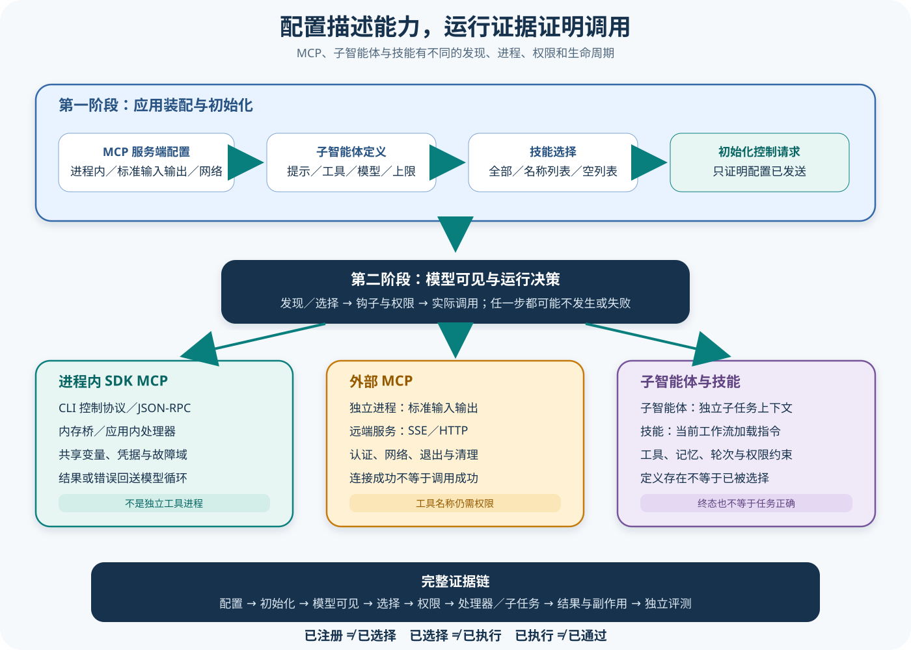

# Claude MCP、子智能体与 Skill 装配

## 读者会得到什么

读完后，你能区分四类常被统称为「扩展」的机制：进程内 SDK MCP 工具、外部 MCP Server、可由 Agent 工具调用的子智能体定义，以及由 Skill 工具加载的指令能力。它们的发现、命名、上下文成本、权限、执行进程和失败边界都不同。

Python SDK 允许用 `@tool` 描述异步函数，再用 `create_sdk_mcp_server()` 包装为进程内 MCP Server。它不启动独立工具进程：Server 与 Handler 运行在应用 Python 进程中，可直接访问应用变量；CLI 侧的 MCP JSON-RPC 经双向控制协议进入 `SdkMcpBridge`，再走内存 Transport 到 Server。

外部 MCP 则通过 `McpStdioServerConfig`、`McpSSEServerConfig` 或 `McpHttpServerConfig` 描述。stdio Server 是单独子进程，SSE/HTTP Server 是网络端点；凭据、可达性、超时、服务端身份和远端副作用都不由「配置存在」自动保证。

`AgentDefinition` 是子智能体初始化输入，包含 description、prompt、tools、disallowedTools、model、skills、memory、mcpServers、initialPrompt、maxTurns、background、effort 和 permissionMode。SDK 把非空字段序列化到 initialize；这证明 CLI 收到了定义，不证明闭源产品内部怎样注册，也不证明主智能体一定选择 Agent、子智能体启动或最终完成。

Skill 是可发现的指令包，不等于普通 MCP Handler。Python `skills` 选项会补齐 Skill 工具的允许规则和默认设置来源，并把显式列表送入 initialize 作为过滤输入。`None` 不代表关闭，空列表才明确压制列表；`"all"` 与线级省略在 wire 上等价为不过滤，但仍依赖真实文件、设置来源和 CLI 版本。

能力已装配，不等于能力已执行。

## 真实输入与输出

### 输入

下面的抽象配置同时注册一个进程内工具、一个 HTTP MCP Server、一个子智能体和两个 Skill。它只表达启动输入；是否可见、是否被选择、是否获批和是否成功仍要观察运行事件。

```json
{"mcp_servers":{"local":{"type":"sdk","tools":["lookup"]},"docs":{"type":"http","url":"https://example.invalid/mcp"}},"agents":{"reviewer":{"tools":["Read","Grep"],"skills":["review"],"maxTurns":4,"permissionMode":"plan"}},"skills":["review","testing"]}
```

### 输出

initialize 成功只说明 Claude Code 接受了能力描述。完整 Artifact 至少需要区分注册、模型可见、模型选择、权限决定、Handler 进入、工具结果、Agent 生命周期和任务评分。

```json
{"initialized":true,"advertised":["mcp__local__lookup","Agent","Skill(review)","Skill(testing)"],"selected":null,"permissionDecision":null,"handlerEntered":false,"agentCompleted":false,"eval":"not-run"}
```

如果模型调用 `mcp__local__lookup`，Python Query 才按 server name 找到 Bridge，将原始 JSON-RPC 交给内存 Server。未知 Server 返回方法不存在错误，未知 Tool、无效参数或 Handler 异常被转换为 MCP error result；它们通常反馈给模型继续推理，而不是自动让整个 query 崩溃。

## 调用链



Claim: claude.mcp.sdk-tools-run-in-process

Claim: claude.extensions.configuration-is-not-execution

1. 应用构造 `ClaudeAgentOptions`。`mcp_servers` 可为名称到四类配置的映射，也可为 MCP 配置文件路径；`agents` 是名称到 `AgentDefinition` 的映射；`skills` 是名称列表、`"all"`、空列表或未设置。
2. `InternalClient` 从配置中提取 type 为 sdk 的 Server instance，为每个创建 `SdkMcpBridge`；stdio/SSE/HTTP 配置则序列化给 CLI 侧连接。两条路径不共享相同进程或故障域。
3. Client 把 AgentDefinition 转成去除 None 的字典，并在 initialize 控制请求中发送 agents、显式 Skill 列表、Hook callback ID 和其他初始化字段。初始化响应只能证明公开协议接受，不能证明内部注册算法。
4. Skill 启用逻辑把 `"all"` 映射为裸 `Skill` allow，把名称列表映射为 `Skill(name)`；未显式设置 setting_sources 时补成 user 与 project，以便 CLI 发现文件。发现失败、名称非法或来源关闭仍会减少实际能力。
5. 模型在可见上下文中选择 `mcp__<server>__<tool>`、Agent 或 Skill。MCP Tool 仍要经过权限流水线；Agent 与 Skill 自身也由工具调用触发，配置定义不能绕过 allowed/disallowed、Permission Mode 与 Hook。
6. 进程内 MCP 调用经 CLI → control request → Query → `SdkMcpBridge` → MCP memory transport → Handler；响应按相反方向回到 CLI，再成为 ToolResult。Handler 与应用共享进程状态和系统权限。
7. 外部 stdio MCP 由独立进程通过标准输入输出通信；SSE/HTTP 通过网络。SDK 配置不能证明远端身份、OAuth 已完成、网络可达或服务端动作幂等。
8. Agent 调用创建独立子任务上下文，应用可从消息和任务事件观察开始、进度、结果或错误。`maxTurns` 是资源上限输入，不是完成保证；`memory`、`skills` 和 `mcpServers` 是装配字段，不是执行记录。
9. Eval Adapter 把初始化能力、模型实际可见工具、选择事件、权限轨迹、Handler 进入、工具结果、子智能体结果和副作用汇成 Artifact；Scorer 独立评估任务正确性、安全和资源预算。

## 源码证据

锁定 Python helper 明确创建应用进程内 Server，并说明它通过内存 MCP Transport 连接 Claude Code：

```source
src/claude_agent_sdk/__init__.py:491-516
def create_sdk_mcp_server(...):
    Create an in-process MCP server that runs within your Python application.
    ...
    the SDK connects to Claude Code over an in-memory MCP transport.
```

公开 MCP 配置联合类型把进程边界写进 Schema：stdio 有 command/args/env，SSE 与 HTTP 有 URL/headers，SDK 配置持有真实 `McpServer` instance。进程内 Server 当前还有功能边界：Server 主动发给 Client 的 sampling、elicitation、roots、logging、progress 尚未转发；mcp 1.x 下被 Claude Code 放弃的工具可能继续跑到完成。

```source
src/claude_agent_sdk/types.py:606-650
class McpStdioServerConfig ...
class McpSSEServerConfig ...
class McpHttpServerConfig ...
class McpSdkServerConfig ... instance: McpServer
```

Query 为每个进程内 Server 建立 `SdkMcpBridge`。Bridge 收到 JSON-RPC 时按需创建 MCP Session，若 Server 已停止，只允许新的 initialize 重新握手；普通消息会得到已停止错误。关闭 Query 时 Bridge 也会 bounded close，但忽略取消的 Handler 可能越过等待宽限。

```source
src/claude_agent_sdk/_internal/sdk_mcp_bridge.py:343-384
class SdkMcpBridge:
    Routes raw JSON-RPC ... through mcp's memory transport.
    ...
    pending = await session.submit(message)
    return await pending.wait()
```

上游集成测试把 divide Handler 包装成进程内 Server，通过 MCP Client 调用失败和成功输入，分别断言 `isError` 与内容。另一个测试调用不存在的 Tool 并得到标准错误结果。它验证锁定 SDK 的内存 MCP 数据面，不验证真实 Claude 模型选择工具。

```source
tests/test_sdk_mcp_integration.py:916-925
failure = await client.call_tool("srv", "divide", {"a": 1, "b": 0})
success = await client.call_tool("srv", "divide", {"a": 6, "b": 3})
assert failure["isError"] is True
assert success["isError"] is False
```

AgentDefinition 的源码类型明确列出 prompt、工具、模型、Skill、memory、MCP、maxTurns、background、effort 与 permissionMode。`InternalClient` 只做 dataclass 到字典的转换，随后 Query 把 agents 和 skills 放入 initialize 请求。

```source
src/claude_agent_sdk/_internal/query.py:261-275
request = {"subtype": "initialize", "hooks": ...}
if self._agents:
    request["agents"] = self._agents
if isinstance(self._skills, list):
    request["skills"] = self._skills
```

这条源码锚点证明「配置被序列化」，没有执行 Agent Tool、没有加载 Skill 文件、也没有出现工具结果。因此课程把后续模型选择与运行证据保持为独立阶段。

## 进程内与外部 MCP

进程内 SDK MCP 适合访问应用内缓存、连接池和领域服务。没有 IPC 开销不等于没有边界：Handler 在同一进程崩溃、泄露 Secret、阻塞事件循环或写坏共享状态，影响面可能比独立 Server 更大。应使用最小权限凭据、输入 Schema、超时、幂等键和结构化错误。

外部 stdio MCP 适合隔离语言 Runtime 或现有命令行 Server，但需要管理子进程启动、stderr、退出、继承环境和清理。HTTP/SSE 适合共享服务，却增加 DNS、TLS、认证、重试、限流和跨租户隔离。连接状态只说明握手结果，不能证明某个 Tool Call 已执行。

MCP 工具名为 `mcp__<server-name>__<tool-name>`。名称出现在初始化或 system 消息说明模型可能发现；加入 `allowed_tools` 只是自动批准，实际可用还需要 Server 连接、Tool Schema、权限、Handler 与结果路径都成功。工具搜索可能只在需要时加载完整 Schema，所以「没有全量 Schema 出现在首轮 Context」不等于未注册。

Tool annotations 是提示元数据，不是执行约束。`readOnlyHint` 可影响只读 Tool 的并行调度，但错误标成只读的 Handler 仍可写磁盘；destructive/idempotent/openWorld 等 Hint 也不能替代权限和 Sandbox。安全评测必须观察真实副作用。

Handler 抛异常时，SDK 进程内 MCP 会转换为 error result，模型循环可继续。应用主动返回 Python `is_error=True` 可控制给模型的错误说明；错误 ToolResult 不等于 query 必然失败，成功 ToolResult 也不等于业务数据正确。

## AgentDefinition 的能力边界

description 帮助主智能体判断何时委派，prompt 定义子智能体初始职责；tools 与 disallowedTools 限制工具表面，model 和 effort 影响推理配置，permissionMode 影响审批，maxTurns 提供轮次上限。每个字段都只是约束输入，真正生效还依赖 Claude Code 版本与公开契约。

Agent 通过 Agent 工具被调用，因此主会话必须能看到并获批该 Tool。一个定义出现在 initialize 不代表模型会选择它；模型选了也不代表子智能体已启动；启动后 Result 或任务通知也不自动证明子任务正确。评测应建立 definition → tool request → task start → child messages → terminal state → parent consumption 的链。

子智能体可装配自己的 Skill、memory 和 MCP Server。`memory` 指向 user/project/local 级别的持久范围，不能被写成每次任务私有内存；`mcpServers` 的名称或内联配置仍要通过连接与权限；background 只改变执行方式，不能保证进程寿命或完成通知。

permissionMode 有继承和覆盖条件，Task 6 已说明 bypass 等模式可能强制施加到子智能体。给 AgentDefinition 写一个更严格的模式不应被当成最终隔离证明，必须从实际任务事件、权限轨迹和 Sandbox 结果核对。

## Skill 的发现与启用

Skill 主要承载可复用指令和资源，由 Skill 工具按需调用。它与 Agent 的区别是：Skill 不自动创建独立对话执行体；它把被选择的能力内容加入当前工作流。Skill 内即使引用脚本或 MCP，也要经过相应工具和权限路径。

Python `skills=None` 保留 CLI 自身默认行为，不等于关闭；`skills=[]` 才明确过滤列表；命名列表会验证名称并生成 `Skill(name)` allow rule；`skills="all"` 注入裸 Skill allow。自动补齐 user/project setting_sources 方便发现，也会把文件系统配置纳入信任边界。

Skill 出现在发现列表只证明元数据可见。要证明执行，至少要看到 Skill 工具请求、加载结果、相关上下文变化或后续行为证据；要证明正确，还要检查 Skill 版本、资源哈希、工具轨迹和目标产物。不能把一个目录存在或 initialize skills 字段直接写成「Skill 已运行」。

## 失败与限制

第一，Claude Code 是闭源产品。Python SDK 公开了配置序列化和 MCP Bridge，但没有公开 Agent 注册器、Skill 选择算法或内部工具搜索实现；课程只描述官方公开契约。

第二，进程内 MCP 与应用共享故障域。无限循环、不可取消线程、同步阻塞和未隔离 Secret 都可能拖垮 SDK；Bridge 的 bounded close 不是强杀 Handler 的保证。

第三，外部 MCP 的认证不会由 SDK 自动完成所有 OAuth 流程。Headers 或 env 有值不证明 token 有效，也可能在错误日志和子进程环境泄露。

第四，设置来源决定 filesystem Agent、Skill、Hook 和 MCP 配置是否加载。启用 project 来源会信任仓库内容；禁用来源会让预期能力消失。必须在 Artifact 记录最终 setting_sources 与加载清单。

第五，maxTurns、permissionMode、Tool annotations 和 Result 都是局部信号。它们不能替代独立任务评分、资源预算和副作用检查。

## 验证方法

先做纯进程内 MCP 测试：注册两个 Tool，覆盖合法调用、缺字段、类型错误、不存在 Tool、Handler 返回 `is_error`、抛异常、结构化内容和取消。记录 Handler 进入次数、输入、共享状态变化和 Bridge close。

再做外部 Transport 矩阵：stdio Server 注入启动失败、stderr、非零退出与孤儿进程；HTTP/SSE 注入 DNS、TLS、401、429、超时、断线重连和重复请求。每种故障分别记录连接状态、Tool 可见性、权限结果与 ToolResult。

对 AgentDefinition 构造固定夹具：initialize 捕获完整字典，确认 None 被去除；随后让主模型明确调用指定 Agent，记录 Agent tool_use_id、任务 ID、子消息、maxTurns、权限拒绝、终态和父流程是否消费结果。配置测试与模型行为测试分开计数。

对 Skill 构造 None、空列表、命名列表和 all 四种情况，核对最终 allowed_tools、setting_sources、initialize skills 与 system init 能力；再调用一个带唯一标记的 Skill，验证标记只在真正加载后出现。最后由独立 Scorer 检查产物，而不是检查标记本身。

## 自检

### 问题 1

SDK MCP Tool 在哪个进程执行？

**答案：** Python create_sdk_mcp_server 创建的 Handler 在应用进程内执行；CLI 的 JSON-RPC 经控制协议与内存 MCP Bridge 到达它。

### 问题 2

AgentDefinition 出现在 initialize 能否证明子智能体执行完成？

**答案：** 不能。它只证明定义被序列化；还要观察 Agent 工具请求、任务生命周期、子消息、终态和目标产物。

### 问题 3

`skills=None` 与 `skills=[]` 是否相同？

**答案：** 不同。None 不做 SDK 自动配置，CLI 默认仍可能发现 Skill；空列表明确压制 Skill 列表。

### 问题 4

`readOnlyHint=true` 能否阻止 Handler 写文件？

**答案：** 不能。Annotation 是调度提示，不是强制安全边界；真实权限、Sandbox 和副作用验证仍必需。
