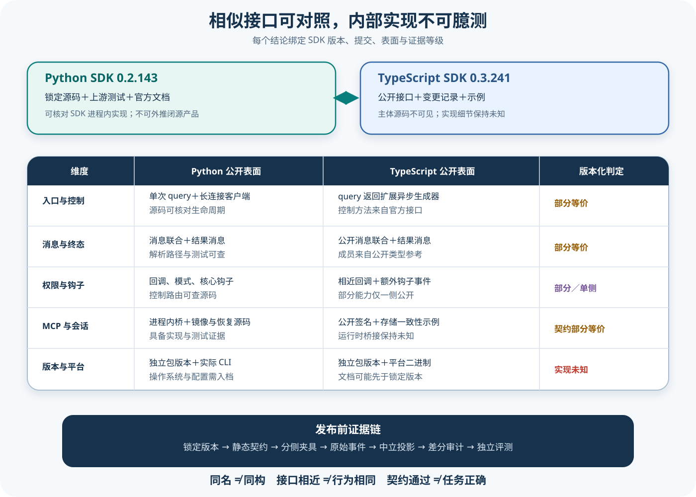

# Claude TypeScript 公开契约与双 SDK 对齐

## 读者会得到什么

读完后，你能在没有 TypeScript SDK 主体源码的情况下做一份诚实、可复查的双 SDK 能力矩阵：TypeScript 一侧只使用官方 API 参考、锁定 README、CHANGELOG 和 Session Store 示例；Python 一侧可继续使用锁定源码、测试和官方参考。两列证据等级不同，不能因函数名相似就画成同一套内部类。

锁定 TypeScript 提交对应公开版本 `0.3.241`，锁定 Python 提交在 `pyproject.toml` 中声明 `0.2.143`。版本号本就独立演进；「TypeScript 有 `query()`，Python 也有 `query()`」最多证明入口意图相近，不能证明参数默认值、控制消息、错误映射、取消、CLI 二进制或资源清理完全同构。

官方 TypeScript 参考把 `query()` 定义为返回扩展 `AsyncGenerator<SDKMessage, void>` 的 `Query`，并列出 `interrupt()`、`setPermissionMode()`、`setModel()`、`setMcpServers()`、`streamInput()`、`stopTask()` 与 `close()` 等控制方法。Python 则把一次性 `query()` 与有显式 `connect()`、`receive_response()`、`interrupt()`、`disconnect()` 的 `ClaudeSDKClient` 分开。它们可以映射到「流式入口」和「长连接控制」两个共同概念，但对象模型并不相同。

官方参考还明确指出部分能力只出现在 TypeScript，例如当前的若干 Hook 事件以及 `applyFlagSettings()`；CHANGELOG 也记录能力在具体版本加入、修复或移除。因此「对齐」必须写成带版本、平台、表面和证据类型的状态，永久勾选无法表达这种变化。

公开契约可以指导集成，却不是运行时源码。

## 核心概念

双 SDK 对齐不是找同名函数，而是比较同一语义问题在两个版本中的公开输入、输出、默认值、错误和生命周期。证据不对称时，矩阵也必须不对称：Python 列可以引用实现与测试，TypeScript 列只能在现有材料范围内引用公开契约、变更记录和示例。

| 概念 | 含义 | 合格证据 | 常见误判 |
| --- | --- | --- | --- |
| 契约等价 | 同一条件下输入、输出和错误语义一致 | 两侧版本化 API 与契约测试 | 名称相同就等价 |
| 部分等价 | 核心意图重叠但对象模型或边界不同 | 逐字段差异与限定条件 | 强行取最小公集后称完全一致 |
| 单侧能力 | 只有一侧在锁定版本公开支持 | 版本文档、类型与 CHANGELOG | 另一侧一定永远没有 |
| 实现未知 | 公开表面存在但主体源码不可核对 | 明确缺失空间与所需证据 | 用 Python 内部类补 TypeScript 图 |
| 版本化矩阵 | 每个单元格绑定 SDK、CLI、平台和日期 | 可重建的快照与运行 Artifact | 永久功能清单 |
| 中立投影 | 保留原始差异的共同事件模型 | 原始类型、未知字段与转换规则 | 把未知字段静默删除 |

共同抽象应来自问题，例如「怎样中断当前运行」，而不是直接拿 `ClaudeSDKClient` 或 TypeScript `Query` 当跨语言架构。前者允许比较调用时机、结果和连接状态；后者会把一侧对象模型强加给另一侧。

`unknown` 是有效结果。它表示当前证据不能回答实现问题，并为后续补证留下位置；它既不计作能力缺失，也不能在汇总时偷偷转成等价。差分报告应单列未知比例和原因。

对齐的最小单位是带条件的行为，不是包名。相同 SDK 在不同 CLI、平台或设置来源下也可能形成两个矩阵快照。

## 为什么这样设计

第一，Python 与 TypeScript 包独立发布，版本号、CLI 捆绑和平台实现可能不同。版本化单元格能把差异定位到具体快照，避免今天的文档覆盖昨天的运行事实。

第二，证据可见度不同。若为了表格整齐而把 Python 源码解释复制到 TypeScript 列，知识库会制造不存在的实现证据；若反过来只比较公开 API，又浪费了 Python 可核对的资源生命周期信息。允许列的证据等级不同，才能诚实且有用。

第三，适配器需要共同语义，但评测需要保留原始差异。中立投影让上层统一统计工具、权限和终态；保留 raw type、版本和未知字段，又能在差异出现时回到具体 SDK 诊断。

第四，契约对齐和结果对齐是两项实验。即使两个入口参数一致，模型、CLI、设置和平台仍可能让产物不同；只有分别运行相同 Trial，才能比较实际结果。

第五，保留历史矩阵能解释升级风险。某项能力从 one-sided 变成 partial，可能是另一侧新增公开表面，也可能只是文档补充；不覆盖旧记录，才能区分功能变化、证据变化与测试覆盖变化，并为回滚提供依据。矩阵由此成为可复查的升级审计记录，而不是营销式功能列表，也能说明差异首次出现的位置。

矩阵还必须说明比较方向与基准，防止证据可见的一侧被默认视为标准实现。

## 实现思路

实现一个版本化对齐器时，数据模型应以「维度—快照—证据—判定」为核心，而不是手写 Markdown 勾选表。下面是课程蓝图，不代表任一 SDK 内部组件。

1. **锁定运行快照。** 保存两侧包版本、Commit、CLI 版本、平台、官方文档日期和安装包声明哈希。
2. **定义中立维度。** 为入口、消息、权限、Hook、MCP、Session 与取消分别写出语义问题和最小可观察行为。
3. **采集各侧证据。** TypeScript 使用公开参考、声明、CHANGELOG 和可运行夹具；Python额外使用源码和上游测试。每条证据声明覆盖范围。
4. **计算单元格状态。** 只有输入、输出、默认值、错误和生命周期都相容才标 equivalent；否则用 partial、one-sided 或 unknown，并给理由。
5. **运行共同场景。** 两侧分别执行同一固定 Trial，保留原始事件与环境，再由同一规范化器生成可比较 Artifact。
6. **检测漂移。** 任一包、CLI 或文档变化只使受影响单元格 stale；重新采集后生成新矩阵，不覆盖旧快照。

```text
对齐(维度, Python快照, TypeScript快照):
    P = 采集(维度, Python快照)
    T = 采集(维度, TypeScript快照)
    如果 任一侧证据缺失: 返回 unknown(缺失项)
    如果 只有一侧公开能力: 返回 one-sided(版本与证据)
    如果 输入输出默认值错误生命周期 全部兼容: 返回 equivalent(P, T)
    返回 partial(逐字段差异, 适配策略)
```

规范化器必须采用可扩展事件：共同字段放顶层，`raw` 保留原负载哈希和未知字段。遇到新 Hook 或消息 subtype 时先产出 unknown event，不能为了旧 Schema 通过就丢弃。适配器的成功只证明转换完成，不证明两侧原始行为相同。

矩阵生成器还应把证据等级写进每个单元格。Python 的 source+test、TypeScript 的 docs+declaration 即使得到相同契约判定，也要保留不同置信边界；汇总视图可以折叠展示，原始记录不能丢失。适配器发布时还要带上矩阵版本，使下游 Artifact 能反查当时采用的转换语义和未知字段策略。

## 贯穿案例

以「中断当前运行后连接能否继续使用」为对齐问题。Python 使用 `ClaudeSDKClient.interrupt()`，TypeScript 使用 Query 的 `interrupt()`；名称相近，但仍要比较前置连接、控制响应、终态消息、后续查询和 close 责任。

1. **固定快照。** 记录 Python 0.2.143、TypeScript 0.3.241、各自 CLI 与平台，禁止一个用滚动 latest。
2. **静态核对。** 两侧公开表面都有 interrupt；Python 可继续核对控制请求源码，TypeScript 内部发送方式保持 unknown。
3. **运行相同 Trial。** 两侧启动一个可安全取消的长任务，在同一阶段调用 interrupt，继续读取到终态，再发送短查询。
4. **生成中立事件。** 记录 interrupt requested、acknowledged、terminal received、connection reusable 和 finally closed，同时保留原始消息。
5. **作出判定。** 若两侧都能继续查询，可把公开行为标为 equivalent；内部控制实现仍是 unknown，不能随行为判定一起升级。

```json
{"sdk":"python","interrupt":{"public":true,"controlSourceVisible":true},"connectionReusable":true}
```

```json
{"sdk":"typescript","interrupt":{"public":true,"controlSourceVisible":false},"connectionReusable":true}
```

```json
{
  "dimension":"interrupt-and-reuse",
  "contractParity":"equivalent-under-pinned-trial",
  "implementationParity":"unknown",
  "conditions":["固定 SDK 与 CLI","同平台","同一安全任务"],
  "rawArtifactsPreserved":true
}
```

如果 TypeScript 终态多一个新 subtype，规范化器应保留未知事件并把消息维度标为 partial，而不是删掉后继续宣称完全等价。若换 CLI 后行为改变，只使新快照重新评审；旧 Trial 仍是当时条件下的证据。

对抗检查再交换实现顺序：先用 TypeScript 独有方法构造问题，再问 Python 是否有等价语义，而不是始终把 Python 当基准。只有双向检查，矩阵才不会系统性偏向证据更可见的一侧。最终判定还应附带可复现命令与原始事件哈希，供后续版本重放同一问题。

## 真实输入与输出

### 输入

双 SDK 对齐器接收两个锁定快照和一组共同语义问题，两个包名远远不够。每个单元格都应携带来源与状态。

```json
{"python":{"version":"0.2.143","commit":"542fefb3...","evidence":"source+tests+docs"},"typescript":{"version":"0.3.241","commit":"48275071...","evidence":"docs+changelog+examples"},"dimensions":["entry","messages","permissions","hooks","mcp","session-store","cancellation"]}
```

### 输出

输出应表达「等价、部分等价、仅一侧、未知」，并保留限定条件。`unknown` 表示证据暂时不足，不应被算作失败或强行补全。

```json
{"dimension":"hooks","status":"partial","sharedContract":["PreToolUse","PostToolUse"],"typescriptOnlyAtPinnedReview":["PostToolBatch","WorktreeCreate"],"implementationParity":"unknown","reason":"TypeScript 主体源码不可用"}
```

这份矩阵用于选择适配器和测试，不直接证明任一 SDK 在真实模型、真实凭据、特定操作系统和特定 CLI 二进制上运行成功。真正的运行结论仍需要相同 Dataset、相同目标表面与分别执行的 Artifact。

## 调用链



Claim: claude.typescript.public-contract-is-not-runtime-source

Claim: claude.sdks.parity-must-be-versioned

1. 先锁定 Python Commit、TypeScript Commit、包版本、官方文档访问日期和目标平台；不允许用滚动的 `latest` 填矩阵。
2. 为共同概念定义中立词汇，例如「单次入口、双向控制、消息联合、权限回调、生命周期钩子、进程内 MCP、外部会话镜像」，避免直接拿某一语言的类名当通用架构。
3. TypeScript 列从官方 API 参考提取函数签名、类型、默认值和限制，再用锁定 CHANGELOG 定位能力首次出现、破坏性移除和缺陷修复；锁定 README 只证明包与文档入口。
4. Python 列从 `types.py`、入口与内部实现、上游测试和官方参考提取相同维度。源码可见允许解释数据怎样被序列化，但仍不能外推 Claude Code 闭源内部。
5. 每个单元格判为 `equivalent`、`partial`、`one-sided` 或 `unknown`。只有输入、输出、默认值、错误和生命周期都核对后，才可称为契约等价；名称相同不足以通过。
6. 对 Session Store 这类双侧公开能力，分别执行一致性夹具。TypeScript 示例的 conformance 只约束 adapter 行为；它不是 SDK Runtime 测试，也不证明 Redis、S3 或 Postgres 生产部署。
7. 升级任一 SDK、CLI 或官方文档时，只把受影响单元格标为待复核，重新跑对应契约测试和端到端测试，再生成新的矩阵版本。
8. Eval Adapter 在真实运行时统一投影消息、工具、权限、会话和终态 Artifact；统一投影不能抹掉原始 SDK、版本、原始事件与未知字段。

## 源码证据

锁定 TypeScript 仓库的 README 说明包用途、安装名和官方文档入口，但没有 SDK 实现。仓库树清单只包含 README、CHANGELOG、许可证、脚本和 Session Store 示例，共 33 个文件；因此本章不会写虚构的 `src/*.ts` 行号。

```source
README.md:1-18
# Claude Agent SDK
The Claude Agent SDK enables you to programmatically build AI agents...
npm install @anthropic-ai/claude-agent-sdk
```

「没有主体源码」只适用于提交 `48275071...` 的公开 Git 树，不代表 npm 可执行分发包没有代码，也不代表 Anthropic 内部没有源码。官方 TypeScript API 参考仍是有效的公开契约证据，但它不能回答私有字段、内部队列、CLI 桥接类或资源回收实现。

CHANGELOG 是版本化契约的第二条证据。它明确记录 `skills` 在 `0.2.120` 加入并称其与 Python SDK 匹配，也记录 `sessionStore`、`SDKMirrorErrorMessage` 在 `0.2.113` 加入。前者只证明该选项在当时被公开描述为匹配，不证明两个实现共享代码。

```source
CHANGELOG.md:584-620
## 0.2.120
- Added `skills` option ... matching the Python SDK
## 0.2.113
- Added `sessionStore` option (alpha) to `query()` ...
- Added `SDKMirrorErrorMessage` ...
```

同一 CHANGELOG 还记录重发 initialize 后 Hook callback 曾静默不生效，随后增加 `hooks_applied` 回报；也记录旧的 V2 Session API 在 `0.3.142` 被移除。这说明「API 名称存在」并不能替代具体版本的行为与缺陷边界。

```source
CHANGELOG.md:18-24
## 0.3.238
- Fixed SDK hook callbacks silently not applying after a host re-sends `initialize`...
```

TypeScript Session Store 示例确实有可读源码，但文件注释明确说它使用 SDK 类型的结构副本以保持零依赖。它验证 append、load、listSubkeys 和 delete 的 adapter 行为，不展示 SDK 怎样批处理镜像、材料化恢复或驱动 CLI。

```source
examples/session-stores/shared/conformance.ts:20-39
// Structural copies of the SDK's SessionStore types so this file has zero
// runtime dependencies on the SDK package.
type SessionStore = {
  append(...): Promise<void>
  load(...): Promise<SessionStoreEntry[] | null>
}
```

示例 README 进一步说明这些 adapter 位于 `examples/`，不随 `@anthropic-ai/claude-agent-sdk` 发布，也不由该包的构建测试负责。课程可借它定义 adapter 验收，不会把它算作 SDK Runtime 主体。

```source
examples/session-stores/README.md:5-14
Reference `SessionStore` adapters backed by S3, Redis, and Postgres...
These adapters live under `examples/` ...
They are not published as part of the package and are not built or tested by this package.
```

Python 侧则有可核对版本与主体源码。锁定包版本为 `0.2.143`，`ClaudeAgentOptions`、`HookEvent`、`McpSdkServerConfig`、`ResultMessage`、`skills` 和 `session_store` 都能定位到真实类型；这使 Python 列的证据等级高于 TypeScript 列，但不使 Python 成为 TypeScript 的实现替身。

```source
pyproject.toml:1-9
[project]
name = "claude-agent-sdk"
version = "0.2.143"
```

## 版本化双 SDK 对齐表

下表只针对本章锁定版本和 2026-08-24 访问的官方参考。

| 维度 | Python `0.2.143` | TypeScript `0.3.241` | 判定与边界 |
| --- | --- | --- | --- |
| 主要入口 | `query()` 返回异步消息迭代；`ClaudeSDKClient` 管理多轮连接 | `query()` 返回扩展异步生成器的 `Query`；控制方法挂在该对象 | `partial`：共同支持流式与控制，但对象模型不同 |
| 消息 | Python `Message` 联合与 `ResultMessage` 可查源码和解析测试 | `SDKMessage` 公开联合包含 system、assistant、user、result、hook、task、mirror error 等 | `partial`：可建立中立投影，成员与字段须逐版本核对 |
| 权限 | `can_use_tool`、PermissionMode、allowed/disallowed，可查控制协议源码 | `canUseTool`、PermissionMode、allowed/disallowed 为官方契约 | `partial`：语义重叠；回调遮蔽、默认值和错误需分别测试 |
| Hook | Python 当前公开一组核心 Hook，可查 callback 路由 | 官方参考列出核心 Hook，并说明当前有 TypeScript 独有事件 | `one-sided/partial`：不能取并集后宣称两侧都支持 |
| MCP | Python 进程内 Bridge 有源码和上游测试；也支持 stdio/SSE/HTTP | `createSdkMcpServer()` 与外部配置有公开签名 | `partial`：进程边界可比较，TS 内部桥实现未知 |
| Session Store | 接口、镜像批处理、恢复材料化有源码与测试 | 公开 Options、CHANGELOG 和 adapter conformance 示例 | `partial`：adapter 契约重叠，Runtime 处理不可判同构 |
| 动态控制 | Client 有 interrupt、权限模式、模型、MCP、输入与关闭等入口 | Query 有相近控制方法，另有 `applyFlagSettings()` 等 TypeScript 特有项 | `partial`：按方法和使用模式逐项适配 |
| 版本与 CLI | Python 包 `0.2.143`，CLI 行为仍受实际二进制影响 | TypeScript 包 `0.3.241`，官方参考称可绑定平台原生 CLI | `unknown`：包版本不同，CLI 构建和平台必须记录 |

这张表用于定位适配器差异、测试缺口和无法比较的区域，不承担「功能多寡排行榜」的角色。例如 TypeScript 当前公开更多 Hook 事件，并不证明它在所有维度更强；Python 有主体源码，也不证明其线上稳定性更高。

## 对齐器设计

中立适配器不要把原始消息立即压成一段文本。建议保留 `sdk`、`sdkVersion`、`cliVersion`、`platform`、`rawType`、`rawSubtype`、`sessionId`、`parentToolUseId`、时间、原始负载哈希和规范化事件。未知 subtype 应进入 `unknownEvents`，不能静默丢弃。

权限也应保留完整链：工具是否注册、是否模型可见、模型是否选择、规则结果、Permission Mode、Hook 结果、回调结果、Sandbox、执行结果。两个 SDK 都叫 allowed tools，不代表 allowed 就等于存在或成功；共同适配器只做语义投影，不替产品补证据。

Session Store adapter 可以共享一组行为夹具：初始 load 返回 null、append 保序、listSubkeys 排序与去重、delete 幂等、并发 append 语义、异常传播和跨进程一致性。但 Python Runtime 的批处理重试与 TypeScript 示例 adapter 的后端实现仍应分开记录。

升级流程应把矩阵作为版本化 Artifact。每次只对变更影响的维度执行：静态 API 快照、CHANGELOG 分类、契约夹具、最小真实 CLI smoke test 和独立任务 Eval。若官方文档变化而 Git Lock 未变，应标成「文档漂移待核对」，不能直接覆盖旧结论。

## 失败与限制

第一，TypeScript 主体源码不可用意味着无法从本地 Git 树验证 `Query` 怎样启动 CLI、解析流、路由控制请求或回收进程。官方 API 参考能证明承诺的表面，不能补成源码。

第二，官方文档是滚动内容。访问日期为 2026-08-24，而锁定 Git 提交是 `0.3.241`；若文档已经描述更晚版本，必须用 CHANGELOG、实际包类型声明或运行实验校准，不能默认完全一致。

第三，Python 源码可见也只覆盖 Python SDK。把 Python 的 `InternalClient`、`Query`、Transport 或 MCP Bridge 画进 TypeScript 列，是无证据的实现外推。

第四，CHANGELOG 是发布记录，不是完备规范。它善于证明某项能力何时加入或修复，却不保证列出全部默认值、兼容性和平台差异。

第五，Session Store 示例的 conformance 是示例级夹具。通过它不证明后端可生产使用，不证明跨进程串行化、灾难恢复、租户隔离或真实 Resume 成功。

第六，契约对齐不等于结果对齐。相同 Dataset 在两个 SDK 上可能因为 CLI 版本、模型、设置来源、权限、系统提示、平台和并发而产生不同 Artifact；发布判断必须分别统计。

## 验证方法

先固定两个包版本、Commit、CLI 版本、操作系统和官方文档快照，生成 API 清单。TypeScript 清单来自官方类型参考与安装包导出的声明；Python 清单来自公开类型、源码和文档。对每项记录名称、输入、输出、默认值、错误、生命周期和来源。

再建立编译级契约夹具：TypeScript 编译 `query()`、消息分支、Hook、MCP、Session Store 和控制方法示例；Python 运行 mypy/pytest 夹具覆盖同一语义。仅编译通过记为「表面可用」，不得记成运行成功。

随后运行相同场景：普通文本、流式输入、工具允许、工具拒绝、Hook 改写、进程内 MCP、外部 MCP 失败、Resume、Store append 失败、interrupt 与 close。保留两侧原始事件，再由同一个规范化器产生 Artifact；规范化器不能删除未知字段。

最后执行差分审计。只比较任务产物、权限决定、工具副作用、终态、费用和延迟等共同指标；API 独有能力单独报告。任何差异都先定位到包版本、CLI、平台、配置或模型，不把「不同」自动判成某一 SDK 的缺陷。

## 自检

### 问题 1

锁定 TypeScript 仓库没有 SDK 主体源码，是否意味着 TypeScript SDK 不存在实现？

**答案：** 不是。它只说明该公开 Git 树不能提供主体实现锚点；npm 分发包和私有实现不在这个结论范围内。

### 问题 2

两个 SDK 都有 `query()`，能否证明实现同构？

**答案：** 不能。名称只支持概念映射；参数、对象模型、默认值、控制协议、错误和生命周期仍要按版本分别核对。

### 问题 3

CHANGELOG 写某个 `skills` 选项「匹配 Python SDK」，能否永久标成完全等价？

**答案：** 不能。它只证明特定发布记录的公开意图；后续版本、默认值、加载来源和运行缺陷仍可能分化。

### 问题 4

双 SDK 对齐表应怎样处理没有足够证据的实现细节？

**答案：** 标为 `unknown`，保留缺口和验证方法；不能复制 Python 内部类到 TypeScript 列，也不能用官方 API 文档冒充源码。
