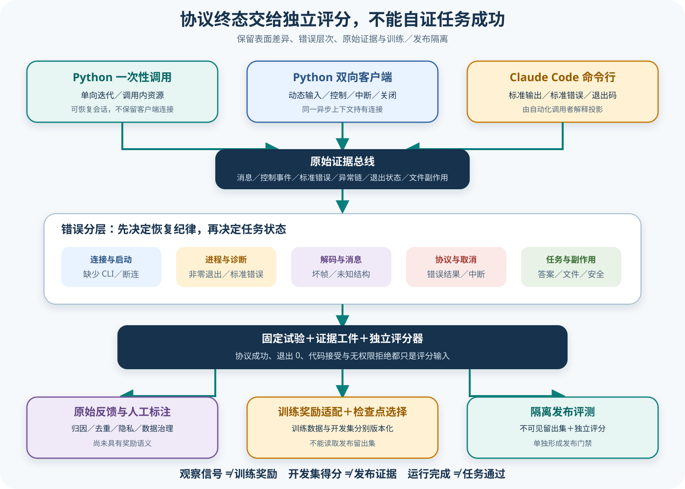

# Claude 产品表面、错误与独立评测设计

## 读者会得到什么

读完后，你能为同一个 Claude 任务选择正确表面，并把运行证据接入可比较的 Eval：Python `query()` 适合单次或单向流；`ClaudeSDKClient` 适合同一连接中的多轮输入、动态控制和中断；直接调用 Claude Code CLI 适合 shell 与流水线，但暴露的是进程、标准输出、标准错误和退出码。TypeScript 的 `Query` 又是另一种对象模型，Task 9 已单独登记其公开契约。

这些表面可能驱动相近的 Agent Loop，却不返回相同对象，也不具有相同连接寿命。`query()` 每次创建内部处理链，函数本身不保留客户端连接；它仍可通过 options 指定 resume，所以「无状态」应理解为入口对象不持有会话，而非禁止恢复历史。`ClaudeSDKClient` 从 connect 到 disconnect 持有 Transport 与内部 Query，并要求操作留在同一异步运行上下文。CLI 进程则由调用者解释输出格式和退出状态。

错误也有多层：找不到或连不上 CLI、子进程非零退出、标准错误诊断、输出不是合法 JSON、合法 JSON 无法解析成 SDK Message、协议 Result 报错、工具错误、权限拒绝、取消，以及答案或文件产物错误。它们对应不同恢复策略；把所有失败折成布尔值会破坏 Trial 统计和故障定位。

`ResultMessage` 携带 subtype、`is_error`、轮次、耗时、费用、usage、permission_denials、错误、HTTP 状态与 terminal_reason。字段丰富仍不等于任务正确：`is_error=false` 可能伴随错误答案、遗漏约束或越界副作用；代码改动被允许、应用或用户接受也只是过程信号。

独立评测必须继续检查目标产物。

## 真实输入与输出

### 输入

一个可复现 Trial 至少固定 Dataset 条目、目标表面、SDK 与 CLI 版本、模型、工作目录快照、设置来源、权限、工具环境和评分器版本。基础设施恢复使用 Attempt，不能创建新 Trial 来冲淡产品失败。

```json
{"trialId":"claude-fix-017","datasetVersion":"bugs-v3","target":{"surface":"python-client","sdk":"0.2.143","cli":"recorded-at-runtime"},"workspace":"sha256:...","model":"locked","permissionMode":"default","scorerVersion":"patch-tests-safety-v4"}
```

### 输出

Target Adapter 保存原始消息、控制事件、stderr、异常、退出码、文件差异、测试结果与外部副作用，再生成规范化 Artifact。下面的协议成功还没有经过任务评分。

```json
{"protocol":{"resultSubtype":"success","isError":false,"terminalReason":"completed","exitCode":0},"artifact":{"answerHash":"...","diffHash":"...","tests":{"passed":18,"failed":1},"permissionDenials":[]},"score":{"status":"fail","reason":"回归测试失败"}}
```

这组数据刻意展示最重要的反例：Agent Loop 可以正常结束，CLI 可以退出 0，最终任务仍失败。Scorer 只依据固定任务契约、产物和安全规则判定，不把最终自然语言中的「完成」当断言。

## 调用链



Claim: claude.surfaces.query-client-cli-are-not-equivalent

Claim: claude.eval.requires-artifact-scorer

Claim: claude.feedback.is-not-training-or-release-reward

1. Dataset 生成不可变 Trial。调度器为 Trial 选择明确 Target surface：Python `query()`、Python Client、TypeScript Query 或 CLI 自动化；表面名称、包版本、CLI 版本和平台写入 RunSpec。
2. Target Adapter 组装 prompt、options、工作目录、权限与环境。单次入口创建新的内部调用链；双向客户端先 connect，再按响应继续 query 或 interrupt；CLI Adapter 启动独立进程并选择公开输出格式。
3. Transport 或 CLI 产生原始 stdout/stderr、JSON 帧、SDK Message、控制响应与异常。采集器保留原始顺序和关联 ID，不能只保存最后一段文本。
4. Error Classifier 先区分连接、进程、解码、消息解析、协议 Result、工具、权限、取消和任务断言。基础设施故障才允许同一 Trial 开新 Attempt；模型或产品失败固定计入 Trial。
5. Artifact Builder 保存有效配置、消息、工具输入输出、权限轨迹、Result、异常链、stderr 摘要、退出码、耗时、费用、文件哈希、测试与外部副作用。敏感字段在保留可关联性的前提下脱敏。
6. 独立 Scorer 根据 Dataset 的验收契约检查答案、文件、命令、测试、安全和预算。协议成功、退出 0、没有 permission denial 或用户接受 diff 都只能成为特征，不能直接决定通过。
7. Feedback Store 可收集用户评价、代码接受或人工备注；数据治理负责归因、去重、隐私、偏差和标签质量。反馈没有显式适配前保持 raw signal 身份。
8. 训练 RewardAdapter 把经审计信号转换成 DPO preference、GRPO/RFT reward 或其他训练 Schema；Checkpoint Selector 使用独立开发集选择候选。两者不能读取发布 holdout。
9. Release Eval 在隔离 holdout 上重跑固定 Trial，由独立 Scorer 出具门禁。训练得分、Checkpoint 选择得分和发布得分分别报告，避免循环证明。

## 源码证据

Python 单次入口的公开 docstring 明确区分 `query()` 与 `ClaudeSDKClient`：前者用于一次性或单向流，不能在响应后动态追加消息或发 interrupt；内部创建 `InternalClient`，迭代 `process_query()` 后结束。

```source
src/claude_agent_sdk/query.py:11-28,118-126
async def query(...) -> AsyncIterator[Message]:
    """Query Claude Code for one-shot or unidirectional streaming interactions.
    ...
    client = InternalClient()
    async for message in client.process_query(...):
        yield message
```

这不表示调用绝对没有 Session：options 可以带 resume、continue 或 session_store。准确边界是调用对象与连接寿命；恢复语义仍由 Task 7 的 Session 证据链约束。

双向 Client 持有长生命周期 Query 与 Transport，可在连接后写新 user message、接收消息和发 interrupt。连接前调用会抛 `CLIConnectionError`；disconnect 会关闭 Query、接收流、Transport 引用和恢复材料化目录。

```source
src/claude_agent_sdk/client.py:236-282,532-587
async def query(...):
    await self._transport.write(json.dumps(message) + "\n")
async def interrupt(self):
    await self._query.interrupt()
async def receive_response(...):
    if isinstance(message, ResultMessage): return
async def disconnect(self):
    await self._query.close()
```

`receive_response()` 在包含 Result 后停止，普通 `receive_messages()` 则可能继续接收后台任务或后续回合。这两个迭代器也不能混成相同终止语义。

异常类型把传输和协议失败分开。`ProcessError` 保存 exit_code 与 stderr；`CLIJSONDecodeError` 保存无法解码的行；`MessageParseError` 处理已解码但无法映射的消息。`ResultError` 继承 ProcessError，在 CLI 先发 `is_error=true` Result、随后非零退出时保存 subtype、errors、result、HTTP 状态、terminal_reason、session_id 与原始 payload。

```source
src/claude_agent_sdk/_errors.py:10-39,56-126
class CLIConnectionError(ClaudeSDKError): ...
class ProcessError(ClaudeSDKError):
    self.exit_code = exit_code
    self.stderr = stderr
class ResultError(ProcessError): ...
class CLIJSONDecodeError(ClaudeSDKError): ...
```

上游回归测试构造 `error_max_turns` Result 后让 Transport 抛 ProcessError，断言调用者先收到 Result，再得到带结构化 payload、exit code 和 cause 的 ResultError。它说明「消息已经被 yield」和「流最终抛异常」可以同时发生。

```source
tests/test_query.py:1574-1614
assert len(received) == 1
assert received[0]["subtype"] == "error_max_turns"
assert type(err) is ResultError
assert err.exit_code == 1
assert err.data is received[0]
```

ResultMessage 本身公开费用、usage、权限拒绝和 terminal_reason。`aborted_streaming` 与 `aborted_tools` 表示取消；旧 CLI 或绕过查询循环的本地命令可能没有 terminal_reason。缺值应标成 unavailable，不能猜成 completed。

```source
src/claude_agent_sdk/types.py:1319-1350
class ResultMessage:
    subtype: str
    is_error: bool
    total_cost_usd: float | None
    permission_denials: list[Any] | None
    api_error_status: int | None
    terminal_reason: str | None
```

## 三类表面怎样选择

Python `query()` 适合固定输入、批处理和 CI：调用者遍历消息即可，不管理显式连接。流式 prompt 仍属于单向输入集合，不能根据中间响应再决定下一条消息；需要这种反馈回路时应使用 Client。

`ClaudeSDKClient` 适合交互界面、审批回调、多轮调试和动态控制。它持有后台读取任务，必须在 connect 所在的同一异步上下文中完成操作。长连接增加了清理、背压、并发写入和后台事件归属问题，Eval 必须记录每个 Result 对应的 origin 与回合。

CLI 自动化适合 shell、流水线和其他语言。调用者要固定 `-p` 与公开输出格式，分别采集 stdout、stderr 和 exit code，并明确是否允许交互审批。CLI 文本、SDK dataclass 和 TypeScript Message 不是可以逐字段互换的同一输出。

表面比较至少保留五组维度：输入能否动态追加、控制能力、消息完整度、终止信号、进程与资源所有权。只比较最终文本会遗漏工具、权限、取消、费用、后台任务和结构化错误。

## 错误分类与重试纪律

CLINotFound、临时连接中断、测试环境启动失败可以归为基础设施候选，但仍要检查是否由产品配置错误导致。只有预先定义为 recoverable 的故障才能创建新 Attempt；同一 Trial 的分母和验收条件保持不变。

`error_max_turns`、权限拒绝、工具业务错误、模型答案错误和回归测试失败属于产品路径，不得自动重试到通过。API 429、529 或超时可能重试，但要记录 SDK/CLI 内部重试次数，避免外层再重试造成隐藏的预算膨胀。

CLIJSONDecodeError 通常说明输出污染、协议版本不匹配或截断；原始行可能含敏感信息，Artifact 只保存受控摘要与哈希。MessageParseError 说明 JSON 合法却不满足已知 Schema，应保留 unknown 类型，不能当普通文本跳过。

interrupt 是控制请求，Result 的 terminal_reason 才是可观察终态之一；close/disconnect 是资源操作。调用 interrupt 后仍可能收到部分 Assistant、ToolResult、Result 或后台事件，Scorer 应按任务契约判 cancelled、failed 或 inconclusive。

stderr 是诊断通道。它可能包含真正的 CLI 失败原因，也可能只是调试日志；不得拼进模型答案或作为唯一任务分数。上传前要脱敏路径、Token、命令参数和第三方响应。

## 独立 Eval 与训练闭环

Dataset 保存任务输入、环境夹具和验收标准；Trial 是统计单位；Attempt 只承载基础设施恢复。Artifact 是运行事实，Scorer 是判断规则。四者分开后，协议成功和任务成功才不会被混为一个布尔值。

对代码任务，Scorer 至少检查目标文件、diff 范围、测试、静态分析、禁止修改区、重复副作用和最终说明。用户点击接受、工具返回成功或补丁能应用，都无法替代这些检查。对非代码任务则检查结构化答案、引用、外部系统状态和安全边界。

Feedback Store 接受点赞、拒绝、编辑、代码接受和人工备注。这些信号存在选择偏差、归因不清、重复用户、策略诱导和隐私风险。进入训练前先做清洗、去重、聚合、质量标注与数据许可审计，再由版本化 RewardAdapter 转成明确语义。

RewardAdapter 可以产生 preference pair、标量 reward 或可验证结果；训练过程用于 DPO、GRPO、RFT 或其他优化。Checkpoint Selector 在独立开发集上选候选；Release Eval 使用未参与训练和选择的 holdout。若同一反馈同时训练又证明发布，得分会循环偏高。

## 失败与限制

第一，Python SDK 源码能证明入口、异常和消息类型，无法证明 Claude Code 闭源内部怎样生成所有 Result、决定退出码或执行重试。

第二，CLI 版本可能独立于 SDK 变化。terminal_reason、api_error_status 或 subtype 在旧版本缺失时应保留未知，不能用当前枚举回填。

第三，ResultError 可能在 Result 已经交给调用者之后抛出。只抓异常会丢失消息，只看消息会漏掉进程失败；Adapter 必须保存两者和 cause 链。

第四，费用和 token usage 是运行计量，不保证完整账单或任务价值。缓存、Provider、重试和后台任务可能改变口径。

第五，用户反馈与代码接受会受界面、时机和人群影响。没有明确 RewardAdapter、权重和数据治理时，只能登记为 raw signal。

第六，本章提供仓库规范性 Eval 架构，不声称 Claude SDK 内置 Dataset、Trial、Artifact Scorer、训练奖励或发布门禁。

## 验证方法

先做表面契约测试：给相同 prompt 分别跑 Python query、Python Client 与 CLI；记录原始输入、首条消息、Result、stderr、退出码和清理。Client 再覆盖跟进消息、并发输入、interrupt、disconnect 和跨异步上下文误用。

再做错误注入矩阵：不存在 CLI、启动失败、非零退出、有 stderr、损坏 JSON、未知消息、error Result 后进程退出、工具失败、权限拒绝、max turns、API 429/529、取消和 close 超时。每种情况断言错误层、是否可重试、Artifact 字段和 Trial 状态。

随后建立固定代码 Dataset。每个 Trial 只允许基础设施 Attempt；故意制造「Result success 但测试失败」「退出 0 但越界改文件」「用户接受但安全规则失败」三类反例，确认 Scorer 全部拒绝。

最后验证训练隔离：从已审计反馈生成 RewardAdapter 输出，记录数据版本和变换；用独立开发集选 Checkpoint，再对不可见 holdout 运行 Release Eval。检查任何 holdout ID、答案或派生特征都没有进入训练或选择阶段。

## 自检

### 问题 1

Python `query()` 和 `ClaudeSDKClient` 的核心差别是什么？

**答案：** `query()` 是一次调用的单向消息迭代；Client 在显式连接中支持动态输入、控制、中断和多轮响应，并承担更长的资源生命周期。

### 问题 2

收到 `is_error=false` 且 CLI 退出 0，能否把 Trial 判为通过？

**答案：** 不能。它们只证明协议与进程层结果；独立 Scorer 还要检查答案、文件、测试、安全约束和副作用。

### 问题 3

CLI 发出错误 Result 后又抛 ProcessError，Adapter 应保留哪一个？

**答案：** 两者都保留。Result 提供结构化终态，ResultError／ProcessError 提供进程退出、stderr 和 cause；它们描述同一次失败的不同层。

### 问题 4

用户接受代码修改可以直接作为训练 reward 或发布门禁吗？

**答案：** 不可以。接受行为只是原始反馈；训练需要版本化 RewardAdapter 与数据治理，发布需要隔离 holdout 和独立 Scorer。
