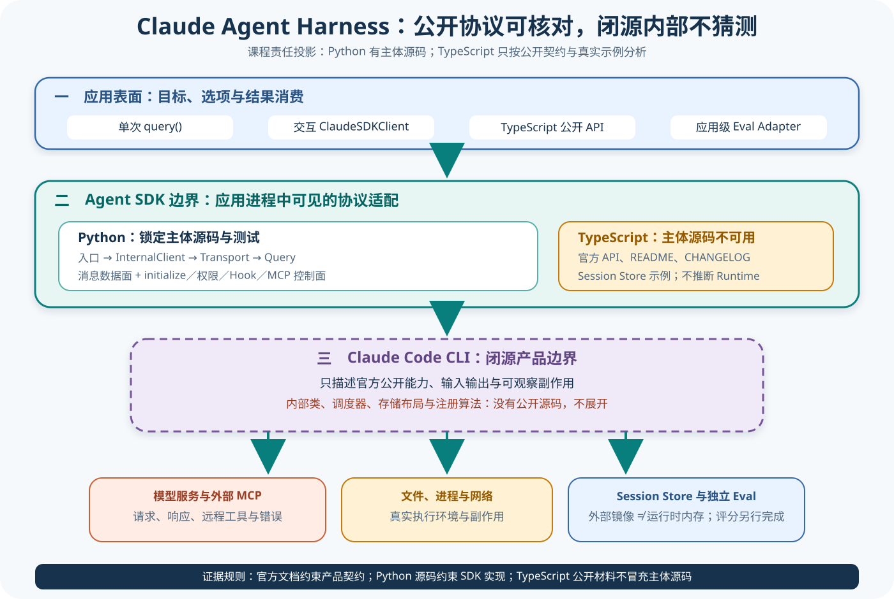
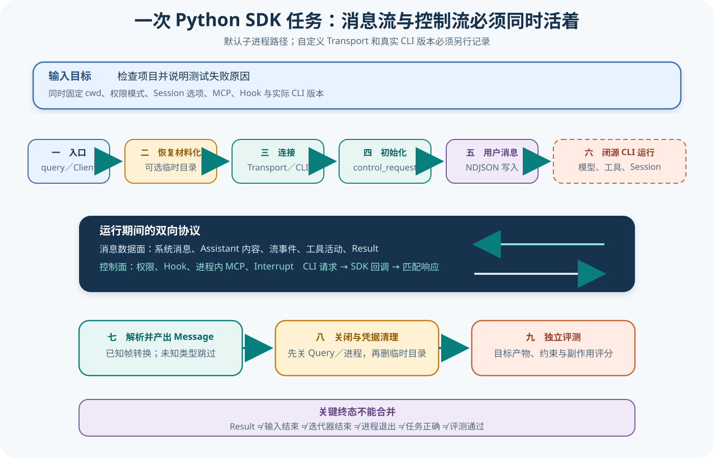

# Claude Agent Harness 主线

## 读者会得到什么

这条主线回答的不是「怎样调用 Claude API」，而是应用怎样通过 Agent SDK 驱动一个能读文件、执行命令、修改代码、维护 Session 并接受权限约束的 Agent Harness。官方把 Agent SDK 与直接 Client SDK 区分开：前者提供 Claude Code 的工具、智能体循环和上下文管理，后者要求应用自己实现工具循环。课程以这个公开产品契约为上界，再用锁定 Python SDK 的真实源码解释应用进程中可见的 Transport、控制协议、消息、Session Store、MCP 与回调。

Claude Code 是闭源产品，本课程只引用官方公开契约，不从 SDK 反推内部实现。图中不会虚构 Claude Code 内部的类、调度器、数据库表或工具注册算法；「CLI 接受请求并访问模型与工具」来自公开能力说明，而 SDK 只证明它怎样启动、连接和交换协议帧。

Python Agent SDK 提供可核对的主体源码与测试；本课程锁定提交 `542fefb3b94be87760b2513fff889b91bb5b6672`，可以逐行核对 `query()`、`ClaudeSDKClient`、`InternalClient`、`Query` 和 `SubprocessCLITransport`。TypeScript Agent SDK 的锁定仓库没有 SDK 主体源码，只能核对公开 API、README、CHANGELOG 与 Session Store 示例；锁定提交为 `48275071e804139579fabada9bb8d90cfe02b062`。相同的公开类型名不构成两个实现内部同构的证明。

两仓许可证也不同。Python 仓库的 MIT License 只覆盖该仓库内容；TypeScript 仓库使用自己的商业条款文件，官方总览还说明 SDK 使用通常受 Anthropic 商业条款约束。任何一个许可证都不能覆盖另一个仓库，更不能据此推导 Claude Code 产品源码的许可证。

先固定看得见的层，再讨论看不见的层。

## 系统全景



Claim: claude.architecture.product-sdk-boundaries

应用层可以选择 Python 的 `query()`、`ClaudeSDKClient`，或 TypeScript 官方公开 API。Python 源码显示，默认路径会构造 `SubprocessCLITransport`；Python 包 README 说明 Claude Code CLI 默认随包捆绑，也可使用系统安装或 `cli_path` 指定版本。自定义 Transport 是另一条明确分支，不能用默认子进程行为描述所有运行。

SDK 内部有两条并行数据面。普通 NDJSON 帧承载用户消息、系统消息、Assistant 内容、流事件和 Result；`control_request` / `control_response` 则承载初始化、权限回调、Hook、进程内 MCP、Interrupt 等双向控制。`Query` 必须持续读取 CLI 标准输出，并在需要时向标准输入写回控制响应，所以「输入已发送」不等于标准输入可以立即关闭。

CLI 之后是闭源产品边界。官方文档说明 Agent SDK 提供与 Claude Code 相同的工具、智能体循环和上下文管理，但没有公开该边界内部的模块图。本课程因此只画一个不透明框：它与模型服务、文件系统、进程、网络和外部 MCP 发生公开可观察的交互；框内算法保持未知。

Session Store 位于应用可见的持久化边界。Python SDK 能把外部 Store 中的 Transcript 条目材料化到临时配置目录，并把运行中的 Transcript 增量镜像回 Store；这不意味着外部 Store 就是 Claude Code 的实时内存，也不表示恢复过程无损或无并发条件。独立 Eval 则消费固定 Trial 的输入、配置、消息、工具副作用与产物，由独立 Scorer 判断任务正确性。

架构图是证据分区，不是闭源实现猜测。

## 课程状态与顺序

<!-- course-navigation:start -->
| 顺序 | 模块 | 状态 | 先回答的问题 |
| ---: | --- | --- | --- |
| 00 | 主线入口 | 已复核 | 应用、双 SDK、CLI、工具、状态与 Eval 怎样形成责任链？ |
| 01 | 产品与 SDK 证据边界 | 提纲 | 哪些结论来自官方契约、Python 源码或 TypeScript 公开材料？ |
| 02 | Python 入口、Transport 与控制协议 | 提纲 | query、Client、CLI 子进程与控制帧怎样连接？ |
| 03 | 消息流与生命周期 | 提纲 | Result、输入结束、取消、关闭和进程退出分别结束哪一层？ |
| 04 | 工具、权限与 Hook | 提纲 | 工具可用、自动允许、询问、回调、Hook 与执行怎样分层？ |
| 05 | Session、恢复与 Store | 提纲 | 恢复材料化、Transcript Mirror 和外部 Store 谁是权威？ |
| 06 | MCP、Agent 与 Skill | 提纲 | 进程内工具、外部 Server 与能力配置怎样装配？ |
| 07 | TypeScript 契约与双 SDK 对齐 | 提纲 | 无主体源码时怎样诚实比较两个 SDK？ |
| 08 | 产品表面、错误与独立 Eval | 提纲 | SDK Result、反馈和产物怎样进入独立评分？ |
<!-- course-navigation:end -->

这张表在阶段末才会原子开放链接。在八篇正文、Claim、中文图和批量门禁全部完成前，文件存在不等于课程可发布；根入口也不会提前把 Claude 标为完成。

状态先于导航。

## 真实输入与输出

### 输入

最小入口把一个字符串目标和选项交给 Python `query()`。真实源码会在完成 `initialize` 后把字符串包装成用户 NDJSON 消息写入所选 Transport；以下只保留协议结构，不包含真实凭据和路径。

```json
{"type":"user","session_id":"","message":{"role":"user","content":"检查项目并说明测试失败原因"},"parent_tool_use_id":null}
```

### 输出

SDK 迭代器可能先后产生初始化系统消息、Assistant 内容、工具活动和 Result。上游 `test_client.py` 的锁定夹具让 Mock Query 只返回一个成功 Result，并断言等待 Result 与关闭输入的协程被作为后台任务启动，而不是在写入用户消息的主路径内阻塞。

```json
{"type":"result","subtype":"success","duration_ms":100,"duration_api_ms":80,"is_error":false,"num_turns":1,"session_id":"test"}
```

这个输出只证明 SDK 的协议投影。夹具没有连接真实模型、没有执行命令，也没有验证用户目标；`subtype: success` 不能替代产物检查。

## 调用链



Claim: claude.task.transport-control-loop

1. 应用调用 `query(prompt, options)`；公开函数创建 `InternalClient`，把字符串、选项和可选自定义 Transport 原样交给 `process_query()`。
2. `InternalClient` 先验证 Session Store 组合；若需要从外部 Store 恢复且未提供自定义 Transport，就把会话材料化到临时配置目录，并为所有退出路径登记清理。
3. 默认路径创建 `SubprocessCLITransport` 并连接 Claude Code CLI；自定义 Transport 路径则使用调用方提供的实现。这里证明的是 SDK 所选连接，不证明 CLI 内部结构。
4. SDK 构造 `Query`，装入权限回调、Hook、进程内 MCP Server、Agent、Skill 和初始化超时；随后先启动读取任务，再发送 `initialize` 控制请求。
5. 初始化完成后，字符串 Prompt 被包装为用户 NDJSON 帧写入标准输入。SDK 同时启动等待运行终结 Result 的后台任务，避免控制帧还需回写时提前关闭输入或阻塞消息读取。
6. Claude Code CLI 在闭源边界内与模型、工具和 Session 交互；它可向 SDK 发出权限、Hook 或 MCP 的 `control_request`，SDK 执行已登记回调并写回匹配的 `control_response`。
7. `Query.receive_messages()` 持续读取帧；`parse_message()` 把已知类型转换成 SDK Message，未知消息被跳过。应用得到的是协议投影，而非 CLI 内部状态对象。
8. 消费完成、异常或调用方提前退出时，`finally` 先关闭 Query 与子进程，再清除含凭据副本的临时配置目录。Eval Adapter 另行保存输入、选项、消息、工具副作用和目标产物，由独立 Scorer 判断。

## 源码证据

公开入口只做默认选项与委托，因此不能把 `query()` 本身写成完整 Agent Loop：

```source
src/claude_agent_sdk/query.py:118-126
if options is None:
    options = ClaudeAgentOptions()
client = InternalClient()
async for message in client.process_query(prompt=prompt, options=options, transport=transport):
    yield message
```

默认 Transport、初始化、字符串消息、输出解析和关闭顺序集中在 `InternalClient`：

```source
src/claude_agent_sdk/_internal/client.py:88-98,132-195
chosen_transport = transport or SubprocessCLITransport(...)
await chosen_transport.connect()
query = Query(...)
await query.start()
await query.initialize()
await chosen_transport.write(json.dumps(user_message) + "\n")
async for data in query.receive_messages():
    message = parse_message(data)
finally:
    await query.close()
```

更强的行为证据来自上游测试：它把 Transport 与 Query 替换成 Mock，安排一个 Result，并断言等待任务被后台调度。这证明了无死锁的装配意图，但仍不是 CLI、模型或工具的端到端测试。

```source
tests/test_client.py:204-257
def test_string_prompt_spawns_wait_for_result_as_task(self):
    ...
    mock_query.spawn_task.assert_called_once()
    assert not mock_query.wait_for_result_and_end_input.await_args_list
```

入口架构 Claim 使用 D 级，因为它综合官方产品契约、Python 实现和 TypeScript 分发边界形成责任投影。端到端任务 Claim 使用 B 级：源码直接定义流程，上游测试锁定后台等待行为；B 级仍受 Mock 和闭源边界限制。

## 失败与限制

第一，SDK 源码不是 Claude Code 源码。`InternalClient`、`Query` 与 `SubprocessCLITransport` 位于 Python 应用进程；把这些类画进 Claude Code 框会制造不存在的公开证据。官方「相同能力」描述也不能证明代码复用、存储同构或调度算法一致。

第二，TypeScript 仓库不是一份被删减目录的完整源码树。锁定树真实包含 README、CHANGELOG、许可证和 Session Store 示例，却没有 SDK Runtime 主体；因此课程可以核对公开 API 和示例行为，不能引用不存在的 `src/query.ts` 行号或声称已经审计 TypeScript 进程管理。

第三，Result success 只是一条协议终态。用户目标可能未完成、文件可能改错、测试可能没跑，甚至工具副作用可能违反策略。发布 Eval 必须检查产物与约束，不能把 Result、进程退出零、消息流结束或用户反馈直接当分数。

第四，默认捆绑 CLI 会随 SDK 构建和版本变化。锁定 Python SDK 提交不自动锁定一次外部安装、线上模型或未来包中的 CLI 二进制；复现实验必须另外记录实际 CLI 版本、平台、认证方式和有效配置。

第五，自定义 Transport 改变证据路径。外部 Transport 可能不使用子进程，也会跳过 SDK 的 Session Store 材料化；任何关于标准输入、临时目录或子进程关闭的结论都必须标注「默认 Transport」。

可见的协议，不等于完整的产品实现。

## 验证方法

先做静态核对：确认两个 Checkout HEAD 与课程锁定提交一致；列出 TypeScript 锁定树，确认没有 SDK 主体源码；分别读取两个许可证。随后逐行核对 Python `query.py`、`_internal/client.py`、`_internal/query.py` 和 `subprocess_cli.py`，记录默认与自定义 Transport 分支。

再运行上游的纯单元测试，重点保留 `test_string_prompt_spawns_wait_for_result_as_task`、初始化控制请求、权限回调和关闭消息流的断言。测试使用 Mock 时必须在证据记录中标明，不得升级为真实 CLI 或线上模型证明。

然后做受控集成实验：使用临时目录和最小权限，记录 SDK 版本、实际 CLI 版本、平台、环境变量白名单、完整 NDJSON 类型序列、控制请求与响应、stderr、退出状态和文件差异。凭据正文不得进入 Artifact。

最后建立独立 Eval：固定一次 Trial 的用户目标和初始仓库，Target 明确为 `query()` 或 `ClaudeSDKClient`，Artifact 保存协议轨迹与最终产物，Scorer 检查任务正确性、安全约束和不可接受副作用。重试只属于同一 Trial 的 Attempt，不能把失败样本从分母中删除。

先复现协议，再评价结果。

## 自检

### 问题 1

为什么 Python SDK 的 `Query` 类不能被描述为 Claude Code 内部控制器？

**答案：** 它是 Python SDK 可见源码中的应用进程对象，负责与 CLI 交换协议；Claude Code 内部实现闭源，课程没有证据把两者合并。

### 问题 2

TypeScript README 和官方 API 参考能证明 TypeScript Runtime 怎样启动进程吗？

**答案：** 不能。它们证明公开契约和用法；锁定仓库没有 Runtime 主体源码，进程实现必须标为不可用。

### 问题 3

为什么字符串 Prompt 写入后不能立即关闭标准输入？

**答案：** Hook、权限回调和进程内 MCP 可能在运行期间继续通过控制请求要求 SDK 写回响应；锁定源码和测试都为此保留后台等待与双向通道。

### 问题 4

Result 的 `subtype: success` 为什么不是 Eval 通过？

**答案：** 它只说明协议按该终态收敛，不证明目标产物正确或副作用合规；独立 Scorer 仍需检查固定 Trial 的 Artifact。
