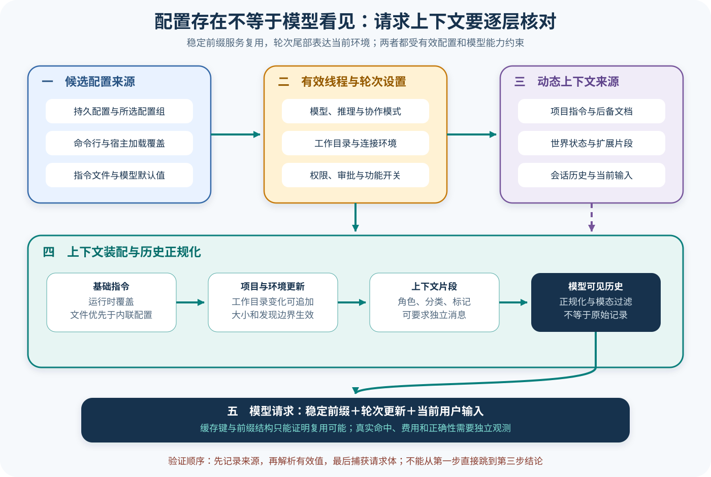

# Codex 配置、提示与上下文

## 读者会得到什么

本篇回答一个经常被压成一句话的问题：Codex 到底把什么交给模型？答案不是「配置文件加用户消息」。持久配置、命令行覆盖、线程设置、模型默认指令、开发者指令、AGENTS.md、权限与环境说明、扩展上下文片段、历史投影和当前用户输入在不同阶段进入；其中有些属于稳定前缀，有些随工作目录或轮次变化，还有些只在功能开启并满足大小、模态或标记约束时可见。

读完后，你应能区分三件事：磁盘上写了什么、当前线程解析出的有效配置是什么、某次模型请求实际包含什么。你也应能解释为什么切换工作目录会追加新的 AGENTS 指令，为什么线程设置改变不必改变提示缓存键，以及为什么 Context Fragment 是受角色、标记、分类、历史正规化和上下文窗口共同约束的输入片段。

本篇只对锁定提交作结论。上游测试使用模拟 Responses 服务；它能核对请求体布局和缓存键，不是线上缓存命中率或成本实验。

## 真实输入与输出

### 输入

上游 `model_visible_layout.rs` 创建两个工作目录，并分别写入不同的 AGENTS.md：

```text
目录一：Turn one agents instructions.
目录二：Turn two agents instructions.
```

第一次 Turn 的用户输入是 `first turn in agents_one`，线程环境选择目录一；第二次输入是 `second turn in agents_two`，环境切换到目录二。两轮都使用只读权限配置和永不询问审批，模型响应则由确定性测试服务给出。

### 输出

测试捕获两次模型请求。第一次请求包含一份来自目录一的 AGENTS 包装项；第二次请求保留原指令项，同时追加目录二对应的替换项：

```text
第一次请求中的 AGENTS 指令包装项数量：1
第二次请求中的 AGENTS 指令包装项数量：2
```

这不是简单「用新字符串覆盖旧字符串」。历史需要保留当时模型看见的上下文边界，同时把当前工作目录的指令更新注入后续请求。另一个 `prompt_caching.rs` 测试则在两轮之间改变权限配置与推理设置，却断言提示缓存键保持相同，并检查第一轮输入前缀仍是第二轮的完整前缀；这证明某些轮次变化可以放在稳定前缀之后，而不是每次重建全部缓存身份。

## 调用链



Claim: codex.config.layered-and-thread-scoped

Claim: codex.context.fragments-are-bounded

1. 配置加载器读取持久配置结构，解析模型、基础指令文件、开发者指令、项目文档大小、功能开关和其他选项；命令行或宿主覆盖与配置值按字段合并，空字符串和无效路径会在解析边界处理。
2. Thread 创建时保存初始有效配置；每次 Turn 还可通过线程设置覆盖模型、推理强度、协作模式、环境、审批与权限。持久配置不是本轮配置的唯一来源。
3. Session 根据模型信息和有效配置选择基础指令；项目文档发现逻辑在当前工作目录链上读取 AGENTS.md 或配置的后备文件，并受 `project_doc_max_bytes` 限制。
4. 世界状态与扩展可以贡献上下文片段。每个片段拥有响应角色、稳定分类、可选起止标记和正文，并决定是否必须作为独立消息记录；实现者必须自行处理标记与正文间空白。
5. 历史管理器记录可用于接口的响应项，生成模型输入前会正规化历史，并按模型输入模态剥离不支持的图像、音频或工具输出内容。原始历史与模型可见投影不能视为同一个数组。
6. Prompt 构造器将基础指令与正规化输入交给模型客户端。稳定前缀和缓存键可以跨轮复用，轮次特有的权限、环境、AGENTS 更新和用户输入则按布局进入请求。
7. Responses 请求体才是「模型这次实际看见什么」的直接证据。配置文件、发现到的文档或扩展已安装，只能证明候选来源存在。

## 源码证据

配置合并对模型和基础指令给出明确优先顺序。运行时覆盖先于文件指令，文件指令再先于配置中的内联指令：

```source
codex-rs/core/src/config/mod.rs:3824-3825,3850-3866
let model = model.or(cfg.model);
let base_instructions = base_instructions
    .or(file_base_instructions)
    .or(cfg.instructions.clone());
let developer_instructions = developer_instructions.or(cfg.developer_instructions);
```

AGENTS 与后备项目文档并非无限读取。有效配置把可选值归一到确定的字节上限和去空白后的文件名列表：

```source
codex-rs/core/src/config/mod.rs:4163-4172
project_doc_max_bytes: cfg.project_doc_max_bytes.unwrap_or(AGENTS_MD_MAX_BYTES),
project_doc_fallback_filenames: cfg
    .project_doc_fallback_filenames
    .unwrap_or_default()
    .into_iter()
    .filter_map(|name| {
        let trimmed = name.trim();
```

上下文片段的契约直接规定角色、分类、独立消息要求、标记和正文；默认渲染不会替实现者补分隔符：

```source
codex-rs/context-fragments/src/fragment.rs:55-77,91-107
pub trait ContextualUserFragment {
    fn role(&self) -> &'static str;
    fn content_kind(&self) -> ContentItemKind;
    fn requires_separate_message(&self) -> bool { false }
    fn markers(&self) -> (&'static str, &'static str);
    fn body(&self) -> String;
}
```

历史到 Prompt 还有一道正规化边界：

```source
codex-rs/core/src/context_manager/history.rs:203-220
Returns the history prepared for sending to the model.
This applies a proper normalization and drops un-suited items.
self.normalize_history(input_modalities);
```

配置分层 Claim 使用 B 级，因为源码给出字段合并，AGENTS 布局和轮次覆盖又由上游请求体测试锁定。上下文片段 Claim 使用 C 级：trait 与历史正规化直接定义边界，但本篇没有对所有扩展实现做统一行为实验，因此不把「任何片段都一定正确注入」升级成更强结论。

## 失败与限制

第一，配置优先级是逐字段的，不能用一句「命令行总是最高」替代源码核对。某些字段使用双层可选值表达「不覆盖、显式恢复默认、指定新值」，Feature、Provider 和宿主加载器也可能引入额外约束。要回答具体字段，必须追到该字段的解析分支。

第二，AGENTS 发现依赖有效工作目录、目录链、大小上限和后备文件名。文件存在但位于错误目录、超过截断上限、读取失败或项目文档功能被禁用时，模型可见结果都会不同。切换目录后保留旧项是历史一致性设计，不表示旧规则仍然支配新目录。

第三，上下文片段不是无限的隐藏系统提示。它有角色和内容分类，可能需要独立消息，标记可能用于识别和替换；最终还受历史正规化、模态支持、压缩和上下文窗口限制。扩展返回一个片段也不能证明它已出现在请求中。

第四，缓存键恒定不等于一定命中缓存。测试只证明锁定请求构造保持键与前缀关系；服务端是否接受、缓存是否过期、账号或模型是否支持、网络层是否改变请求，都超出该测试范围。缓存优化也不能以隐藏错误配置为代价。

第五，模型可见请求不是完整运行状态。审批策略、文件系统权限和环境连接可能以专门片段、工具规格或服务端元数据表达；外部秘密不应为了「可见性」无边界复制进 Prompt。验证应同时检查请求体和真实安全执行层。

配置存在不等于模型看见。

## 验证方法

先锁定配置来源：记录持久配置、命令行覆盖、宿主 Loader 覆盖、线程设置、当前工作目录和模型标识；对每个关键字段写出最终值与来源。不要从单份配置文件推断整个 Session。

再捕获模型请求：使用确定性模拟服务运行两轮，第一轮固定目录与 AGENTS，第二轮切换目录或线程设置。逐项比较顶层 instructions、input 数组、工具规格、权限与环境片段、用户消息以及提示缓存键；敏感值只记录存在性和哈希，不写入公开证据。

然后做边界注入：让 AGENTS 缺失、超大、位于父目录、使用后备文件名或在两轮间变化；让扩展片段使用空标记、错误空白、独立消息和不同内容分类；让模型不支持图像或音频。检查历史原始项、正规化后的模型输入和 Rollout 记录是否符合各自契约。

最后检查缓存：保持基础前缀不变，只改变明确属于轮次尾部的设置，确认键和前缀；再改变基础指令、模型或稳定工具规格，确认请求差异不会被错误吞掉。即使本地结构通过，也只能报告「具备缓存命中可能」，不能报告真实服务命中率。

## 自检

### 问题 1

为什么找到 AGENTS.md 还不能断言模型读到了它？

**答案：** 还要核对有效工作目录、目录发现、字节上限、功能配置、历史注入和最终请求体。文件存在只是候选来源证据。

### 问题 2

第二轮请求为什么可能同时出现旧 AGENTS 项和新 AGENTS 项？

**答案：** 历史保留第一轮真实可见上下文，新工作目录的规则作为更新追加；这样能解释前一轮行为，又给当前轮提供新边界，不是简单改写过去。

### 问题 3

提示缓存键在两轮间相同，能否证明节省了费用？

**答案：** 不能。它只证明请求构造保留了键和稳定前缀关系；真实缓存支持、命中、过期、计费和服务端策略需要独立线上观测。

### 问题 4

Context Fragment 与普通用户消息有什么关键差别？

**答案：** 片段由扩展或世界状态生成，显式拥有角色、内容分类、标记和独立消息要求，并经过历史正规化；它不是可以无限拼接、无来源的隐藏文本。
