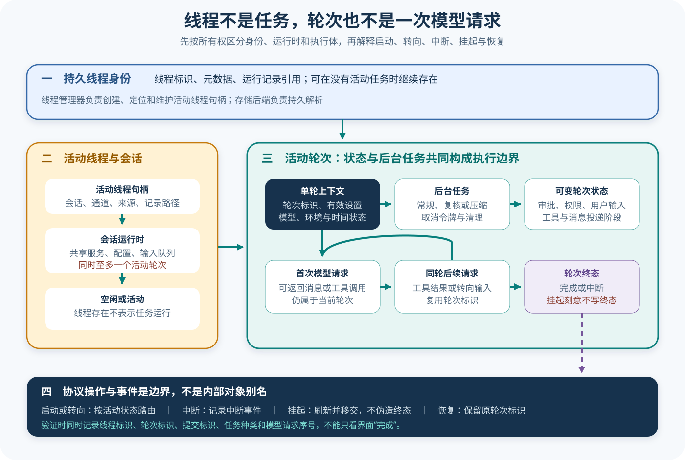

# Codex 线程、任务与轮次

## 读者会得到什么

Codex 源码同时出现 Thread、Session、Task、Turn、Op、Event 和界面任务状态。如果把它们都译成「一次任务」，恢复会错误地创建新身份，取消会误删持久历史，界面完成也会被误写成模型请求完成。本篇按所有权和生命周期拆开这些概念：Thread 是可持久引用的会话身份，CodexThread 是活动线程句柄，Session 持有共享运行服务，SessionTask 是后台工作流，TurnContext 与 ActiveTurn 约束一次逻辑轮次，Op/Event 则是跨表面提交与观测的协议。

读完后，你应该能回答：同一 Turn 为什么可包含多次模型请求；转向输入为何可以进入活动 Turn；空闲时强行 steer 为什么必须返回类型化拒绝；中断、挂起、恢复和完成为何不是同一个状态迁移。

身份先于状态。

## 核心概念

理解 Codex 生命周期要先问「谁拥有谁」，再问「现在是什么状态」。Thread 提供持久身份，活动 CodexThread 提供操作句柄，Session 持有共享服务，SessionTask 驱动一种工作流，ActiveTurn 持有当前执行控制，TurnState 保存轮次内可变等待项。相似名称来自不同层，不代表一一对应。

| 对象 | 身份跨度 | 所有者 / 内容 | 典型终态 |
|---|---|---|---|
| Thread | 跨进程可引用 | 历史与持久会话标识 | 归档或删除 |
| CodexThread | 当前活动实例 | Session 与通信通道 | 关闭或移交 |
| Session | 活动线程运行期 | 服务、输入队列、ActiveTurn | flush / shutdown |
| SessionTask | 一次工作流执行 | Regular、Review、Compact 等 | 完成、取消、失败 |
| TurnContext | 一次逻辑轮次 | 模型、权限、环境、输出约束 | 随 Turn 结算 |
| ActiveTurn | 当前执行控制 | RunningTask、TurnState | 清空、挂起或恢复 |
| TurnState | 轮次内可变状态 | 审批、用户输入、动态工具、计数 | 随轮次释放 |
| Op / Event | 协议交互 | 提交请求与观测结果 | 已接受或类型化拒绝 |

Thread 与 Session 的区别类似「持久记录」和「当前打开的运行实例」。Thread 可以出现在历史列表中而没有活动 Task；Session 则绑定当前进程内服务和输入队列。恢复 Thread 时可以创建新的活动句柄，却必须延续原有身份和历史，而非创建一个看似相同的新会话。

Task 与 Turn 也不同。Task 是驱动 Session 的后台工作流实现，Regular、Review 或 Compact 可以拥有不同执行逻辑；Turn 是用户和协议可观察的一次逻辑工作边界。一个 Turn 能包含多次模型采样和工具 follow-up，一个 Task 也可能因挂起而由另一工作者接管。

steer 表示将新输入送入正在运行且身份匹配的 Turn。它不等同于启动新 Turn，也不是无条件消息排队。接受时可以更新活动轮的输入和设置；拒绝时应同时拒绝附带配置，避免调用方收到 NoActiveTurn，Session 却已被部分修改。

中断与挂起体现两种不同意图。中断宣告当前执行终止并产生 aborted 语义；挂起为所有权移交暂时停止当前工作者，不写完成或中断终态，随后恢复继续使用原 turn_id。恢复不是重放所有用户输入，而是从持久边界继续未结算工作。

协议提交标识与 TurnId 也不能混用。submission ID 关联一次客户端 Op 与其响应，重发同一操作时可用于去重；TurnId 关联整个逻辑轮次，期间可以接受多个操作并产生多次模型采样。若用 TurnId 当提交幂等键，合法 steer 会被误判为重复；若用 submission ID 统计轮次，又会重复计数。

要把多工作者恢复做成可证明的系统，还需要所有权或隔离令牌语义。挂起记录至少包含原 Turn、历史水位和前一 writer 已关闭的证据；新工作者取得有效租约后才能追加。旧工作者迟到的写入应被拒绝，否则两个进程会同时宣告同一 Turn 终态。这里描述的是教学化恢复要求，不声称锁定 Codex 源码使用这些同名机制。

## 为什么这样设计

第一，持久 Thread 与活动 Session 分离，使应用可以列出、归档和恢复历史，而不必让每个会话常驻进程。进程崩溃或产品表面关闭不会自动抹去 Thread 身份，新的工作者也能重新建立运行服务。

第二，Session 同时只允许一个 ActiveTurn，简化会话历史、审批和工具结果的线性归属。若同一 Session 并行写入两个轮次，用户 steer、工具结果和 TurnComplete 会出现难以排序的竞态；需要并行时应创建子线程或明确的编排身份。

第三，将工作流抽象为 SessionTask，让常规执行、Review 与 Compact 复用取消、事件和清理机制，又不强迫它们共享同一模型循环。TaskKind 可用于可观测与策略，不能反向推断所有 Task 都会产出相同消息。

第四，类型化提交结果把竞态显式返回给调用方。UI 在点击 steer 与请求到达之间，活动 Turn 可能已经结束；`NotSubmitted { NoActiveTurn }` 比静默创建新轮次更安全，也防止设置落入错误身份。

第五，挂起不写终态，是为了保持未完成工作的可恢复性。若移交前发出 TurnAborted，恢复者会把它当成已结算历史；若发 TurnComplete，评测和界面都会产生假成功。缺失终态在这里是有意协议，但必须由挂起记录和 writer flush 解释。

## 实现思路

教学状态机以 Thread 为聚合根，同时把持久事件和进程内执行控制分开。它用于学习所有权，不冒充 Codex 内部类型的完整复制。

1. **解析 Thread。** 根据 ThreadId 加载持久历史，创建活动 Session 和通信通道；记录新建、恢复或 fork 来源。
2. **串行提交 Op。** 每次提交携带 submission ID、目标 Thread / Turn 与可选设置，处理器返回明确的 accepted 或 rejection 枚举。
3. **启动 Turn。** 仅在 `active_turn == none` 时生成 TurnId、TurnContext 和取消令牌，选择 SessionTask 并写 TurnStarted。
4. **路由追加输入。** 活动轮存在且身份、Schema 兼容时 steer；否则整次拒绝，不写历史、不应用设置。
5. **结算 Task。** 正常完成写 TurnComplete，中断写 TurnAborted；失败记录责任层并清理 ActiveTurn。
6. **执行挂起与恢复。** 挂起停止工作者、flush writer 并保存 continuation，不写终态；恢复验证 lease 或所有权后继续原 TurnId。
7. **投影产品状态。** 界面和 App Server 只读核心事件，将语义损失记在适配层，不能回写核心状态。

```text
提交(op):
    session = resolve(op.thread_id)
    如果 op.kind == start 且 session.active_turn 为空:
        return start_new_turn(op)
    如果 op.kind == steer 且 matches(session.active_turn, op.turn_id, op.schema):
        return steer_active_turn(op)
    return NotSubmitted(reason)  // 不应用附带设置
```

状态存储需要两个提交点：持久事件追加成功和进程内状态切换成功。实现应规定顺序并支持幂等恢复，避免已经写 TurnStarted 却没有 ActiveTurn，或 ActiveTurn 清空却漏写终态。挂起是例外路径，它写 continuation 证据而非终态。

观察模型请求时，为每次采样附上 ThreadId、TurnId 和 sample index。工具 follow-up 递增 sample index 但保留 TurnId；新用户工作生成新 TurnId。Eval Adapter 再将 TrialId 单独绑定，禁止按网络请求数量自动生成 Trial。

## 贯穿案例

用户启动一次「运行测试并修复失败」的 Turn。第一次模型采样提出命令，工具执行期间用户补充「只修改解析器，不要改快照」，随后产品表面收到挂起请求，把执行移交给另一工作者继续。

1. **创建身份。** Thread `th-7` 已存在，Session 在空闲状态创建 Turn `tr-9` 和 Regular Task，写入 TurnStarted。
2. **工具 follow-up。** 第一次采样调用测试工具，结果回到同一 `tr-9` 的第二次模型请求；sample index 改变，TurnId 不变。
3. **接受 steer。** 活动 Turn 与目标标识匹配，追加限制文本并更新允许的轮次设置；返回 `Steered { tr-9 }`。
4. **拒绝竞态输入。** 工具结果结算后，又一个旧客户端向 `tr-old` steer；处理器返回 WrongTurn，附带的完全访问设置不生效。
5. **挂起移交。** 当前工作者保存历史水位和 continuation，flush 后关闭 writer，不写 TurnComplete 或 TurnAborted。
6. **恢复完成。** 新工作者验证 Thread 与 Turn 身份，从同一 `tr-9` 继续，产物通过后才写 TurnComplete；独立 Scorer 另行判断任务。

```json
{"threadId":"th-7","turnId":"tr-9","taskKind":"regular","sample":2,"state":"active"}
```

```json
{"operation":"steer","targetTurn":"tr-old","result":"not_submitted","reason":"wrong_turn","settingsApplied":false}
```

若挂起路径错误写了 aborted，恢复者会面对一个已经终止却要求继续的轮次；若恢复时生成 `tr-10`，同一逻辑工作被拆成两个 Turn；若拒绝 steer 仍应用权限，安全配置被一个失败操作污染。三个断言分别保护终态、身份和原子提交。

案例最终同时保存 Thread 历史、Task 生命周期、每次采样与产品表面响应。TurnComplete 只表示核心工作流结算，报告中的测试结果和工作区差异仍由 Trial Scorer 检查。这样可以解释「运行完成但任务失败」，也能区分产品失败与工作者移交。

最后模拟旧工作者在恢复后迟到提交工具结果。教学原型中的 writer 隔离令牌已失效，因此该事件不能进入 Thread；新工作者根据已持久化水位决定继续等待、查询副作用或标记 unknown。这个测试防止挂起只停了内存 Task，却没有真正隔离持久写入。

## 真实输入与输出

### 输入

上游 `turn_state.rs` 的确定性测试先提交：

```text
run a shell command
```

第一次模型响应提出回显命令，产生同一 Turn 内的第二次模型请求；工具闭环结束后，测试又提交 `second turn`。另一个输入提交测试先启动被门闩阻塞的活动 Turn，再提交 `steer active turn` 并携带新的审批和环境设置，最后在 Turn 完成后尝试对 `missing-turn` 执行 steer。

### 输出

模型请求元数据给出清晰边界：第一次 Turn 的首个请求没有服务端轮次状态，工具后的 follow-up 带 `ts-1`，第二个逻辑 Turn 又清空该状态；前两个请求的 turn_id 相同，第三个不同。

```text
轮次状态：空 → ts-1 → 空
轮次标识：第一轮 = 第一轮后续请求 ≠ 第二轮
```

活动 Turn 的 steer 返回 `Steered { turn_id }`，并更新线程配置快照；完成后再 steer 返回 `NotSubmitted { NoActiveTurn }`，且被拒绝输入携带的配置不污染已接受设置。类型化返回值让调用方不必从界面文字猜状态。

拒绝必须无副作用。

## 调用链

先核对身份。



Claim: codex.thread.turn-task-state-separation

1. 产品表面通过 `Op` 提交轮次输入、线程设置、中断、恢复或挂起；每个 `Event` 用提交标识关联返回的 `EventMsg`。
2. ThreadManager 以 ThreadId 定位活动 `CodexThread`。它保存 Session、双向通道、Session 来源、配置事件和可选 Rollout 路径；持久 Thread 身份不等于当前一定有运行任务。
3. Session 持有线程级共享服务、状态、Feature、输入队列和至多一个 ActiveTurn。源码注释明确规定一个 Session 同时最多一个运行任务。
4. 当新工作开始，Session 创建 TurnContext 和取消令牌，再把 Regular、Review 或 Compact 等 `SessionTask` 放到后台执行。Task 是实现工作流的可取消执行体，不是持久 Thread 本身。
5. ActiveTurn 保存当前 RunningTask 与 TurnState；TurnState 再持有待审批、待用户输入、待权限、动态工具、工具计数和当前轮输入。一个 Turn 可因工具或追加输入进行多次模型采样。
6. `start_or_steer_turn` 根据是否空闲选择启动或转向；`start_turn_if_idle` 不允许转向。没有活动 Turn、标识不匹配或输出 Schema 不兼容时，输入会被类型化拒绝，不能静默排队。
7. 正常完成发出 TurnComplete；中断发出 TurnAborted；挂起则刻意不记录这两个终止事件，以便另一工作者用原 turn_id 恢复。产品表面必须保留这些差异。

## 源码证据

Session 的所有权边界直接说明并发约束：

```source
codex-rs/core/src/session/session.rs:37-67
A session has at most 1 running task at a time, and can be interrupted by user input.
pub(crate) struct Session {
    pub(crate) thread_id: ThreadId,
    pub(crate) active_turn: Mutex<Option<ActiveTurn>>,
    pub(crate) input_queue: InputQueue,
    pub(crate) services: SessionServices,
}
```

ActiveTurn 与 RunningTask 分别保存可变轮次状态和执行控制：

```source
codex-rs/core/src/state/turn.rs:31-35,67-84
pub(crate) struct ActiveTurn {
    pub(crate) task: Option<RunningTask>,
    pub(crate) turn_state: Arc<Mutex<TurnState>>,
}
pub(crate) enum TaskKind { Regular, Review, Compact }
pub(crate) cancellation_token: CancellationToken,
pub(crate) turn_context: Arc<TurnContext>,
```

Task trait 描述后台工作流、取消和清理，不承诺所有 Task 都运行相同的模型循环：

```source
codex-rs/core/src/tasks/mod.rs:172-204
Async task that drives a Session turn.
Implementations encapsulate a specific Codex workflow.
fn kind(&self) -> TaskKind;
fn run(..., ctx: Arc<TurnContext>, input: Vec<TurnInput>,
       cancellation_token: CancellationToken)
```

协议层明确把操作和事件分开，且旧线格式仍使用 task 名称映射 Turn 生命周期：

```source
codex-rs/protocol/src/protocol.rs:541-548,1276-1283,1337-1349
pub enum Op { Interrupt, ... }
pub struct Event { pub id: String, pub msg: EventMsg }
TurnStarted(TurnStartedEvent),
TurnComplete(TurnCompleteEvent),
```

该 Claim 使用 B 级：源码直接定义所有权和状态，`turn_state.rs` 又验证同一轮 follow-up 复用 turn_id、下一轮重置；`turn_input_submission.rs` 验证活动转向与空闲拒绝。结论仍限定在锁定核心，不把某个产品表面的 UI 标签外推成内部状态。

## 失败与限制

第一，同一 Thread 可以空闲、运行、被中断或等待恢复。列表里看见线程不代表有活动 Task；反过来，后台进程可能在 Turn 结束后仍存在，因此中断当前 Task 与清理后台终端是不同 Op。

第二，同一 Turn 可有多次 Responses 请求。工具 follow-up、Hook、转向输入或压缩都可能继续该逻辑轮次；按网络请求数统计 Turn 会重复计数。Eval 的 Trial 也不应直接等同于内部 Turn，除非任务契约明确这样映射。

第三，steer 不是无条件追加。活动 Turn 不存在、目标标识错误、当前工作流不可转向或输出 Schema 不匹配都应拒绝。被拒绝输入不得写入历史，也不应把附带线程设置应用到 Session。

第四，中断、挂起和恢复的持久语义不同。中断记录 TurnAborted；挂起为移交所有权而停止执行、刷新历史并关闭 writer，刻意不写终止事件；恢复要保留原 turn_id。把挂起记录成完成会使另一工作者无法区分已结算与待接管。

第五，协议为了兼容可能在线上字段仍出现 task_started/task_complete，但核心类型称 TurnStarted/TurnComplete。不能从 wire 名称推断内部 Task 与 Turn 等价；应看 serde 映射和状态所有者。

名字不是所有权。

边界决定行为。

先看状态。

## 验证方法

证据必须关联。

先记录身份：为 ThreadId、TurnId、提交 id、TaskKind 和每次模型请求编号分别建列。运行一个含工具 follow-up 的 Turn，再运行第二个 Turn，验证同轮请求共享 TurnId、跨轮改变，ThreadId 始终不变。

再验证输入路由：活动轮次时调用 start-or-steer，空闲时分别调用 start-if-idle 与 steer；加入目标 TurnId 和输出 Schema 不匹配。检查返回的枚举、历史、配置快照和输入队列，确保拒绝路径没有副作用。

接着验证终止：分别触发正常完成、用户中断、模型流错误、Task 替换、挂起与恢复。捕获 TurnStarted、TurnComplete、TurnAborted 及 writer 状态，确认挂起不伪造终止、恢复复用原身份。

最后映射产品表面：检查 TUI、无界面执行和 App Server 如何把核心 EventMsg 映射到各自状态。若界面只有「运行中/完成」两态，应把语义损失记录为表面限制，不能回写成核心事实。

## 自检

### 问题 1

Thread 与 Session 为什么不能视为同一个对象？

**答案：** Thread 是可持久引用的会话身份；Session 是当前活动运行时，持有服务、队列和至多一个活动轮次。Thread 可以持久存在而当前没有运行 Session Task。

### 问题 2

一次工具调用导致两次模型请求，算几个 Turn？

**答案：** 在该测试中仍是一个 Turn。第二次请求是工具结果驱动的 follow-up，复用相同 turn_id；新用户轮次才取得新标识。

### 问题 3

为什么空闲 steer 的配置不能被保留？

**答案：** steer 的语义是把输入送入指定活动轮次。没有活动轮次时整次提交被拒绝，附带设置也不得部分生效，否则返回值与实际状态不一致。

### 问题 4

挂起为何不发 TurnAborted？

**答案：** 挂起用于把未完成根轮次移交给另一工作者；它刷新并关闭当前执行，但保留原 turn_id 和未结算语义。记录 aborted 或 complete 会把可恢复工作误标成终态。
