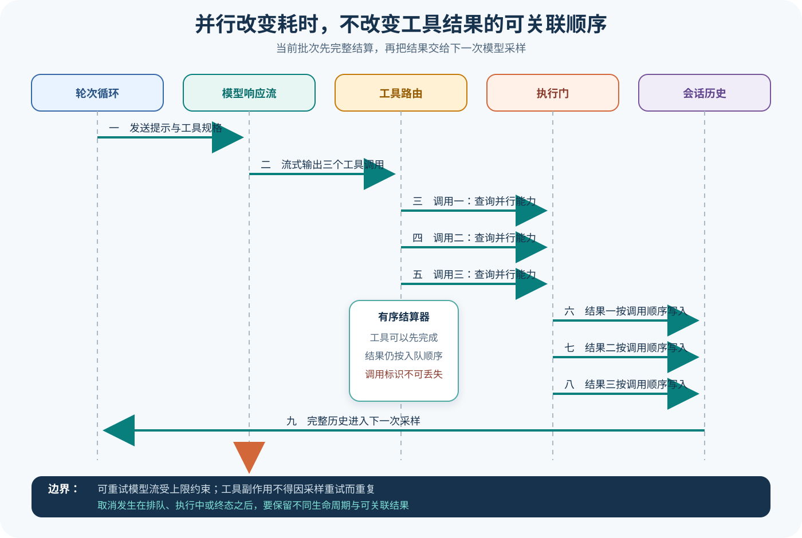

# Codex 模型流与工具闭环

## 读者会得到什么

入口篇证明了单个工具结果会回到模型，本篇继续回答更难的部分：一个响应里出现多个工具调用时，哪些可以并行，结果为什么仍按调用顺序写回，流错误何时重试，取消发生在排队、执行或终态之后又有何差异。核心不变量是：并行改变完成时间，不改变调用与结果的可关联顺序；模型只有在当前批次工具结果结算后，才进入下一次采样。

读完后，你应能沿着 Prompt、模型客户端流、输出项处理、ToolRouter、ToolCallRuntime、工具 Future、会话历史和 follow-up 标志复原闭环，也不会把 Provider 流重试、工具取消、Turn 结算与 Eval Attempt 混成一种「重试」。

## 真实输入与输出

### 输入

上游 `tool_parallelism.rs` 构造一次包含三个 `exec_command` 函数调用的模拟模型响应，三个调用标识依次为 `call-1`、`call-2`、`call-3`，命令参数相同：

```json
{"cmd":"echo 'shell output'","yield_time_ms":1000}
```

测试向 Codex 提交 `run shell three times`。模型服务是 Mock，但本地 shell 工具路径实际执行；该文件仅在上游支持的测试环境中证明行为，不代表任意平台的性能。

### 输出

第二次模型请求包含三个原始函数调用和三个函数调用输出。测试不只数数量，还检查所有调用项都位于所有输出项之前，并按位置配对 call_id：

```text
调用顺序：call-1, call-2, call-3
结果顺序：call-1, call-2, call-3
约束：全部调用先出现，随后才是全部结果
```

这意味着运行时可以并行完成工具，但提交给模型的历史仍保持确定性批次布局。下一次模拟响应返回 `done`，Turn 才完成。

## 调用链

先结算，再继续。



Claim: codex.loop.tool-results-before-continuation

1. `run_turn` 从正规化会话历史构造采样输入，建立 Prompt、Responses 元数据和子取消令牌，再调用模型客户端流。
2. 流消费器按事件处理输出项；函数调用完成项被解析成 ToolCall，通过 ToolRouter 查询模型可见规格对应的真实运行时。未知工具、参数错误或运行时缺失会形成工具错误，而不是执行任意字符串。
3. ToolCallRuntime 询问该工具是否支持并行。支持者取得共享读锁并可并发执行；不支持者取得写锁，从而与其他工具串行。并行是工具级声明和运行时门控共同结果。
4. 每个工具调用产生 Future，按模型输出顺序加入 `FuturesOrdered`。工具可以先后完成，但 drain 按入队顺序取结果，记录到会话历史并保留 call_id。
5. 当前响应完成后，Harness 排空在途工具；只要工具输出或其他事件要求 follow-up，外层就从更新后的历史再次构造模型输入。不会在结果尚未结算时把半批历史交给模型。
6. Responses 流错误只有被分类为可重试时才进入受上限约束的重试处理；上下文超限、用量限制和非重试错误走独立分支。重试采样不能重复已提交的真实副作用。
7. 取消令牌可在等待执行门、工具处理或模型流期间触发。若工具已经达到终态，应保留完成生命周期；否则中止执行并生成可关联的取消结果。无 follow-up 时才进入 Turn 停止 Hook 与完成路径。

## 源码证据

并行执行门由工具能力决定：

```source
codex-rs/core/src/tools/parallel.rs:112-175
let supports_parallel = router.tool_supports_parallel(&call);
let _guard = if supports_parallel {
    Either::Left(lock.read().await)
} else {
    Either::Right(lock.write().await)
};
router.dispatch_tool_call_with_terminal_outcome(...).await
```

Turn 流使用有序 Future 容器，并在 drain 时按顺序记录结果：

```source
codex-rs/core/src/session/turn.rs:2130-2153,2224-2227
let mut in_flight: FuturesOrdered<...> = FuturesOrdered::new();
while let Some(res) = in_flight.next().await {
    sess.record_conversation_items(...).await;
}
```

模型流重试有显式分类与上限，不是捕获所有错误后无限重放：

```source
codex-rs/core/src/session/turn.rs:1363-1439
let max_retries = turn_context.provider.info().stream_max_retries();
if !err.is_retryable() { return Err(err); }
handle_retryable_response_stream_error(..., max_retries, ...).await?;
```

上游批次测试直接断言所有调用在所有结果之前，并按调用标识保持顺序：

```source
codex-rs/core/tests/suite/tool_parallelism.rs:268-298
assert_eq!(function_calls.len(), 3);
assert_eq!(function_call_outputs.len(), 3);
assert!(*index < *output_index, "all function calls must come before outputs");
assert_eq!(call.1.get("call_id"), output.1.get("call_id"));
```

该 Claim 使用 B 级：并行门、有序 drain 和 follow-up 由源码支持，上游集成测试锁定三调用批次布局。它不保证所有工具都并行，也不声称任意平台具有同一耗时。

## 失败与限制

重试不是重放。

第一，模型声称支持并行工具调用不代表每个工具都并行。Router 的工具元数据决定是否取得读锁；不支持并行的工具通过写锁串行。涉及同一文件、终端或外部资源时，即便并行允许，业务副作用仍可能互相竞争。

第二，有序提交不等于串行执行。只看第二次请求的结果顺序无法推断实际开始与结束时间；要证明并发需要独立时序或屏障测试。相反，只看到执行并发也不能省略结果排序，因为模型需要稳定的 call_id 对齐。

第三，Provider 流重试与工具重试不同。流在工具调用完成前失败，可能安全地重新建立采样；真实工具已经产生副作用后，再重放模型输出可能重复执行。恢复设计必须记录已执行调用并区分请求、调用和结果的提交点。

第四，取消存在竞态。取消发生在执行门前、处理器运行中或处理器已完成后，应该产生不同计时与生命周期；不能统一覆盖成「工具失败」。已经到达终态的结果应保留，尚未执行的调用不能伪造副作用。

第五，TurnComplete 只说明 Harness 收敛。三个命令都退出零仍可能违反用户意图、安全约束或产物要求。独立 Eval 需固定 Trial 并检查副作用，不能把同一 Trial 内的工具恢复 Attempt 计成新通过样本。

并行不是乱序。

## 验证方法

时序必须可见。

标识必须稳定。

副作用要去重。

结果必须对齐。

先构造两个可并行工具和一个不可并行工具，用屏障与可控延迟记录开始、结束和 call_id。确认并行组重叠执行，串行工具获得独占门；不要只用墙钟阈值作为唯一证据。

再捕获下一次模型请求，检查函数调用数量、输出数量、所有调用与结果的相对区间，以及逐位置 call_id。让第二个工具最快完成，确认历史仍按模型调用顺序提交。

随后注入未知工具、参数错误、运行时未就绪、策略拒绝、非零退出、工具超时和取消；分别检查工具生命周期事件、结果内容、会话历史与是否 follow-up。任何分支都不能丢失调用标识。

最后注入模型流提前关闭、可重试错误、上下文超限和用量限制。记录实际采样次数与已发生副作用，确认只有允许的流错误受上限重试，并验证不会把工具恢复次数改写成 Eval Trial 数量。

## 自检

### 问题 1

三个工具并发完成，为什么结果仍要按调用顺序交给模型？

**答案：** 稳定批次布局保证每个 call_id 与结果可确定关联，避免完成时序让模型上下文随机变化；并发优化执行时间，不应改变历史语义。

### 问题 2

所有工具都使用同一个并发策略吗？

**答案：** 不是。Router 查询工具是否支持并行；支持者共享读门，不支持者取得写门并与其他工具串行。

### 问题 3

Responses 流可重试是否表示工具调用也能安全重放？

**答案：** 不能。模型流重试与真实副作用恢复是不同问题；工具一旦执行，必须通过调用身份和提交记录避免重复副作用。

### 问题 4

工具完成后立刻收到取消，应丢弃结果吗？

**答案：** 不应机械丢弃。源码区分是否已到终态；已完成生命周期要保留，只有尚未完成的执行才生成取消结果并中止。
