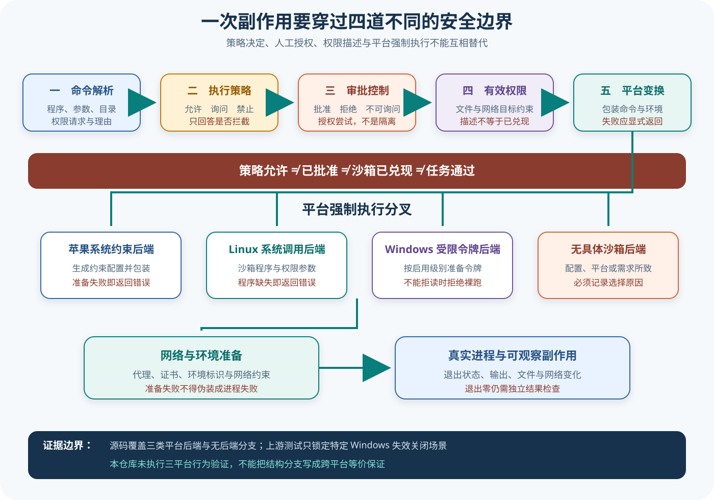

# Codex 执行策略、审批与多平台沙箱

## 读者会得到什么

本篇拆开一个最容易误判的安全链：命令被策略允许，只说明无需由该策略继续拦截；用户批准一次升级，只说明 Harness 可以继续尝试；权限描述表达期望约束；最后能否隔离，仍取决于当前平台后端、网络代理和实际进程创建。四者不是同义词。

允许不是隔离。批准也不是隔离。

这就是边界。它们不能互换。

读完后，你应能从模型的 `exec_command` 参数一路追到命令解析、执行策略、审批请求、附加权限、有效权限描述、平台命令变换和子进程结果，并能识别失效关闭、显式无沙箱和平台能力不足。本文讨论的是锁定源码与上游测试夹具，不声称这些平台路径已在本仓库本地执行。

## 真实输入与输出

### 输入

第一组上游测试把审批策略设为 `UnlessTrusted`，权限描述设为工作区可写，并让模型请求：

```json
{"cmd":"git status","yield_time_ms":1000}
```

第二组 Windows 上游测试建立允许读取根目录、允许写项目根、但拒绝 `*.env` 的权限描述，再用受限令牌后端尝试读取和写入受拒绝文件：

```text
type secret.env >NUL & echo exact secret >future.env & type public.txt
```

### 输出

第一组不会直接执行：Harness 先发出带原调用标识的审批请求；测试提交拒绝决定后，Turn 才继续收敛。第二组也不会退回裸进程；当非提升的受限令牌无法直接兑现「拒绝读取」时，执行以错误终止：

```text
当前后端不能直接强制拒绝读取，因此拒绝在无沙箱状态下运行
```

两组输出证明不同边界：前者证明审批生命周期，后者证明一个特定 Windows 受限令牌场景的失效关闭。它们都没有证明命令业务结果正确。

## 调用链

策略允许不等于副作用已经安全发生。



Claim: codex.security.approval-policy-sandbox-separation

Claim: codex.security.platform-enforcement-differs

1. 模型提交结构化工具参数。工具层先解析程序、参数、工作目录、超时、沙箱权限请求和理由；解析失败不会进入任意 shell 执行。
2. Exec Policy 根据命令及规则给出 `Allow`、`Prompt` 或 `Forbidden`。多个规则需要保守合并；允许仅表示策略层不再要求审批，禁止则在更靠前的位置终止。
3. `Prompt` 或请求提升权限时，审批策略决定是否可询问用户。用户批准是一次控制面决定；拒绝、`never` 或关闭细粒度沙箱审批都会阻止该请求。批准本身不会创建操作系统隔离。
4. 默认权限与经批准的附加权限合成为有效 `PermissionProfile`。它描述文件系统与网络的目标权限，不等于当前主机一定能逐项强制执行。
5. SandboxManager 独立判断是否需要沙箱，再按平台选择后端：macOS 使用 Seatbelt，Linux 使用 Seccomp 入口及其封装，Windows 仅在启用时使用受限令牌，否则选择 `None`。未知平台也可能没有具体后端。
6. `transform` 把原命令包装成对应平台命令，准备工作目录、网络代理、证书与环境；缺少 Linux 沙箱程序、Seatbelt 不可用、代理准备失败或 Windows 约束无法兑现都会返回显式错误。
7. 只有变换成功后才创建真实进程。退出码、标准输出和文件副作用属于执行事实；它们仍需由独立检查器判断是否满足任务、安全和发布要求。

## 源码证据

执行策略的三值决定只负责策略层：

```source
codex-rs/execpolicy/src/decision.rs:7-15
pub enum Decision {
    Allow,
    Prompt,
    Forbidden,
}
```

平台选择和「是否需要沙箱」被刻意分开；主机不能提供后端时，初始选择可能成为 `None`：

```source
codex-rs/sandboxing/src/manager.rs:62-75,293-325
pub fn get_platform_sandbox(...) -> Option<SandboxType> { ... }
// request needs a sandbox, independently of whether this host can provide one
pub fn should_sandbox(...) -> bool { ... }
```

命令变换先合并附加权限，再进入平台分支；网络代理和后端准备错误会向上传递，不会被这里吞掉：

```source
codex-rs/sandboxing/src/manager.rs:331-359,365-459
let base_effective_permission_profile =
    effective_permission_profile(permissions, additional_permissions.as_ref());
let (argv, arg0_override, pending_sandboxed_request) = match sandbox { ... };
```

审批测试显示「请求提升」仍受审批策略控制；关闭细粒度沙箱审批时，请求直接失败：

```source
codex-rs/core/tests/suite/approvals.rs:1077-1124
sandbox_approval: false,
sandbox_permissions: SandboxPermissions::RequireEscalated,
output_contains: "you cannot ask for escalated permissions",
```

Windows 测试明确锁定失效关闭，而不是把无法兑现的拒绝读取静默降级为裸跑：

```source
codex-rs/core/tests/suite/windows_sandbox.rs:176-210
.expect_err("restricted-token sandbox should reject deny-read restrictions");
// ... cannot enforce deny-read restrictions directly; refusing to run unsandboxed
```

第一条 Claim 使用 B 级：源码分别定义策略、审批与权限变换，上游测试锁定审批请求与拒绝路径。第二条 Claim 使用 D 级：源码明确存在三种平台后端和无后端分支，Windows 上游测试只行为验证其中一个失效关闭场景；Linux 与 macOS 路径未由本仓库运行验证，因此跨平台结论保持为结构性推断。

## 失败与限制

最危险的误读是把 `Allow` 写成「已安全执行」。它只跳过策略审批；若权限描述仍要求隔离，平台后端仍须准备和强制执行。反过来，审批通过也只授权一次请求，不能证明路径、网络或进程边界已经兑现。

存在显式无沙箱路径。用户配置、沙箱偏好、Windows 开关、未知平台或无需沙箱的权限描述都可能让选择结果为 `None`。这不是自动漏洞，也不是沙箱保证；观察者必须记录「为什么无沙箱」，不能把它与「平台沙箱已成功安装」合并成一个成功状态。

无后端，就没有平台隔离证明。

平台实现不等价。Seatbelt、Linux 沙箱封装和 Windows 受限令牌的强制原语、网络处理及失败条件不同。当前证据只在源码层看到所有分支，只在上游测试源码中看到特定 Windows 拒绝读取场景；不能外推为三平台完整等价，也不能称作本地跨平台实测。

网络不是文件权限的附属项。有效权限描述会导出网络策略，受管网络还可能要求代理、环境标识和证书准备；代理准备失败必须单独报告。网络受限也不代表所有外部副作用都消失，例如已授权的本地进程、套接字或凭据仍需独立检查。

进程退出零不是 Eval 通过。命令可能修改错误文件、泄漏信息或只完成中间步骤。Harness 应保留原调用、策略决定、审批决定、有效权限、后端、变换错误、退出状态与副作用；独立 Eval 再以固定 Trial 检查目标产物，不能把审批重试或命令恢复计成新的成功样本。

## 验证方法

先为同一命令构造允许、询问和禁止三条策略，并固定审批策略。捕获是否生成审批事件、调用标识是否稳定、拒绝后是否仍创建进程。不要用最终错误字符串反推中间所有决定。

再建立最小权限矩阵：只读、工作区写、额外路径写、网络受限和请求提升。记录默认权限、附加权限与最终有效权限，确认未经批准的附加权限不会进入平台变换。

随后在每个受支持平台分别验证允许读、拒绝读、允许写、拒绝写、网络代理和缺失后端。每次都记录实际选择的 SandboxType、包装命令和副作用；若主机无法兑现某条拒绝规则，应断言明确失败，而不是只看进程未报错。

最后增加独立结果检查：即使命令退出零，也核对允许路径之外没有写入、受限网络没有绕过、目标文件内容正确。把上游夹具、本地验证和生产观察分栏保存，任何一栏都不能替代另外两栏。

## 自检

### 问题 1

Exec Policy 返回允许，是否证明命令已被操作系统隔离？

**答案：** 不能。允许只结束策略层拦截；权限合成、平台后端变换和真实进程创建仍是后续独立步骤。

### 问题 2

用户批准提升权限后，还可能执行失败吗？

**答案：** 会。批准只授权尝试；工作目录、代理、平台后端或权限原语无法准备时仍应失败。

### 问题 3

为什么 Windows 失效关闭测试不能证明 Linux 与 macOS 同样安全？

**答案：** 它只覆盖受限令牌无法兑现拒绝读取的特定夹具；另外两个平台使用不同后端，需要各自行为测试。

### 问题 4

命令退出零为什么仍不能算 Eval 通过？

**答案：** 退出零只说明进程自报成功，不能证明用户目标、允许副作用集合或发布标准得到满足，仍需独立评分与门禁。
